# 001-visao-geral-operacao-e-fluxo-macro

## Objetivo do documento
Consolidar a visão geral da operação da AlphaCarnes e registrar o fluxo macro aprovado até o momento, servindo como base para o detalhamento funcional dos próximos documentos.

---

## Visão geral do negócio

A operação da AlphaCarnes é orientada por **compra programada**, **venda sobre disponibilidade virtual** e **expedição praticamente simultânea ao recebimento físico**, com baixa permanência de itens em estoque.

A lógica central do negócio é:

1. O operador de compras define o que será comprado no frigorífico.
2. A compra do dia gera uma **disponibilidade virtual** por item/parte.
3. O time comercial vende somente o que foi programado/comprado.
4. Os pedidos são feitos por **parte/unidade**, não por peso.
5. No dia da operação, o caminhão do fornecedor chega com as partes macro.
6. As peças são pesadas, associadas aos pedidos e direcionadas para expedição.
7. Alguns itens passam por corte e nova pesagem.
8. A carga é finalizada por caminhão/rota.
9. Somente após o fechamento da expedição ocorre a emissão de NF.
10. Itens não vendidos ou não destinados seguem para estoque/congelamento como exceção.

---

## Princípios operacionais já aprovados

### Compra e venda
- O **lote do dia** é a **compra principal do dia**.
- A **disponibilidade virtual é por dia**.
- A venda se encerra quando o item zera, ainda no plano virtual.
- **Não pode haver overbooking comercial**.
- Um pedido não pode consumir disponibilidade de mais de uma compra programada.

### Pedido comercial
- O pedido é realizado por **parte**, não por peso.
- Exemplo: o cliente pede 20 traseiros, não 200 kg de traseiro.
- O peso real será conhecido somente na operação física, na balança.

### Associação operacional
- Na balança, o sistema deve sugerir a associação da peça ao pedido.
- O operador visualiza a sugestão e as preferências do cliente.
- O operador pode confirmar ou redirecionar para outro pedido compatível.
- Enquanto a expedição estiver aberta, a peça pode ser transferida entre pedidos.
- Após o fechamento/finalização do caminhão, a alteração fica bloqueada.

### Estoque
- O estoque não é o centro da operação.
- Itens não vendidos ou remanescentes devem ir para congelamento/estoque como exceção operacional.
- O congelamento deve ser evitado porque impacta peso e qualidade.

---

## Fluxo macro aprovado

```mermaid
flowchart TD

    A[Planejamento de compra do dia<br/>bois, porco, frango e outros itens] --> B[Registro da compra programada no sistema]
    B --> C[Quebra da compra em disponibilidade virtual por item/parte<br/>ex.: 100 dianteiros, 100 centrais, 100 traseiros]
    C --> D[Liberação da disponibilidade virtual para vendas]

    D --> E[Vendas / pedidos de clientes]
    E --> F[Registro do pedido por parte<br/>ex.: 20 traseiros, 10 dianteiros]
    F --> G[Aplicação de preferências por cliente/pedido<br/>peso, gordura, perfil da peça, corte]
    G --> H[Reserva da disponibilidade virtual]
    H --> I{Há saldo virtual disponível?}

    I -- Não --> I1[Bloquear venda / encerrar item para o dia]
    I1 --> J[Monitoramento do saldo virtual remanescente]

    I -- Sim --> J[Monitoramento do saldo virtual remanescente]
    J --> K{Toda a disponibilidade do dia foi vendida?}

    K -- Não --> E
    K -- Sim --> L[Encerramento comercial das vendas do planejamento do dia]

    L --> M[Planejamento operacional do dia seguinte]
    M --> N[Definição de pedidos por caminhão / rota / itinerário]
    N --> O[Distribuição da operação para os terminais]
    O --> O1[Terminal de pesagem]
    O --> O2[Terminal de expedição / conferência]
    O --> O3[Faturamento]
    O --> O4[Painel operacional]

    O4 --> P[Chegada do caminhão do frigorífico na doca]
    O3 --> P
    O2 --> P
    O1 --> P

    P --> Q[Recebimento físico das partes macro<br/>dianteiros, centrais, traseiros etc.]
    Q --> R[Encaminhamento imediato para pesagem]
    R --> S[Pesagem da peça / parte na balança]
    S --> T[Captura automática ou manual do peso]
    T --> U[Sistema sugere pedido de venda com base em:<br/>saldo pendente, cliente, preferências, rota, planejamento]
    U --> V[Operador visualiza sugestão + cadastro/preferências do cliente]
    V --> W{Operador confirma a sugestão?}

    W -- Sim --> X[Associar peça ao pedido sugerido]
    W -- Não --> Y[Operador redireciona manualmente para outro pedido compatível]
    Y --> Z[Associar peça ao pedido escolhido]

    X --> AA[Registrar peça no sistema<br/>pedido, cliente, item, peso, quantidade]
    Z --> AA

    AA --> AB[Impressão da etiqueta inicial<br/>dados + QR code + rastreabilidade]

    AB --> AC{Necessita corte?}

    AC -- Não --> AD[Encaminhar para expedição]
    AC -- Sim --> AE[Enviar para processo de corte]
    AE --> AF[Nova pesagem após corte]
    AF --> AG[Atualização dos subitens / pesos / quantidades]
    AG --> AH[Impressão de nova etiqueta]
    AH --> AI[Registrar transformação e rastreabilidade]
    AI --> AD

    AD --> AJ{Há divergência?}
    AJ -- Sim --> AK[Registrar divergência<br/>peso, qualidade, item, corte, destino]
    AK --> AL[Definir ação corretiva / responsável]
    AL --> AM{Peça liberada para expedição?}
    AM -- Não --> AN[Reclassificar / ajuste / estoque / bloqueio]
    AM -- Sim --> AO[Seguir para expedição]
    AJ -- Não --> AO[Seguir para expedição]

    AO --> AP[Posicionamento estratégico no caminhão de entrega<br/>conforme rota e ordem de parada]
    AP --> AQ[Conferência de carga em tempo real]
    AQ --> AR[Atualização dos terminais<br/>expedição, faturamento, painel operacional]

    AR --> AS{Expedição / caminhão ainda está em aberto?}

    AS -- Sim --> AT[Permitir transferência de peça entre pedidos compatíveis<br/>conforme decisão do operador]
    AT --> AU{Operador deseja transferir a peça?}
    AU -- Sim --> AV[Redirecionar peça para outro pedido compatível]
    AV --> AW[Atualizar carga, saldo do pedido e rastreabilidade em tempo real]
    AW --> AX[Retornar ao fluxo da expedição aberta]
    AU -- Não --> AX[Manter peça no pedido atual]
    AX --> AY{Todos os itens do caminhão foram carregados?}

    AS -- Não --> AZ[Bloquear alteração de destinação da peça]
    AZ --> BA[Caminhão aguardando faturamento/liberação]

    AY -- Não --> R
    AY -- Sim --> BB[Finalizar / fechar expedição do caminhão]
    BB --> BC[Bloquear alterações de destinação das peças]
    BC --> BD[Liberação da emissão de NF]
    BD --> BE[Emissão da nota fiscal]
    BE --> BF[Envio eletrônico da NF ao motorista]
    BF --> BG[Dados para seguro da carga]
    BG --> BH[Liberação do caminhão para entrega]
    BH --> BI[Saída para distribuição]

    BA --> BD

    BI --> BJ{Houve sobra não vendida?}
    BJ -- Não --> BK[Fechamento operacional do dia]
    BJ -- Sim --> BL[Enviar sobra para estoque / congelamento]
    BL --> BM[Registrar impacto de estoque e rastreabilidade]
    BM --> BK

    BK --> BN[Dashboards, histórico e indicadores operacionais]
```

---

## Macroetapas do processo

1. **Compra programada**
2. **Disponibilidade virtual**
3. **Vendas e reservas**
4. **Planejamento logístico**
5. **Recebimento físico**
6. **Pesagem e associação**
7. **Corte e divergências**
8. **Expedição e conferência**
9. **Faturamento e emissão de NF**
10. **Liberação do caminhão**
11. **Tratamento de sobras e estoque**
12. **Dashboards, histórico e rastreabilidade**

---

## Pontos críticos do modelo operacional

### 1. Cross-docking
A operação é essencialmente de recebimento com expedição quase simultânea, com baixíssima permanência em estoque.

### 2. Disponibilidade virtual
O processo comercial não depende do estoque físico, e sim de uma disponibilidade virtual gerada a partir da compra do dia.

### 3. Associação assistida por operador
A decisão final sobre a peça e seu melhor destino operacional/comercial é assistida pelo sistema, mas validada pelo operador.

### 4. Bloqueio por fechamento da expedição
Após o fechamento do caminhão, alterações em peças, pedidos e destinação devem ser bloqueadas.

### 5. Divergência no recebimento
Diferenças entre compra programada, NF do fornecedor e recebido físico devem ser tratadas formalmente no sistema, com rastreabilidade e acompanhamento das ações humanas.
