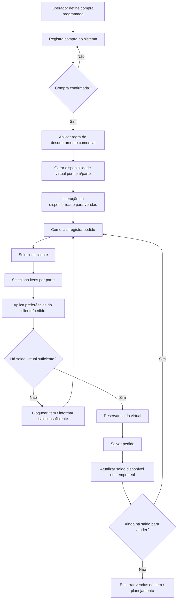

# 002-compra-programada-disponibilidade-virtual-e-vendas

## Objetivo do documento
Detalhar o bloco estrutural da solução, composto por:
1. Compra programada
2. Geração e controle da disponibilidade virtual
3. Vendas e reserva da disponibilidade

Este é o núcleo conceitual da operação, pois define o que pode ser vendido antes do recebimento físico.

---

## Conceito central

A AlphaCarnes não vende com base em estoque físico já armazenado. Ela vende com base em **disponibilidade virtual planejada**, gerada a partir da **compra principal do dia**.

Fluxo lógico:

1. Definir o que será comprado.
2. Confirmar a compra programada do dia.
3. Transformar a compra em disponibilidade virtual por item/parte.
4. Permitir que o time comercial venda somente dentro desse saldo.
5. Encerrar a venda quando o item zerar.
6. Executar a operação física no dia seguinte ou na janela operacional prevista.

---

## Definições aprovadas

### Definição 1 — lote do dia
O **lote do dia** é a **compra principal do dia**.

### Definição 2 — disponibilidade virtual
A disponibilidade virtual é **por dia**.

### Definição 3 — encerramento comercial
A venda de um item se encerra quando o saldo daquele item zera, ainda no ambiente virtual, antes da operação real.

### Definição 4 — overbooking
**Não pode haver overbooking comercial.**

### Definição 5 — origem da disponibilidade
Um pedido não pode consumir disponibilidade de mais de uma compra programada.

---

## Subprocesso 1 — Compra programada

### Finalidade
Registrar a compra principal do dia que dará origem à disponibilidade virtual a ser vendida.

### Exemplos de compra programada
- 100 bois
- 30 caixas de frango
- 20 peças ou lotes de porco

### Características do subprocesso
- Ainda não existe produto físico disponível.
- A compra é uma previsão/negociação/contratação.
- Ela será utilizada para definir o que o comercial pode vender.

### Regras principais
- Deve existir um único lote principal por dia.
- Somente compras confirmadas geram disponibilidade virtual.
- Cada item da compra deve possuir uma regra de desdobramento comercial.

---

## Subprocesso 2 — Geração da disponibilidade virtual

### Finalidade
Transformar a compra programada em saldo comercializável por item/parte.

### Exemplo de desdobramento
Compra:
- 100 bois

Disponibilidade virtual gerada:
- 100 dianteiros
- 100 centrais
- 100 traseiros

### Observações
- A disponibilidade virtual trabalha com **quantidade comercial**, não com peso.
- O peso real será conhecido posteriormente, na balança.
- O sistema deve conhecer a regra de decomposição comercial de cada item comprado.

### Exemplo de regra de desdobramento
- boi → 1 dianteiro, 1 central, 1 traseiro
- porco → regra própria
- frango → caixa fechada ou regra de subitens, conforme parametrização

---

## Subprocesso 3 — Vendas e reserva da disponibilidade

### Finalidade
Permitir ao time comercial vender somente dentro do saldo virtual disponível.

### Regra comercial essencial
O pedido é feito por **parte/unidade**, não por peso.

Exemplos:
- 20 traseiros
- 15 dianteiros
- 10 centrais

### Preferências do cliente
As preferências do cliente devem ser registradas para apoiar a associação operacional posterior, incluindo:
- peças mais pesadas ou mais leves
- mais ou menos gordura
- corte preferencial
- observações recorrentes
- prioridades operacionais ou comerciais

Essas preferências:
- não alteram o saldo virtual
- mas devem aparecer na tela do operador na balança

### Reserva da disponibilidade
Ao registrar ou confirmar um pedido:
- o saldo correspondente deve ser reservado imediatamente
- o disponível deve ser recalculado em tempo real
- não pode haver saldo negativo

---

## Estados relevantes do bloco

### Compra programada
- rascunho
- em negociação
- confirmada
- operacionalizada
- recebida
- encerrada
- cancelada

### Disponibilidade virtual
- gerada
- parcialmente reservada
- esgotada
- parcialmente recebida
- parcialmente expedida
- encerrada
- com sobra

### Pedido de venda
- rascunho
- reservado
- confirmado
- em operação
- em expedição
- faturado
- concluído
- cancelado

---

## Fluxo detalhado do bloco estrutural

---

## Regras de negócio consolidadas

### Compra programada
- Deve existir uma compra principal por dia operacional.
- A compra confirmada é a única origem da disponibilidade virtual do dia.
- Não deve haver geração de disponibilidade sem regra de desdobramento válida.

### Disponibilidade virtual
- É controlada por dia.
- Deve ser calculada por item comercial.
- Não pode haver saldo negativo.
- Deve refletir total gerado, reservado, recebido, expedido e remanescente.

### Vendas
- O pedido é feito por item/parte, não por peso.
- O sistema deve mostrar saldo em tempo real.
- A reserva é imediata ao salvar ou confirmar o pedido.
- A edição ou cancelamento do pedido deve recalcular a reserva.
- Não é permitido overbooking.
- Um pedido não pode consumir disponibilidade de mais de uma compra programada.

---

## Impacto do bloco estrutural no restante do sistema

Este bloco condiciona diretamente:
- o planejamento operacional do dia
- a montagem dos caminhões
- a associação da peça na balança
- a gestão de divergências
- a expedição
- o faturamento

Sem este bloco corretamente implementado, os demais módulos não terão base confiável.

---

## Resultado esperado deste bloco

Ao final da implementação deste bloco, o sistema deve responder com precisão:
- o que foi programado para compra hoje
- em quantas partes/unidades isso se transforma
- quanto já foi vendido por item
- quanto ainda está disponível para venda
- quais clientes têm preferências específicas
- quais pedidos estão reservados para a operação do dia
- quais itens já estão esgotados virtualmente
