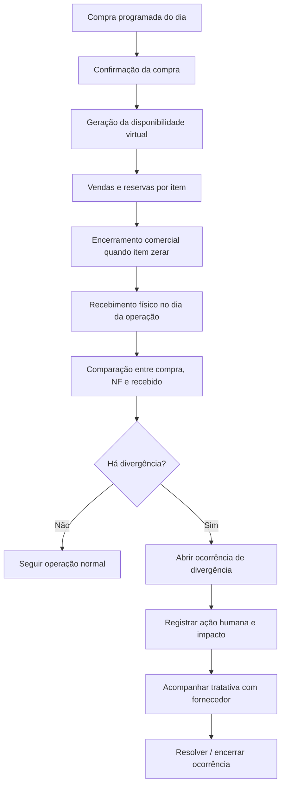

# 003-regras-funcionais-por-tela-bloco-estrutural

## Objetivo do documento
Registrar as regras funcionais por tela do bloco estrutural da solução, contemplando compra programada, disponibilidade virtual, vendas, cadastro de preferências de clientes e tratamento sistêmico de divergências de recebimento.

---

## Telas cobertas neste documento

1. Tela de Compra Programada do Dia
2. Tela de Parametrização de Desdobramento Comercial
3. Tela de Disponibilidade Virtual do Dia
4. Tela de Cadastro e Preferências do Cliente
5. Tela de Pedido de Venda
6. Tela de Monitoramento Comercial do Dia
7. Tela de Recebimento com Correção de Divergências
8. Tela de Ocorrências com Fornecedor

---

# 1. Tela de Compra Programada do Dia

## Objetivo
Registrar o lote principal do dia, base para a disponibilidade virtual e para as vendas.

## Regras funcionais
- **RF-CP-01**: Deve existir apenas um lote principal por dia operacional.
- **RF-CP-02**: A compra programada pode ser criada e editada enquanto estiver em rascunho ou negociação.
- **RF-CP-03**: Somente compras confirmadas podem gerar disponibilidade virtual.
- **RF-CP-04**: Após a existência de pedidos vinculados ao lote do dia, alterações estruturais devem ser restritas ou exigir perfil de gestor.
- **RF-CP-05**: Cada item da compra deve estar vinculado a uma regra de desdobramento comercial.
- **RF-CP-06**: Um pedido de venda do dia só poderá consumir disponibilidade desse lote principal.
- **RF-CP-07**: A tela deve alertar quando a compra do dia ainda não estiver confirmada e o comercial tentar iniciar vendas.

---

# 2. Tela de Parametrização de Desdobramento Comercial

## Objetivo
Definir como cada item comprado se transforma em itens comercializáveis.

## Regras funcionais
- **RF-DC-01**: Todo item de compra deve possuir uma regra de desdobramento ativa antes da confirmação da compra do dia.
- **RF-DC-02**: A disponibilidade virtual será gerada exclusivamente com base nessas regras.
- **RF-DC-03**: A tela deve permitir simular o resultado do desdobramento antes da confirmação.
- **RF-DC-04**: Mudanças na regra não devem afetar retroativamente compras já confirmadas.
- **RF-DC-05**: A regra deve trabalhar com quantidade comercial, não com peso.

---

# 3. Tela de Disponibilidade Virtual do Dia

## Objetivo
Exibir e controlar o saldo comercial virtual do dia.

## Regras funcionais
- **RF-DV-01**: A disponibilidade virtual deve ser gerada automaticamente após a confirmação da compra programada.
- **RF-DV-02**: A disponibilidade virtual é por dia.
- **RF-DV-03**: Cada item deve possuir saldo calculado em tempo real: disponível = total gerado - reservado.
- **RF-DV-04**: Não pode existir saldo negativo.
- **RF-DV-05**: Quando o saldo disponível de um item zerar, a venda daquele item deve ser encerrada automaticamente.
- **RF-DV-06**: A tela deve destacar item disponível, item em saldo crítico, item esgotado e item com divergência de recebimento.
- **RF-DV-07**: O sistema deve diferenciar reservado virtualmente, recebido fisicamente, expedido fisicamente e remanescente.
- **RF-DV-08**: Divergências no recebimento devem afetar a visão operacional do saldo, mas não podem ser corrigidas silenciosamente; devem gerar ocorrência formal.

---

# 4. Tela de Cadastro e Preferências do Cliente

## Objetivo
Registrar as preferências comerciais e operacionais que orientarão a sugestão de associação da peça ao pedido.

## Regras funcionais
- **RF-CL-01**: As preferências do cliente devem estar disponíveis na tela de pedido e na tela de pesagem/associação.
- **RF-CL-02**: As preferências padrão do cliente podem ser sobrescritas no pedido.
- **RF-CL-03**: As preferências não alteram a disponibilidade virtual, apenas influenciam a alocação operacional posterior.
- **RF-CL-04**: Observações críticas do cliente devem ser destacadas visualmente ao operador.

---

# 5. Tela de Pedido de Venda

## Objetivo
Permitir o registro de pedidos comerciais com consumo da disponibilidade virtual do dia.

## Regras funcionais
- **RF-PV-01**: O pedido de venda deve ser vinculado ao lote principal do dia.
- **RF-PV-02**: Um pedido não pode consumir disponibilidade de mais de uma compra programada.
- **RF-PV-03**: Cada item do pedido deve validar saldo disponível em tempo real.
- **RF-PV-04**: Não pode haver overbooking comercial.
- **RF-PV-05**: Se o item zerar, o sistema deve bloquear novas vendas daquele item.
- **RF-PV-06**: Ao salvar o pedido, a quantidade correspondente deve ser reservada imediatamente.
- **RF-PV-07**: Ao editar ou cancelar o pedido, a reserva deve ser recalculada e devolvida quando aplicável.
- **RF-PV-08**: O sistema deve exibir claramente total do item no dia, já reservado e ainda disponível.
- **RF-PV-09**: O pedido deve ser feito por parte/unidade, não por peso.

---

# 6. Tela de Monitoramento Comercial do Dia

## Objetivo
Fornecer visão executiva e operacional da compra, venda e disponibilidade do dia.

## Regras funcionais
- **RF-MC-01**: A tela deve consolidar a visão do dia em tempo real.
- **RF-MC-02**: Quando um item estiver esgotado, a tela deve sinalizar encerramento comercial daquele item.
- **RF-MC-03**: A tela deve permitir identificar rapidamente risco de problema operacional, como item 100% vendido mas ainda não recebido, divergência relevante no recebimento, sobra inesperada e ruptura potencial de atendimento.
- **RF-MC-04**: Se houver divergência entre comprado e recebido, a tela deve destacar o impacto no ecossistema: pedidos afetados, item afetado, quantidade divergente e status da tratativa.

---

# 7. Tela de Recebimento com Correção de Divergências

## Objetivo
Registrar o recebimento físico e tratar sistemicamente divergências entre compra programada, nota fiscal do fornecedor e quantidade/peso apurados.

## Regras funcionais
- **RF-RD-01**: Toda divergência entre previsto/NF e recebido deve gerar ocorrência formal no sistema.
- **RF-RD-02**: Não pode haver ajuste manual silencioso de quantidade ou item recebido.
- **RF-RD-03**: A divergência deve registrar o que era esperado, o que foi recebido, quem identificou, quando identificou, qual ação foi tomada e quem aprovou a ação.
- **RF-RD-04**: O sistema deve identificar os pedidos potencialmente afetados pela divergência.
- **RF-RD-05**: Se a divergência comprometer a capacidade de atender pedidos vendidos, a tela deve gerar alerta operacional.
- **RF-RD-06**: A tratativa deve aceitar ações como aceitar diferença, replanejar atendimento, redirecionar peças, enviar sobra para estoque, bloquear item e abrir tratativa com fornecedor.
- **RF-RD-07**: A ocorrência deve permanecer aberta até sua resolução formal.
- **RF-RD-08**: A tela deve permitir registrar o histórico de ações humanas na resolução com o fornecedor.
- **RF-RD-09**: A correção operacional pode impactar disponibilidade efetiva do dia, pedidos vendidos, expedição e faturamento; esses impactos devem ficar visíveis.
- **RF-RD-10**: Se uma divergência reduzir o total realmente disponível abaixo do total vendido, o sistema deve sinalizar ruptura operacional e listar os pedidos em risco.

---

# 8. Tela de Ocorrências com Fornecedor

## Objetivo
Acompanhar formalmente a resolução das divergências com o fornecedor.

## Regras funcionais
- **RF-OF-01**: Toda divergência crítica de recebimento deve gerar ocorrência rastreável com o fornecedor.
- **RF-OF-02**: A ocorrência deve registrar o histórico cronológico completo.
- **RF-OF-03**: A ocorrência deve permitir vincular documentos e evidências.
- **RF-OF-04**: A tela deve permitir visualizar o impacto da ocorrência em pedidos, expedição e faturamento.
- **RF-OF-05**: O encerramento da ocorrência deve exigir definição formal de desfecho.

---

## Regras transversais do bloco

- **RT-01**: A compra programada do dia é a única origem da disponibilidade virtual daquele dia.
- **RT-02**: A disponibilidade virtual é controlada por dia.
- **RT-03**: A venda de um item se encerra quando seu saldo virtual zera.
- **RT-04**: Não é permitido overbooking.
- **RT-05**: Um pedido não pode consumir disponibilidade de mais de uma compra programada.
- **RT-06**: O sistema deve separar claramente previsto/comprado, reservado/vendido, recebido fisicamente, expedido, divergente e sobrante.
- **RT-07**: Toda correção de divergência no recebimento deve ser rastreável.

---

## Fluxo resumido do bloco com divergência

