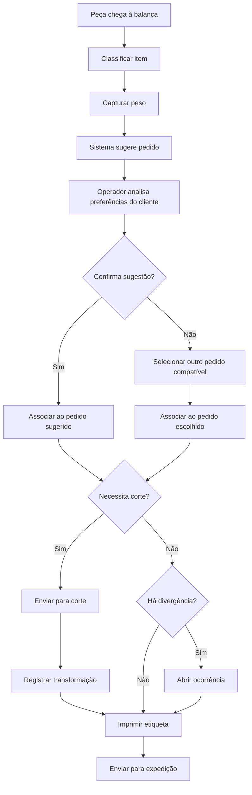
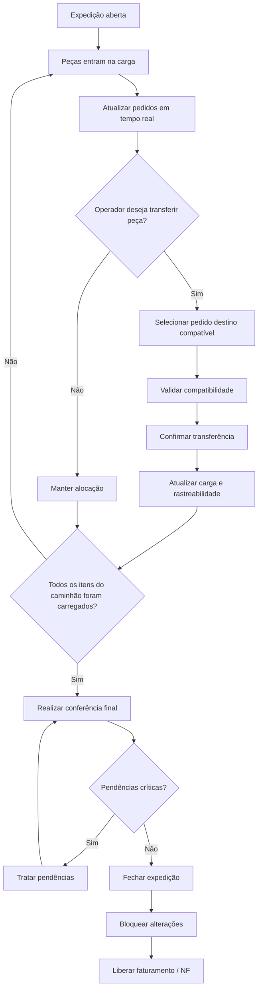

# 006-campos-e-acoes-detalhados-tela-pesagem-associacao-sugestiva-e-expedicao-caminhao

## Objetivo do documento
Detalhar os campos, ações, estados, regras funcionais e fluxos das telas:
1. Tela de Pesagem com Associação Sugestiva
2. Tela de Expedição / Caminhão

Este documento dá continuidade aos documentos anteriores do bloco estrutural e operacional da AlphaCarnes, mantendo a rastreabilidade e coerência do desenho funcional já aprovado.

---

# 1. Premissas já aprovadas

## 1.1 Premissas operacionais
- A operação é predominantemente de **cross-docking**.
- A venda ocorre sobre **disponibilidade virtual por dia**, antes da operação real.
- O pedido é realizado por **parte/unidade**, e não por peso.
- O peso real é conhecido apenas na etapa de recebimento/pesagem.
- O operador pode usar sua expertise para decidir a melhor destinação da peça.
- O sistema deve **sugerir** a associação da peça ao pedido, mas a decisão final é humana.
- Mesmo após associada a um pedido, a peça pode ser transferida entre pedidos enquanto a expedição estiver em aberto.
- Após o fechamento do caminhão/expedição, a alteração de destinação da peça fica bloqueada.

## 1.2 Premissas de integração
- A balança pode operar com leitura automática ou entrada manual assistida.
- A impressora de etiquetas deve ser acionada a partir da confirmação operacional da peça.
- Os dados devem refletir em tempo real na expedição, faturamento e painéis.

---

# 2. Tela de Pesagem com Associação Sugestiva

## 2.1 Objetivo
Permitir o registro operacional da peça recebida, capturar seu peso, sugerir automaticamente o pedido de venda mais compatível e permitir ao operador confirmar ou redirecionar a destinação da peça com base na sua experiência e nas preferências do cliente.

## 2.2 Usuários
- Operador de recebimento/pesagem
- Separador
- Gestor operacional (consulta/supervisão)
- Apoio da expedição (consulta, se necessário)

## 2.3 Características de UX esperadas
- Interface touch-friendly
- Uso com poucos cliques
- Fonte grande
- Alto contraste
- Leitura rápida em ambiente operacional
- Status visuais claros
- Operação contínua por esteira/fluxo

---

## 2.4 Estrutura da tela

### Bloco A — Cabeçalho operacional
Exibe o contexto da operação atual.

#### Campos
- Data operacional
- Lote do dia
- Fornecedor
- NF de entrada (quando disponível)
- Terminal/estação
- Operador logado
- Status da balança
- Status da impressora
- Caminhão fornecedor em atendimento
- Caminhão de entrega em montagem, quando aplicável

#### Regras
- O operador deve visualizar claramente em qual lote do dia está operando.
- Os status de balança e impressora devem ficar visíveis o tempo todo.
- Falhas de comunicação com dispositivos devem ser destacadas sem interromper silenciosamente a operação.

---

### Bloco B — Identificação da peça recebida
Permite registrar a macroparte ou item que está entrando na balança.

#### Campos
- Tipo de item recebido
  - dianteiro
  - central
  - traseiro
  - item suíno
  - item de frango
  - outro item
- Subtipo/classificação operacional
- Código/lacre/identificação do lote, se existir
- Origem do item
- Observação visual rápida
- Indicador de necessidade de corte aparente
- Indicador de possível divergência

#### Ações
- Selecionar item
- Confirmar classificação
- Reclassificar item
- Registrar observação rápida
- Sinalizar item para corte
- Sinalizar suspeita de divergência

#### Regras funcionais
##### RF-PS-01
O item deve ser classificado antes da associação ao pedido.

##### RF-PS-02
Se houver dúvida sobre o tipo de item, o operador pode registrar a classificação provisória e sinalizar revisão posterior.

##### RF-PS-03
A tela deve permitir reclassificação enquanto a peça ainda não estiver bloqueada por fechamento de expedição.

---

### Bloco C — Captura de peso
Responsável pelo peso real da peça.

#### Campos
- Peso atual da balança
- Indicador de estabilidade
- Modo de captura
  - automático
  - manual
- Peso confirmado
- Horário da leitura
- Últimas leituras, se necessário

#### Ações
- Capturar peso automaticamente
- Confirmar peso
- Digitar peso manualmente, se autorizado
- Repetir leitura
- Limpar leitura
- Marcar problema na balança

#### Regras funcionais
##### RF-PS-04
O sistema deve priorizar a leitura automática da balança quando disponível.

##### RF-PS-05
A confirmação do peso deve exigir leitura estável ou justificativa para prosseguir com peso manual.

##### RF-PS-06
Pesos inseridos manualmente devem ficar marcados como tal para auditoria.

##### RF-PS-07
O horário e o operador da confirmação devem ser registrados.

---

### Bloco D — Sugestão de associação ao pedido
Este é o núcleo inteligente da tela.

#### Objetivo
Sugerir o pedido mais adequado para a peça com base em regras de negócio e preferências do cliente.

#### Dados exibidos na sugestão principal
- Pedido sugerido
- Cliente sugerido
- Item do pedido correspondente
- Quantidade pendente daquele item
- Rota/caminhão previstos
- Preferências do cliente
- Justificativa resumida da sugestão

#### Critérios sugeridos para o motor de sugestão
- Compatibilidade do item recebido com o item pedido
- Saldo pendente do pedido
- Preferência de faixa de peso do cliente
- Preferência de gordura/perfil
- Necessidade de corte
- Priorização logística do caminhão/rota
- Prioridade comercial definida
- Ordem de atendimento planejada

#### Regras funcionais
##### RF-PS-08
O sistema deve sempre apresentar uma sugestão quando houver pedido compatível em aberto.

##### RF-PS-09
A sugestão não deve vincular automaticamente a peça sem aprovação do operador.

##### RF-PS-10
A sugestão deve exibir transparência mínima do motivo da recomendação.

##### RF-PS-11
Se não houver pedido compatível, o sistema deve permitir:
- encaminhar para estoque/sobra
- marcar para análise
- registrar divergência
- enviar para corte, quando aplicável

---

### Bloco E — Dados do cliente e preferências
Permite que o operador veja o contexto necessário para decidir.

#### Campos
- Cliente
- Prioridade do cliente
- Faixa de peso preferida
- Perfil de gordura
- Observações recorrentes
- Preferência por corte
- Restrições operacionais
- Observações do pedido específico
- Histórico resumido de preferências, se útil

#### Regras funcionais
##### RF-PS-12
As preferências do cliente devem ficar visíveis no momento da aprovação da associação.

##### RF-PS-13
As preferências padrão do cliente e as observações do pedido devem ser destacadas separadamente.

##### RF-PS-14
Observações críticas devem aparecer com destaque visual.

---

### Bloco F — Lista de pedidos compatíveis
Permite ao operador redirecionar a peça.

#### Campos por linha
- Pedido
- Cliente
- Item
- Quantidade pedida
- Quantidade já preenchida
- Quantidade pendente
- Preferências resumidas
- Caminhão previsto
- Rota prevista
- Prioridade
- Compatibilidade estimada

#### Ações
- Confirmar pedido sugerido
- Selecionar outro pedido compatível
- Filtrar pedidos
- Ordenar por prioridade
- Buscar por cliente/pedido
- Ver detalhes do pedido

#### Regras funcionais
##### RF-PS-15
O operador deve poder redirecionar a peça para outro pedido compatível.

##### RF-PS-16
Somente pedidos compatíveis e ainda abertos devem aparecer como opções válidas.

##### RF-PS-17
O sistema deve bloquear a seleção de pedido:
- já completo
- incompatível com o item
- já faturado
- pertencente a caminhão já fechado

##### RF-PS-18
O operador deve conseguir visualizar rapidamente o impacto da escolha na carga e no saldo do pedido.

---

### Bloco G — Decisão operacional da peça
Registra o destino efetivo da peça.

#### Ações principais
- Confirmar associação ao pedido sugerido
- Redirecionar para outro pedido
- Enviar para corte
- Registrar divergência
- Destinar para sobra/estoque
- Rejeitar temporariamente
- Reimprimir etiqueta
- Cancelar operação antes da confirmação final

#### Regras funcionais
##### RF-PS-19
Toda decisão sobre a peça deve gerar rastreabilidade:
- operador
- horário
- peso
- item
- pedido associado
- justificativa, quando aplicável

##### RF-PS-20
Se a peça for enviada para corte, o vínculo original deve permanecer rastreável.

##### RF-PS-21
Se a peça for direcionada para estoque/sobra, a tela deve exigir motivo.

##### RF-PS-22
Se houver divergência, a ocorrência deve ser aberta formalmente.

---

### Bloco H — Etiquetagem
Emite a etiqueta após confirmação.

#### Campos exibidos para pré-visualização
- ID da peça
- Data/hora
- Item
- Cliente
- Pedido
- Peso
- Quantidade
- Caminhão
- Rota
- QR Code
- Observações relevantes

#### Ações
- Imprimir etiqueta
- Reimprimir etiqueta
- Alterar layout, se perfil permitir
- Confirmar impressão

#### Regras funcionais
##### RF-PS-23
A etiqueta só deve ser emitida após a confirmação operacional da peça.

##### RF-PS-24
Reimpressões devem ficar auditadas.

##### RF-PS-25
Se a peça ainda estiver em carga aberta, a etiqueta poderá ser atualizada/reemitida caso haja transferência de pedido, conforme regra de negócio definida.

---

## 2.5 Estados sugeridos da peça na pesagem/associação
- recebida
- identificada
- pesada
- sugerida para pedido
- associada provisoriamente
- direcionada para corte
- com divergência
- em expedição aberta
- bloqueada por fechamento
- enviada para estoque/sobra
- expedida

---

## 2.6 Fluxo funcional da Tela de Pesagem

---

# 3. Tela de Expedição / Caminhão

## 3.1 Objetivo
Controlar a montagem da carga por caminhão, permitir conferência em tempo real, possibilitar a transferência de peças entre pedidos enquanto a expedição estiver aberta e bloquear alterações após o fechamento do caminhão.

## 3.2 Usuários
- operador de expedição
- Ludmila / responsável pela carga
- conferente em tablet
- gestor operacional
- faturamento em consulta

## 3.3 Estrutura da tela

### Bloco A — Cabeçalho do caminhão
#### Campos
- Caminhão
- Motorista
- Rota
- Itinerário
- Ordem de paradas
- Status da expedição
- Total previsto de pedidos
- Total previsto de peças
- Total carregado até o momento
- Horário de abertura da carga
- Horário estimado de saída

#### Regras funcionais
##### RF-EC-01
Cada caminhão em operação deve possuir status claro:
- planejado
- em carga
- em conferência
- fechado
- liberado
- faturado
- expedido

##### RF-EC-02
Enquanto o caminhão estiver com status “em carga” ou equivalente, a expedição é considerada aberta.

---

### Bloco B — Pedidos do caminhão
#### Campos por pedido
- Pedido
- Cliente
- Item
- Quantidade prevista
- Quantidade já associada/carregada
- Quantidade pendente
- Peso acumulado
- Observações
- Prioridade
- Situação do pedido na carga

#### Ações
- Abrir detalhes do pedido
- Visualizar peças vinculadas
- Filtrar por cliente
- Filtrar pendências
- Destacar pedidos críticos

#### Regras funcionais
##### RF-EC-03
A tela deve mostrar em tempo real o preenchimento dos pedidos do caminhão.

##### RF-EC-04
O sistema deve destacar pedidos:
- completos
- parciais
- em risco
- com divergência

---

### Bloco C — Lista de peças carregadas / em carga
#### Campos por peça
- ID da peça
- Item
- Peso
- Pedido atual
- Cliente atual
- Horário de entrada na carga
- Origem (direta ou pós-corte)
- Status
- QR Code/identificação
- Observações

#### Ações
- Consultar peça
- Transferir peça para outro pedido compatível
- Remover da carga, se autorizado
- Registrar conferência
- Reimprimir etiqueta
- Ver histórico da peça

#### Regras funcionais
##### RF-EC-05
Toda peça em expedição aberta deve poder ser consultada individualmente.

##### RF-EC-06
A peça pode ser transferida entre pedidos compatíveis somente enquanto a expedição estiver aberta.

##### RF-EC-07
Transferências devem atualizar imediatamente:
- pedido de origem
- pedido de destino
- saldos pendentes
- rastreabilidade
- painéis operacionais

##### RF-EC-08
O sistema deve bloquear transferência de peça quando:
- caminhão estiver fechado
- NF emitida
- pedido de destino incompatível
- pedido de destino já completo
- peça estiver bloqueada por divergência

---

### Bloco D — Transferência entre pedidos
Este bloco pode ser um modal ou painel lateral.

#### Campos
- Peça selecionada
- Pedido atual
- Cliente atual
- Lista de pedidos compatíveis
- Justificativa da transferência
- Operador responsável
- Impacto na carga

#### Ações
- Confirmar transferência
- Cancelar
- Ver preferências do cliente de origem
- Ver preferências do cliente de destino
- Ver saldo pendente do pedido de destino

#### Regras funcionais
##### RF-EC-09
A transferência deve exigir confirmação explícita do operador.

##### RF-EC-10
Toda transferência deve ficar registrada com:
- operador
- data/hora
- pedido anterior
- pedido novo
- motivo
- situação da expedição

##### RF-EC-11
A tela deve exibir as preferências do cliente do pedido destino antes da confirmação.

---

### Bloco E — Conferência de carga
#### Campos
- Total esperado do caminhão
- Total já carregado
- Peças faltantes
- Peças excedentes
- Divergências de expedição
- Progresso da carga
- Checklist operacional

#### Ações
- Confirmar item
- Registrar falta
- Registrar sobra
- Registrar divergência
- Marcar checklist
- Concluir conferência

#### Regras funcionais
##### RF-EC-12
A conferência deve refletir a composição real da carga em tempo real.

##### RF-EC-13
Diferenças entre previsto e carregado devem gerar alerta imediato.

##### RF-EC-14
O caminhão não deve ser fechado com pendências críticas sem autorização apropriada.

---

### Bloco F — Fechamento da expedição
#### Campos exibidos
- Resumo final da carga
- Pedidos completos
- Pedidos parciais
- Divergências pendentes
- Total de peças
- Peso total
- Hora de fechamento
- Operador responsável
- Situação do faturamento

#### Ações
- Validar fechamento
- Fechar expedição
- Reabrir, se perfil e regra permitirem
- Liberar para faturamento
- Imprimir/gerar romaneio
- Enviar dados ao faturamento

#### Regras funcionais
##### RF-EC-15
Somente expedições abertas podem receber alterações de destinação de peça.

##### RF-EC-16
Ao fechar a expedição, todas as peças vinculadas ao caminhão devem ficar bloqueadas para alteração.

##### RF-EC-17
O fechamento da expedição é pré-requisito para a liberação da emissão de NF.

##### RF-EC-18
A reabertura de expedição, se existir, deve ser excepcional, auditada e restrita por perfil.

---

## 3.4 Estados do caminhão / expedição
- planejado
- aguardando carga
- em carga
- em conferência
- fechado
- liberado para faturamento
- faturado
- liberado para saída
- expedido

---

## 3.5 Fluxo funcional da Tela de Expedição

---

# 4. Regras transversais específicas do 006

## RT-006-01
A associação da peça ao pedido é sempre sugestiva, nunca totalmente automática.

## RT-006-02
A decisão final da destinação da peça é do operador.

## RT-006-03
Enquanto a expedição estiver em aberto, a peça pode ser transferida entre pedidos compatíveis.

## RT-006-04
Após o fechamento do caminhão/expedição, a alteração de destinação da peça fica bloqueada.

## RT-006-05
Toda alteração de destinação deve ser rastreável.

## RT-006-06
A emissão de NF só pode ser liberada após o fechamento da expedição.

---

# 5. Pontos de atenção para próximos documentos
Os próximos documentos podem detalhar:
- motor de sugestão e critérios de score
- regras detalhadas de corte e transformação
- regras detalhadas de faturamento e emissão de NF
- telas de dashboard operacional e monitoramento em tempo real
- modelo de dados de peça, expedição, caminhão e transferências

---

# 6. Resultado esperado deste documento
Com este documento, o sistema passa a ter base funcional para:
- operar a balança com apoio sistêmico
- associar peças aos pedidos de forma assistida
- permitir intervenção humana qualificada
- montar a carga de forma dinâmica
- controlar o ponto exato de bloqueio operacional
- preparar o fechamento correto para faturamento e saída do caminhão
