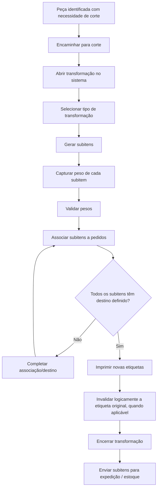

# 007-corte-transformacao-reetiquetagem-e-rastreabilidade-da-peca

## Objetivo do documento
Detalhar as regras funcionais, fluxos, estados, campos e ações relacionados ao processo de:
1. Corte
2. Transformação da peça em subitens
3. Reetiquetagem
4. Rastreabilidade completa da peça

Este documento dá continuidade ao fluxo operacional já aprovado, especialmente após a etapa de pesagem, associação sugestiva ao pedido e encaminhamento para expedição.

---

# 1. Contexto operacional

## 1.1 Papel do corte na operação
O corte é uma exceção prevista dentro do fluxo principal da operação.  
Ele ocorre quando uma peça:
- precisa ser adaptada ao perfil do cliente,
- precisa ser subdividida em partes menores,
- precisa corrigir sua apresentação comercial,
- ou exige adequação operacional antes da expedição.

O corte altera a composição física e comercial da peça e, por isso, deve ser tratado como **transformação rastreável**, nunca como simples ajuste manual.

## 1.2 Princípio central
A peça original nunca deve “sumir” do sistema.  
Quando houver corte, o sistema deve preservar:
- a identidade da peça original,
- o vínculo com o pedido anterior,
- o histórico do peso original,
- os novos subitens gerados,
- os novos pesos,
- as novas etiquetas,
- e o destino final de cada item gerado.

---

# 2. Objetivos funcionais do processo de corte

O processo de corte deve permitir:
- registrar que uma peça foi encaminhada para corte,
- identificar a peça original,
- registrar os subitens gerados,
- pesar novamente os subitens,
- gerar novas etiquetas,
- preservar rastreabilidade completa,
- atualizar pedido, expedição e faturamento,
- e bloquear inconsistências operacionais.

---

# 3. Conceitos principais

## 3.1 Peça original
Item identificado na etapa de recebimento/pesagem, com:
- peso original,
- associação inicial ao pedido,
- etiqueta inicial,
- contexto operacional.

## 3.2 Transformação
Evento operacional que converte uma peça em:
- uma peça ajustada,
- duas ou mais peças menores,
- subitens comercialmente distintos,
- ou novos itens com novo peso e eventualmente nova classificação.

## 3.3 Subitem
Cada item derivado da peça original após o corte.

## 3.4 Reetiquetagem
Emissão de nova etiqueta para o item resultante do corte, mantendo vínculo com a peça original.

## 3.5 Cadeia de rastreabilidade
Relação cronológica e estrutural entre:
- peça original,
- evento de corte,
- subitens gerados,
- novas pesagens,
- novas etiquetas,
- pedido final,
- caminhão final,
- faturamento final.

---

# 4. Situações que podem disparar o corte

## 4.1 Por preferência do cliente
Exemplos:
- cliente prefere pedaços menores,
- cliente exige padrão específico,
- cliente aceita somente parte ajustada.

## 4.2 Por necessidade operacional
Exemplos:
- adequação à montagem da carga,
- adequação a espaço/logística,
- separação de peças.

## 4.3 Por divergência
Exemplos:
- peça não atende perfil esperado,
- necessário reclassificar,
- necessário salvar parte da peça para outro pedido.

## 4.4 Por decisão humana
O operador/gestor pode decidir pelo corte com base na melhor solução operacional.

---

# 5. Tela / módulo de corte

## 5.1 Objetivo
Permitir que o operador registre o corte da peça, seus resultados e a nova configuração operacional.

## 5.2 Usuários
- operador de corte
- operador de pesagem
- gestor operacional
- expedição em consulta
- faturamento em consulta, quando necessário

## 5.3 Dados exibidos da peça original
- ID da peça original
- item original
- peso original
- pedido inicialmente associado
- cliente
- preferências aplicadas
- horário da pesagem original
- operador responsável anterior
- status atual
- etiqueta original
- caminhão previsto
- rota prevista
- observações e divergências associadas

## 5.4 Ações principais
- encaminhar para corte
- iniciar corte
- registrar tipo de transformação
- informar quantidade de subitens
- registrar subitens gerados
- capturar peso de cada subitem
- reclassificar subitem
- associar subitem ao pedido
- redirecionar subitem para outro pedido compatível
- enviar subitem para expedição
- destinar subitem a estoque/sobra
- imprimir nova etiqueta
- encerrar transformação

---

# 6. Tipos de transformação suportados

## 6.1 Corte simples
A peça continua sendo um único item, mas com:
- novo peso,
- nova apresentação,
- eventual nova etiqueta.

## 6.2 Corte com subdivisão
A peça original gera dois ou mais subitens.

Exemplo:
- uma peça gera 2 partes menores.

## 6.3 Corte com reclassificação
A peça original ou subitem passa a ser tratado como outro item comercial/operacional permitido.

## 6.4 Corte com destinação mista
Parte da peça segue para um pedido e parte para:
- outro pedido,
- estoque,
- ou descarte técnico, se houver regra futura.

---

# 7. Regras funcionais do processo de corte

## 7.1 Regras gerais

### RF-CT-01
Somente peças ainda não bloqueadas por fechamento definitivo podem ser encaminhadas para corte.

### RF-CT-02
Toda peça encaminhada para corte deve manter vínculo permanente com sua peça original.

### RF-CT-03
A peça original não pode ser apagada nem sobrescrita silenciosamente.

### RF-CT-04
O sistema deve registrar o evento de corte com:
- data/hora,
- operador,
- motivo,
- tipo de transformação,
- peça de origem.

### RF-CT-05
O corte deve gerar rastreabilidade completa dos subitens produzidos.

---

## 7.2 Regras de geração de subitens

### RF-CT-06
Cada subitem gerado deve receber um identificador único.

### RF-CT-07
Cada subitem deve possuir:
- item/classificação,
- peso,
- quantidade,
- vínculo com a peça original,
- vínculo com o evento de corte,
- status operacional.

### RF-CT-08
O sistema deve permitir criar um ou vários subitens derivados da peça original.

### RF-CT-09
A soma dos pesos dos subitens não deve exceder o peso original sem justificativa formal.

### RF-CT-10
Diferenças relevantes entre peso original e soma dos subitens devem gerar alerta e justificativa obrigatória.

---

## 7.3 Regras de associação dos subitens

### RF-CT-11
O subitem pode herdar o pedido original da peça, quando compatível.

### RF-CT-12
O subitem pode ser redirecionado para outro pedido compatível, enquanto a expedição estiver aberta.

### RF-CT-13
As preferências do cliente devem ser consideradas na nova associação do subitem.

### RF-CT-14
Subitens não compatíveis com nenhum pedido podem ser destinados a:
- análise,
- estoque/sobra,
- ou replanejamento operacional.

---

## 7.4 Regras de reetiquetagem

### RF-CT-15
Todo subitem operacionalmente válido deve receber nova etiqueta.

### RF-CT-16
A nova etiqueta deve manter referência à peça original.

### RF-CT-17
A etiqueta original deve ser invalidada logicamente para expedição quando a peça deixar de existir como unidade expedível.

### RF-CT-18
Reimpressões e reetiquetagens devem ser auditadas.

---

## 7.5 Regras de rastreabilidade

### RF-CT-19
O histórico deve permitir visualizar:
- peça original,
- evento de corte,
- subitens gerados,
- novas pesagens,
- novas etiquetas,
- destino final.

### RF-CT-20
A rastreabilidade deve ser consultável por:
- peça,
- subitem,
- pedido,
- cliente,
- caminhão,
- lote do dia.

### RF-CT-21
O sistema deve registrar todas as transferências de destinação dos subitens.

---

## 7.6 Regras de bloqueio

### RF-CT-22
Subitem já faturado ou em expedição fechada não pode ser alterado.

### RF-CT-23
Peça original em processo de transformação não pode ser expedida em paralelo.

### RF-CT-24
Não deve ser possível encerrar o corte sem definir o destino operacional dos subitens gerados.

---

# 8. Campos detalhados da tela de corte

## 8.1 Cabeçalho da transformação
- ID da transformação
- Data/hora de abertura
- Operador responsável
- Status da transformação
- Motivo do corte
- Tipo de transformação
- Observações

## 8.2 Dados da peça de origem
- ID da peça original
- Item original
- Peso original
- Cliente/pedido original
- Caminhão previsto
- Rota
- Etiqueta original
- Status operacional
- Observações/preferências

## 8.3 Dados dos subitens gerados
Para cada subitem:
- ID do subitem
- classificação/item
- peso
- quantidade
- pedido associado
- cliente
- destino
- caminhão
- status
- etiqueta nova
- observações

## 8.4 Totais e validações
- peso original
- soma dos pesos dos subitens
- diferença apurada
- justificativa da diferença
- status de validação

---

# 9. Ações detalhadas da tela de corte

## 9.1 Ações principais
- iniciar transformação
- adicionar subitem
- remover subitem antes do fechamento
- confirmar peso do subitem
- reclassificar subitem
- associar subitem ao pedido
- transferir subitem para outro pedido
- destinar subitem para estoque/sobra
- imprimir etiqueta do subitem
- concluir corte
- cancelar transformação, se permitido

## 9.2 Ações auxiliares
- visualizar preferências do cliente
- visualizar histórico da peça original
- abrir divergência
- registrar observação
- sinalizar perda operacional
- solicitar aprovação do gestor

---

# 10. Estados operacionais

## 10.1 Estado da transformação
- aberta
- em execução
- aguardando pesagem
- aguardando associação
- aguardando etiquetagem
- concluída
- cancelada
- bloqueada

## 10.2 Estado da peça original
- ativa
- em transformação
- transformada
- parcialmente transformada
- bloqueada
- encerrada

## 10.3 Estado do subitem
- gerado
- pesado
- associado provisoriamente
- em expedição aberta
- bloqueado por fechamento
- enviado a estoque
- expedido
- faturado

---

# 11. Fluxo funcional do processo de corte

---

# 12. Reetiquetagem

## 12.1 Objetivo
Garantir que os itens resultantes do corte circulem na operação com identificação correta e rastreável.

## 12.2 Dados mínimos da nova etiqueta
- ID do subitem
- referência da peça original
- data/hora
- item/classificação
- peso
- cliente/pedido
- caminhão/rota, se já definidos
- QR Code
- observações relevantes

## 12.3 Regras funcionais da reetiquetagem

### RF-RT-01
A nova etiqueta deve substituir operacionalmente a anterior para o item transformado.

### RF-RT-02
A referência à peça original deve continuar recuperável via sistema e, idealmente, via QR Code ou código legível.

### RF-RT-03
A reetiquetagem não pode quebrar o histórico da peça.

### RF-RT-04
Se houver múltiplos subitens, cada um deve ter sua própria etiqueta.

---

# 13. Rastreabilidade da peça

## 13.1 Objetivo
Permitir a leitura completa do ciclo de vida da peça.

## 13.2 O sistema deve responder perguntas como:
- qual foi a peça original?
- essa peça foi cortada?
- quantos subitens foram gerados?
- quais pesos cada subitem teve?
- para quais pedidos eles foram?
- qual caminhão levou cada subitem?
- qual NF contemplou o item final?
- qual operador realizou o corte?
- houve divergência durante o processo?

## 13.3 Linha do tempo mínima
- compra programada do dia
- recebimento
- pesagem inicial
- sugestão/associação ao pedido
- envio para corte
- transformação
- novas pesagens
- reetiquetagem
- expedição
- faturamento
- saída

---

# 14. Alertas e exceções

## 14.1 Alertas
- soma dos subitens divergente do peso original
- subitem sem pedido definido
- subitem sem etiqueta
- subitem em caminhão fechado tentando ser alterado
- transformação aberta há tempo excessivo
- perda operacional acima do limite

## 14.2 Exceções tratáveis
- necessidade de ajuste de classificação
- envio parcial para pedido e parcial para sobra
- reabertura da transformação por perfil autorizado
- correção de etiqueta com auditoria

---

# 15. Integrações impactadas

O processo de corte impacta diretamente:
- pesagem
- associação ao pedido
- expedição
- faturamento
- dashboards operacionais
- rastreabilidade
- estoque/sobra

Toda alteração deve atualizar o ecossistema em tempo real.

---

# 16. Regras transversais específicas do 007

## RT-007-01
O corte é sempre uma transformação rastreável.

## RT-007-02
A peça original nunca deve perder sua identidade histórica.

## RT-007-03
Os subitens precisam ser identificados individualmente.

## RT-007-04
A etiqueta original e as novas etiquetas devem coexistir logicamente no histórico.

## RT-007-05
Subitens só podem seguir para expedição após peso, associação e etiqueta válidos.

## RT-007-06
O processo de corte não pode gerar inconsistência silenciosa no saldo operacional da carga.

---

# 17. Resultado esperado deste documento
Com este documento, a operação passa a ter base funcional para:
- tratar corte como transformação formal,
- preservar rastreabilidade ponta a ponta,
- suportar múltiplos subitens,
- manter coerência entre peso, pedido, etiqueta e expedição,
- e evitar perda de controle quando uma peça deixa de seguir o fluxo simples de recebimento direto para carga.
