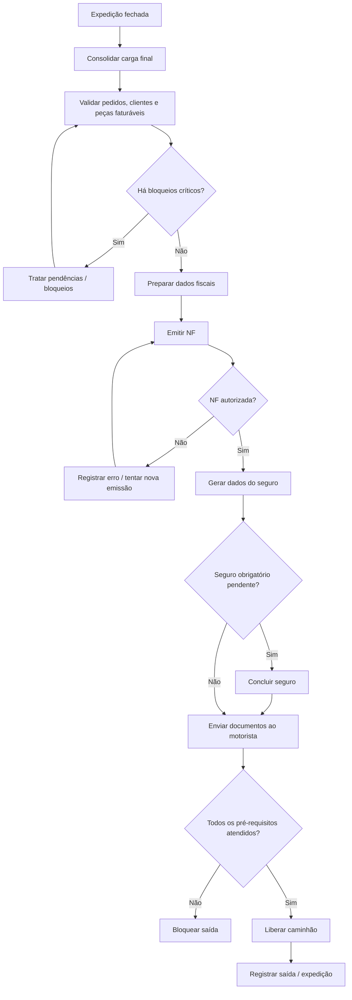

# 008-faturamento-emissao-nf-seguro-bloqueios-fiscais-e-liberacao-do-caminhao

## Objetivo do documento
Detalhar as regras funcionais, fluxos, estados, campos e ações relacionados ao processo de:
1. Faturamento
2. Emissão de Nota Fiscal
3. Geração de dados para seguro da carga
4. Bloqueios fiscais e operacionais
5. Liberação do caminhão para saída

Este documento dá continuidade ao fluxo operacional aprovado anteriormente, especialmente após:
- montagem e conferência da carga,
- fechamento da expedição,
- bloqueio da destinação das peças,
- e preparação final para a saída do caminhão.

---

# 1. Contexto do processo

## 1.1 Papel do faturamento na operação
O faturamento é a etapa que consolida formalmente a operação comercial e logística já montada.

Até esse ponto, o sistema já deve ter:
- compra programada definida,
- disponibilidade virtual consumida pelas vendas,
- peças recebidas e pesadas,
- peças associadas aos pedidos,
- corte e transformação registrados, quando houver,
- expedição montada,
- carga conferida,
- caminhão fechado.

A partir daí, o sistema passa a:
- consolidar os dados finais da carga,
- emitir a NF,
- gerar as informações necessárias ao seguro,
- liberar formalmente o caminhão,
- e enviar eletronicamente os documentos ao motorista.

## 1.2 Princípio central
**A NF só pode ser emitida após o fechamento da expedição do caminhão.**

Isso garante coerência entre:
- pedido,
- peça,
- carga,
- cliente,
- faturamento,
- e fiscalização.

---

# 2. Objetivos funcionais do processo

O processo de faturamento deve permitir:
- consolidar os pedidos efetivamente carregados,
- identificar pendências ou bloqueios,
- gerar a NF com base na carga final,
- registrar o vínculo entre pedidos, peças, caminhão e documento fiscal,
- gerar os dados necessários para seguro da carga,
- enviar os documentos ao motorista,
- e liberar o caminhão para saída apenas quando todos os requisitos forem atendidos.

---

# 3. Premissas já aprovadas

## 3.1 Premissas operacionais
- O pedido comercial é por parte/unidade, mas a carga final incorpora pesos reais apurados.
- A destinação das peças pode mudar enquanto a expedição estiver aberta.
- Após o fechamento da expedição, a destinação das peças fica bloqueada.
- O faturamento ocorre somente sobre o que foi efetivamente carregado.
- Peças não carregadas não podem ser faturadas naquele caminhão.
- Itens em divergência crítica não devem seguir para faturamento sem tratamento formal.

## 3.2 Premissas fiscais e documentais
- A emissão de NF deve considerar as regras fiscais aplicáveis.
- O sistema deve se integrar ao processo de emissão e, idealmente, à SEFAZ (Osasco), conforme já previsto.
- O motorista deve receber eletronicamente a documentação emitida.
- O seguro da carga depende da consolidação final do carregamento.

---

# 4. Módulo / Tela de Faturamento do Caminhão

## 4.1 Objetivo
Consolidar a carga final e preparar os documentos fiscais e logísticos necessários para a saída.

## 4.2 Usuários
- faturamento
- gestor operacional
- administrativo
- expedição em consulta
- logística em consulta

## 4.3 Estrutura da tela

### Bloco A — Cabeçalho do caminhão
#### Campos
- ID do caminhão
- placa
- motorista
- rota
- itinerário
- data operacional
- hora de fechamento da expedição
- status do faturamento
- status da NF
- status do seguro
- status da liberação final

#### Regras funcionais
##### RF-FT-01
A tela deve exibir claramente o status atual do caminhão em relação a:
- expedição,
- faturamento,
- emissão fiscal,
- seguro,
- liberação.

##### RF-FT-02
Somente caminhões com expedição fechada podem entrar na etapa de faturamento.

---

### Bloco B — Consolidação da carga
#### Campos exibidos
- total de pedidos vinculados
- total de clientes vinculados
- total de peças carregadas
- peso total da carga
- itens por cliente
- itens por pedido
- divergências pendentes
- sobras não faturadas
- observações operacionais

#### Ações
- abrir resumo por pedido
- abrir resumo por cliente
- abrir lista de peças
- visualizar divergências
- validar composição final da carga

#### Regras funcionais
##### RF-FT-03
A consolidação deve refletir somente a carga efetivamente fechada no caminhão.

##### RF-FT-04
O sistema deve diferenciar:
- itens carregados e aptos a faturar,
- itens fora da carga,
- itens bloqueados,
- itens com divergência.

##### RF-FT-05
A tela deve permitir rastrear cada item faturável até:
- pedido,
- peça/subitem,
- cliente,
- caminhão.

---

### Bloco C — Resumo fiscal por cliente/pedido
#### Campos
- cliente
- pedido
- itens faturáveis
- quantidades finais
- peso final
- valores, quando aplicável
- observações fiscais
- observações operacionais
- status de aptidão fiscal

#### Ações
- editar complementos fiscais permitidos
- validar dados do cliente
- validar dados da operação
- marcar item/pedido como pronto para faturamento
- destacar pendências

#### Regras funcionais
##### RF-FT-06
O sistema deve consolidar o faturamento por cliente/pedido conforme a estratégia fiscal adotada.

##### RF-FT-07
Dados fiscais obrigatórios incompletos devem bloquear a emissão.

##### RF-FT-08
A tela deve destacar pendências cadastrais ou documentais do cliente.

---

### Bloco D — Pendências e bloqueios
#### Objetivo
Impedir faturamento incorreto e dar visibilidade do motivo do bloqueio.

#### Tipos de bloqueio possíveis
- expedição não fechada
- peça bloqueada
- divergência crítica não tratada
- pedido incompleto sem autorização
- cliente com dados fiscais incompletos
- NF não autorizada
- falha de integração fiscal
- seguro pendente, se for regra obrigatória
- conferência final não concluída
- inconsistência entre carga e dados fiscais

#### Ações
- visualizar motivo do bloqueio
- abrir ocorrência relacionada
- solicitar aprovação do gestor
- registrar exceção autorizada
- atualizar cadastro
- reprocessar validação

#### Regras funcionais
##### RF-FT-09
O sistema não pode permitir emissão fiscal com bloqueios críticos ativos.

##### RF-FT-10
Todo bloqueio deve exibir:
- causa,
- impacto,
- ação necessária,
- responsável potencial pela resolução.

##### RF-FT-11
Bloqueios excepcionais resolvidos manualmente devem ficar auditados.

---

# 5. Emissão de Nota Fiscal

## 5.1 Objetivo
Gerar e registrar a documentação fiscal correspondente à carga efetivamente expedida.

## 5.2 Dados necessários para emissão
- cliente
- pedido
- itens finais
- quantidades finais
- pesos finais
- veículo/caminhão
- data operacional
- dados fiscais do cliente
- dados fiscais dos produtos
- dados do emitente
- dados complementares exigidos pela operação

## 5.3 Ações
- validar dados antes da emissão
- emitir NF
- reenviar para autorização
- cancelar emissão antes de autorização, quando aplicável
- consultar retorno da SEFAZ
- gerar DANFE/representação
- vincular NF ao caminhão
- reenviar documento ao motorista

## 5.4 Regras funcionais
### RF-NF-01
A emissão da NF deve ser baseada na composição final da carga do caminhão.

### RF-NF-02
Após a emissão/autorização da NF, as peças e pedidos vinculados ficam ainda mais restritos para alteração.

### RF-NF-03
O sistema deve registrar:
- número da NF,
- chave,
- data/hora de emissão,
- status de autorização,
- retorno da SEFAZ,
- usuário/serviço responsável pela emissão.

### RF-NF-04
Falhas na autorização devem ser registradas e destacadas imediatamente.

### RF-NF-05
A tela deve permitir nova tentativa controlada de emissão quando houver erro técnico.

### RF-NF-06
O faturamento não pode considerar peças que não estejam efetivamente no caminhão fechado.

### RF-NF-07
A emissão fiscal deve manter vínculo rastreável com:
- caminhão,
- pedido,
- cliente,
- peça/subitem.

---

# 6. Seguro da carga

## 6.1 Objetivo
Gerar e organizar os dados necessários para o seguro da carga, quando aplicável.

## 6.2 Dados exibidos / gerados
- caminhão
- motorista
- rota
- itinerário
- clientes atendidos
- itens transportados
- peso total
- valor total da carga, se aplicável
- horário previsto de saída
- horário de fechamento da carga
- observações relevantes

## 6.3 Ações
- consolidar dados do seguro
- exportar dados
- enviar integração
- confirmar geração
- registrar número/protocolo do seguro, se houver

## 6.4 Regras funcionais
### RF-SG-01
Os dados do seguro devem refletir a carga final, e não a carga planejada.

### RF-SG-02
Caso o seguro seja obrigatório para liberação, o sistema deve bloquear a saída enquanto ele estiver pendente.

### RF-SG-03
A geração do seguro deve ficar vinculada ao caminhão e à carga correspondente.

---

# 7. Liberação do caminhão

## 7.1 Objetivo
Autorizar formalmente a saída do caminhão após conferência logística, fiscal e documental.

## 7.2 Pré-requisitos para liberação
- expedição fechada
- conferência concluída
- bloqueios críticos resolvidos
- NF emitida/autorizada
- documentos enviados ao motorista
- seguro gerado, se obrigatório
- checklist final concluído

## 7.3 Campos da tela de liberação
- caminhão
- motorista
- status da expedição
- status da NF
- status do seguro
- checklist final
- horário de liberação
- responsável pela liberação
- observações finais

## 7.4 Ações
- validar pré-requisitos
- liberar caminhão
- bloquear saída
- registrar observação final
- reenviar documentos
- imprimir/gerar romaneio
- registrar exceção autorizada

## 7.5 Regras funcionais
### RF-LB-01
A liberação do caminhão só pode ocorrer quando todos os pré-requisitos estiverem atendidos.

### RF-LB-02
A decisão de liberação deve ficar auditada com:
- usuário,
- data/hora,
- caminhão,
- status documental no momento da liberação.

### RF-LB-03
Se houver falha em algum requisito crítico, a saída deve ser bloqueada pelo sistema.

### RF-LB-04
Após a liberação, o caminhão passa para status de saída/autorizado e a operação do lote correspondente deve refletir isso em tempo real.

---

# 8. Envio eletrônico ao motorista

## 8.1 Objetivo
Garantir que o motorista receba os documentos necessários para fiscalização e operação.

## 8.2 Documentos potenciais
- NF / DANFE
- romaneio
- dados de rota
- comprovante ou dados do seguro
- orientações operacionais, se aplicável

## 8.3 Ações
- enviar por meio eletrônico
- reenviar
- registrar confirmação de envio
- registrar falha de envio

## 8.4 Regras funcionais
### RF-MT-01
O envio ao motorista deve ocorrer após a emissão bem-sucedida dos documentos.

### RF-MT-02
O sistema deve registrar evidência de envio ou falha.

### RF-MT-03
Falha de envio não deve passar despercebida; deve gerar alerta operacional.

---

# 9. Estados operacionais e fiscais

## 9.1 Estado do faturamento do caminhão
- aguardando expedição
- aguardando validação
- pronto para faturar
- em faturamento
- faturado parcialmente
- faturado
- bloqueado
- cancelado

## 9.2 Estado da NF
- não iniciada
- em preparação
- em emissão
- aguardando autorização
- autorizada
- rejeitada
- cancelada
- contingência, se adotado futuramente

## 9.3 Estado da liberação do caminhão
- aguardando conferência
- aguardando faturamento
- aguardando seguro
- pronto para liberação
- liberado
- bloqueado
- expedido

---

# 10. Fluxo funcional do processo de faturamento e liberação

---

# 11. Campos detalhados da tela de faturamento

## 11.1 Cabeçalho
- ID do caminhão
- placa
- motorista
- rota
- data operacional
- hora de fechamento da expedição
- status geral

## 11.2 Resumo da carga
- total de pedidos
- total de clientes
- total de peças
- peso total
- pedidos completos
- pedidos parciais
- divergências abertas
- pendências fiscais

## 11.3 Dados fiscais por cliente/pedido
- cliente
- documento fiscal
- itens
- quantidades
- pesos
- observações
- status de validação

## 11.4 Pendências
- tipo da pendência
- impacto
- responsável
- ação sugerida
- status da resolução

## 11.5 Emissão
- botão emitir NF
- status da emissão
- retorno da SEFAZ
- chave
- número do documento
- horário

## 11.6 Seguro e liberação
- status do seguro
- protocolo/número, se existir
- status do envio ao motorista
- checklist final
- botão liberar caminhão

---

# 12. Ações detalhadas da tela de faturamento

## 12.1 Ações principais
- validar carga para faturamento
- abrir pedido
- abrir cliente
- abrir peça/subitem
- visualizar bloqueios
- corrigir pendência permitida
- emitir NF
- reenviar emissão
- gerar dados do seguro
- reenviar documentos ao motorista
- liberar caminhão
- bloquear saída
- registrar exceção

## 12.2 Ações auxiliares
- exportar resumo da carga
- imprimir romaneio
- consultar histórico do caminhão
- consultar histórico do pedido
- consultar histórico fiscal
- abrir ocorrência vinculada

---

# 13. Bloqueios e exceções

## 13.1 Bloqueios críticos
- expedição não fechada
- divergência crítica não resolvida
- peça sem rastreabilidade completa
- dados fiscais do cliente inválidos
- falha de emissão da NF
- pedido sem composição final válida
- seguro obrigatório pendente
- checklist final não concluído

## 13.2 Exceções auditáveis
- liberação sob autorização superior
- faturamento parcial autorizado
- reprocessamento manual excepcional
- reenvio por falha externa

## 13.3 Regras funcionais de exceção
### RF-EX-01
Toda exceção operacional/fiscal deve exigir:
- perfil autorizado,
- justificativa,
- registro auditável.

### RF-EX-02
Exceções não podem apagar o histórico da situação original.

---

# 14. Rastreabilidade do faturamento

## 14.1 O sistema deve permitir responder:
- qual caminhão levou quais pedidos?
- qual NF contempla qual pedido e quais peças?
- quem autorizou a saída?
- quais pendências existiam antes da liberação?
- houve bloqueio ou exceção?
- quando e como os documentos foram enviados ao motorista?

## 14.2 Linha do tempo mínima
- fechamento da expedição
- consolidação da carga
- validação fiscal
- emissão de NF
- autorização
- geração do seguro
- envio ao motorista
- liberação do caminhão
- saída

---

# 15. Integrações impactadas

O processo de faturamento e liberação impacta diretamente:
- expedição
- pedidos
- clientes
- peças/subitens
- emissão fiscal / SEFAZ
- seguro
- dashboards operacionais
- histórico e auditoria

As mudanças de status devem refletir em tempo real nos painéis.

---

# 16. Regras transversais específicas do 008

## RT-008-01
A emissão de NF é consequência do fechamento da expedição, nunca o contrário.

## RT-008-02
Somente itens efetivamente carregados e aptos podem ser faturados.

## RT-008-03
Bloqueios críticos impedem faturamento e/ou liberação.

## RT-008-04
O sistema deve diferenciar claramente:
- carga montada,
- carga conferida,
- carga faturada,
- caminhão liberado.

## RT-008-05
A liberação do caminhão deve ser um ato formal, auditável e condicionado a todos os requisitos mínimos.

## RT-008-06
O envio eletrônico de documentos ao motorista faz parte do processo de liberação.

---

# 17. Resultado esperado deste documento
Com este documento, a operação passa a ter base funcional para:
- fechar corretamente a carga do caminhão,
- faturar sobre a realidade operacional,
- controlar bloqueios e pendências,
- emitir documentos fiscais com rastreabilidade,
- preparar o seguro da carga,
- e liberar o caminhão com segurança operacional, fiscal e documental.
