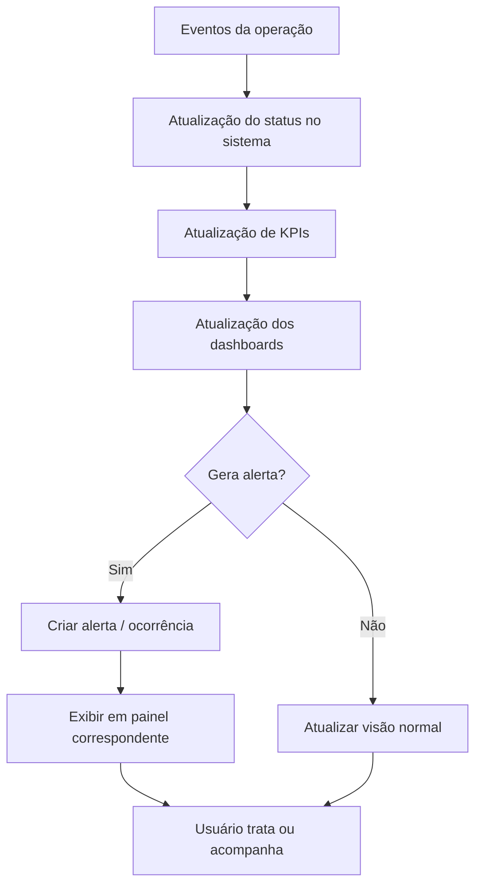

# 009-dashboards-operacionais-kpis-alertas-e-monitoramento-em-tempo-real

## Objetivo do documento
Detalhar os requisitos funcionais, regras de negócio, indicadores, alertas, painéis e mecanismos de monitoramento em tempo real da operação AlphaCarnes.

Este documento consolida a camada de observabilidade operacional e gerencial do sistema, permitindo:
1. acompanhamento em tempo real da operação do dia,
2. visibilidade executiva e tática,
3. monitoramento de gargalos e riscos,
4. suporte à tomada de decisão,
5. e rastreabilidade consolidada da operação.

---

# 1. Contexto

## 1.1 Papel dos dashboards na operação
A operação da AlphaCarnes é:
- dinâmica,
- sensível a tempo,
- fortemente integrada entre compra, vendas, recebimento, pesagem, corte, expedição, faturamento e liberação,
- e baseada em alta coordenação entre times.

Por isso, o sistema precisa oferecer visões diferentes para:
- comercial,
- compras,
- operação,
- expedição,
- faturamento,
- gestão,
- diretoria.

## 1.2 Princípio central
Os dashboards não são apenas relatórios estáticos.  
Eles devem ser uma **camada operacional viva**, mostrando:
- o que foi planejado,
- o que foi vendido,
- o que foi recebido,
- o que está em divergência,
- o que foi carregado,
- o que foi faturado,
- e o que ainda está em risco.

---

# 2. Objetivos funcionais

O módulo de dashboards e monitoramento deve permitir:
- acompanhar a operação do dia em tempo real,
- identificar rupturas entre planejado e realizado,
- acompanhar status dos caminhões,
- acompanhar andamento dos pedidos,
- monitorar divergências e impactos,
- identificar gargalos operacionais,
- apoiar priorização de decisões,
- consolidar indicadores executivos,
- e gerar histórico para análise posterior.

---

# 3. Perfis de visualização

## 3.1 Painel executivo
Voltado para diretoria, gestor geral, sócios e liderança.

### Foco
- visão consolidada,
- volume do dia,
- status geral da operação,
- caminhões,
- faturamento,
- rupturas,
- produtividade,
- pendências críticas.

## 3.2 Painel operacional
Voltado para operação do dia.

### Foco
- recebimento em andamento,
- pesagens,
- peças em corte,
- peças em expedição,
- pedidos em preenchimento,
- caminhões em carga.

## 3.3 Painel comercial
Voltado para vendas e compras.

### Foco
- lote do dia,
- disponibilidade virtual,
- saldo vendido,
- itens esgotados,
- risco de sobra,
- risco de ruptura por divergência no recebimento.

## 3.4 Painel de expedição
Voltado para Ludmila, conferência e logística.

### Foco
- status dos caminhões,
- pedidos por caminhão,
- peças carregadas,
- pendências de carga,
- ordem de montagem,
- itens em risco.

## 3.5 Painel de faturamento
Voltado para o time fiscal/administrativo.

### Foco
- caminhões fechados e aptos a faturar,
- bloqueios fiscais,
- NF emitidas,
- falhas de emissão,
- pendências de documentos,
- liberação final.

---

# 4. Dashboard Executivo

## 4.1 Objetivo
Fornecer uma visão resumida, clara e em tempo real da operação do dia.

## 4.2 Indicadores principais
- lote principal do dia
- total de itens/partes compradas
- total de itens/partes vendidas
- percentual do lote vendido
- total recebido fisicamente
- total expedido
- total faturado
- total de caminhões do dia
- caminhões liberados
- caminhões pendentes
- divergências abertas
- pedidos em risco
- peças em corte
- sobras enviadas para estoque
- status geral da operação

## 4.3 Componentes visuais sugeridos
- cards de KPI
- semáforo operacional
- barra de progresso da operação do dia
- gráfico por etapa
- lista de alertas críticos
- timeline dos caminhões

## 4.4 Regras funcionais
### RF-DB-01
O dashboard executivo deve refletir o estado real da operação em tempo próximo do real.

### RF-DB-02
Indicadores críticos devem possuir destaque visual por cor/status.

### RF-DB-03
O painel deve destacar imediatamente:
- ruptura de atendimento,
- divergência crítica,
- caminhão atrasado,
- falha fiscal,
- excesso de sobra.

---

# 5. Dashboard Operacional do Dia

## 5.1 Objetivo
Acompanhar a execução da operação física ponta a ponta.

## 5.2 Indicadores operacionais
- caminhão fornecedor em atendimento
- peças recebidas
- peças pesadas
- peças aguardando associação
- peças associadas
- peças em corte
- peças com divergência
- peças em expedição
- peças já carregadas
- peso total processado
- ritmo de processamento por hora
- tempo médio entre recebimento e expedição
- gargalos por etapa

## 5.3 Componentes visuais sugeridos
- fila operacional por etapa
- contadores em tempo real
- mapa de status por peça
- linha do tempo do lote do dia
- lista de ocorrências abertas
- monitor de produtividade

## 5.4 Regras funcionais
### RF-DB-04
Toda mudança relevante de status da peça deve refletir no painel operacional.

### RF-DB-05
A tela deve permitir identificar gargalos entre:
- recebimento,
- pesagem,
- corte,
- expedição.

### RF-DB-06
A operação deve poder filtrar por:
- item,
- caminhão,
- cliente,
- pedido,
- status,
- divergência.

---

# 6. Dashboard Comercial

## 6.1 Objetivo
Monitorar a relação entre compra programada, disponibilidade virtual e vendas.

## 6.2 Indicadores principais
- lote do dia
- total comprado por item
- total disponível virtual
- total reservado
- total ainda disponível
- percentual vendido por item
- itens esgotados
- itens com risco de sobra
- pedidos registrados
- pedidos por cliente
- divergências de recebimento com impacto comercial

## 6.3 Componentes visuais sugeridos
- tabela de saldo virtual
- gráfico de consumo por item
- cards de itens esgotados
- lista de clientes/pedidos do dia
- alertas de risco comercial

## 6.4 Regras funcionais
### RF-DB-07
O painel comercial deve demonstrar claramente a diferença entre:
- planejado/comprado,
- reservado/vendido,
- recebido fisicamente.

### RF-DB-08
Quando houver divergência de recebimento que reduza a disponibilidade real, o sistema deve destacar os pedidos afetados.

### RF-DB-09
O painel deve indicar itens que zeraram e tiveram venda encerrada.

---

# 7. Dashboard de Expedição

## 7.1 Objetivo
Monitorar a formação da carga e o status dos caminhões.

## 7.2 Indicadores principais
- caminhões planejados
- caminhões em carga
- caminhões em conferência
- caminhões fechados
- caminhões liberados
- peças carregadas por caminhão
- pedidos completos por caminhão
- pedidos pendentes por caminhão
- transferências de peça realizadas
- divergências de expedição
- tempo médio de fechamento da carga

## 7.3 Componentes visuais sugeridos
- cards por caminhão
- barra de progresso da carga
- lista de pendências por caminhão
- pedidos por rota
- mapa ou sequência de paradas
- painel de conferência final

## 7.4 Regras funcionais
### RF-DB-10
O painel deve refletir em tempo real a montagem de cada caminhão.

### RF-DB-11
O sistema deve destacar caminhões:
- aguardando itens,
- com carga em risco,
- fechados aguardando faturamento,
- liberados.

### RF-DB-12
Transferências de peças entre pedidos devem ficar visíveis enquanto a expedição estiver aberta.

---

# 8. Dashboard de Faturamento e Liberação

## 8.1 Objetivo
Controlar o fechamento fiscal e documental da operação.

## 8.2 Indicadores principais
- caminhões aptos a faturar
- caminhões bloqueados
- NF emitidas
- NF rejeitadas
- caminhões aguardando seguro
- caminhões aguardando envio ao motorista
- caminhões liberados para saída
- tempo médio entre fechamento da expedição e emissão da NF

## 8.3 Componentes visuais sugeridos
- cards de status fiscal
- fila de caminhões no faturamento
- lista de bloqueios
- painel de reprocessamento de emissão
- checklist documental

## 8.4 Regras funcionais
### RF-DB-13
O painel deve destacar o motivo do bloqueio de cada caminhão.

### RF-DB-14
O sistema deve diferenciar:
- expedição fechada,
- pronto para faturar,
- faturando,
- faturado,
- liberado.

---

# 9. KPIs estratégicos e operacionais

## 9.1 KPIs do comercial e planejamento
- percentual vendido do lote do dia
- tempo médio até zerar item
- itens com maior giro
- itens com maior sobra
- taxa de utilização do lote do dia
- pedidos por cliente
- pedidos por rota

## 9.2 KPIs de recebimento e pesagem
- tempo médio de recebimento por lote
- tempo médio de pesagem por peça
- peso médio por item/tipo
- volume processado por hora
- quantidade de peças processadas por operador
- índice de divergência no recebimento

## 9.3 KPIs de corte
- percentual de peças que passaram por corte
- tempo médio de transformação
- perda média entre peso original e peso dos subitens
- quantidade de reetiquetagens
- subitens gerados por tipo de peça

## 9.4 KPIs de expedição
- tempo médio de montagem por caminhão
- percentual de pedidos completos por caminhão
- número de transferências entre pedidos
- índice de divergências na carga
- tempo entre primeira peça carregada e fechamento do caminhão

## 9.5 KPIs de faturamento
- tempo médio entre fechamento e emissão de NF
- índice de falha de emissão
- quantidade de bloqueios fiscais
- tempo médio para liberação final
- caminhões liberados no prazo

## 9.6 KPIs de qualidade e risco
- divergências por fornecedor
- divergências por item
- ocorrências abertas com fornecedor
- percentual de sobras enviadas ao estoque
- percentual de pedidos impactados por divergência
- tempo médio de resolução de ocorrências

---

# 10. Alertas operacionais e executivos

## 10.1 Objetivo
Disparar avisos em tempo real para apoiar ação imediata.

## 10.2 Tipos de alerta

### Alertas comerciais
- item esgotado
- item com saldo crítico
- risco de sobra
- pedido em risco por divergência no recebimento

### Alertas de recebimento
- quantidade recebida menor que a comprada
- item divergente da NF
- excesso inesperado
- divergência de qualidade
- ruptura potencial de atendimento

### Alertas de pesagem
- balança offline
- peso manual em excesso
- peça sem associação
- fila crescente na pesagem

### Alertas de corte
- transformação aberta há muito tempo
- diferença excessiva de peso
- subitem sem destino
- reetiquetagem pendente

### Alertas de expedição
- caminhão parado por falta de item
- pedido incompleto
- peça em carga errada
- transferência excessiva entre pedidos
- conferência não concluída

### Alertas de faturamento
- caminhão fechado sem faturamento
- NF rejeitada
- documentos não enviados ao motorista
- seguro pendente
- bloqueio fiscal crítico

## 10.3 Regras funcionais
### RF-AL-01
Os alertas devem possuir níveis mínimos:
- informativo,
- atenção,
- crítico.

### RF-AL-02
Alertas críticos devem ter destaque visual e permanecer visíveis até resolução ou tratamento.

### RF-AL-03
Cada alerta deve conter:
- evento gerador,
- impacto,
- ação sugerida,
- hora de geração,
- status de tratamento.

### RF-AL-04
O sistema deve permitir registrar que o alerta:
- foi visualizado,
- está em tratamento,
- foi resolvido,
- foi descartado com justificativa.

---

# 11. Monitoramento em tempo real

## 11.1 Objetivo
Atualizar os painéis à medida que a operação acontece.

## 11.2 Eventos mínimos que devem atualizar dashboards
- compra programada confirmada
- disponibilidade virtual gerada
- pedido criado/alterado/cancelado
- saldo virtual alterado
- recebimento registrado
- divergência aberta/atualizada
- peça pesada
- peça associada
- peça redirecionada
- peça enviada para corte
- transformação concluída
- peça carregada
- caminhão fechado
- NF emitida
- seguro gerado
- caminhão liberado
- sobra enviada para estoque

## 11.3 Regras funcionais
### RF-MT-01
Os painéis devem atualizar com baixa latência operacional.

### RF-MT-02
Eventos relevantes devem refletir imediatamente nos contadores e listas afetadas.

### RF-MT-03
O sistema deve evitar desatualização silenciosa dos painéis.

---

# 12. Filtros e navegação

## 12.1 Filtros mínimos
- data operacional
- lote do dia
- fornecedor
- item
- cliente
- pedido
- caminhão
- rota
- operador
- status
- tipo de divergência
- nível de alerta

## 12.2 Regras funcionais
### RF-NV-01
Todo dashboard deve permitir drill-down para o detalhe operacional relevante.

### RF-NV-02
O usuário deve conseguir sair do indicador macro para:
- pedido,
- peça,
- cliente,
- ocorrência,
- caminhão,
- NF,
- divergência.

### RF-NV-03
A navegação deve preservar o contexto operacional do filtro aplicado.

---

# 13. Histórico e comparação

## 13.1 Objetivo
Permitir análise de tendência e comparação entre operações.

## 13.2 Visões históricas sugeridas
- comparação por dia
- comparação por fornecedor
- comparação por item
- comparação por rota
- comparação por operador
- comparação por cliente
- comparação por caminhão

## 13.3 Indicadores históricos
- venda x sobra
- divergência por fornecedor
- produtividade por operador
- tempo médio de expedição
- tempo médio de faturamento
- recorrência de bloqueios
- percentual de pedidos completos

## 13.4 Regras funcionais
### RF-HS-01
O sistema deve permitir comparação entre períodos operacionais.

### RF-HS-02
Indicadores históricos não devem se confundir com os painéis em tempo real.

---

# 14. Painel de ocorrências e gestão por exceção

## 14.1 Objetivo
Centralizar problemas relevantes do dia.

## 14.2 Itens exibidos
- divergências no recebimento
- pedidos em risco
- peças bloqueadas
- transformações pendentes
- caminhões com bloqueio
- NF rejeitada
- documentos não enviados
- ocorrências com fornecedor

## 14.3 Regras funcionais
### RF-OC-01
O painel de ocorrências deve consolidar exceções abertas da operação.

### RF-OC-02
Cada ocorrência deve exibir:
- gravidade,
- etapa impactada,
- responsável,
- prazo/urgência,
- status.

---

# 15. Regras de visibilidade e segurança

## 15.1 Objetivo
Garantir que cada perfil visualize o que lhe é pertinente.

## 15.2 Regras funcionais
### RF-SG-01
O dashboard executivo deve ter visão ampla e consolidada.

### RF-SG-02
O operador deve ver apenas os painéis compatíveis com sua função.

### RF-SG-03
Informações sensíveis fiscais/comerciais podem ter visibilidade restrita.

### RF-SG-04
Ações de tratamento de alertas e exceções devem respeitar perfil de acesso.

---

# 16. Estrutura sugerida dos painéis

## 16.1 Tela inicial sugerida
- resumo executivo do dia
- status da operação
- principais alertas
- acesso rápido aos painéis táticos

## 16.2 Telas específicas
- painel executivo
- painel operacional
- painel comercial
- painel de expedição
- painel de faturamento
- painel de ocorrências
- histórico e comparativos

---

# 17. Fluxo funcional do monitoramento

---

# 18. Regras transversais específicas do 009

## RT-009-01
Todo dashboard deve refletir a operação real, e não apenas planejamento.

## RT-009-02
Os painéis devem separar claramente:
- planejado,
- reservado,
- recebido,
- transformado,
- expedido,
- faturado,
- sobras.

## RT-009-03
Alertas devem ser acionáveis, e não apenas informativos.

## RT-009-04
O sistema deve suportar tanto visão em tempo real quanto histórico comparativo.

## RT-009-05
Toda exceção crítica deve ficar visível até resolução formal ou descarte justificado.

---

# 19. Resultado esperado deste documento
Com este documento, a operação passa a ter base funcional para:
- monitorar a operação ponta a ponta,
- acompanhar riscos e gargalos em tempo real,
- agir por exceção,
- apoiar gestão e diretoria,
- e transformar o sistema em um cockpit operacional completo, e não apenas um registro transacional.
