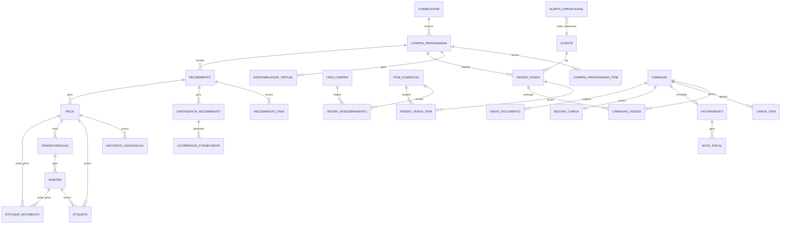

# 010-modelo-de-dados-conceitual-e-entidades-principais-do-sistema

## Objetivo do documento
Definir o modelo de dados conceitual da solução AlphaCarnes, identificando:
1. entidades principais,
2. relacionamentos de negócio,
3. regras de consistência,
4. estados relevantes,
5. e a base estrutural necessária para sustentar os fluxos já documentados.

Este documento não representa ainda um modelo físico de banco de dados, mas sim a visão conceitual e funcional que servirá de base para:
- modelagem lógica,
- APIs,
- telas,
- rastreabilidade,
- integrações,
- dashboards,
- e regras transacionais do sistema.

---

# 1. Princípios de modelagem

## 1.1 Princípios centrais
O modelo de dados deve refletir as características reais da operação:

- a operação começa na **compra programada do dia**;
- a venda ocorre sobre **disponibilidade virtual por dia**;
- o pedido comercial é feito por **parte/unidade**, não por peso;
- o peso real surge na operação física;
- a operação é predominantemente de **cross-docking**;
- a associação da peça ao pedido é **sugestiva com aprovação humana**;
- a peça pode ser redirecionada enquanto a expedição estiver aberta;
- o corte é uma **transformação rastreável**;
- o faturamento ocorre sobre a carga final real;
- estoque é exceção, normalmente decorrente de sobra.

## 1.2 Princípios de consistência
O modelo deve garantir:

- separação entre planejado, reservado, recebido, transformado, expedido e faturado;
- rastreabilidade ponta a ponta;
- impossibilidade de overbooking;
- vínculo de cada pedido a um único lote principal do dia;
- rastreabilidade de ações humanas e decisões críticas;
- impossibilidade de “sumir” com peça, subitem ou documento do histórico.

---

# 2. Macrodomínios do modelo

O sistema pode ser organizado conceitualmente nos seguintes macrodomínios:

1. **Cadastros**
2. **Compra Programada**
3. **Disponibilidade Virtual**
4. **Pedidos de Venda**
5. **Recebimento e Divergências**
6. **Peças, Pesagem e Associação**
7. **Corte e Transformação**
8. **Expedição e Caminhões**
9. **Faturamento e Documentos**
10. **Ocorrências, Alertas e Auditoria**
11. **Dashboards e Indicadores**

---

# 3. Entidades principais

## 3.1 Cadastro de Cliente
Representa o cliente comprador.

### Atributos principais
- idCliente
- codigoCliente
- nomeRazaoSocial
- nomeFantasia
- documentoFiscal
- status
- rotaPadrao
- prioridade
- preferenciasPadrao
- observacoesOperacionais
- dadosFiscais
- dadosDeContato

### Observações
O cliente concentra preferências operacionais e dados fiscais necessários para pedido, sugestão de alocação e faturamento.

---

## 3.2 Cadastro de Fornecedor
Representa o frigorífico ou outro fornecedor da compra do dia.

### Atributos principais
- idFornecedor
- codigoFornecedor
- nomeRazaoSocial
- documentoFiscal
- status
- contatos
- observacoes
- parametrosOperacionais

---

## 3.3 Cadastro de Item de Compra
Representa o item comprado em origem.

### Exemplos
- boi
- lote suíno
- caixa de frango
- outros itens compráveis

### Atributos principais
- idItemCompra
- codigoItemCompra
- descricao
- categoria
- unidadeCompra
- status

---

## 3.4 Cadastro de Item Comercial
Representa o item vendável.

### Exemplos
- dianteiro
- central
- traseiro
- subitem específico
- item suíno comercial
- item de frango comercial

### Atributos principais
- idItemComercial
- codigoItemComercial
- descricao
- categoria
- unidadeComercial
- status
- permiteCorte
- observacoesOperacionais

---

## 3.5 Regra de Desdobramento Comercial
Define como um item de compra gera disponibilidade virtual comercial.

### Atributos principais
- idRegraDesdobramento
- idItemCompra
- idItemComercial
- fatorQuantidade
- status
- vigencia
- observacoes

### Exemplo
1 boi -> 1 dianteiro  
1 boi -> 1 central  
1 boi -> 1 traseiro

---

## 3.6 Lote Principal do Dia / Compra Programada
Representa a compra principal do dia operacional.

### Atributos principais
- idCompraProgramada
- dataOperacao
- idFornecedor
- numeroInterno
- referenciaExterna
- previsaoEntrega
- statusCompra
- observacoes
- dataConfirmacao
- usuarioCriacao
- usuarioConfirmacao

### Relacionamentos
- possui vários itens de compra
- gera disponibilidade virtual
- é a única fonte de disponibilidade do dia

---

## 3.7 Item da Compra Programada
Representa cada item dentro da compra programada.

### Atributos principais
- idCompraProgramadaItem
- idCompraProgramada
- idItemCompra
- quantidadeComprada
- unidade
- observacoes
- idRegraDesdobramentoAplicada

---

## 3.8 Disponibilidade Virtual do Dia
Representa o saldo comercial virtual gerado a partir da compra.

### Atributos principais
- idDisponibilidadeVirtual
- idCompraProgramada
- dataOperacao
- idItemComercial
- quantidadeTotalGerada
- quantidadeReservada
- quantidadeDisponivel
- quantidadeRecebida
- quantidadeExpedida
- quantidadeSobra
- quantidadeComDivergencia
- statusDisponibilidade

### Regras
- é por dia
- é consumida por pedidos
- não pode ficar negativa

---

## 3.9 Pedido de Venda
Representa o pedido comercial do cliente.

### Atributos principais
- idPedidoVenda
- idCompraProgramada
- idCliente
- dataOperacao
- dataEntrega
- rotaPrevista
- prioridade
- statusPedido
- observacoesGerais
- usuarioCriacao
- usuarioAprovacao

### Regras
- um pedido pertence a um único lote do dia
- não pode consumir mais de uma compra programada

---

## 3.10 Item do Pedido de Venda
Representa cada item solicitado no pedido.

### Atributos principais
- idPedidoVendaItem
- idPedidoVenda
- idItemComercial
- quantidadePedida
- quantidadeReservada
- quantidadeAtendida
- quantidadePendente
- preferenciasAplicadas
- observacoes
- statusItemPedido

### Regras
- é por parte/unidade
- consome disponibilidade virtual
- não trabalha por peso comercial na origem

---

## 3.11 Recebimento
Representa o evento de chegada física do caminhão do fornecedor.

### Atributos principais
- idRecebimento
- idCompraProgramada
- idFornecedor
- dataHoraChegada
- notaFiscalFornecedor
- placaVeiculoFornecedor
- motoristaFornecedor
- statusRecebimento
- observacoes

---

## 3.12 Item Recebido / Apuração de Recebimento
Representa o que foi efetivamente recebido e apurado.

### Atributos principais
- idRecebimentoItem
- idRecebimento
- idItemComercialOuClassificacaoOperacional
- quantidadeRecebida
- pesoTotalApurado
- statusApuracao
- observacoes

---

## 3.13 Divergência de Recebimento
Representa inconsistência entre compra/NF/recebimento.

### Atributos principais
- idDivergenciaRecebimento
- idRecebimento
- tipoDivergencia
- descricao
- impactoOperacional
- impactoComercial
- statusDivergencia
- responsavelRegistro
- dataHoraRegistro
- acaoImediata

### Possíveis vínculos
- pedidos afetados
- itens afetados
- ocorrência com fornecedor

---

## 3.14 Ocorrência com Fornecedor
Representa a tratativa formal da divergência.

### Atributos principais
- idOcorrenciaFornecedor
- idFornecedor
- idCompraProgramada
- idDivergenciaRecebimento
- statusOcorrencia
- descricao
- impacto
- dataHoraAbertura
- dataHoraEncerramento
- desfecho

---

## 3.15 Peça
Entidade central da operação física.

### Representa
A unidade operacional pesada e rastreada no fluxo.

### Atributos principais
- idPeca
- idCompraProgramada
- idRecebimento
- classificacaoOperacional
- idItemComercialBase
- pesoOriginal
- dataHoraPesagem
- modoCapturaPeso
- statusPeca
- etiquetaAtual
- idPedidoVendaAtual
- idPedidoVendaItemAtual
- idCaminhaoAtual
- observacoes

### Regras
- nasce na pesagem/recebimento
- pode ser associada sugestivamente
- pode ser redirecionada enquanto a expedição estiver aberta
- pode ser transformada por corte

---

## 3.16 Sugestão de Associação
Representa a recomendação do sistema para vincular a peça a um pedido.

### Atributos principais
- idSugestaoAssociacao
- idPeca
- idPedidoVenda
- idPedidoVendaItem
- scoreCompatibilidade
- justificativa
- dataHoraGeracao
- statusSugestao

### Observação
Pode ser efêmera ou persistida, conforme decisão arquitetural.

---

## 3.17 Histórico de Associação / Transferência de Peça
Registra as mudanças de destinação da peça.

### Atributos principais
- idHistoricoAssociacao
- idPeca
- idPedidoOrigem
- idPedidoDestino
- idCaminhaoOrigem
- idCaminhaoDestino
- motivo
- operadorResponsavel
- dataHoraEvento
- statusExpedicaoNoMomento

### Regras
- toda transferência deve ser auditada
- após fechamento do caminhão, não deve haver nova transferência

---

## 3.18 Transformação / Corte
Representa o evento de transformação da peça.

### Atributos principais
- idTransformacao
- idPecaOrigem
- tipoTransformacao
- motivo
- operadorResponsavel
- dataHoraAbertura
- dataHoraEncerramento
- statusTransformacao
- observacoes

---

## 3.19 Subitem Gerado
Representa cada item derivado do corte.

### Atributos principais
- idSubitem
- idTransformacao
- idPecaOrigem
- classificacao
- peso
- quantidade
- statusSubitem
- idPedidoVendaAtual
- idPedidoVendaItemAtual
- idCaminhaoAtual
- etiquetaAtual
- observacoes

### Regras
- tem identidade própria
- mantém vínculo com a peça de origem
- pode seguir para expedição, estoque ou análise

---

## 3.20 Etiqueta
Representa a identificação operacional impressa.

### Atributos principais
- idEtiqueta
- codigoEtiqueta
- tipoEtiqueta
- idPeca
- idSubitem
- referenciaOrigem
- dataHoraImpressao
- operadorResponsavel
- statusEtiqueta
- versao

### Regras
- reimpressões devem ser auditadas
- a etiqueta atual operacional pode mudar
- o histórico deve permanecer acessível

---

## 3.21 Caminhão de Entrega
Representa o veículo que levará a carga ao cliente.

### Atributos principais
- idCaminhao
- placa
- motorista
- rota
- itinerario
- statusCaminhao
- dataOperacao
- horaAberturaCarga
- horaFechamentoCarga
- horaLiberacao
- observacoes

---

## 3.22 Pedido na Carga / Planejamento do Caminhão
Relaciona pedido e caminhão.

### Atributos principais
- idCaminhaoPedido
- idCaminhao
- idPedidoVenda
- ordemNaCarga
- statusNaCarga
- observacoes

---

## 3.23 Item/Peça na Carga
Relaciona peça ou subitem ao caminhão.

### Atributos principais
- idCargaItem
- idCaminhao
- idPecaOuSubitem
- tipoOrigem
- idPedidoVenda
- idPedidoVendaItem
- dataHoraEntradaCarga
- statusCargaItem
- conferido
- observacoes

---

## 3.24 Conferência de Carga
Representa a conferência do caminhão antes do fechamento.

### Atributos principais
- idConferenciaCarga
- idCaminhao
- operadorResponsavel
- dataHoraInicio
- dataHoraFim
- statusConferencia
- pendencias
- observacoes

---

## 3.25 Faturamento do Caminhão
Representa a consolidação fiscal e documental da carga.

### Atributos principais
- idFaturamento
- idCaminhao
- statusFaturamento
- dataHoraInicio
- dataHoraFim
- observacoes
- responsavel

---

## 3.26 Nota Fiscal
Representa o documento fiscal emitido.

### Atributos principais
- idNotaFiscal
- idFaturamento
- numeroNota
- chaveAcesso
- statusNota
- dataHoraEmissao
- dataHoraAutorizacao
- retornoSefaz
- tipoDocumento
- observacoes

### Relações
- pode consolidar um ou mais pedidos/clientes, conforme estratégia fiscal adotada

---

## 3.27 Seguro da Carga
Representa o registro ou integração do seguro.

### Atributos principais
- idSeguroCarga
- idCaminhao
- statusSeguro
- protocolo
- dataHoraGeracao
- observacoes

---

## 3.28 Envio de Documento ao Motorista
Representa a evidência do envio eletrônico.

### Atributos principais
- idEnvioDocumento
- idCaminhao
- tipoDocumento
- canalEnvio
- statusEnvio
- dataHoraEnvio
- destinatario
- evidencias

---

## 3.29 Estoque / Sobra
Representa o destino de itens não expedidos e enviados para congelamento/estoque.

### Atributos principais
- idEstoqueMovimento
- idPecaOuSubitem
- tipoOrigem
- motivoEntradaEstoque
- dataHoraMovimento
- statusEstoque
- observacoes

---

## 3.30 Alerta Operacional
Representa eventos que exigem atenção.

### Atributos principais
- idAlerta
- tipoAlerta
- nivel
- moduloOrigem
- entidadeOrigem
- descricao
- impacto
- statusAlerta
- dataHoraGeracao
- dataHoraResolucao

---

## 3.31 Auditoria / Log de Ação Humana
Registra ações relevantes de usuário.

### Atributos principais
- idAuditoria
- usuario
- acao
- modulo
- entidadeAfetada
- idEntidadeAfetada
- valorAnterior
- valorNovo
- justificativa
- dataHora

---

# 4. Relacionamentos principais

## 4.1 Compra e disponibilidade
- 1 CompraProgramada possui N CompraProgramadaItem
- 1 CompraProgramada gera N DisponibilidadeVirtual
- 1 ItemCompra possui N RegrasDesdobramento
- 1 RegraDesdobramento gera N Disponibilidades virtuais ao longo do tempo

## 4.2 Disponibilidade e pedidos
- 1 CompraProgramada gera N DisponibilidadeVirtual (origem física do lote)
- 1 Operacao possui N PedidoVenda (pool comercial — [AD-14](execucao/DECISOES.md))
- 1 PedidoVenda possui N PedidoVendaItem
- N PedidoVendaItem consomem N DisponibilidadeVirtual por item comercial **da mesma operação**, atravessando compras se necessário
- ~~cada PedidoVenda pertence a 1 único lote principal do dia~~ **Superado por AD-14 (2026-08-27).** O pedido de venda pertence à operação; a peça física continua amarrada ao lote via `pecas.compra_programada_id` obrigatório e imutável.

## 4.3 Recebimento e divergência
- 1 CompraProgramada pode ter 1 ou mais Recebimentos (cadeia física por lote, preservada por [AD-14](execucao/DECISOES.md)); ~~na V1 o lote do dia é a compra principal operacional~~ **superado por AD-14** — N compras/lotes coexistem na mesma operação
- 1 Recebimento possui N RecebimentoItem
- 1 Recebimento pode gerar N DivergenciasRecebimento
- 1 DivergenciaRecebimento pode gerar 1 ou N OcorrenciasFornecedor

## 4.4 Peças e associação
- 1 Recebimento gera N Peças
- 1 Peça pode ter N SugestoesAssociacao
- 1 Peça pode ter N HistoricosAssociacao
- 1 Peça pode estar associada a 0 ou 1 PedidoVendaItem por vez
- 1 Peça pode estar associada a 0 ou 1 Caminhão por vez, durante a operação

## 4.5 Corte e transformação
- 1 Peça pode ter 0 ou N Transformacoes, embora na prática a modelagem possa restringir a transformação principal
- 1 Transformacao gera N Subitens
- N Subitens mantêm vínculo com 1 Peça de origem

## 4.6 Etiquetas
- 1 Peça pode ter N Etiquetas ao longo da vida
- 1 Subitem pode ter N Etiquetas ao longo da vida
- 1 Etiqueta ativa por item operacional em determinado momento

## 4.7 Expedição
- 1 Caminhão possui N Pedidos
- 1 Caminhão possui N CargaItems
- N Peças/Subitens entram em 1 Caminhão
- 1 Caminhão possui 1 ou mais eventos de conferência, dependendo da modelagem

## 4.8 Faturamento
- 1 Caminhão possui 0 ou 1 Faturamento ativo por operação
- 1 Faturamento gera 0 ou N NotasFiscais, dependendo da estratégia fiscal
- 1 Caminhão pode ter 0 ou 1 SeguroCarga
- 1 Caminhão pode ter N EnviosDocumento

---

# 5. Regras de cardinalidade de negócio

## RN-01
Um pedido de venda pertence a um único lote principal do dia.

## RN-02
Um pedido não pode consumir disponibilidade de mais de uma compra programada.

## RN-03
A disponibilidade virtual é diária e vinculada ao lote do dia.

## RN-04
Um item do pedido não pode gerar saldo reservado maior do que a disponibilidade do item comercial.

## RN-05
Uma peça só pode ter uma destinação operacional atual válida por vez.

## RN-06
Uma peça ou subitem não pode estar simultaneamente:
- em dois pedidos,
- em dois caminhões,
- ou em dois estados finais incompatíveis.

## RN-07
Subitem derivado de corte deve manter vínculo obrigatório com a peça original.

## RN-08
Após fechamento do caminhão, não pode haver nova transferência de peça/subitem sem fluxo excepcional autorizado.

## RN-09
NF só pode ser emitida sobre itens efetivamente carregados na carga fechada.

## RN-10
Sobra enviada ao estoque deve registrar origem operacional.

---

# 6. Estados principais por entidade

## 6.1 CompraProgramada
- rascunho
- em negociação
- confirmada
- operacionalizada
- recebida
- encerrada
- cancelada

## 6.2 DisponibilidadeVirtual
- gerada
- parcialmente reservada
- esgotada
- parcialmente expedida
- encerrada
- com sobra
- impactada por divergência

## 6.3 PedidoVenda
- rascunho
- reservado
- confirmado
- em atendimento
- em expedição
- concluído
- faturado
- cancelado
- impactado por divergência

## 6.4 Peça
- recebida
- pesada
- sugerida
- associada provisoriamente
- em corte
- em expedição aberta
- bloqueada por fechamento
- expedida
- enviada para estoque
- faturada

## 6.5 Transformacao
- aberta
- em execução
- aguardando pesagem
- aguardando associação
- aguardando etiqueta
- concluída
- cancelada
- bloqueada

## 6.6 Subitem
- gerado
- pesado
- associado
- em expedição aberta
- bloqueado
- expedido
- enviado a estoque
- faturado

## 6.7 Caminhão
- planejado
- em carga
- em conferência
- fechado
- aguardando faturamento
- faturado
- liberado
- expedido
- bloqueado

## 6.8 NotaFiscal
- não iniciada
- em preparação
- em emissão
- aguardando autorização
- autorizada
- rejeitada
- cancelada

---

# 7. Regras de integridade e consistência

## 7.1 Integridade comercial
### RI-01
Não pode haver overbooking.

### RI-02
Ao cancelar ou alterar pedido, a reserva virtual deve ser recalculada.

### RI-03
O sistema deve distinguir claramente:
- quantidade comprada,
- quantidade reservada,
- quantidade recebida,
- quantidade expedida,
- quantidade faturada,
- quantidade em sobra.

## 7.2 Integridade operacional
### RI-04
Peso manual deve ser auditável.

### RI-05
Transferência de peça deve ser auditável.

### RI-06
Corte deve preservar o histórico da peça original.

### RI-07
Etiqueta original e reetiquetagens devem coexistir no histórico.

## 7.3 Integridade fiscal
### RI-08
Somente carga fechada pode ir para faturamento.

### RI-09
Somente item efetivamente carregado pode compor NF.

### RI-10
Falha fiscal deve bloquear a liberação do caminhão quando for requisito crítico.

---

# 8. Eventos de domínio relevantes

O sistema deve ser fortemente orientado a eventos. Exemplos:

- compra_programada_criada
- compra_programada_confirmada
- disponibilidade_virtual_gerada
- pedido_criado
- pedido_alterado
- pedido_cancelado
- saldo_virtual_atualizado
- recebimento_registrado
- divergencia_recebimento_aberta
- ocorrencia_fornecedor_aberta
- peca_pesada
- sugestao_associacao_gerada
- peca_associada
- peca_transferida
- corte_iniciado
- transformacao_concluida
- etiqueta_emitida
- carga_item_adicionado
- caminhão_fechado
- faturamento_iniciado
- nf_emitida
- nf_autorizada
- seguro_gerado
- documento_enviado_ao_motorista
- caminhão_liberado
- sobra_enviada_estoque
- alerta_gerado
- alerta_resolvido

---

# 9. Visão conceitual resumida do relacionamento

---

# 10. Decisões arquiteturais que este documento prepara

Este documento prepara o terreno para os próximos passos:

1. modelagem lógica relacional ou híbrida;
2. definição de chaves técnicas e chaves de negócio;
3. definição de APIs por agregado;
4. desenho transacional por módulo;
5. estratégia de auditoria;
6. estratégia de eventos e atualização em tempo real;
7. definição de dashboards com base em entidades consolidadas.

---

# 11. Regras transversais específicas do 010

## RT-010-01
O modelo deve preservar a rastreabilidade ponta a ponta entre compra, venda, peça, carga e documento fiscal.

## RT-010-02
Nenhuma entidade operacional crítica deve perder histórico por sobrescrita simples.

## RT-010-03
A camada de estados deve ser explícita para evitar ambiguidade operacional.

## RT-010-04
A modelagem deve suportar atualização em tempo real sem perder consistência transacional.

## RT-010-05
As ações humanas críticas precisam ser auditáveis.

---

# 12. Resultado esperado deste documento
Com este documento, a solução passa a ter uma base conceitual sólida para:
- modelagem lógica do banco,
- definição de relacionamentos entre módulos,
- preservação de rastreabilidade,
- sustentação das regras funcionais já aprovadas,
- e evolução segura para desenho técnico, APIs e implementação.
