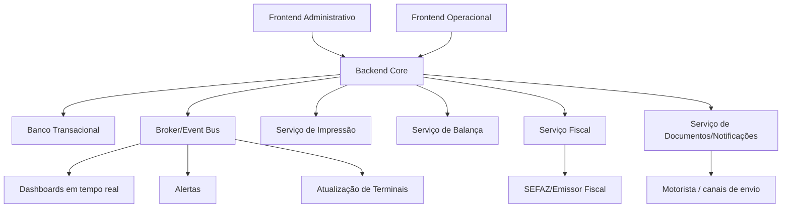

# 012-arquitetura-aplicacional-modulos-servicos-e-integracoes

## Objetivo do documento
Definir a arquitetura aplicacional de alto nível da solução AlphaCarnes, incluindo:
- módulos funcionais,
- serviços principais,
- integrações externas,
- comunicação em tempo real,
- componentes de infraestrutura,
- e responsabilidades de cada camada do sistema.

---

# 1. Objetivos da arquitetura

A arquitetura deve:
- suportar operação em tempo real;
- integrar dispositivos físicos e fluxos web;
- preservar consistência transacional nas etapas críticas;
- permitir evolução gradual por fases;
- facilitar auditoria e rastreabilidade;
- suportar dashboards vivos;
- e reduzir acoplamento entre módulos.

---

# 2. Visão geral da solução

A solução pode ser estruturada em 5 grandes camadas:

1. **Frontend Web Administrativo**
2. **Frontend Operacional / Terminais**
3. **Backend Core de Negócio**
4. **Serviços de Integração**
5. **Camada de Dados, Eventos e Observabilidade**

---

# 3. Frontend Web Administrativo

## 3.1 Público-alvo
- compras
- comercial
- gestor
- faturamento
- administrativo
- diretoria

## 3.2 Módulos principais
- Compra Programada
- Disponibilidade Virtual
- Pedidos de Venda
- Recebimento e Divergências
- Expedição
- Faturamento
- Dashboards
- Cadastros
- Ocorrências com Fornecedor
- Auditoria / Histórico

## 3.3 Características
- interface desktop-first
- filtros e consultas ricos
- dashboards e drill-down
- permissões por perfil
- formulários estruturados
- telas de exceção e conferência

---

# 4. Frontend Operacional / Terminais

## 4.1 Público-alvo
- operador de pesagem
- operador de corte
- operador de expedição
- conferentes
- equipe de doca

## 4.2 Telas principais
- Tela de Pesagem / Associação Sugestiva
- Tela de Corte / Transformação
- Tela de Expedição / Caminhão
- Tela de Conferência
- Tela de Alertas Operacionais

## 4.3 Características
- touch-friendly
- alto contraste
- baixo número de cliques
- atualização em tempo real
- alta resiliência operacional
- foco em fluxo rápido

---

# 5. Backend Core de Negócio

## 5.1 Responsabilidade
Centralizar as regras transacionais do sistema.

## 5.2 Domínios/módulos de negócio sugeridos
### 5.2.1 Cadastro
- clientes
- fornecedores
- itens
- regras de desdobramento
- parâmetros

### 5.2.2 Planejamento Comercial
- compra programada
- disponibilidade virtual
- pedidos
- reservas

### 5.2.3 Operação Física
- recebimento
- divergências
- pesagem
- associação da peça
- transferências

### 5.2.4 Transformação
- corte
- subitens
- reetiquetagem

### 5.2.5 Expedição
- caminhões
- pedidos na carga
- conferência
- fechamento

### 5.2.6 Fiscal/Documental
- faturamento
- emissão de NF
- seguro
- envio ao motorista

### 5.2.7 Observabilidade
- alertas
- dashboards
- auditoria
- ocorrências

---

# 6. Serviços especializados sugeridos

## 6.1 Serviço de Integração com Balança
### Responsabilidades
- leitura serial/USB/RS-232
- estabilização de leitura
- envio de leituras ao backend
- fallback para leitura manual assistida
- monitoramento de conectividade

## 6.2 Serviço de Impressão de Etiquetas
### Responsabilidades
- geração de payload de impressão
- controle de fila de impressão
- reimpressão auditada
- monitoramento da impressora

## 6.3 Serviço de QR/Leitura Operacional
### Responsabilidades
- leitura de etiquetas
- resolução de peça/subitem
- apoio à conferência e transferência

## 6.4 Serviço Fiscal
### Responsabilidades
- montagem do payload fiscal
- integração com emissor/SEFAZ
- armazenamento de retorno
- reprocessamento controlado

## 6.5 Serviço de Notificações/Documentos
### Responsabilidades
- envio ao motorista
- envio interno de alertas
- anexos e evidências
- histórico de envio

## 6.6 Serviço de Eventos/Tempo Real
### Responsabilidades
- distribuição de atualizações para dashboards
- sinalização de mudanças de status
- broadcasting para terminais

---

# 7. Componentes de infraestrutura

## 7.1 Banco transacional principal
Responsável por:
- entidades operacionais
- consistência transacional
- auditoria
- histórico

## 7.2 Broker / Event Bus
Responsável por:
- propagação de eventos
- atualização em tempo real
- desacoplamento de módulos
- consumo por dashboards e integrações

## 7.3 Cache / estado transitório
Uso sugerido para:
- sessões operacionais
- estado de telas em tempo real
- filas leves de monitoramento
- aceleração de consultas vivas

## 7.4 Armazenamento de documentos
Responsável por:
- PDFs
- DANFE
- comprovantes
- anexos de ocorrência
- evidências

## 7.5 Observabilidade
- logs estruturados
- métricas de aplicação
- rastreamento de erros
- monitoramento de integrações

---

# 8. Comunicação entre componentes

## 8.1 Comunicação síncrona
Usar para:
- operações transacionais críticas
- cadastros
- pedidos
- associações
- fechamento de expedição
- faturamento

## 8.2 Comunicação assíncrona
Usar para:
- eventos de atualização
- dashboards
- notificações
- reprocessamentos
- auditoria complementar
- integrações tolerantes a atraso

---

# 9. Fluxo arquitetural resumido

---

# 10. Estratégia sugerida de modularização

## 10.1 Modular monolith como fase inicial
Sugestão para a V1:
- backend único modularizado por domínio
- banco único transacional
- serviços de integração separados quando necessário
- event bus leve para tempo real

### Vantagens
- menor complexidade inicial
- maior velocidade de implantação
- melhor controle transacional
- menor custo de operação inicial

## 10.2 Evolução futura para serviços mais isolados
À medida que crescer:
- fiscal pode virar serviço isolado
- balança/impressão pode virar gateway local
- dashboards podem ganhar pipeline otimizado
- documentos podem ganhar storage especializado

---

# 11. Integrações externas principais

## 11.1 Balança
- leitura serial / RS-232
- captura de peso
- status do dispositivo

## 11.2 Impressora de etiquetas
- impressão de etiquetas operacionais
- reimpressão
- status e fila

## 11.3 Leitores / QR Code
- leitura de etiquetas
- conferência
- expedição

## 11.4 SEFAZ / Emissor
- emissão de NF
- consulta de autorização
- retorno de erros

## 11.5 Canais de envio ao motorista
- e-mail
- WhatsApp, se for adotado
- outro canal eletrônico

## 11.6 Seguro da carga
- exportação/integração
- geração de protocolo

---

# 12. Regras arquiteturais críticas

## RA-01
Regras de negócio não devem ficar dispersas no frontend.

## RA-02
Etapas críticas devem ser fechadas no backend com transação e auditoria.

## RA-03
Integrações físicas devem ser tratadas como serviços/gateways, e não como lógica espalhada pela UI.

## RA-04
Atualizações em tempo real devem ser orientadas a eventos.

## RA-05
Falhas de integração não podem ser silenciosas.

## RA-06
Toda exceção operacional/fiscal precisa ser observável.

---

# 13. Decisões recomendadas para a V1

## 13.1 Tecnologia backend
- API REST como base
- WebSocket ou SSE para tempo real
- ORM com boa capacidade transacional
- fila/event bus simples e confiável

## 13.2 Tecnologia frontend
- aplicação web responsiva
- módulo desktop administrativo
- módulo operacional touch-friendly

## 13.3 Dispositivos
- PCs operacionais
- tablets
- impressora de etiquetas
- leitores QR
- integração serial com balança

---

# 14. Segurança e acesso

A arquitetura deve contemplar:
- autenticação centralizada
- autorização por perfil
- segregação por função
- logs de acesso
- rastreamento de ações críticas

---

# 15. Resultado esperado deste documento
Com este documento, a solução passa a ter uma visão arquitetural clara para:
- orientar desenvolvimento,
- modularizar a aplicação,
- planejar integrações,
- decidir entre cloud e on-premises,
- e evoluir do desenho funcional para o desenho técnico.
