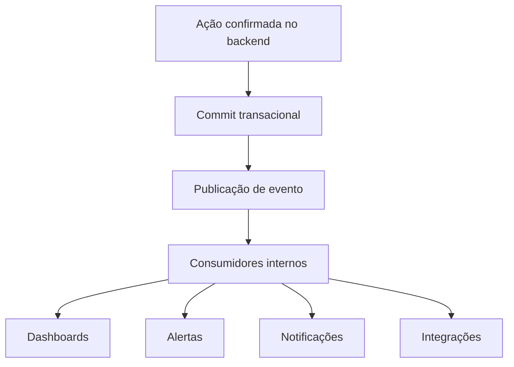

# 014-eventos-de-dominio-workflows-assincronos-e-atualizacao-em-tempo-real

## Objetivo do documento
Definir a estratégia funcional de eventos de domínio, workflows assíncronos e atualização em tempo real da operação AlphaCarnes.

---

# 1. Objetivos

A camada de eventos deve:
- propagar mudanças operacionais importantes;
- atualizar dashboards e terminais em tempo real;
- desacoplar módulos;
- registrar fatos relevantes da operação;
- suportar alertas e workflows assíncronos.

---

# 2. Princípios

## PR-01
Eventos representam fatos de negócio já confirmados.

## PR-02
Eventos não substituem transação principal; complementam a propagação.

## PR-03
Toda atualização crítica em tempo real deve derivar de evento rastreável.

## PR-04
Eventos assíncronos não podem comprometer a integridade transacional principal.

---

# 3. Categorias de eventos

## 3.1 Planejamento e Comercial
- compra_programada_criada
- compra_programada_confirmada
- disponibilidade_virtual_gerada
- pedido_venda_criado
- pedido_venda_alterado
- pedido_venda_cancelado
- reserva_disponibilidade_atualizada
- item_virtual_esgotado

## 3.2 Recebimento e Divergências
- recebimento_iniciado
- recebimento_registrado
- divergencia_recebimento_aberta
- divergencia_recebimento_atualizada
- ocorrencia_fornecedor_aberta
- ocorrencia_fornecedor_atualizada

## 3.3 Operação Física
- peca_pesada
- peso_manual_registrado
- sugestao_associacao_gerada
- peca_associada
- peca_transferida
- peca_enviada_para_corte
- transformacao_iniciada
- transformacao_concluida
- etiqueta_emitida

## 3.4 Expedição
- item_adicionado_a_carga
- item_removido_da_carga
- conferencia_atualizada
- caminhao_fechado
- carga_bloqueada

## 3.5 Fiscal e Liberação
- faturamento_iniciado
- nf_emitida
- nf_autorizada
- nf_rejeitada
- seguro_gerado
- documento_enviado_ao_motorista
- caminhao_liberado

## 3.6 Estoque e Exceções
- sobra_enviada_ao_estoque
- alerta_gerado
- alerta_resolvido
- excecao_aprovada

---

# 4. Payload mínimo sugerido

Todo evento deveria conter:
- eventId
- eventType
- occurredAt
- aggregateType
- aggregateId
- correlationId
- causationId
- userId ou systemActor
- payload de negócio
- version

---

# 5. Workflows assíncronos sugeridos

## 5.1 Atualização de dashboards
Disparado por eventos operacionais e fiscais.

## 5.2 Geração de alertas
Exemplos:
- item esgotado
- divergência crítica
- caminhão parado
- NF rejeitada

## 5.3 Notificações
- ao time interno
- ao motorista
- a gestores

## 5.4 Persistência de histórico/auditoria complementar
Quando parte do histórico for derivada de eventos.

## 5.5 Integrações externas
- impressão
- fiscal
- envio documental
- seguro

---

# 6. Atualização em tempo real

## 6.1 Canais candidatos
- WebSocket
- SSE
- polling inteligente como fallback

## 6.2 Eventos que devem refletir imediatamente na UI
- saldo virtual alterado
- peça associada
- peça transferida
- transformação concluída
- item carregado
- caminhão fechado
- NF emitida
- alerta crítico

---

# 7. Regras funcionais

## RF-EV-01
Eventos publicados devem representar ações já confirmadas pelo sistema.

## RF-EV-02
Eventos críticos devem conter correlação com a operação do dia e entidade principal.

## RF-EV-03
Falha na publicação de evento não pode ser silenciosa.

## RF-EV-04
A UI deve ser resiliente a reordenação ou atraso eventual de eventos não críticos.

## RF-EV-05
Processos assíncronos devem ser idempotentes quando possível.

---

# 8. Fluxo resumido

---

# 9. Resultado esperado deste documento
Com este documento, a solução passa a ter base para:
- tempo real consistente,
- workflows desacoplados,
- alertas acionáveis,
- e evolução futura para uma arquitetura orientada a eventos mais robusta.
