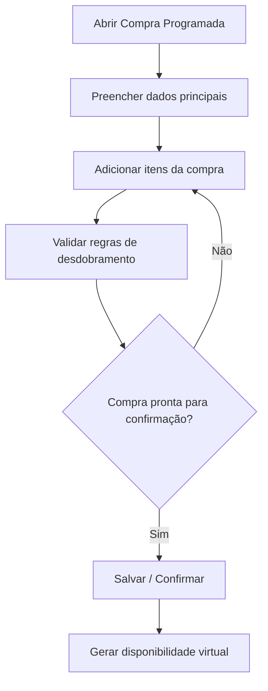
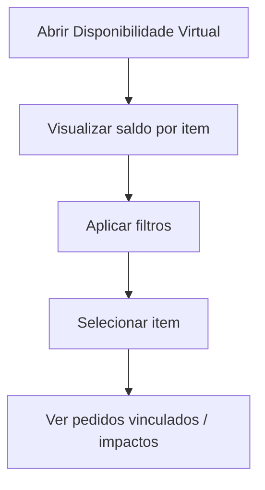
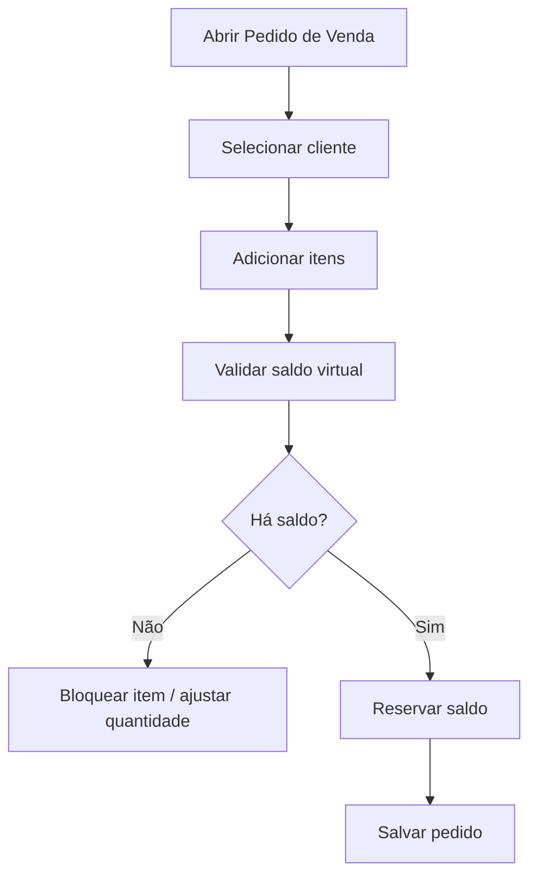
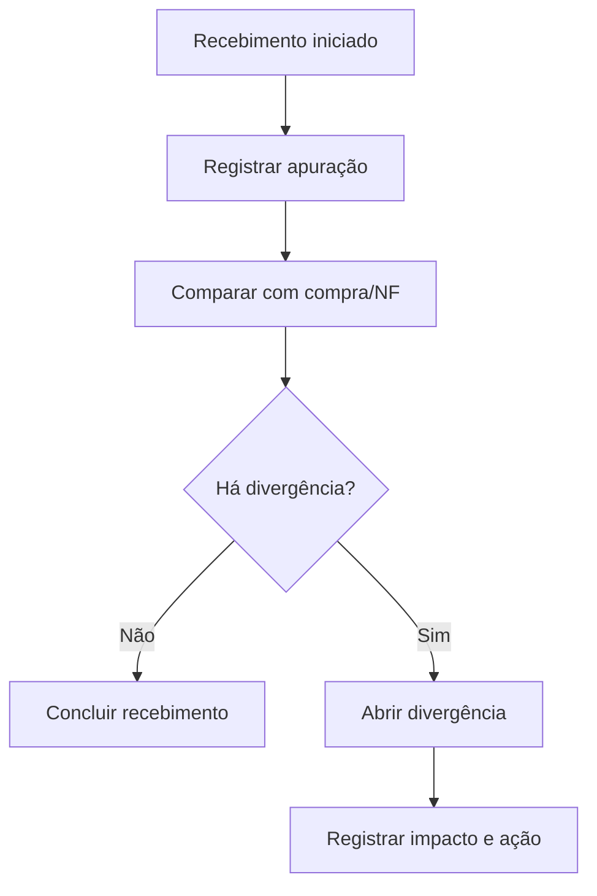
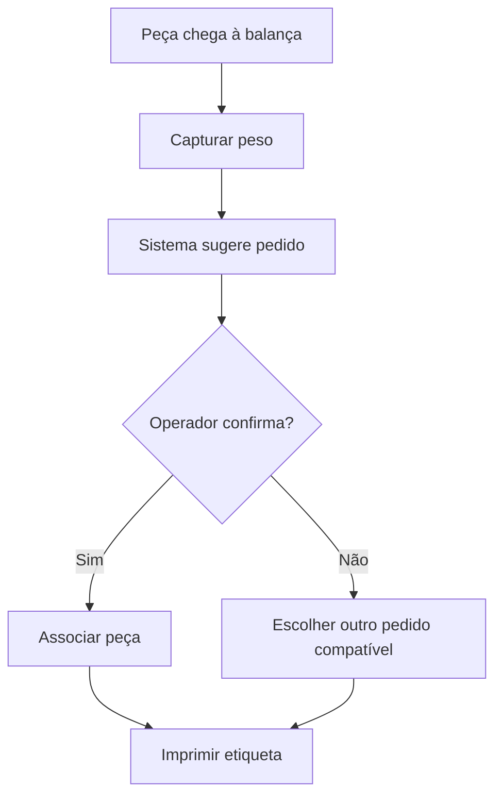
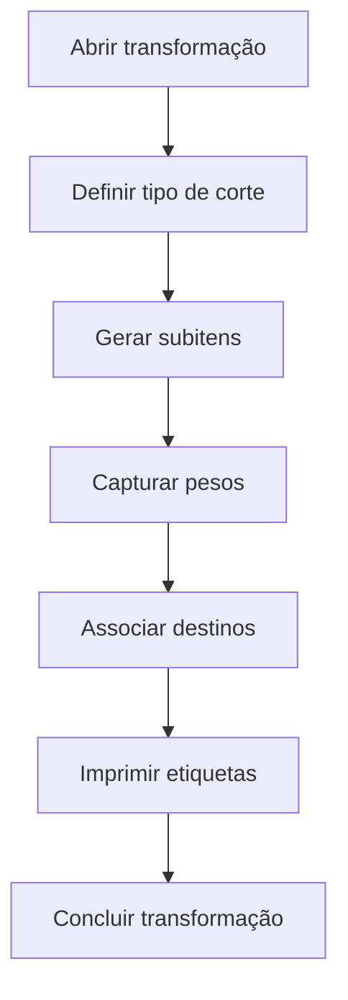
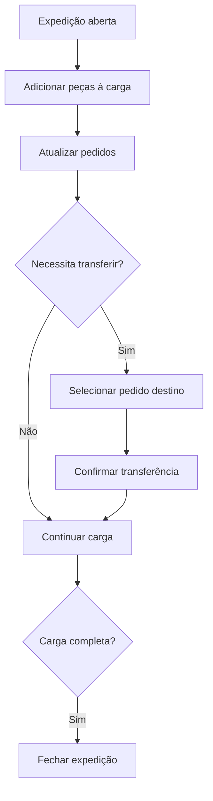
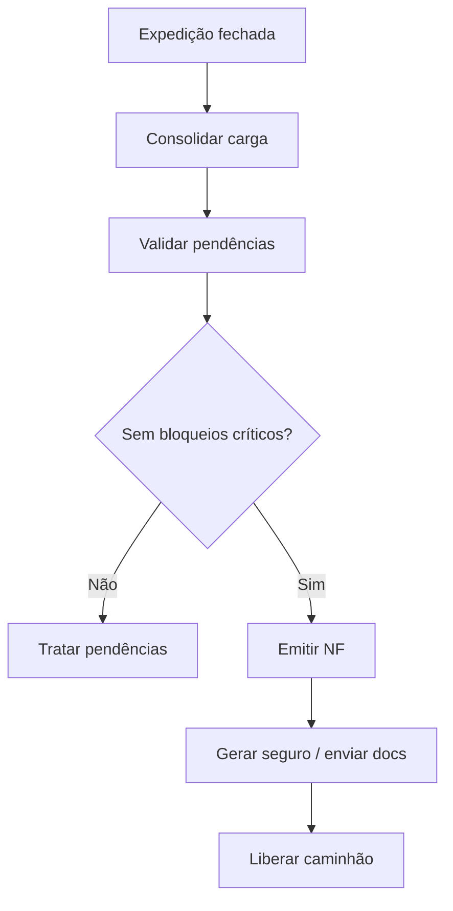
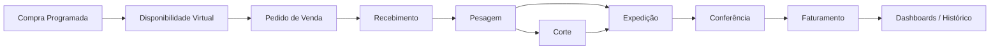

# 016-wireframes-fluxos-por-tela

## Objetivo do documento
Estruturar os wireframes conceituais e os fluxos por tela da solução AlphaCarnes, servindo como base para:
- design de interface,
- prototipação,
- refinamento funcional,
- e priorização de desenvolvimento.

Este documento não define layout visual final, mas sim a composição funcional de cada tela, seus blocos, ações e transições principais.

---

# 1. Princípios dos wireframes

## 1.1 Princípios gerais
- minimizar cliques nas telas operacionais;
- destacar dados críticos e estados;
- permitir leitura rápida em ambiente operacional;
- preservar rastreabilidade;
- separar claramente contexto, ação e confirmação;
- suportar desktop no administrativo e touch-friendly no operacional.

## 1.2 Padrão visual conceitual
Cada tela deve conter, conforme necessário:
- cabeçalho de contexto;
- área principal de trabalho;
- painéis laterais de apoio;
- lista de alertas/pendências;
- ações primárias e secundárias;
- histórico ou rastreabilidade resumida.

---

# 2. Mapa resumido de telas

## 2.1 Administrativo
1. Tela de Compra Programada
2. Tela de Disponibilidade Virtual
3. Tela de Pedido de Venda
4. Tela de Monitoramento Comercial
5. Tela de Recebimento com Divergências
6. Tela de Ocorrências com Fornecedor
7. Tela de Faturamento
8. Dashboards
9. Cadastros
10. Auditoria / Histórico

## 2.2 Operacional
1. Tela de Pesagem / Associação Sugestiva
2. Tela de Corte / Transformação
3. Tela de Expedição / Caminhão
4. Tela de Conferência
5. Tela de Alertas Operacionais

---

# 3. Wireframe — Tela de Compra Programada

## 3.1 Objetivo
Registrar o lote principal do dia e seus itens de compra.

## 3.2 Estrutura
### Cabeçalho
- data operacional
- fornecedor
- status da compra
- número interno
- previsão de entrega
- ações rápidas

### Corpo
#### Bloco A — Dados da compra
- fornecedor
- data
- referência externa
- observações
- status

#### Bloco B — Itens da compra
Tabela com:
- item de compra
- quantidade
- unidade
- regra de desdobramento
- observações

#### Bloco C — Resumo de geração esperada
- total de itens comerciais previstos
- preview do desdobramento
- alertas de parametrização

### Rodapé de ações
- salvar rascunho
- confirmar compra
- cancelar
- visualizar disponibilidade gerada

## 3.3 Fluxo da tela

---

# 4. Wireframe — Tela de Disponibilidade Virtual

## 4.1 Objetivo
Exibir a disponibilidade comercial do dia e seu consumo.

## 4.2 Estrutura
### Cabeçalho
- data operacional
- lote do dia
- fornecedor
- status geral

### Corpo
#### Bloco A — Cards resumo
- total gerado
- total reservado
- total disponível
- itens esgotados
- itens com divergência

#### Bloco B — Grade principal
Colunas:
- item comercial
- total gerado
- reservado
- disponível
- recebido
- expedido
- sobra
- status

#### Bloco C — Painel lateral
- pedidos impactados
- alertas
- ocorrências de recebimento

### Ações
- filtrar
- abrir pedidos vinculados
- abrir divergência
- exportar visão

## 4.3 Fluxo da tela

---

# 5. Wireframe — Tela de Pedido de Venda

## 5.1 Objetivo
Registrar pedidos sobre saldo virtual disponível.

## 5.2 Estrutura
### Cabeçalho
- cliente
- data da operação
- rota prevista
- prioridade
- status do pedido

### Corpo
#### Bloco A — Dados do cliente
- cliente
- preferências padrão
- observações relevantes

#### Bloco B — Itens do pedido
Tabela editável:
- item comercial
- quantidade pedida
- quantidade reservável
- saldo disponível
- preferências aplicadas
- observações

#### Bloco C — Painel lateral
- saldo virtual por item
- alertas de esgotamento
- histórico resumido do cliente

### Ações
- salvar
- confirmar pedido
- cancelar item
- cancelar pedido
- duplicar pedido

## 5.3 Fluxo da tela

---

# 6. Wireframe — Tela de Recebimento com Divergências

## 6.1 Objetivo
Controlar o confronto entre compra/NF/recebimento real.

## 6.2 Estrutura
### Cabeçalho
- lote do dia
- fornecedor
- NF
- horário de chegada
- status do recebimento

### Corpo
#### Bloco A — Esperado
- itens previstos
- quantidades compradas
- observações

#### Bloco B — Recebido
- itens recebidos
- quantidades apuradas
- peso total apurado

#### Bloco C — Divergências
- tipo
- impacto
- ação imediata
- pedidos afetados
- status da tratativa

### Ações
- registrar recebimento
- abrir divergência
- atualizar tratativa
- abrir ocorrência com fornecedor

## 6.3 Fluxo da tela

---

# 7. Wireframe — Tela de Pesagem / Associação Sugestiva

## 7.1 Objetivo
Pesar a peça e sugerir o pedido mais compatível.

## 7.2 Estrutura
### Cabeçalho operacional
- lote do dia
- terminal
- operador
- status da balança
- status da impressora

### Corpo
#### Bloco A — Identificação da peça
- classificação operacional
- observação visual
- indicação de corte/divergência

#### Bloco B — Peso
- peso atual
- estabilidade
- peso confirmado

#### Bloco C — Sugestão do sistema
- pedido sugerido
- cliente
- justificativa
- saldo pendente
- preferências do cliente

#### Bloco D — Lista de pedidos compatíveis
- pedido
- cliente
- item
- quantidade pendente
- prioridade
- compatibilidade

### Rodapé operacional
- confirmar sugestão
- redirecionar
- enviar para corte
- abrir divergência
- imprimir etiqueta

## 7.3 Fluxo da tela

---

# 8. Wireframe — Tela de Corte / Transformação

## 8.1 Objetivo
Registrar transformação da peça em subitens.

## 8.2 Estrutura
### Cabeçalho
- peça original
- peso original
- pedido original
- status da transformação

### Corpo
#### Bloco A — Dados da peça de origem
- item
- peso
- cliente/pedido
- observações

#### Bloco B — Subitens gerados
Tabela:
- subitem
- classificação
- peso
- destino
- pedido
- etiqueta

#### Bloco C — Validação
- soma dos pesos
- diferença para peso original
- justificativa

### Ações
- adicionar subitem
- pesar subitem
- associar subitem
- imprimir etiqueta
- concluir transformação

## 8.3 Fluxo da tela

---

# 9. Wireframe — Tela de Expedição / Caminhão

## 9.1 Objetivo
Montar a carga do caminhão e permitir ajustes enquanto aberta.

## 9.2 Estrutura
### Cabeçalho
- caminhão
- motorista
- rota
- status da expedição
- progresso da carga

### Corpo
#### Bloco A — Pedidos do caminhão
- cliente
- pedido
- itens previstos
- itens atendidos
- pendências

#### Bloco B — Peças/Subitens em carga
- identificação
- item
- peso
- pedido atual
- horário
- status

#### Bloco C — Transferência
Painel lateral ou modal:
- pedido atual
- pedidos compatíveis
- preferências do cliente destino
- justificativa

### Ações
- transferir peça
- registrar conferência
- remover item, se permitido
- fechar expedição

## 9.3 Fluxo da tela

---

# 10. Wireframe — Tela de Conferência

## 10.1 Objetivo
Validar a composição final da carga.

## 10.2 Estrutura
- cabeçalho do caminhão
- checklist final
- lista de itens esperados
- lista de itens conferidos
- pendências
- ações de confirmar falta/sobra/divergência

---

# 11. Wireframe — Tela de Faturamento

## 11.1 Objetivo
Consolidar a carga final e emitir documentos.

## 11.2 Estrutura
### Cabeçalho
- caminhão
- status da expedição
- status fiscal
- status seguro
- status liberação

### Corpo
#### Bloco A — Resumo da carga
- pedidos
- clientes
- peças
- peso total

#### Bloco B — Pendências / bloqueios
- tipo
- impacto
- ação necessária

#### Bloco C — Emissão
- botão emitir NF
- retorno da emissão
- chave
- status de autorização

#### Bloco D — Documentos e liberação
- seguro
- envio ao motorista
- checklist final
- liberar caminhão

## 11.3 Fluxo da tela

---

# 12. Wireframe — Dashboards

## 12.1 Telas previstas
- dashboard executivo
- dashboard operacional
- dashboard comercial
- dashboard expedição
- dashboard faturamento
- painel de ocorrências

## 12.2 Estrutura comum
- cabeçalho com filtros
- cards KPI
- listas de alertas
- gráficos/tabelas
- drill-down para detalhe operacional

---

# 13. Jornada resumida por tela

---

# 14. Resultado esperado deste documento
Com este documento, a solução passa a ter base para:
- prototipação em Figma/Bolt/Beautiful;
- refinamento de UX e fluxo;
- priorização de backlog por tela;
- e alinhamento entre negócio, produto e desenvolvimento.
