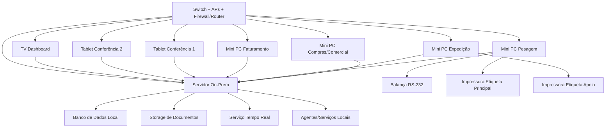
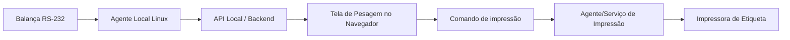
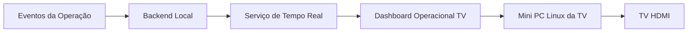
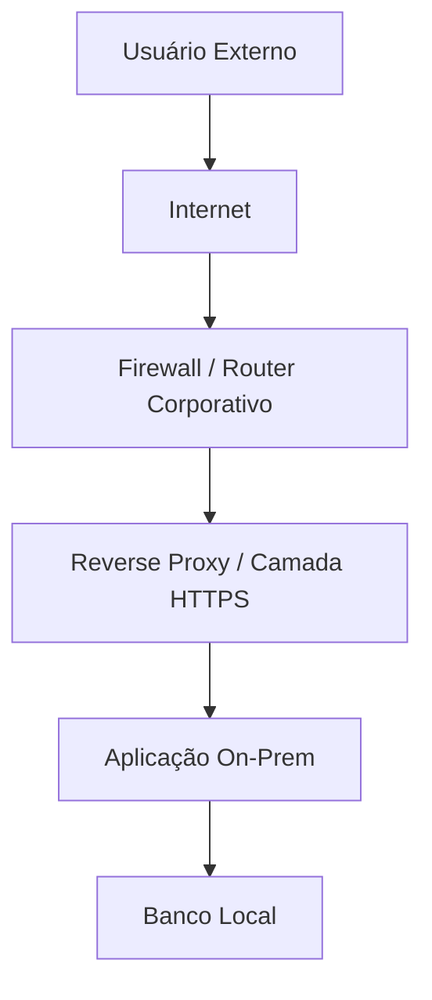
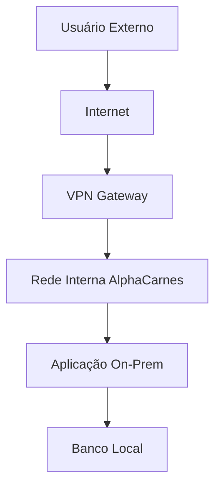
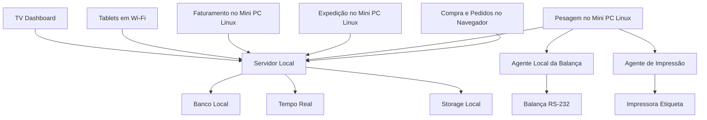

# 018-arquitetura-onpremises-e-topologia-de-equipamentos-minimos

## Objetivo do documento
Definir a arquitetura **on-premises** recomendada para a AlphaCarnes, com foco em:
1. topologia física e lógica da operação;
2. equipamentos mínimos por posto;
3. uso preferencial de estações pequenas e Linux;
4. integração entre balança, impressora, scanners, tablets e backend local;
5. uso de TV/painel para dashboards operacionais em tempo real;
6. especificação do(s) servidor(es) on-premises;
7. e o que é necessário para manter a aplicação acessível externamente com segurança.

Este documento complementa:
- 012-arquitetura-aplicacional-modulos-servicos-e-integracoes
- 017-infraestrutura-e-equipamentos-recomendados-para-operacao

---

# 1. Princípios da arquitetura on-premises

## 1.1 Objetivos
A arquitetura on-premises deve:
- manter os serviços principais dentro da estrutura local da AlphaCarnes;
- reduzir dependência de internet para a operação do dia;
- suportar integração local com balança e impressão;
- permitir operação em tempo real na rede interna;
- minimizar custo e complexidade dos postos operacionais;
- usar estações pequenas, estáveis e simples de manter;
- permitir acesso externo seguro sem comprometer a operação local.

## 1.2 Princípios recomendados
- estações operacionais preferencialmente com **Linux**;
- uso de **mini PCs** ou thin clients robustos, em vez de desktops grandes;
- aplicação principal web;
- integrações físicas concentradas em **agentes locais**;
- dashboards distribuídos por navegador interno;
- cabeamento nos pontos críticos e Wi‑Fi para mobilidade;
- separação entre rede interna operacional e acesso externo;
- exposição externa somente por camada controlada de segurança.

---

# 2. Visão geral da topologia on-premises

## 2.1 Componentes centrais
A estrutura recomendada contém:

1. **Servidor local principal**
2. **Banco de dados local**
3. **Backend/API local**
4. **Serviço de tempo real / WebSocket**
5. **Serviço de impressão**
6. **Serviço de integração com balança**
7. **Armazenamento local de documentos**
8. **Rede local cabeada + Wi‑Fi**
9. **Estações operacionais Linux**
10. **Tablets para conferência**
11. **TV/painel de dashboards**
12. **Camada segura para acesso externo**

## 2.2 Desenho conceitual resumido

---

# 3. Servidor on-premises

## 3.1 Estratégia recomendada
Para a **V1**, a recomendação é começar com:

### Opção A — 1 servidor físico principal
Hospedando:
- frontend web;
- backend/API;
- serviço de tempo real;
- banco de dados;
- storage local de documentos;
- monitoramento básico.

### Opção B — 2 servidores lógicos ou físicos
Mais robusta, recomendada se o orçamento permitir:
- **Servidor 1**: aplicação + tempo real + frontend + integrações lógicas
- **Servidor 2**: banco de dados + storage + backups locais

## 3.2 Recomendação prática para a AlphaCarnes
### V1 recomendada
**1 servidor físico principal bem dimensionado**, com:
- virtualização leve ou containers;
- separação lógica entre aplicação e banco;
- backup externo/interno;
- nobreak dedicado.

### Evolução recomendada
Quando a operação crescer:
- separar banco em servidor dedicado;
- manter aplicação em outro host;
- adicionar storage/NAS para documentos e backup.

---

## 3.3 Especificação mínima recomendada do servidor principal (V1)
### Perfil mínimo funcional
- CPU: 8 núcleos ou equivalente
- RAM: 32 GB
- Armazenamento principal: SSD/NVMe de 1 TB
- Armazenamento secundário para backup local: 1 TB ou mais
- Rede: 2 interfaces gigabit, se possível
- Sistema operacional: Linux Server
- Nobreak dedicado
- Ventilação e proteção física adequadas

### Papel esperado
Esse servidor deve suportar:
- usuários administrativos;
- estações operacionais;
- tablets;
- dashboard da TV;
- eventos em tempo real;
- integrações locais;
- emissão documental;
- banco de dados da operação.

---

## 3.4 Especificação recomendada do servidor principal (mais confortável)
### Perfil recomendado
- CPU: 12 a 16 núcleos ou equivalente
- RAM: 64 GB
- Armazenamento:
  - 1 x NVMe/SSD para sistema e aplicação
  - 1 x NVMe/SSD para banco de dados
  - 1 x disco adicional ou storage externo para backup
- Rede: 2 portas gigabit ou 10GbE, se houver estrutura
- Linux Server
- Nobreak dedicado
- backup automatizado

---

## 3.5 Servidor secundário opcional
Se a AlphaCarnes quiser uma estrutura on-prem mais robusta desde o início, o segundo servidor pode cumprir uma destas funções:

### Opção 1 — Banco de dados dedicado
- banco transacional
- réplicas ou backup
- storage local

### Opção 2 — Backup / contingência
- storage de documentos
- backup de banco
- cópia do sistema
- recuperação em caso de falha do principal

### Opção 3 — Acesso externo / DMZ interna
- reverse proxy
- autenticação
- camada de publicação controlada

---

# 4. Componentes centrais da arquitetura

## 4.1 Servidor local principal
### Função
Hospedar os serviços centrais do sistema:
- backend/API;
- autenticação;
- tempo real;
- integrações lógicas;
- dashboards;
- armazenamento de metadados.

### Requisitos funcionais
- disponibilidade durante toda a operação;
- bom desempenho de I/O;
- operação estável;
- backup regular;
- acesso apenas na rede interna, com abertura externa controlada se necessário.

### Pode hospedar
- API principal;
- serviço de WebSocket/SSE;
- serviço de alertas;
- serviço de documentos;
- aplicação web;
- banco de dados, na V1, se a carga permitir.

---

## 4.2 Banco de dados local
### Função
Centralizar os dados transacionais da operação.

### Requisitos
- integridade transacional;
- backup frequente;
- restauração testável;
- boa performance em escrita e leitura operacional.

### Recomendação
Na V1, pode ficar no mesmo servidor principal, desde que:
- haja SSD/NVMe;
- haja backup e nobreak;
- a carga esteja dentro do esperado.

---

## 4.3 Storage local de documentos
### Função
Armazenar:
- etiquetas geradas, se necessário;
- DANFE/PDFs;
- evidências;
- documentos enviados ao motorista;
- anexos de ocorrência.

### Observação
Na V1, pode ser um storage local no próprio servidor, com política de backup.

---

# 5. Postos operacionais e estações mínimas

## 5.1 Estratégia de estações
As estações devem ser:
- pequenas;
- silenciosas;
- estáveis;
- fáceis de substituir;
- preferencialmente Linux;
- com navegador moderno;
- com poucos serviços locais além do necessário.

## 5.2 Perfil recomendado
### Estações fixas
- **mini PC Linux**
- baixo consumo
- SSD
- RAM suficiente para navegador + serviço local quando necessário

### Motivos
- menor custo e espaço;
- manutenção mais simples;
- melhor padronização;
- maior robustez operacional do que PCs improvisados;
- ótima aderência a uso web + agentes locais leves.

---

# 6. Posto 1 — Compras / Comercial

## 6.1 Finalidade
- compra programada;
- disponibilidade virtual;
- pedidos;
- monitoramento comercial básico.

## 6.2 Equipamento mínimo recomendado
- 1 mini PC Linux
- 1 monitor 22" a 24"
- teclado e mouse
- conexão de rede cabeada preferencialmente

## 6.3 Integração
- acesso via navegador ao sistema local
- sem necessidade de programação local especial
- sem dependência de dispositivo serial

---

# 7. Posto 2 — Pesagem

## 7.1 Finalidade
- registrar peça;
- capturar peso;
- sugerir associação;
- imprimir etiqueta;
- abrir divergência;
- enviar para corte ou expedição.

## 7.2 Equipamento mínimo recomendado
- 1 mini PC Linux dedicado
- 1 monitor 22" a 24" ou touch, se desejado
- 1 teclado compacto + mouse
- 1 balança ligada localmente
- 1 impressora de etiqueta principal
- 1 leitor QR/2D
- 1 adaptador USB-RS232, se necessário
- 1 nobreak dedicado

## 7.3 Integração local
Este é o posto que mais depende de integração local.

### Componentes locais recomendados
1. **Navegador** rodando a tela de pesagem
2. **Agente local da balança**
3. **Agente local de impressão**, se adotado
4. **Serviço leve de diagnóstico de dispositivos**, opcional

### Fluxo sugerido

## 7.4 Observação importante
A lógica de negócio não deve ficar no mini PC da pesagem.  
O mini PC deve apenas:
- operar a UI;
- ler a balança;
- acionar impressão;
- e conversar com o backend local.

---

# 8. Posto 3 — Corte

## 8.1 Finalidade
- registrar transformação;
- gerar subitens;
- pesar subitens, se necessário;
- reetiquetar.

## 8.2 Equipamento mínimo recomendado
### Opção A — Estação dedicada
- 1 mini PC Linux
- 1 monitor
- 1 leitor QR/2D
- 1 impressora de etiquetas compartilhada ou dedicada
- 1 balança local, se o processo exigir

### Opção B — Compartilhamento inicial
Se o corte for menos frequente, o posto pode compartilhar parte da infraestrutura da pesagem/expedição, desde que não gere gargalo.

---

# 9. Posto 4 — Expedição

## 9.1 Finalidade
- acompanhar montagem do caminhão;
- transferir peças entre pedidos enquanto permitido;
- conferir carga;
- fechar expedição.

## 9.2 Equipamento mínimo recomendado
- 1 mini PC Linux
- 1 monitor 22" a 24"
- 1 leitor QR/2D
- 1 impressora de apoio opcional
- 1 nobreak compartilhado ou dedicado

## 9.3 Integração
- acesso ao sistema via navegador
- atualização em tempo real via WebSocket/SSE
- leitura de QR como dispositivo padrão
- sem necessidade obrigatória de software específico do SO, além do navegador

---

# 10. Posto 5 — Faturamento / Liberação

## 10.1 Finalidade
- consolidar carga;
- emitir NF;
- gerar dados do seguro;
- enviar documentação;
- liberar caminhão.

## 10.2 Equipamento mínimo recomendado
- 1 mini PC Linux
- 1 monitor 24"
- teclado e mouse
- impressora A4 opcional
- rede cabeada preferencialmente

## 10.3 Integração
- acesso via navegador
- integração fiscal realizada pelo backend/serviço fiscal local
- sem dependência direta de periférico serial

---

# 11. Conferência móvel com tablets

## 11.1 Finalidade
- conferir peças na doca/caminhão;
- validar composição da carga;
- registrar faltas/sobras/divergências;
- consultar pedidos e status.

## 11.2 Equipamentos recomendados
- 2 tablets
- 2 capas robustas
- Wi‑Fi estável
- leitor por câmera ou leitor externo, conforme estratégia

## 11.3 Integração
### Modo recomendado
- aplicação web responsiva
- operação em navegador
- autenticação no sistema local
- tempo real pela rede interna

### Observação
Para a V1, não é necessário app nativo específico se a aplicação web for bem desenhada.

---

# 12. TV/Painel de dashboard

## 12.1 Objetivo
Disponibilizar um painel visual contínuo da operação em área visível para:
- gestores;
- operação;
- expedição;
- faturamento.

## 12.2 Finalidades práticas
A TV pode exibir:
- status geral da operação do dia;
- total comprado x vendido x recebido x expedido;
- caminhões em carga;
- caminhões fechados;
- divergências críticas;
- peças em corte;
- alertas críticos;
- fila de pendências do faturamento;
- progresso de liberação.

## 12.3 Equipamento recomendado
### Opção mínima
- 1 TV de 43" a 55"
- 1 mini PC Linux ou media player simples conectado por HDMI
- rede Wi‑Fi estável ou cabeada, preferencialmente cabeada
- suporte de parede

### Opção mais robusta
- TV comercial/profissional
- mini PC Linux dedicado
- boot automático no dashboard
- modo kiosk/fullscreen

## 12.4 Integração da TV com o sistema
A TV não precisa de lógica especial de negócio.  
Ela funciona como um **cliente de visualização** conectado ao dashboard em tempo real.

### Arquitetura recomendada
1. O backend local calcula KPIs e publica eventos.
2. O módulo de dashboard consolida o estado da operação.
3. A TV acessa uma rota específica do sistema, por exemplo:
   - `/dashboard/operacional-tv`
4. O navegador da TV/mini PC fica em:
   - tela cheia,
   - auto refresh ou WebSocket,
   - modo kiosk.

### Fluxo de integração

## 12.5 Requisitos funcionais da TV
- atualização em tempo quase real;
- leitura à distância;
- poucas interações;
- foco em cards, semáforos, listas curtas e progressos;
- não exigir login manual constante;
- reiniciar automaticamente em caso de queda de energia.

## 12.6 Itens recomendados para o dashboard da TV
### Seção 1 — Operação do dia
- lote do dia
- % vendido
- % recebido
- % expedido

### Seção 2 — Caminhões
- em carga
- aguardando item
- fechados
- liberados

### Seção 3 — Alertas
- divergência crítica
- item em ruptura
- NF rejeitada
- caminhão parado

### Seção 4 — Fila operacional
- peças aguardando corte
- peças aguardando associação
- carga aguardando conferência

---

# 13. Agentes locais Linux

## 13.1 Objetivo
Isolar a integração com equipamentos físicos da lógica de negócio central.

## 13.2 Agente da balança
### Funções
- abrir porta serial;
- ler peso;
- validar estabilidade;
- publicar leitura para o backend local;
- informar status do dispositivo.

## 13.3 Agente de impressão
### Funções
- receber comando do backend;
- montar/imprimir etiqueta;
- registrar sucesso/falha;
- gerenciar fila local simples, se necessário.

## 13.4 Benefícios dos agentes
- menor acoplamento com a UI;
- menor dependência do navegador para periféricos críticos;
- mais previsibilidade no on-premises;
- melhor diagnóstico de falhas.

---

# 14. Equipamentos mínimos consolidados para a V1 on-premises

## 14.1 Quantitativo mínimo sugerido
- 4 mini PCs Linux
- 4 monitores
- 2 impressoras de etiqueta
- 2 tablets
- 4 leitores QR/2D
- 2 adaptadores USB-RS232
- 1 servidor local principal
- 1 switch gigabit
- 2 access points Wi‑Fi
- 2 a 3 nobreaks
- 1 TV 43" a 55"
- 1 mini PC Linux ou player dedicado para a TV

## 14.2 Distribuição sugerida
### Mini PCs Linux
- 1 compras/comercial
- 1 pesagem
- 1 expedição
- 1 faturamento

### Impressoras
- 1 pesagem
- 1 apoio corte/contingência

### Tablets
- 2 conferência/expedição

### Leitores
- 1 pesagem
- 1 corte
- 2 expedição/conferência

### TV
- 1 painel operacional

---

# 15. Requisitos mínimos dos mini PCs Linux

## 15.1 Perfil recomendado
- formato compacto
- SSD
- memória suficiente para navegador e serviços leves
- múltiplas portas USB
- rede gigabit
- HDMI/DisplayPort
- estabilidade de operação contínua

## 15.2 Especificação mínima sugerida
- CPU: 4 núcleos ou equivalente
- RAM: 8 GB
- SSD: 256 GB
- Rede: 1 Gbps
- 4 portas USB, preferencialmente
- HDMI/DisplayPort
- Linux Desktop estável
- navegador atualizado

## 15.3 Papel do Linux
O Linux é recomendado nas estações porque:
- reduz overhead;
- facilita operação kiosk;
- facilita agentes locais leves;
- melhora padronização;
- reduz custo de licença;
- é ótimo para estações web e integração serial.

---

# 16. Requisitos do servidor on-premises

## 16.1 Função
Hospedar:
- aplicação web;
- backend/API;
- banco;
- tempo real;
- storage local;
- serviços auxiliares.

## 16.2 Requisitos funcionais
- SSD/NVMe
- boa memória RAM
- backup
- nobreak
- boa ventilação
- segurança física
- acesso restrito

## 16.3 Observação
Na V1, um único servidor local bem montado pode ser suficiente.  
Na evolução, pode-se separar banco, aplicação e storage.

---

# 17. Acesso externo à aplicação on-premises

## 17.1 Objetivo
Permitir que usuários autorizados acessem o sistema de fora da AlphaCarnes, por exemplo:
- de casa;
- em viagens;
- por gestores;
- para acompanhamento administrativo.

## 17.2 Princípio de segurança
O acesso externo **não deve expor diretamente o banco ou os serviços internos críticos**.  
A publicação externa deve ocorrer por uma camada controlada.

## 17.3 Opções recomendadas

### Opção A — VPN corporativa (mais segura)
Usuários externos se conectam primeiro à rede da AlphaCarnes por VPN.
Depois disso, acessam a aplicação como se estivessem dentro da rede interna.

#### Vantagens
- mais segura;
- reduz exposição pública;
- boa para V1;
- mantém o sistema essencialmente interno.

#### Desvantagens
- exige configuração de cliente VPN;
- um pouco menos simples para usuário final.

---

### Opção B — Reverse Proxy publicado com autenticação forte
Publica apenas a aplicação web/API por meio de uma camada controlada.

#### Componentes típicos
- firewall/router com controle de portas;
- reverse proxy;
- certificado HTTPS;
- autenticação forte;
- idealmente MFA;
- logs de acesso;
- restrições por perfil/IP, se desejado.

#### Vantagens
- mais simples para acesso via navegador;
- dispensa VPN em alguns cenários.

#### Desvantagens
- exige endurecimento de segurança maior;
- aumenta superfície de exposição.

---

### Opção C — VPN + Reverse Proxy interno
A mais equilibrada para crescer:
- VPN para entrar na rede;
- reverse proxy interno para distribuir a aplicação.

---

## 17.4 Componentes necessários para acesso externo seguro

### Obrigatórios
- link de internet estável
- IP público fixo ou DNS dinâmico confiável
- domínio ou subdomínio
- certificado HTTPS
- firewall/router empresarial
- política de autenticação
- logs de acesso

### Muito recomendáveis
- MFA
- WAF ou regras de proteção na borda
- segmentação de rede
- bloqueio por origem quando aplicável
- backup externo/offsite
- monitoramento de disponibilidade

---

## 17.5 Topologia sugerida para acesso externo

### Cenário recomendado para V1
**Firewall/Router + Reverse Proxy + Aplicação Interna**

### Cenário mais seguro
**Usuário Externo -> VPN -> Rede Interna -> Aplicação**

---

## 17.6 O que precisa ser configurado para acesso externo
1. domínio ou subdomínio para a aplicação;
2. resolução DNS;
3. firewall/router com regras claras;
4. certificado TLS/HTTPS;
5. política de autenticação segura;
6. controle de sessão;
7. logs e monitoramento;
8. política de backup e contingência.

---

## 17.7 Riscos do acesso externo on-premises
- indisponibilidade da internet local da AlphaCarnes impacta o acesso externo;
- falhas de energia impactam o acesso externo;
- má configuração de firewall expõe indevidamente a aplicação;
- ausência de MFA aumenta risco de credenciais comprometidas.

---

## 17.8 Recomendação prática
Para a AlphaCarnes, eu recomendaria:

### Fase 1
- operação local totalmente funcional;
- acesso externo somente via **VPN** para perfis administrativos/gestão.

### Fase 2
- avaliar publicação web controlada via reverse proxy HTTPS;
- manter perfis operacionais restritos à rede interna.

---

# 18. Rede e conectividade

## 18.1 Topologia recomendada
- switch central
- access points cobrindo doca, pesagem e expedição
- pontos cabeados nos postos fixos
- Wi‑Fi para tablets e TV, se necessário, embora a TV idealmente use cabeado

## 18.2 Pontos que devem ser cabeados
- servidor
- pesagem
- expedição fixa
- faturamento
- TV, se viável

## 18.3 Pontos que podem operar em Wi‑Fi
- tablets
- estação administrativa, se necessário
- consultas leves

---

# 19. Contingência on-premises

## 19.1 Energia
Devem ter nobreak:
- servidor
- pesagem
- impressora principal
- expedição fixa

## 19.2 Falha da balança
O sistema deve permitir peso manual auditado.

## 19.3 Falha da impressora principal
Deve existir impressora de contingência ou caminho operacional alternativo controlado.

## 19.4 Falha da TV
Não impacta a transação principal, mas reduz visibilidade. Pode ser restaurada facilmente com reboot do mini PC/painel.

## 19.5 Falha do servidor principal
Idealmente:
- backup automatizado;
- restauração documentada;
- plano futuro para servidor de contingência ou virtualização com snapshot.

---

# 20. Fluxo resumido da arquitetura on-premises

---

# 21. Regras transversais específicas do 018

## RT-018-01
A operação crítica deve continuar funcional mesmo com internet externa indisponível, desde que a rede local esteja íntegra.

## RT-018-02
Estações operacionais devem ser mínimas, padronizadas e preferencialmente Linux.

## RT-018-03
Integrações com balança e impressão devem ficar isoladas em agentes locais.

## RT-018-04
A TV de dashboard deve ser tratada como cliente de visualização, sem lógica de negócio embarcada.

## RT-018-05
O acesso externo on-premises deve passar por camada de segurança dedicada, nunca por exposição bruta do ambiente interno.

---

# 22. Resultado esperado deste documento
Com este documento, a AlphaCarnes passa a ter uma visão prática e técnica de:
- como montar a operação on-premises;
- quais equipamentos mínimos usar;
- como estruturar servidores e estações pequenas Linux;
- como integrar TV/painel em tempo real;
- e como disponibilizar a aplicação externamente com segurança.
