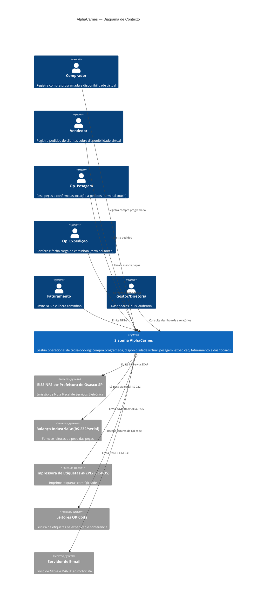

# C4 Nível 1 — Diagrama de Contexto

## Descrição
Visão de alto nível: quem usa o sistema e com quais sistemas externos ele se comunica.

## Atores

| Ator | Perfil no sistema | Uso principal |
|------|------------------|---------------|
| Comprador | `compras` | Compra Programada, Disponibilidade Virtual |
| Vendedor | `comercial` | Pedidos de Venda |
| Operador de Pesagem | `operador_pesagem` | Terminal de Pesagem |
| Operador de Corte | `operador_corte` | Corte e Transformação |
| Operador de Expedição | `operador_expedicao` | Terminal de Expedição |
| Conferente | `conferente` | Conferência de carga |
| Faturamento | `faturamento` | Emissão NFS-e |
| Gestor | `gestor` | Dashboards, aprovações |
| Diretoria | `diretoria` | Relatórios executivos |
| Administrador | `administrador` | Cadastros, configurações |
| Auditoria | `auditoria` | Consulta de auditoria |

## Sistemas Externos

| Sistema | Protocolo | Criticidade |
|---------|-----------|-------------|
| EISS NFS-e (Osasco-SP) | SOAP/HTTPS | Alta — bloqueante para liberar caminhão |
| Balança Industrial | RS-232 serial | Alta — bloqueante para pesagem |
| Impressora de Etiquetas | ZPL/ESC-POS (TCP ou USB) | Alta — necessária para rastreabilidade |
| Leitores QR Code | USB HID / TCP | Média — expedição pode funcionar sem |
| Servidor de E-mail | SMTP | Baixa — envio assíncrono ao motorista |
