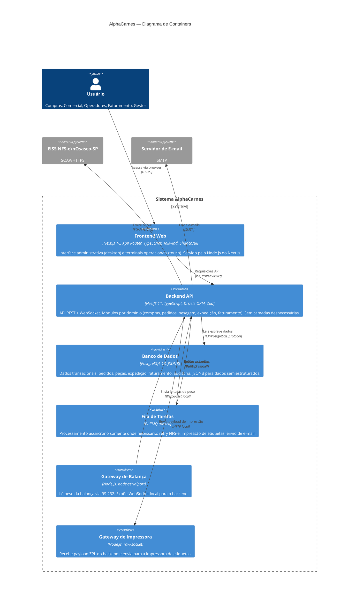

# C4 Nível 2 — Diagrama de Containers

## Responsabilidades por Container

### Frontend Web (`app/frontend`)
- Renderização de páginas (Server Components para queries, Client Components para interatividade)
- Autenticação (cookie seguro com JWT)
- Layout administrativo (sidebar, filtros, tabelas, formulários)
- Layout operacional (tela cheia, touch-friendly, alto contraste)
- Conexão WebSocket para atualizações em tempo real

### Backend API (`app/backend`)
- Módulos NestJS por domínio de negócio — sem camadas extras
- API REST por módulo (`/compras`, `/pedidos`, `/pesagem`, `/expedicao`, `/faturamento`)
- WebSocket Gateway NestJS para tempo real
- `FaturamentoModule` encapsula toda comunicação SOAP com EISS
- Guards declarativos para auth/RBAC; Interceptor para auditoria
- Drizzle ORM direto nos services — sem repositórios intermediários desnecessários

### PostgreSQL 18
- Dados transacionais com ACID
- JSONB para preferências, atributos de peça, payload fiscal
- Auditoria via tabela de log + trigger `updated_at`

### BullMQ (Redis)
- Usado apenas onde o processamento síncrono não é viável:
  - Retry de emissão NFS-e após falha do EISS
  - Fila de impressão de etiquetas (um job por etiqueta)
  - Envio de e-mail ao motorista

### Gateway de Balança
- Processo separado no servidor on-premises
- Lê serial RS-232 da balança industrial
- Estabiliza leitura (descarta leituras instáveis)
- Expõe WebSocket local para o backend consumir

### Gateway de Impressora
- Processo separado (pode ser o mesmo servidor)
- Recebe payload ZPL/ESC-POS do backend
- Envia para impressora via TCP (porta 9100) ou USB
- Gerencia fila de impressão e confirma sucesso
