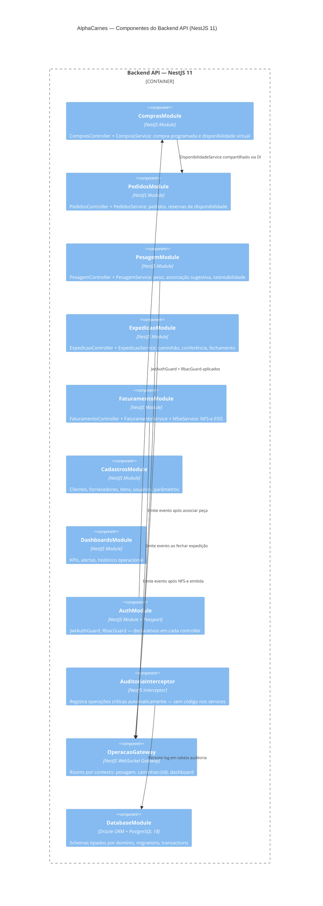

# C4 Nível 3 — Componentes do Backend



## Estrutura de diretórios do backend (NestJS — clean)

```
app/backend/src/
├── app.module.ts               ← importa todos os módulos de domínio
│
├── modules/
│   ├── auth/
│   │   ├── auth.module.ts
│   │   ├── auth.service.ts     ← login, refresh, validação JWT
│   │   ├── jwt.strategy.ts
│   │   └── guards/
│   │       ├── jwt-auth.guard.ts
│   │       └── rbac.guard.ts
│   │
│   ├── compras/
│   │   ├── compras.module.ts
│   │   ├── compras.controller.ts
│   │   └── compras.service.ts  ← inclui lógica de disponibilidade virtual
│   │
│   ├── pedidos/
│   │   ├── pedidos.module.ts
│   │   ├── pedidos.controller.ts
│   │   └── pedidos.service.ts
│   │
│   ├── pesagem/
│   │   ├── pesagem.module.ts
│   │   ├── pesagem.controller.ts
│   │   └── pesagem.service.ts  ← associação sugestiva + rastreabilidade
│   │
│   ├── expedicao/
│   │   ├── expedicao.module.ts
│   │   ├── expedicao.controller.ts
│   │   └── expedicao.service.ts
│   │
│   ├── faturamento/
│   │   ├── faturamento.module.ts
│   │   ├── faturamento.controller.ts
│   │   ├── faturamento.service.ts
│   │   └── nfse/
│   │       ├── nfse.service.ts       ← orquestra emissão/cancelamento
│   │       ├── eiss-client.ts        ← cliente SOAP node-soap
│   │       └── payload-builder.ts    ← monta NotaFiscalDTO
│   │
│   ├── cadastros/
│   │   ├── cadastros.module.ts
│   │   ├── cadastros.controller.ts
│   │   └── cadastros.service.ts
│   │
│   └── dashboards/
│       ├── dashboards.module.ts
│       ├── dashboards.controller.ts
│       └── dashboards.service.ts
│
├── common/
│   ├── interceptors/
│   │   └── auditoria.interceptor.ts
│   ├── pipes/
│   │   └── zod-validation.pipe.ts
│   └── websocket/
│       └── operacao.gateway.ts       ← @WebSocketGateway NestJS
│
├── database/
│   ├── database.module.ts
│   ├── schema/
│   │   ├── cadastros.schema.ts
│   │   ├── compras.schema.ts
│   │   ├── pedidos.schema.ts
│   │   ├── pesagem.schema.ts
│   │   ├── expedicao.schema.ts
│   │   ├── fiscal.schema.ts
│   │   └── auditoria.schema.ts
│   └── migrations/
│
└── main.ts
```
