# Modelo de Dados Conceitual — AlphaCarnes

> Este documento expande e consolida o doc `010-modelo-de-dados-conceitual-e-entidades-principais-do-sistema.md`,
> organizando as 31+ entidades em 7 domínios de negócio alinhados à arquitetura modular NestJS
> (um `@Module()` por domínio), incluindo diagrama ER abrangente e descrição detalhada de
> cada entidade com invariantes de negócio derivados da operação real de cross-docking.

---

## Domínios de Negócio

O modelo é organizado em 7 domínios que mapeiam 1:1 com os módulos da aplicação backend:

| # | Domínio | Módulo NestJS | Responsabilidade principal |
|---|---------|---------------|---------------------------|
| 1 | Cadastro Base | `cadastros` | Entidades mestras e parametrização |
| 2 | Planejamento Comercial | `compras` / `pedidos` | Compra programada, disponibilidade virtual, pedidos |
| 3 | Operação Física | `pesagem` | Recebimento, peças, pesagem, divergências |
| 4 | Transformação | `corte` | Corte, subitens, reetiquetagem |
| 5 | Expedição | `expedicao` | Caminhões, carga, conferência, fechamento |
| 6 | Fiscal/Documental | `faturamento` | NF, seguro, envio de documentos |
| 7 | Observabilidade | `dashboards` / `auth` | Eventos de domínio, auditoria, alertas |

### Domínio 1 — Cadastro Base
Entidades: **Cliente**, **Fornecedor**, **Item** (compra e comercial), **RegraDesdobramento**, **Parametro**, **Usuario**, **Perfil**

### Domínio 2 — Planejamento Comercial
Entidades: **CompraProgramada**, **DisponibilidadeVirtual**, **PedidoVenda**, **ItemPedido**, **ReservaDisponibilidade**

### Domínio 3 — Operação Física
Entidades: **Recebimento**, **ItemRecebido**, **Divergencia**, **Peca**, **Pesagem**

### Domínio 4 — Transformação
Entidades: **OrdemCorte** (Transformacao), **SubItem**, **Reetiquetagem** (Etiqueta)

### Domínio 5 — Expedição
Entidades: **Caminhao**, **Rota** (CaminhaoPedido), **PecaCaminhao** (CargaItem), **FechamentoExpedicao** (ConferenciaCarga)

### Domínio 6 — Fiscal/Documental
Entidades: **NotaFiscal**, **ItemNotaFiscal** (NotaFiscalPedido), **SeguroCarga**, **EnvioDocumento**

### Domínio 7 — Observabilidade
Entidades: **EventoDominio**, **Auditoria**, **Alerta**, **Ocorrencia** (OcorrenciaFornecedor)

---

## Diagrama Entidade-Relacionamento

```mermaid
erDiagram

    %% ── DOMÍNIO 1 — Cadastro Base ──────────────────────────────────────
    CLIENTE {
        uuid id PK
        string codigo UK
        string razaoSocial
        string documentoFiscal UK
        string status
        string rotaPadrao
        int prioridade
        jsonb preferenciasJson
        jsonb dadosFiscaisJson
    }

    FORNECEDOR {
        uuid id PK
        string codigo UK
        string razaoSocial
        string documentoFiscal UK
        string status
        jsonb contatosJson
        jsonb parametrosOperacionaisJson
    }

    ITEM_COMPRA {
        uuid id PK
        string codigo UK
        string descricao
        string categoria
        string unidadeCompra
        string status
    }

    ITEM_COMERCIAL {
        uuid id PK
        string codigo UK
        string descricao
        string categoria
        string unidadeComercial
        boolean permiteCorte
        string status
    }

    REGRA_DESDOBRAMENTO {
        uuid id PK
        uuid itemCompraId FK
        uuid itemComercialId FK
        numeric fatorQuantidade
        string status
        date vigenciaInicio
        date vigenciaFim
    }

    USUARIO {
        uuid id PK
        string login UK
        string nome
        string status
        uuid perfilId FK
    }

    PERFIL {
        uuid id PK
        string codigo UK
        string descricao
        jsonb permissoesJson
    }

    %% ── DOMÍNIO 2 — Planejamento Comercial ─────────────────────────────
    COMPRA_PROGRAMADA {
        uuid id PK
        date dataOperacao UK
        uuid fornecedorId FK
        string numeroInterno UK
        string referenciaExterna
        timestamptz previsaoEntrega
        string statusCompra
        uuid createdBy FK
        uuid confirmedBy FK
    }

    COMPRA_PROGRAMADA_ITEM {
        uuid id PK
        uuid compraProgramadaId FK
        uuid itemCompraId FK
        numeric quantidadeComprada
        string unidade
        uuid regraDesdobramentoId FK
    }

    DISPONIBILIDADE_VIRTUAL {
        uuid id PK
        uuid compraProgramadaId FK
        date dataOperacao
        uuid itemComercialId FK
        numeric quantidadeTotalGerada
        numeric quantidadeReservada
        numeric quantidadeDisponivel
        numeric quantidadeRecebida
        numeric quantidadeExpedida
        numeric quantidadeSobra
        string statusDisponibilidade
    }

    PEDIDO_VENDA {
        uuid id PK
        uuid compraProgramadaId FK
        uuid clienteId FK
        date dataOperacao
        date dataEntrega
        string rotaPrevista
        int prioridade
        string statusPedido
        uuid createdBy FK
        uuid approvedBy FK
    }

    PEDIDO_VENDA_ITEM {
        uuid id PK
        uuid pedidoVendaId FK
        uuid itemComercialId FK
        numeric quantidadePedida
        numeric quantidadeReservada
        numeric quantidadeAtendida
        numeric quantidadePendente
        string statusItemPedido
        jsonb preferenciasAplicadasJson
    }

    RESERVA_DISPONIBILIDADE {
        uuid id PK
        uuid disponibilidadeVirtualId FK
        uuid pedidoVendaItemId FK
        numeric quantidadeReservada
        string statusReserva
    }

    %% ── DOMÍNIO 3 — Operação Física ─────────────────────────────────────
    RECEBIMENTO {
        uuid id PK
        uuid compraProgramadaId FK
        uuid fornecedorId FK
        timestamptz dataHoraChegada
        string notaFiscalFornecedor
        string placaVeiculoFornecedor
        string motoristaFornecedor
        string statusRecebimento
    }

    RECEBIMENTO_ITEM {
        uuid id PK
        uuid recebimentoId FK
        string itemComercialOuClasse
        numeric quantidadeRecebida
        numeric pesoTotalApurado
        string statusApuracao
    }

    DIVERGENCIA_RECEBIMENTO {
        uuid id PK
        uuid recebimentoId FK
        string tipoDivergencia
        string descricao
        string impactoOperacional
        string impactoComercial
        string statusDivergencia
        string acaoImediata
        uuid responsavelRegistro FK
        timestamptz dataHoraRegistro
    }

    PECA {
        uuid id PK
        uuid compraProgramadaId FK
        uuid recebimentoId FK
        string classificacaoOperacional
        uuid itemComercialBaseId FK
        numeric pesoOriginal
        timestamptz dataHoraPesagem
        string modoCapturaPeso
        string statusPeca
        uuid pedidoVendaAtualId FK
        uuid pedidoVendaItemAtualId FK
        uuid caminhaoAtualId FK
    }

    PESAGEM_LOG {
        uuid id PK
        uuid pecaId FK
        numeric pesoLido
        string modoCaptura
        string balancaOrigem
        boolean estavel
        boolean confirmado
        string operador
        timestamptz createdAt
    }

    %% ── DOMÍNIO 4 — Transformação ────────────────────────────────────────
    TRANSFORMACAO {
        uuid id PK
        uuid pecaOrigemId FK
        string tipoTransformacao
        string motivo
        string operadorResponsavel
        string statusTransformacao
        timestamptz dataHoraAbertura
        timestamptz dataHoraEncerramento
    }

    SUBITEM {
        uuid id PK
        uuid transformacaoId FK
        uuid pecaOrigemId FK
        string classificacao
        uuid itemComercialId FK
        numeric peso
        numeric quantidade
        string statusSubitem
        uuid pedidoVendaAtualId FK
        uuid caminhaoAtualId FK
    }

    ETIQUETA {
        uuid id PK
        string codigoEtiqueta UK
        string tipoEtiqueta
        uuid pecaId FK
        uuid subitemId FK
        string statusEtiqueta
        int versao
        string operadorResponsavel
        timestamptz dataHoraImpressao
    }

    %% ── DOMÍNIO 5 — Expedição ────────────────────────────────────────────
    CAMINHAO {
        uuid id PK
        string placa
        string motorista
        string rota
        jsonb itinerarioJson
        string statusCaminhao
        date dataOperacao
        timestamptz horaAberturaCarga
        timestamptz horaFechamentoCarga
        timestamptz horaLiberacao
    }

    CAMINHAO_PEDIDO {
        uuid id PK
        uuid caminhaoId FK
        uuid pedidoVendaId FK
        int ordemNaCarga
        string statusNaCarga
    }

    CARGA_ITEM {
        uuid id PK
        uuid caminhaoId FK
        string tipoOrigem
        uuid pecaId FK
        uuid subitemId FK
        uuid pedidoVendaId FK
        uuid pedidoVendaItemId FK
        timestamptz dataHoraEntradaCarga
        string statusCargaItem
        boolean conferido
    }

    CONFERENCIA_CARGA {
        uuid id PK
        uuid caminhaoId FK
        string operadorResponsavel
        timestamptz dataHoraInicio
        timestamptz dataHoraFim
        string statusConferencia
        jsonb pendenciasJson
    }

    %% ── DOMÍNIO 6 — Fiscal/Documental ────────────────────────────────────
    FATURAMENTO {
        uuid id PK
        uuid caminhaoId FK
        string statusFaturamento
        string responsavel
        timestamptz dataHoraInicio
        timestamptz dataHoraFim
    }

    NOTA_FISCAL {
        uuid id PK
        uuid faturamentoId FK
        string numeroNota
        string chaveAcesso UK
        string statusNota
        timestamptz dataHoraEmissao
        timestamptz dataHoraAutorizacao
        jsonb retornoSefazJson
        string tipoDocumento
    }

    NOTA_FISCAL_PEDIDO {
        uuid id PK
        uuid notaFiscalId FK
        uuid pedidoVendaId FK
    }

    SEGURO_CARGA {
        uuid id PK
        uuid caminhaoId FK
        string statusSeguro
        string protocolo
        timestamptz dataHoraGeracao
    }

    ENVIO_DOCUMENTO {
        uuid id PK
        uuid caminhaoId FK
        string tipoDocumento
        string canalEnvio
        string destinatario
        string statusEnvio
        jsonb evidenciasJson
        timestamptz dataHoraEnvio
    }

    %% ── DOMÍNIO 7 — Observabilidade ──────────────────────────────────────
    OCORRENCIA_FORNECEDOR {
        uuid id PK
        uuid fornecedorId FK
        uuid compraProgramadaId FK
        uuid divergenciaRecebimentoId FK
        string statusOcorrencia
        string descricao
        string impacto
        string desfecho
        timestamptz dataHoraAbertura
        timestamptz dataHoraEncerramento
    }

    AUDITORIA_ACAO {
        uuid id PK
        string usuario
        string acao
        string modulo
        string entidadeAfetada
        uuid entidadeAfetadaId
        jsonb valorAnteriorJson
        jsonb valorNovoJson
        string justificativa
        timestamptz createdAt
    }

    ALERTA_OPERACIONAL {
        uuid id PK
        string tipoAlerta
        string nivel
        string moduloOrigem
        string entidadeOrigem
        uuid entidadeOrigemId
        string descricao
        string impacto
        string statusAlerta
        timestamptz dataHoraGeracao
        timestamptz dataHoraResolucao
    }

    %% ── RELACIONAMENTOS ──────────────────────────────────────────────────

    %% Cadastro Base
    PERFIL ||--o{ USUARIO : "classifica"
    ITEM_COMPRA ||--o{ REGRA_DESDOBRAMENTO : "origina"
    ITEM_COMERCIAL ||--o{ REGRA_DESDOBRAMENTO : "recebe"

    %% Compra → Disponibilidade → Pedidos
    FORNECEDOR ||--o{ COMPRA_PROGRAMADA : "fornece"
    COMPRA_PROGRAMADA ||--o{ COMPRA_PROGRAMADA_ITEM : "contém"
    ITEM_COMPRA ||--o{ COMPRA_PROGRAMADA_ITEM : "compõe"
    COMPRA_PROGRAMADA ||--o{ DISPONIBILIDADE_VIRTUAL : "gera"
    ITEM_COMERCIAL ||--o{ DISPONIBILIDADE_VIRTUAL : "tipo"
    COMPRA_PROGRAMADA ||--o{ PEDIDO_VENDA : "suporta"
    CLIENTE ||--o{ PEDIDO_VENDA : "realiza"
    PEDIDO_VENDA ||--o{ PEDIDO_VENDA_ITEM : "contém"
    ITEM_COMERCIAL ||--o{ PEDIDO_VENDA_ITEM : "especifica"
    DISPONIBILIDADE_VIRTUAL ||--o{ RESERVA_DISPONIBILIDADE : "é reservada por"
    PEDIDO_VENDA_ITEM ||--o{ RESERVA_DISPONIBILIDADE : "gera"

    %% Recebimento → Peça
    COMPRA_PROGRAMADA ||--o{ RECEBIMENTO : "origina"
    FORNECEDOR ||--o{ RECEBIMENTO : "entrega"
    RECEBIMENTO ||--o{ RECEBIMENTO_ITEM : "apura"
    RECEBIMENTO ||--o{ DIVERGENCIA_RECEBIMENTO : "pode gerar"
    DIVERGENCIA_RECEBIMENTO ||--o{ OCORRENCIA_FORNECEDOR : "desdobra em"
    FORNECEDOR ||--o{ OCORRENCIA_FORNECEDOR : "relacionada a"
    RECEBIMENTO ||--o{ PECA : "gera"
    PECA ||--o{ PESAGEM_LOG : "registra"

    %% Corte e Transformação
    PECA ||--o{ TRANSFORMACAO : "sofre"
    TRANSFORMACAO ||--o{ SUBITEM : "gera"
    PECA ||--o{ ETIQUETA : "identificada por"
    SUBITEM ||--o{ ETIQUETA : "identificado por"

    %% Expedição
    CAMINHAO ||--o{ CAMINHAO_PEDIDO : "agrupa"
    PEDIDO_VENDA ||--o{ CAMINHAO_PEDIDO : "participa em"
    CAMINHAO ||--o{ CARGA_ITEM : "carrega"
    CAMINHAO ||--o{ CONFERENCIA_CARGA : "passa por"

    %% Faturamento
    CAMINHAO ||--|| FATURAMENTO : "consolida"
    FATURAMENTO ||--o{ NOTA_FISCAL : "emite"
    NOTA_FISCAL ||--o{ NOTA_FISCAL_PEDIDO : "cobre"
    PEDIDO_VENDA ||--o{ NOTA_FISCAL_PEDIDO : "contemplado em"
    CAMINHAO ||--o| SEGURO_CARGA : "possui"
    CAMINHAO ||--o{ ENVIO_DOCUMENTO : "registra envio"
```

---

## Descrição das Entidades

### Domínio 1 — Cadastro Base

#### Cliente

**Propósito:** Representa o comprador final das carnes. Centraliza dados fiscais, preferências operacionais e prioridade de atendimento usados em pedidos, sugestão de alocação de peças e faturamento.

**Atributos principais:**
- `id` — UUID, chave primária
- `codigo` — código interno único
- `razaoSocial`, `nomeFantasia`
- `documentoFiscal` — CNPJ/CPF, único
- `status` — `ativo` | `inativo` | `bloqueado`
- `rotaPadrao` — rota padrão de entrega
- `prioridade` — inteiro; ordena atendimento quando há escassez de disponibilidade
- `preferenciasJson` — JSONB com preferências de partes, pesos, apresentação
- `dadosFiscaisJson` — dados para emissão NFS-e (endereço, IE, regime tributário)
- `dadosContatoJson` — contatos operacionais (telefone, e-mail, WhatsApp)

**Relacionamentos:**
- 1 Cliente → N PedidoVenda

**Invariantes de negócio:**
- `documentoFiscal` deve ser único e válido no formato CNPJ/CPF.
- Cliente `bloqueado` não pode ter novos pedidos criados.
- `prioridade` determina ordem de reserva quando a disponibilidade virtual está próxima do esgotamento.

---

#### Fornecedor

**Propósito:** Representa o frigorífico ou outro fornecedor que entrega a carga física. Vinculado à compra programada e ao recebimento físico.

**Atributos principais:**
- `id`, `codigo`, `razaoSocial`, `documentoFiscal`
- `status` — `ativo` | `inativo`
- `contatosJson` — representantes, telefones, e-mails
- `parametrosOperacionaisJson` — tolerâncias de divergência, lead time, janelas de entrega

**Relacionamentos:**
- 1 Fornecedor → N CompraProgramada
- 1 Fornecedor → N Recebimento
- 1 Fornecedor → N OcorrenciaFornecedor

**Invariantes de negócio:**
- `documentoFiscal` único e válido (CNPJ).
- Fornecedor `inativo` não pode ser usado em nova compra programada.
- Toda divergência de recebimento deve referenciar o fornecedor da compra.

---

#### Item (Compra e Comercial)

**Propósito (ItemCompra):** Representa a unidade comprada em origem — boi inteiro, lote suíno, caixa de frango. Define o que é negociado com o fornecedor.

**Propósito (ItemComercial):** Representa a unidade vendável — dianteiro, central, traseiro, subitem específico. Define o que é prometido ao cliente.

**Atributos principais (ItemCompra):**
- `id`, `codigo` (único), `descricao`, `categoria`, `unidadeCompra`, `status`

**Atributos principais (ItemComercial):**
- `id`, `codigo` (único), `descricao`, `categoria`, `unidadeComercial`
- `permiteCorte` — boolean; indica se a peça pode passar por transformação
- `status`, `observacoesOperacionais`

**Relacionamentos:**
- ItemCompra → N RegraDesdobramento
- ItemComercial → N RegraDesdobramento
- ItemComercial → N DisponibilidadeVirtual
- ItemComercial → N PedidoVendaItem
- ItemComercial → N Peca (como classificação base)

**Invariantes de negócio:**
- Um ItemComercial com `permiteCorte = false` não pode ser origem de Transformacao.
- ItemCompra e ItemComercial com `status = inativo` não podem ser usados em novos documentos.
- Um ItemComercial só pode ter uma DisponibilidadeVirtual por CompraProgramada (unicidade `compraProgramadaId + itemComercialId`).

---

#### RegraDesdobramento

**Propósito:** Define como uma unidade de compra gera disponibilidade virtual comercial. Exemplo: 1 boi → 1 dianteiro + 1 central + 1 traseiro (três regras com `fatorQuantidade = 1`).

**Atributos principais:**
- `id`, `itemCompraId` (FK), `itemComercialId` (FK)
- `fatorQuantidade` — multiplicador da quantidade comprada
- `status` — `ativa` | `inativa`
- `vigenciaInicio`, `vigenciaFim` — período de validade da regra

**Relacionamentos:**
- N:1 com ItemCompra
- N:1 com ItemComercial
- Aplicada em CompraProgamadaItem para calcular DisponibilidadeVirtual

**Invariantes de negócio:**
- `fatorQuantidade` deve ser maior que zero.
- Não pode haver duas regras ativas para o mesmo par `(itemCompraId, itemComercialId)` no mesmo período de vigência.
- A alteração de uma regra ativa não retroage — disponibilidades já geradas permanecem inalteradas.

---

#### Parametro

**Propósito:** Armazena configurações operacionais do sistema (tolerâncias de peso, limites de alerta, configurações de integração NFS-e). Evita valores hardcoded.

**Atributos principais:**
- `id`, `chave` (única), `valor`, `tipo` (`string` | `numeric` | `boolean` | `json`), `descricao`, `modulo`

**Invariantes de negócio:**
- `chave` deve ser única no sistema.
- Parâmetros críticos (ex.: `nfse.endpoint`) requerem auditoria de alteração.

---

#### Usuario e Perfil

**Propósito (Usuario):** Representa um operador humano do sistema com autenticação e vínculo a um Perfil de acesso.

**Propósito (Perfil):** Define o conjunto de permissões de um grupo de usuários. O sistema possui 11 perfis predefinidos conforme doc 013.

**Atributos principais (Usuario):**
- `id`, `login` (único), `nome`, `status`, `perfilId` (FK), `createdAt`

**Atributos principais (Perfil):**
- `id`, `codigo` (único), `descricao`, `permissoesJson` (mapa de módulo → ações permitidas)

**Relacionamentos:**
- 1 Perfil → N Usuario
- Usuario referenciado em `createdBy` / `approvedBy` de entidades transacionais

**Invariantes de negócio:**
- Todo Usuario deve ter exatamente um Perfil ativo.
- Perfis predefinidos não podem ser excluídos (apenas desativados).
- Segregação de funções: aprovação e criação de pedido não podem ser feitas pelo mesmo usuário (regra aplicada na camada de negócio).

---

### Domínio 2 — Planejamento Comercial

#### CompraProgramada

**Propósito:** Representa a compra principal do dia operacional — o "lote do dia". É a âncora de toda a operação: gera disponibilidade virtual, vincula pedidos, recebimentos e documentos fiscais.

**Atributos principais:**
- `id`, `dataOperacao` (único na V1), `fornecedorId` (FK)
- `numeroInterno` (único), `referenciaExterna` (NF do fornecedor)
- `previsaoEntrega` (timestamptz), `statusCompra`
- `createdBy`, `confirmedBy` (UUIDs de Usuario)

**Ciclo de vida (status):**
`rascunho` → `em_negociacao` → `confirmada` → `operacionalizada` → `recebida` → `encerrada` | `cancelada`

**Relacionamentos:**
- 1 CompraProgramada → N CompraProgamadaItem
- 1 CompraProgramada → N DisponibilidadeVirtual (geradas automaticamente)
- 1 CompraProgramada → N PedidoVenda
- 1 CompraProgramada → N Recebimento (geralmente 1 na V1)

**Invariantes de negócio:**
- Apenas uma CompraProgramada por `dataOperacao` na V1 (constraint UNIQUE).
- Disponibilidade virtual só é gerada após status `confirmada`.
- CompraProgramada `cancelada` não pode ter novos pedidos nem recebimentos.
- A mudança de status é unidirecional exceto de `rascunho` para `cancelada`.

---

#### DisponibilidadeVirtual

**Propósito:** Saldo virtual diário de um ItemComercial gerado pela CompraProgramada. É o "estoque prometido" que os pedidos consomem por reserva. Controla o anti-overbooking central do sistema.

**Atributos principais:**
- `id`, `compraProgramadaId` (FK), `dataOperacao`, `itemComercialId` (FK)
- `quantidadeTotalGerada` — calculada pelas RegraDesdobramento
- `quantidadeReservada` — soma das reservas ativas
- `quantidadeDisponivel` — `gerada - reservada` (nunca negativo)
- `quantidadeRecebida` — atualizada no Recebimento físico
- `quantidadeExpedida` — atualizada no fechamento do caminhão
- `quantidadeSobra`, `quantidadeComDivergencia`
- `statusDisponibilidade`

**Ciclo de vida (status):**
`gerada` → `parcialmente_reservada` → `esgotada` | `parcialmente_expedida` → `encerrada` | `com_sobra` | `impactada_por_divergencia`

**Relacionamentos:**
- N:1 com CompraProgramada
- N:1 com ItemComercial
- 1 DisponibilidadeVirtual → N ReservaDisponibilidade

**Invariantes de negócio:**
- `quantidadeDisponivel >= 0` em todos os momentos (CHECK constraint no banco).
- Unicidade `(compraProgramadaId, itemComercialId)` — um saldo por item por lote.
- A reserva é atômica: a transação de criação de ItemPedido deve decrementar `quantidadeDisponivel` e criar ReservaDisponibilidade em uma única operação de banco.
- Cancelamento de pedido deve liberar a reserva correspondente de forma imediata.

---

#### PedidoVenda

**Propósito:** Pedido comercial de um Cliente vinculado ao lote do dia. Define quais partes e quantidades serão entregues, consome disponibilidade virtual e é a unidade de agrupamento para expedição e faturamento.

**Atributos principais:**
- `id`, `compraProgramadaId` (FK), `clienteId` (FK)
- `dataOperacao`, `dataEntrega`, `rotaPrevista`
- `prioridade` — ordena alocação de peças quando há escassez
- `statusPedido`, `createdBy`, `approvedBy`

**Ciclo de vida (status):**
`rascunho` → `reservado` → `confirmado` → `em_atendimento` → `em_expedicao` → `concluido` → `faturado` | `cancelado` | `impactado_por_divergencia`

**Relacionamentos:**
- N:1 com CompraProgramada (1 pedido = 1 lote)
- N:1 com Cliente
- 1 PedidoVenda → N PedidoVendaItem
- 1 PedidoVenda → N Peca (via `pedidoVendaAtualId` na Peca)
- 1 PedidoVenda ↔ N CaminhaoPedido (pode estar em no máximo 1 caminhão ativo)

**Invariantes de negócio:**
- Um pedido pertence a um único lote (`compraProgramadaId`) e não pode migrar.
- Pedido não pode consumir disponibilidade de mais de uma CompraProgramada.
- Aprovação e criação devem ser feitos por usuários distintos (segregação de funções).
- Pedido `cancelado` deve liberar todas as reservas de DisponibilidadeVirtual associadas.
- Pedido `faturado` é imutável; qualquer correção exige cancelamento e novo pedido.

---

#### ItemPedido (PedidoVendaItem)

**Propósito:** Linha do pedido. Representa a solicitação de uma quantidade de um ItemComercial específico, operando por parte/unidade — o peso real é desconhecido neste momento.

**Atributos principais:**
- `id`, `pedidoVendaId` (FK), `itemComercialId` (FK)
- `quantidadePedida` — por unidade (não por peso)
- `quantidadeReservada`, `quantidadeAtendida`, `quantidadePendente`
- `statusItemPedido`, `preferenciasAplicadasJson`

**Relacionamentos:**
- N:1 com PedidoVenda
- N:1 com ItemComercial
- 1 ItemPedido → N ReservaDisponibilidade
- 1 ItemPedido → N Peca (via `pedidoVendaItemAtualId`)
- 1 ItemPedido → N CargaItem

**Invariantes de negócio:**
- `quantidadePedida > 0` (CHECK constraint).
- `quantidadeReservada <= quantidadePedida` em todos os momentos.
- `quantidadePendente = quantidadePedida - quantidadeAtendida` (campo derivado, mantido por trigger ou serviço).
- Não pode exceder a DisponibilidadeVirtual disponível do ItemComercial no lote.

---

#### ReservaDisponibilidade

**Propósito:** Registro transacional da reserva de saldo virtual por ItemPedido. Permite rastrear exatamente quais reservas existem sobre qual DisponibilidadeVirtual, facilitando liberação parcial e auditoria.

**Atributos principais:**
- `id`, `disponibilidadeVirtualId` (FK), `pedidoVendaItemId` (FK)
- `quantidadeReservada`, `statusReserva` — `ativa` | `liberada` | `consumida`

**Relacionamentos:**
- N:1 com DisponibilidadeVirtual
- N:1 com PedidoVendaItem

**Invariantes de negócio:**
- Unicidade `(disponibilidadeVirtualId, pedidoVendaItemId)` — um registro por combinação.
- `quantidadeReservada > 0`.
- Ao cancelar o ItemPedido, o status muda para `liberada` e `quantidadeDisponivel` da DisponibilidadeVirtual é restaurado.

---

### Domínio 3 — Operação Física

#### Recebimento

**Propósito:** Evento de chegada física do caminhão do fornecedor. Marco que inicia a transição do planejado para o físico. Vincula a entrega real à CompraProgramada.

**Atributos principais:**
- `id`, `compraProgramadaId` (FK), `fornecedorId` (FK)
- `dataHoraChegada`, `notaFiscalFornecedor`
- `placaVeiculoFornecedor`, `motoristaFornecedor`
- `statusRecebimento` — `aguardando` | `em_apuracao` | `concluido` | `com_divergencia` | `cancelado`

**Relacionamentos:**
- N:1 com CompraProgramada
- N:1 com Fornecedor
- 1 Recebimento → N ItemRecebido
- 1 Recebimento → N Divergencia
- 1 Recebimento → N Peca (as peças nascem aqui)

**Invariantes de negócio:**
- O Recebimento só pode ser criado se a CompraProgramada estiver no status `confirmada` ou `operacionalizada`.
- Após `concluido`, não podem ser adicionados novos ItemRecebido sem abertura de Divergencia.
- `notaFiscalFornecedor` deve ser registrada e mantida para rastreabilidade fiscal.

---

#### ItemRecebido (RecebimentoItem)

**Propósito:** Apuração do que foi efetivamente recebido por classificação operacional. Ponto de comparação com o que foi comprado para identificar divergências.

**Atributos principais:**
- `id`, `recebimentoId` (FK)
- `itemComercialOuClasse` — classificação operacional em texto (estabilizada na V1)
- `quantidadeRecebida`, `pesoTotalApurado` — `NUMERIC(10,3)` kg
- `statusApuracao` — `pendente` | `concluido` | `com_divergencia`

**Relacionamentos:**
- N:1 com Recebimento

**Invariantes de negócio:**
- `pesoTotalApurado > 0` para itens válidos.
- A soma dos pesos dos ItemRecebido deve ser reconciliada com a NF do fornecedor.
- Divergência entre quantidade comprada e recebida deve gerar uma Divergencia automaticamente.

---

#### Divergencia (DivergenciaRecebimento)

**Propósito:** Registra inconsistências entre a compra programada, a NF do fornecedor e o recebimento físico. Pode impactar pedidos e gerar ocorrências formais com o fornecedor.

**Atributos principais:**
- `id`, `recebimentoId` (FK)
- `tipoDivergencia` — `quantidade` | `qualidade` | `peso` | `especie` | `outros`
- `descricao`, `impactoOperacional`, `impactoComercial`
- `statusDivergencia` — `aberta` | `em_tratativa` | `resolvida` | `encerrada_sem_resolucao`
- `acaoImediata`, `responsavelRegistro` (FK), `dataHoraRegistro`

**Relacionamentos:**
- N:1 com Recebimento
- 1 Divergencia → N OcorrenciaFornecedor
- N:N com PedidoVenda (via tabela `divergencias_recebimento_pedidos_afetados`)

**Invariantes de negócio:**
- Toda divergência deve ter `tipoDivergencia` e `descricao` obrigatórios.
- Divergência com `impactoComercial` não nulo deve notificar automaticamente os pedidos afetados.
- Divergência `aberta` bloqueia o fechamento do recebimento como `concluido`.

---

#### Peca

**Propósito:** Entidade central da operação física. Representa a unidade operacional individualizada — uma peça de carne específica, pesada, etiquetada e rastreada do recebimento até o faturamento.

**Atributos principais:**
- `id`, `compraProgramadaId` (FK), `recebimentoId` (FK)
- `classificacaoOperacional` — texto (dianteiro, traseiro etc.)
- `itemComercialBaseId` (FK nullable) — item comercial correspondente
- `pesoOriginal` — `NUMERIC(10,3)` kg; registrado na pesagem
- `dataHoraPesagem`, `modoCapturaPeso` — `balanca_automatica` | `manual`
- `statusPeca` — ver estados abaixo
- `pedidoVendaAtualId` (FK nullable), `pedidoVendaItemAtualId` (FK nullable)
- `caminhaoAtualId` (FK nullable)

**Ciclo de vida (status):**
`recebida` → `pesada` → `sugerida` → `associada_provisoriamente` → `em_corte` | `em_expedicao_aberta` → `bloqueada_por_fechamento` → `expedida` → `faturada` | `enviada_para_estoque`

**Relacionamentos:**
- N:1 com CompraProgramada e Recebimento (origem)
- 0:1 com PedidoVenda e PedidoVendaItem (destinação atual)
- 0:1 com Caminhao (carga atual)
- 1 Peca → N PesagemLog
- 1 Peca → N Etiqueta
- 1 Peca → N Transformacao
- 1 Peca → N HistoricoAssociacao

**Invariantes de negócio:**
- `pesoOriginal` é definido apenas na pesagem e nunca sobrescrito manualmente sem auditoria.
- A peça só pode ter uma `pedidoVendaAtualId` por vez (unicidade de destinação).
- A peça só pode ter um `caminhaoAtualId` por vez.
- Após o fechamento do caminhão (`statusCaminhao = fechado`), a peça não pode ser transferida sem fluxo excepcional com aprovação.
- `modoCapturaPeso = manual` exige `justificativa` registrada na PesagemLog.
- O peso real só é conhecido após a pesagem física — pedidos são feitos por unidade, não por peso.

---

#### Pesagem (PesagemLog)

**Propósito:** Log imutável de todas as leituras de peso associadas a uma peça. Permite auditoria de leituras manuais, instáveis ou corrigidas.

**Atributos principais:**
- `id`, `pecaId` (FK)
- `pesoLido` — `NUMERIC(10,3)` kg
- `modoCaptura`, `balancaOrigem`, `estavel` (boolean), `confirmado` (boolean)
- `operador`, `createdAt`

**Relacionamentos:**
- N:1 com Peca

**Invariantes de negócio:**
- Registros de PesagemLog são imutáveis após criação (append-only).
- `pesoLido > 0` em todos os casos.
- Leitura `estavel = false` deve gerar Alerta operacional.
- O peso `confirmado = true` torna-se o `pesoOriginal` da Peca.

---

### Domínio 4 — Transformação

#### OrdemCorte (Transformacao)

**Propósito:** Representa o evento de transformação de uma peça em subitens por corte. Mantém a rastreabilidade da peça de origem e de todo o processo de transformação.

**Atributos principais:**
- `id`, `pecaOrigemId` (FK)
- `tipoTransformacao` — `corte` | `desossa` | `porcao` | `outros`
- `motivo`, `operadorResponsavel`
- `statusTransformacao`
- `dataHoraAbertura`, `dataHoraEncerramento`

**Ciclo de vida (status):**
`aberta` → `em_execucao` → `aguardando_pesagem` → `aguardando_associacao` → `aguardando_etiqueta` → `concluida` | `cancelada` | `bloqueada`

**Relacionamentos:**
- N:1 com Peca (origem)
- 1 Transformacao → N SubItem

**Invariantes de negócio:**
- A Peca de origem deve ter `statusPeca = pesada` ou `associada_provisoriamente` para iniciar corte.
- Peca com `itemComercialBaseId.permiteCorte = false` não pode ser submetida a transformação.
- Durante `statusTransformacao = em_execucao`, a peça de origem entra em status `em_corte` e não pode ser redirecionada.
- A soma dos pesos dos SubItens gerados deve ser reconciliada com o `pesoOriginal` da peça (tolerância configurável via Parametro).
- Transformacao `cancelada` restaura o status da peça de origem.

---

#### SubItem

**Propósito:** Unidade operacional derivada de uma Transformacao. Tem identidade própria, peso individual, classificação comercial e pode seguir o mesmo fluxo de expedição de uma Peca.

**Atributos principais:**
- `id`, `transformacaoId` (FK), `pecaOrigemId` (FK)
- `classificacao`, `itemComercialId` (FK nullable)
- `peso` — `NUMERIC(10,3)` kg
- `quantidade`, `statusSubitem`
- `pedidoVendaAtualId` (FK nullable), `pedidoVendaItemAtualId` (FK nullable)
- `caminhaoAtualId` (FK nullable)

**Ciclo de vida (status):**
`gerado` → `pesado` → `associado` → `em_expedicao_aberta` → `bloqueado` → `expedido` → `faturado` | `enviado_a_estoque`

**Relacionamentos:**
- N:1 com Transformacao e Peca (origem)
- 0:1 com PedidoVenda e PedidoVendaItem (destinação)
- 0:1 com Caminhao
- 1 SubItem → N Etiqueta

**Invariantes de negócio:**
- `peso > 0` (CHECK constraint).
- Mantém vínculo obrigatório com `pecaOrigemId` em todos os estados.
- Segue as mesmas regras de unicidade de destinação da Peca (uma destinação por vez).
- Após fechamento do caminhão, mesmas restrições de transferência da Peca.

---

#### Reetiquetagem (Etiqueta)

**Propósito:** Identifica fisicamente uma Peca ou SubItem através de etiqueta impressa. O histórico completo de etiquetas (incluindo reetiquetagens e cancelamentos) deve ser preservado para rastreabilidade.

**Atributos principais:**
- `id`, `codigoEtiqueta` (único), `tipoEtiqueta`
- `pecaId` (FK nullable), `subitemId` (FK nullable) — apenas um preenchido
- `statusEtiqueta` — `ativa` | `cancelada` | `substituida`
- `versao` — incrementado a cada reetiquetagem
- `operadorResponsavel`, `dataHoraImpressao`

**Relacionamentos:**
- N:1 com Peca ou SubItem (exclusivo)

**Invariantes de negócio:**
- `codigoEtiqueta` único globalmente.
- Apenas uma etiqueta `ativa` por Peca ou SubItem em qualquer momento.
- Reetiquetagem cancela a etiqueta anterior e cria nova com `versao` incrementado — auditável.
- `pecaId` e `subitemId` não podem ser preenchidos simultaneamente (CHECK constraint).
- Etiqueta nunca é excluída fisicamente — apenas marcada como `cancelada` ou `substituida`.

---

### Domínio 5 — Expedição

#### Caminhao

**Propósito:** Representa o veículo de entrega que agrega pedidos, peças e subitens para uma rota do dia. É a unidade de fechamento operacional que precede o faturamento.

**Atributos principais:**
- `id`, `placa`, `motorista`, `rota`
- `itinerarioJson` — sequência de paradas com endereços
- `statusCaminhao`
- `dataOperacao`, `horaAberturaCarga`, `horaFechamentoCarga`, `horaLiberacao`

**Ciclo de vida (status):**
`planejado` → `em_carga` → `em_conferencia` → `fechado` → `aguardando_faturamento` → `faturado` → `liberado` → `expedido` | `bloqueado`

**Relacionamentos:**
- 1 Caminhao → N CaminhaoPedido
- 1 Caminhao → N CargaItem
- 1 Caminhao → N ConferenciaCarga
- 1 Caminhao → 0:1 Faturamento
- 1 Caminhao → 0:1 SeguroCarga
- 1 Caminhao → N EnvioDocumento

**Invariantes de negócio:**
- Status `fechado` bloqueia novas associações de Peca/SubItem sem fluxo excepcional.
- `horaFechamentoCarga` não pode ser anterior a `horaAberturaCarga`.
- Faturamento só pode ser iniciado após `statusCaminhao = fechado`.
- Caminhão `liberado` implica NFS-e autorizada e SeguroCarga gerado.

---

#### Rota (CaminhaoPedido)

**Propósito:** Relacionamento entre Caminhao e PedidoVenda, definindo a ordem de entrega e o status do pedido na carga.

**Atributos principais:**
- `id`, `caminhaoId` (FK), `pedidoVendaId` (FK)
- `ordemNaCarga` — inteiro para sequenciamento de entrega
- `statusNaCarga` — `planejado` | `carregado` | `entregue` | `removido`

**Relacionamentos:**
- N:1 com Caminhao
- N:1 com PedidoVenda

**Invariantes de negócio:**
- Unicidade `(caminhaoId, pedidoVendaId)` — um pedido só aparece uma vez por caminhão.
- Um pedido não pode estar em dois caminhões ativos simultaneamente.
- Remoção de pedido do caminhão deve liberar as peças associadas para realocação.

---

#### PecaCaminhao (CargaItem)

**Propósito:** Registra cada Peca ou SubItem efetivamente carregado no caminhão, vinculando ao pedido de destino. É a base para o faturamento real (peso por carga fechada).

**Atributos principais:**
- `id`, `caminhaoId` (FK), `tipoOrigem` — `peca` | `subitem`
- `pecaId` (FK nullable), `subitemId` (FK nullable)
- `pedidoVendaId` (FK), `pedidoVendaItemId` (FK)
- `dataHoraEntradaCarga`, `statusCargaItem`, `conferido` (boolean)

**Relacionamentos:**
- N:1 com Caminhao, PedidoVenda, PedidoVendaItem
- N:1 com Peca ou SubItem (exclusivo)

**Invariantes de negócio:**
- `pecaId` e `subitemId` não podem ser preenchidos simultaneamente (CHECK constraint).
- Após `statusCaminhao = fechado`, `statusCargaItem` não pode ser alterado sem exceção auditada.
- Itens `conferido = false` bloqueiam o fechamento da ConferenciaCarga.

---

#### FechamentoExpedicao (ConferenciaCarga)

**Propósito:** Registro da conferência formal do caminhão antes do fechamento. Valida que todos os itens planejados estão carregados e que não há pendências.

**Atributos principais:**
- `id`, `caminhaoId` (FK), `operadorResponsavel`
- `dataHoraInicio`, `dataHoraFim`
- `statusConferencia` — `em_andamento` | `concluida` | `com_pendencias` | `cancelada`
- `pendenciasJson` — lista de pendências identificadas

**Relacionamentos:**
- N:1 com Caminhao

**Invariantes de negócio:**
- ConferenciaCarga `com_pendencias` bloqueia o fechamento do Caminhao.
- Apenas o status `concluida` permite avançar o Caminhao para `fechado`.
- Operador responsável pela conferência deve ser diferente do operador de carga (segregação).

---

### Domínio 6 — Fiscal/Documental

#### NotaFiscal

**Propósito:** Documento fiscal emitido via integração SOAP com o EISS da Prefeitura de Osasco-SP (NFS-e). Representa a materialização fiscal da entrega para um ou mais pedidos.

**Atributos principais:**
- `id`, `faturamentoId` (FK)
- `numeroNota`, `chaveAcesso` (único, nullable até autorização)
- `statusNota` — `nao_iniciada` | `em_preparacao` | `em_emissao` | `aguardando_autorizacao` | `autorizada` | `rejeitada` | `cancelada`
- `dataHoraEmissao`, `dataHoraAutorizacao`
- `retornoSefazJson` — payload completo de resposta do webservice
- `tipoDocumento` — `nfse` | `outros`

**Relacionamentos:**
- N:1 com Faturamento
- 1 NotaFiscal → N NotaFiscalPedido

**Invariantes de negócio:**
- NF só pode ser emitida sobre carga com `statusCaminhao = fechado`.
- Apenas itens efetivamente carregados (CargaItem) podem compor a NF.
- NF `rejeitada` deve registrar o motivo em `retornoSefazJson` e gerar Alerta.
- NF `cancelada` não pode ser reativada; um novo documento deve ser emitido.
- `chaveAcesso` único quando preenchido.

---

#### ItemNotaFiscal (NotaFiscalPedido)

**Propósito:** Vínculo entre NotaFiscal e PedidoVenda. Uma NF pode contemplar múltiplos pedidos (consolidação fiscal por caminhão).

**Atributos principais:**
- `id`, `notaFiscalId` (FK), `pedidoVendaId` (FK)

**Relacionamentos:**
- N:1 com NotaFiscal e PedidoVenda

**Invariantes de negócio:**
- Unicidade `(notaFiscalId, pedidoVendaId)`.
- PedidoVenda só pode aparecer em uma NF autorizada por operação.

---

#### SeguroCarga

**Propósito:** Registro ou integração do seguro da carga do caminhão. Pré-requisito para liberação do motorista conforme regras operacionais do doc 008.

**Atributos principais:**
- `id`, `caminhaoId` (FK único), `statusSeguro`
- `protocolo` — número de protocolo da seguradora
- `dataHoraGeracao`

**Relacionamentos:**
- 1:1 com Caminhao

**Invariantes de negócio:**
- Um caminhão tem no máximo um SeguroCarga por operação (UNIQUE `caminhaoId`).
- Seguro `nao_gerado` ou `com_erro` bloqueia a liberação do caminhão.
- `protocolo` deve ser registrado após confirmação da seguradora.

---

#### EnvioDocumento

**Propósito:** Evidência do envio eletrônico de documentos (DANFE, seguro, outros) ao motorista via e-mail ou outro canal.

**Atributos principais:**
- `id`, `caminhaoId` (FK), `tipoDocumento`, `canalEnvio`
- `destinatario`, `statusEnvio`, `evidenciasJson`
- `dataHoraEnvio`

**Relacionamentos:**
- N:1 com Caminhao

**Invariantes de negócio:**
- `statusEnvio = falha` deve gerar Alerta e permitir reenvio.
- `evidenciasJson` deve conter confirmação de entrega quando disponível.
- Pelo menos um EnvioDocumento com `tipoDocumento = danfe` e `statusEnvio = enviado` é obrigatório antes da liberação final.

---

### Domínio 7 — Observabilidade

#### EventoDominio

**Propósito:** Registro imutável de eventos de negócio publicados pelos módulos. Base para atualização em tempo real via WebSocket e para replayability de estado. Não é uma tabela de auditoria de usuário, mas de estado do sistema.

**Atributos principais:**
- `id`, `tipo` (ex.: `peca_associada`, `caminhao_fechado`), `moduloOrigem`
- `agregadoId` (UUID da entidade principal), `agregadoTipo`
- `payloadJson` — dados completos do evento
- `createdAt` — imutável

**Invariantes de negócio:**
- Eventos são append-only; nunca atualizados ou excluídos.
- `payloadJson` deve ser autocontido (suficiente para reconstituir o estado sem joins).
- Eventos de domínio críticos (ex.: `nf_autorizada`, `caminhao_liberado`) são publicados transacionalmente junto com a mudança de estado.

---

#### Auditoria (AuditoriaAcao)

**Propósito:** Registra ações humanas relevantes — quem fez, o quê, quando, com qual justificativa e qual valor anterior/posterior. Cobre as operações críticas listadas em RI-04, RI-05 e RT-010-05.

**Atributos principais:**
- `id`, `usuario` (login), `acao` (ex.: `transferencia_peca`, `peso_manual_confirmado`)
- `modulo`, `entidadeAfetada`, `entidadeAfetadaId`
- `valorAnteriorJson`, `valorNovoJson`
- `justificativa`, `createdAt`

**Relacionamentos:**
- Sem FK explícita (auditoria é desnormalizada para imutabilidade)

**Invariantes de negócio:**
- Registros de auditoria são imutáveis (append-only).
- Ações críticas (peso manual, transferência de peça, cancelamento de pedido, emissão de NF) devem gerar AuditoriaAcao obrigatoriamente.
- `justificativa` é obrigatória para ações de override (ex.: transferência após fechamento excepcional).

---

#### Alerta (AlertaOperacional)

**Propósito:** Evento que exige atenção operacional imediata ou monitoramento. Gerado automaticamente por regras de negócio (ex.: divergência de recebimento, peso instável, NF rejeitada).

**Atributos principais:**
- `id`, `tipoAlerta`, `nivel` — `info` | `aviso` | `critico`
- `moduloOrigem`, `entidadeOrigem`, `entidadeOrigemId`
- `descricao`, `impacto`
- `statusAlerta` — `aberto` | `em_tratativa` | `resolvido` | `ignorado`
- `dataHoraGeracao`, `dataHoraResolucao`

**Invariantes de negócio:**
- Alerta `critico` com `statusAlerta = aberto` deve bloquear ações críticas no módulo afetado (ex.: caminhão com alerta crítico aberto não pode ser fechado sem resolução).
- `dataHoraResolucao` só pode ser preenchida se `statusAlerta in (resolvido, ignorado)`.
- Alertas nunca são excluídos fisicamente — apenas resolvidos ou ignorados com justificativa.

---

#### Ocorrencia (OcorrenciaFornecedor)

**Propósito:** Tratativa formal de uma Divergencia com o fornecedor. Documenta o histórico de negociação, o impacto operacional e o desfecho (crédito, reposição, descarte).

**Atributos principais:**
- `id`, `fornecedorId` (FK), `compraProgramadaId` (FK)
- `divergenciaRecebimentoId` (FK), `statusOcorrencia`
- `descricao`, `impacto`, `desfecho`
- `dataHoraAbertura`, `dataHoraEncerramento`

**Ciclo de vida (status):**
`aberta` → `em_negociacao` → `aguardando_fornecedor` → `resolvida` | `encerrada_sem_resolucao`

**Relacionamentos:**
- N:1 com Fornecedor, CompraProgramada e DivergenciaRecebimento

**Invariantes de negócio:**
- Toda OcorrenciaFornecedor deve referenciar uma DivergenciaRecebimento existente.
- `dataHoraEncerramento` só pode ser preenchida com `statusOcorrencia in (resolvida, encerrada_sem_resolucao)`.
- `desfecho` é obrigatório no encerramento.
- Cada mudança de status deve gerar um registro em `ocorrencias_fornecedor_historico` (tabela auxiliar de historico).

---

## Regras de Negócio Transversais

As seguintes regras atravessam múltiplos domínios e devem ser garantidas pela camada de serviço:

| Código | Regra |
|--------|-------|
| **RN-01** | Um pedido pertence a um único lote do dia (`compraProgramadaId` imutável). |
| **RN-02** | Pedido não pode consumir disponibilidade de mais de uma CompraProgramada. |
| **RN-03** | Disponibilidade virtual é diária e vinculada ao lote do dia. |
| **RN-04** | `quantidadeReservada <= quantidadeDisponivel` em DisponibilidadeVirtual — sem overbooking. |
| **RN-05** | Peca/SubItem tem uma única destinação operacional ativa por vez. |
| **RN-06** | Peca/SubItem não pode estar em dois pedidos, dois caminhões ou dois estados finais incompatíveis. |
| **RN-07** | SubItem mantém vínculo obrigatório com a `pecaOrigemId`. |
| **RN-08** | Após fechamento do caminhão, transferências requerem fluxo excepcional com aprovação e auditoria. |
| **RN-09** | NF só pode ser emitida sobre itens de carga fechada. |
| **RN-10** | Sobra enviada ao estoque deve registrar origem operacional. |
| **RN-11** | Peso real (`pesoOriginal`) só é conhecido após pesagem física — pedidos são por unidade. |
| **RN-12** | Aprovação e criação de pedido devem ser feitas por usuários distintos (segregação). |
