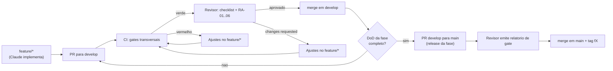

# Framework de Revisão — AlphaCarnes

> **Status:** Vigente
> Define como cada entrega do AlphaCarnes é revisada, aprovada e integrada. Complementa [`roadmap-canonico.md`](roadmap-canonico.md) (o que entregar) e [`quality-gates.md`](quality-gates.md) (critérios objetivos).

## 1. Papéis

### Revisor / Quality Owner
- Define e mantém os quality gates e o roadmap canônico.
- Revisa todo PR contra os gates transversais e a DoD da fase.
- Tem **autoridade de merge**: aprova e integra PRs (`develop` e `main`) quando o gate é atendido; bloqueia quando não é.
- Emite o **relatório de gate** ao fechar cada fase (PR `develop -> main`).
- Não implementa as features das fases; atua na revisão, nos gates e na integração.

### Implementador (Claude)
- Implementa cada fase/sub-gate em branch `feature/*`.
- Abre PR para `develop` com o checklist de PR preenchido e evidências de teste.
- Trata os comentários de revisão até o PR ficar verde.
- Não faz merge dos próprios PRs.

## 2. Estratégia de branches

| Branch | Propósito | Quem escreve | Proteção |
|--------|-----------|--------------|----------|
| `main` | Releases de fase estáveis | Só via PR `develop -> main` | PR + 1 approval do revisor + checks obrigatórios |
| `develop` | Integração contínua das entregas | Só via PR `feature/* -> develop` | PR + 1 approval do revisor + checks obrigatórios |
| `feature/<fase>-<slug>` | Trabalho de uma fase/sub-gate | Implementador | — |

Convenção de nome de branch: `feature/f3-disponibilidade-virtual`, `feature/f4b-pesagem`, `fix/f5-fechamento-bloqueio`.

Nunca há push direto em `develop` ou `main`. Toda mudança passa por PR.

## 3. Fluxo de revisão e merge



- Cada PR para `develop` é um incremento revisável (idealmente um sub-gate ou módulo).
- O **fechamento de fase** é o PR `develop -> main`, mergeado só com DoD 100% e relatório de gate emitido.
- Após merge em `main`, cria-se a tag da fase (ex.: `f3`, `f4a`).

## 4. Definition of Ready (DoR) — antes de abrir o PR

Um item só está pronto para revisão quando:
- A fase/sub-gate está identificada no roadmap canônico e suas dependências (DP) estão satisfeitas.
- O escopo do PR é coeso (um sub-gate ou módulo; evitar PRs gigantes que misturam fases).
- Há testes cobrindo o comportamento novo (não só o caminho feliz).
- O checklist de PR (seção 7) está preenchido, com evidência de teste local.
- Migrations, quando houver, foram geradas via `drizzle-kit` e são reversíveis.

## 5. Definition of Done (DoD) — condição de merge

- Todos os **gates transversais** verdes (ver [`quality-gates.md`](quality-gates.md#gates-transversais)).
- A **DoD específica da fase** atendida e demonstrada por teste (ver [`quality-gates.md`](quality-gates.md#dod-por-fase)).
- Regras arquiteturais **RA-01 a RA-06** respeitadas (ver seção 6).
- Documentação/ADR atualizada quando houve decisão nova.
- Sem comentários de revisão pendentes.

## 6. Verificação das regras arquiteturais (RA-01..RA-06)

Toda revisão de PR confirma explicitamente:

- **RA-01** — Nenhuma regra de negócio no frontend. O front só apresenta e valida formulário; decisões críticas (saldo, bloqueios, associação) vêm do backend.
- **RA-02** — Etapas críticas (associação, fechamento de expedição, faturamento, reserva de disponibilidade) executadas em **transação** no backend e com **auditoria**.
- **RA-03** — Integrações físicas (balança, impressora, leitor QR) implementadas como **gateways/serviços isolados**, nunca como lógica espalhada na UI.
- **RA-04** — Atualizações em tempo real **orientadas a eventos** (evento de domínio publicado após commit, broadcast por WebSocket), sem polling.
- **RA-05** — Falhas de integração **nunca silenciosas**: erro explícito, log estruturado, status de falha; sem `success=true` mascarando erro; sem dados inventados.
- **RA-06** — Toda exceção operacional/fiscal é **observável**: registrada, rastreável e visível em alerta/ocorrência.

## 7. Template — Checklist de revisão de PR

> Usado pelo implementador ao abrir o PR e pelo revisor ao revisar. Reflete-se em `.github/pull_request_template.md` (ver [`ci-spec.md`](ci-spec.md)).

```markdown
## Fase / Sub-gate
- Fase: <F1..F9 / F4a..F4c>
- Dependências (DP) satisfeitas: <sim/quais>

## O que entrega
- <resumo objetivo do incremento>

## Gates transversais
- [ ] lint sem erros
- [ ] type-check (TS strict) sem erros
- [ ] testes unit + integração passando
- [ ] cobertura backend ≥ 80% (linha + branch nos services de domínio)
- [ ] build ok (backend e frontend)
- [ ] npm audit sem vuln high/critical
- [ ] sem segredos commitados
- [ ] migrations via drizzle-kit, reversíveis, sem destrutivo não justificado

## Regras arquiteturais
- [ ] RA-01 sem regra de negócio no frontend
- [ ] RA-02 etapas críticas transacionais + auditadas
- [ ] RA-03 hardware como gateway isolado
- [ ] RA-04 tempo real por eventos
- [ ] RA-05 nenhuma falha de integração silenciosa
- [ ] RA-06 exceções observáveis

## DoD da fase
- [ ] <invariante 1 da fase, com link para o teste que prova>
- [ ] <invariante 2 ...>

## Evidências
- <prints, logs de teste, saída de cobertura, vídeo do fluxo quando aplicável>
```

## 8. Template — Relatório de gate de fase

> Emitido pelo revisor no PR `develop -> main` que fecha a fase. Arquivado no corpo do PR e referenciado na tag.

```markdown
# Relatório de Gate — Fase <Fx>

**Data:** <YYYY-MM-DD>
**Revisor:** <nome>
**PR:** develop -> main (#<n>)
**Tag de release:** <fx>

## Escopo entregue
- <módulos/sub-gates incluídos>

## Gates transversais
- Resultado do CI: <link do run> — <verde/vermelho>
- Cobertura backend: <%> (meta ≥ 80%)
- Audit de dependências: <sem high/critical | pendências>
- Migrations: <reversíveis e aplicadas em ambiente limpo: sim/não>

## DoD da fase (invariantes)
- [<ok/falha>] <invariante 1> — evidência: <link teste>
- [<ok/falha>] <invariante 2> — evidência: <link teste>

## Regras arquiteturais RA-01..RA-06
- <conformidade por regra; exceções justificadas, se houver>

## Riscos e dívidas conhecidas
- <itens aceitos para fase futura, com justificativa>

## Decisão
- [ ] APROVADO — merge em main + tag <fx>
- [ ] REPROVADO — pendências: <lista>
```

## 9. Convenção de commits e PRs

- **Conventional Commits** (já em uso no repositório): `feat:`, `fix:`, `docs:`, `refactor:`, `test:`, `chore:`, `build:`, `ci:`.
- Escopo opcional por domínio/fase: `feat(compras): reserva atômica de disponibilidade`.
- Título do PR no mesmo padrão; corpo com o checklist da seção 7.
- Regras de edição de código do projeto valem na revisão: sem código legado comentado, sem marcadores artificiais, sem fallback inventado, sem `success=true` mascarando erro (alinhado a RA-05).

## 10. Reprovação e retrabalho

- Falha de gate transversal → CI vermelho bloqueia o merge automaticamente; ajuste no `feature/*`.
- Falha de DoD ou de RA-01..06 → revisor marca **changes requested** com comentários objetivos e acionáveis; sem merge até resolver.
- Dívida aceita conscientemente → registrada no relatório de gate (seção 8) com justificativa e fase de resolução; nunca silenciosa.
