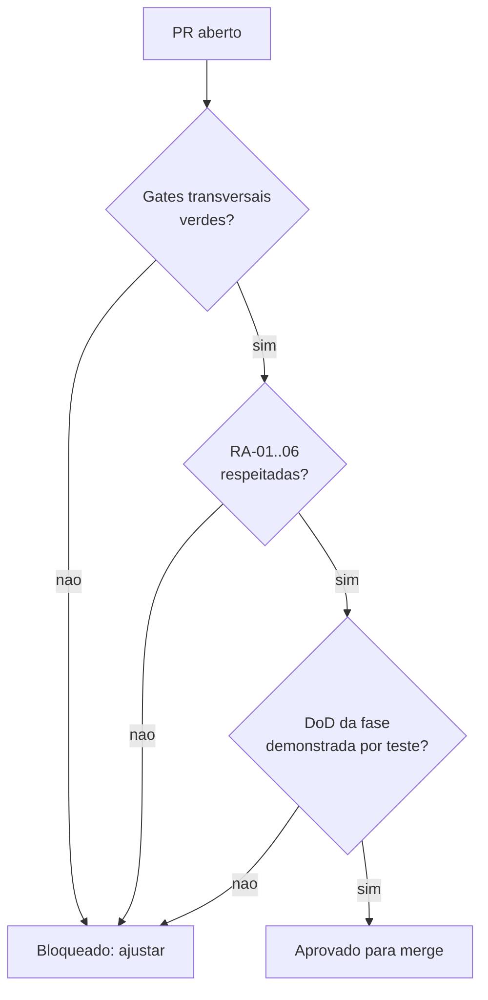

# Quality Gates — AlphaCarnes

> **Status:** Vigente
> Critérios objetivos de qualidade. Os **gates transversais** valem para todo PR; a **DoD por fase** lista os invariantes testáveis de cada fase do [`roadmap-canonico.md`](roadmap-canonico.md). O processo que aplica estes gates está em [`framework-revisao.md`](framework-revisao.md).

## Gates transversais

Condição de merge para **qualquer** PR (`feature/* -> develop` e `develop -> main`). Itens marcados como **CI** são verificados automaticamente pelo pipeline ([`ci-spec.md`](ci-spec.md)); os demais são verificados na revisão.

### Qualidade de código
- **CI** Lint sem erros (backend e frontend).
- **CI** `type-check` com TypeScript strict; zero `any` implícito; sem `@ts-ignore` não justificado.
- **CI** Build de produção ok (backend e frontend).
- Sem código legado comentado, marcadores artificiais ("CORRIGIDO:", "ANTES:"), ou duplicação evitável.
- Funções/arquivos coesos; preferir simplicidade (KISS) e reuso (DRY).

### Testes e cobertura
- **CI** Testes unitários + integração passando.
- **CI** Cobertura **backend ≥ 80%** (linha e branch nos services de domínio).
- **CI** Frontend: smoke test de render e teste dos componentes/fluxos críticos da fase.
- Testes provam o comportamento, não só o caminho feliz: incluem casos de borda e de falha.
- Invariantes de negócio têm teste dedicado que **falha** quando a regra é violada (ex.: tentar furar saldo).

### Segurança
- **CI** `npm audit` sem vulnerabilidades **high** ou **critical** (backend e frontend).
- **CI** Sem segredos commitados (secret scanning).
- Segredos e tokens (ex.: `EISS_CHAVE_AUTENTICACAO`) só via variáveis de ambiente; nunca em código ou logs.
- Entradas validadas/sanitizadas (Zod nas bordas); queries parametrizadas (Drizzle).
- RBAC aplicado nos endpoints críticos; segregação de funções respeitada (doc 013).

### Dados e migrations
- **CI** Migrations geradas via `drizzle-kit` aplicam-se em banco limpo sem erro.
- Migrations reversíveis; sem `DELETE`/`DROP`/`TRUNCATE` destrutivo não justificado.
- Convenções de [`../data/convencoes-schema.md`](../data/convencoes-schema.md): UUID PK, `TIMESTAMPTZ`, `NUMERIC` para dinheiro/peso, status como `TEXT`+CHECK, soft delete `deleted_at`, JSONB com índice GIN quando filtrado.
- Sem `ALTER TABLE` manual; um arquivo de schema Drizzle por domínio.

### Arquitetura (RA-01..RA-06)
- **RA-01** Sem regra de negócio no frontend.
- **RA-02** Etapas críticas transacionais + auditadas no backend.
- **RA-03** Hardware como gateway/serviço isolado.
- **RA-04** Tempo real orientado a eventos (sem polling).
- **RA-05** Nenhuma falha de integração silenciosa (erro explícito, `success=false`, log; nunca dado inventado).
- **RA-06** Exceções operacionais/fiscais observáveis (registro, rastreio, alerta/ocorrência).

### Observabilidade e auditoria
- Operações críticas geram registro de auditoria (quem, quando, o quê; dados anteriores/novos).
- Logs estruturados (JSON) nas operações e integrações; correlação por requisição.
- Erros de integração externa logados com contexto suficiente para diagnóstico.

### Documentação
- ADR criada/atualizada quando há decisão arquitetural nova.
- Documento de domínio/fase atualizado quando o comportamento muda.

## DoD por fase

Cada item abaixo é um **invariante testável**. O PR de fechamento da fase só é aprovado com todos demonstrados por teste (link no relatório de gate).

### F1 — Infra + Auth + RBAC
- Login, refresh e logout funcionais; access token 15 min, refresh token 8 h revogável no banco.
- Os **11 perfis** (doc 013) existem e são aplicados por Guard nos endpoints; acesso negado para perfil incompatível tem teste.
- Seed de usuários/perfis reproduzível.
- Ambiente Docker local sobe `postgres + backend + frontend` em comando único.
- Migration base por domínio (usuários, perfis, refresh tokens, auditoria) aplicada em banco limpo.
- Auditoria base registra login e ações administrativas.

### F2 — Cadastros Base

**Entidades no escopo:** clientes, fornecedores, itens de compra, itens comerciais, regras de desdobramento comercial. Mais: parâmetros do sistema e gestão de usuários/perfis (administração das entidades criadas na F1).

- **CRUD por entidade** (criar, listar com paginação + filtro, detalhar, editar, soft-delete, restaurar), cada rota protegida por **permissão nomeada** via Guard; perfil sem a permissão recebe **403** (teste por entidade). Mapeamento permissão→perfil conforme doc 013.
- **Soft delete** em toda entidade de negócio: nenhuma rota faz DELETE físico; registro `deleted_at` não aparece em listagens padrão nem pode ser referenciado em novos vínculos; restauração só por perfil autorizado (teste).
- **Validação na borda (Zod):** `documentoFiscal` aceita CNPJ **e** CPF com dígito verificador válido e é único por entidade; `codigo*` único. Entrada inválida ou duplicada retorna **400/409 explícito**, sem inventar dados (RA-05; teste cobre inválido e duplicado).
- **Regra de desdobramento** (base que a F3 consome): liga item de compra → item comercial com `fatorQuantidade > 0` e vigência; itens referenciados devem existir e estar ativos; **não** permite duas regras ativas para o mesmo par no mesmo período (teste).
- **JSONB conforme convenção:** preferências de cliente e atributos semiestruturados em JSONB, com índice **GIN** onde houver filtro.
- **Auditoria (RA-02):** toda mutação de cadastro (create/update/delete/restore) gera registro com dados anteriores/novos (teste).
- **DP-01 satisfeita:** existe checagem de prontidão de cadastros mínimos (cliente + fornecedor + item de compra + item comercial + regra de desdobramento ativos) que **falha de forma explícita** quando algo falta — bloqueia o avanço para compra/pedido (teste que falha quando a regra é violada).
- **Frontend:** listagem + formulário (criar/editar) por entidade, com estados de loading e erro; smoke de render + teste do fluxo crítico (criar cliente; CNPJ inválido exibe erro).
- Cobertura backend ≥ 80% (linha e branch) nos services de domínio de cadastros.

### F3 — Planejamento Comercial (Negócio Fase 1)

**Entidades no escopo:** compra programada + itens, disponibilidade virtual do dia, pedido de venda + itens, reservas de saldo. Eventos de domínio + gateway WebSocket.

- **Geração transacional de disponibilidade:** confirmar uma compra programada gera a disponibilidade virtual por item comercial aplicando as **regras de desdobramento** da F2 (item de compra × fator × quantidade comprada), numa única transação. **Idempotente:** confirmar duas vezes não duplica saldo (guard por status). Compra confirmada é imutável (editar item após confirmação **falha**; teste).
- **Saldo nunca negativo (invariante duro):** a reserva é um **UPDATE condicional atômico** (`... SET reservada = reservada + r, disponivel = disponivel - r WHERE id = :id AND disponivel >= r`), com `CHECK (quantidade_disponivel >= 0)` e `CHECK (quantidade_reservada >= 0)` como backstop no schema. **Sem `SELECT` e depois `UPDATE`** (race). 
- **Teste de concorrência (obrigatório):** N reservas paralelas cujo total **excede** o saldo — o teste prova que (a) `quantidade_disponivel` nunca fica negativa, (b) a soma das reservas confirmadas == total gerado, (c) o excedente é tratado (rejeição 409 e/ou `quantidadePendente`), nunca silenciosamente perdido (RA-05).
- **Reserva parcial + alerta:** quando o pedido excede o disponível, reserva o que há (`quantidadeReservada = min(pedida, disponivel)`), marca `quantidadePendente`, e **sinaliza alerta** de pedido sem cobertura (evento + registro observável; RA-06). Item com saldo zero → nova reserva bloqueada/100% pendente.
- **Liberação de reserva:** cancelar pedido/item ou reduzir quantidade **devolve** o saldo à disponibilidade na mesma transação (teste prova que `disponivel` volta ao valor correto).
- **Tempo real (RA-04):** após o **commit** da reserva/liberação, um evento de domínio é publicado e o gateway WebSocket faz broadcast do novo saldo (room `dashboard`/`operacao:{data}`). Sem polling. Teste prova que o evento é emitido **após** o commit com payload correto.
- **Rastreabilidade:** cada reserva é rastreável (pedido → cliente → item comercial → disponibilidade de origem → preferências aplicadas).
- Cobertura backend ≥ 80% (linha e branch) nos services de domínio.

### F4a — Recebimento + Divergências
Primeiro encontro do mundo virtual (F3) com o físico. **Sem balança e sem entidade Peça** (isso é F4b): aqui registra-se quantidade recebida (peso é campo manual opcional, informativo). Invariantes testáveis:

- **Vínculo com o lote do dia:** todo recebimento referencia uma `compra_programada` **confirmada** (lote principal do dia). Iniciar recebimento sobre compra em rascunho/cancelada → **falha explícita** (409). Itens esperados derivam do desdobramento da compra (não digitados à mão).
- **Conferência esperado × recebido:** o sistema apresenta o esperado **antes** do registro do recebido; cada item recebido é apurado contra o esperado. A diferença (falta/sobra/item trocado) é **computada pelo sistema**, não ajustada cegamente pelo operador.
- **Divergência é sempre formal (RA-06):** qualquer diferença gera uma `divergencia_recebimento` com `tipo` (CHECK: quantidade_menor, quantidade_maior, item_divergente, qualidade_divergente, peso_incompativel, item_ausente, item_excedente, inconsistencia_nf_fisico), `descricao`, `impacto`, `acao_imediata`, `responsavel_registro` e `status`. **Não existe ajuste invisível** do esperado nem do recebido (teste prova que alterar quantidade sem ocorrência formal é rejeitado).
- **Encerramento sem pendência silenciosa (invariante duro):** concluir um recebimento com item divergente **sem** tratativa formal registrada → **falha** (409). Teste prova: recebimento com divergência aberta e sem ação → bloqueio; com tratativa registrada → conclusão permitida.
- **Imutabilidade pós-conclusão + idempotência:** recebimento `concluido` é imutável (novo registro/edição de item → 409); concluir duas vezes é idempotente (UPDATE condicional por status, sem efeito duplicado). Teste de concorrência na conclusão (S5-like).
- **Impacto na disponibilidade e pedidos em risco (RA-05/RA-06):** o recebimento atualiza `quantidade_recebida` e `quantidade_com_divergencia` na `disponibilidade_virtual` do dia, na **mesma transação**. Quando `recebido < reservado` de um item, o sistema **lista os pedidos impactados** e emite alerta observável de *pedido em risco* — nunca perde a informação em silêncio. Teste prova a lista de pedidos afetados e o alerta.
- **Ocorrência com fornecedor + histórico:** divergência pode abrir/continuar uma `ocorrencia_fornecedor` com **timeline auditável** (data/hora, usuário, ação, retorno, próximo passo, desfecho). Status com CHECK (aberta, em_analise, aguardando_fornecedor, resolvida). Encerrar ocorrência exige desfecho.
- **Tempo real (RA-04):** após o **commit**, eventos de domínio (`recebimento_iniciado`, `recebimento_registrado`, `divergencia_recebimento_aberta`, `divergencia_recebimento_atualizada`, `ocorrencia_fornecedor_aberta`, `ocorrencia_fornecedor_atualizada`) são publicados e o gateway WS faz broadcast para `dashboard`/`operacao:{data}`. Sem polling. Teste prova emissão **após** o commit e no-emit em rollback.
- **RBAC por permissão nomeada:** `RECEBIMENTO_LER/GERENCIAR`, `DIVERGENCIA_RECEBIMENTO_GERENCIAR`, `OCORRENCIA_FORNECEDOR_GERENCIAR`, mapeadas aos perfis (Operador/receptor, Gestor operacional, Compras, Administrativo; consulta para Faturamento/Comercial). Resolvidas do banco (ADR-008); teste de 403 por permissão ausente.
- **Auditoria transacional antes/depois** em toda mutação (recebimento, item, divergência, ocorrência), dentro da `db.transaction` (padrão F2/F3).
- **Rastreabilidade:** recebimento → compra/lote → fornecedor → NF → item recebido → divergência → ocorrência, consultável e sem buraco.
- **Frontend:** tela de recebimento (esperado × recebido + painel de divergência com classificação obrigatória), painel de disponibilidade refletindo recebido/divergente via WS sem refetch, gating por permissão, estados de loading/erro.
- Cobertura backend ≥ 80% (linha e branch) nos services de domínio.

### F4b — Pesagem + Associação + Etiquetagem
- Peso capturado via **gateway de balança isolado** (RA-03), com leitura estabilizada e fallback manual assistido sem falha silenciosa (RA-05).
- **Modo de captura explícito (ADR-009):** todo registro de peso grava `modo_captura` (`automatico` | `manual_assistido`), `operador_id`, `capturado_em`. **Automático exige `leitura_estavel = true`**; **manual exige `motivo`** (CHECK) + snapshot do `gateway_status`. Teste prova: leitura instável **não** confirma como automático; sem motivo no manual → falha.
- **Indisponibilidade nunca silenciosa (RA-05):** gateway fora do ar vira **status visível + evento/alerta observável**; o sistema **não autopreenche nem inventa peso**. Teste (com **gateway fake**) prova: dispositivo `indisponivel` → captura automática falha explicitamente e o caminho manual fica disponível; nenhum valor default é gravado.
- **Manual é autorizado e auditável:** entrada manual exige permissão `PESO_MANUAL` (perfis `recebimento_pesagem`/`gestor`/`administrador`); sem ela → **403**. Capturas manuais são consultáveis (KPI taxa de manual). Teste de 403 e de marcação de procedência.
- **Gateway por interface (RA-03 + testabilidade):** backend depende de `BalancaGateway`/`LeitorGateway` (interface), nunca do driver; CI usa **fake** que simula `disponivel`/`instavel`/`indisponivel` — o fallback é coberto por teste, não só documentado.
- Peça registrada com peso bruto/líquido e rastreabilidade.
- Associação sugestiva por saldo + preferências + rota; operador confirma ou redireciona.
- **Leitor/QR com mesmo contrato (ADR-009):** leitor indisponível → digitação manual autorizada (`LEITURA_MANUAL`, `modo_captura=manual_assistido`, `motivo`); o código digitado ainda precisa **resolver numa peça/subitem real** — código inválido → erro explícito, sem inventar vínculo.
- Etiqueta com QR impressa via **gateway de impressora isolado**; reimpressão auditada.
- HW mínimo (balança + impressora) operacional como dependência satisfeita.

### F4c — Corte / Transformação
Transforma uma peça em subitens rastreáveis. **Reusa** o contrato de captura/etiqueta do ADR-009 e a associação por unidade da F4b. Invariantes testáveis:

- **Peça original imortal (RF-CT-02/03, RT-007-02):** corte **nunca** apaga/sobrescreve a peça original; ela vira `em_transformacao` → `transformada`, com histórico e peso original preservados. Teste prova que a origem continua consultável após o corte.
- **Elegibilidade (RF-CT-01/23):** só peça em estado elegível (`pesada`/`associada`/`para_corte`) entra em corte; peça já transformada/expedida/faturada → **falha** (409). Peça em transformação não pode ser expedida em paralelo.
- **Contabilidade de unidade (RT-007-06 — sem inconsistência silenciosa):** ao **iniciar** o corte, a unidade que a peça original consumia no pedido é **liberada** atomicamente (`quantidade_atendida − 1` no item de origem), pois a peça deixa de ser unidade expedível. Cada **subitem associado** consome a sua própria unidade no item-alvo via o **UPDATE atômico anti-overbooking da F4b** (bloqueia item completo, 409). Teste prova o saldo antes/depois sem perda nem dupla contagem.
- **Conservação de peso (RF-CT-09/10):** `Σ pesos dos subitens ≤ peso_original`; diferença relevante (perda) exige **justificativa obrigatória + alerta** observável. Concluir com `Σ > original` sem justificativa → **falha**. Teste cobre o caminho com e sem justificativa.
- **Captura de peso do subitem (ADR-009):** cada subitem é pesado pelo mesmo contrato (auto exige leitura estável; manual exige `PESO_MANUAL` + motivo + snapshot; nunca inventa peso).
- **Destino obrigatório no encerramento (RF-CT-24, RT-007-05):** não conclui o corte se algum subitem estiver sem **peso + destino (pedido/sobra/estoque/análise) + etiqueta válida**. Teste: concluir com subitem incompleto → 409.
- **Associação de subitem (RF-CT-11..14):** subitem herda o pedido original quando compatível, ou é redirecionado (reusa a lógica F4b: compatibilidade, preferências do cliente, bloqueio de pedido completo/incompatível/faturado/caminhão fechado); sem compatível → sobra/estoque/análise (exige motivo) ou divergência (reusa F4a).
- **Reetiquetagem (RF-CT-15..18, RF-RT-01..04):** cada subitem válido recebe **etiqueta nova com referência à peça original**; a etiqueta original é **invalidada logicamente para expedição** quando a peça deixa de existir como unidade expedível, mas **coexiste no histórico**. Reimpressão/reetiqueta auditada. Reusa o contrato de impressão best-effort do ADR-009/Refino-1 (impressora down não trava nem perde o QR).
- **Rastreabilidade ponta a ponta (RF-CT-19/20, RT-007-01):** consultável por peça/subitem/pedido/cliente/lote — linha do tempo origem → corte → subitens → novas pesagens → reetiquetas → destino. Teste de consulta da cadeia.
- **Tempo real (RA-04):** eventos pós-commit (`corte_iniciado`, `subitem_gerado`, `subitem_pesado`, `subitem_associado`, `corte_concluido`/`peca_transformada`) com broadcast `dashboard`/`operacao:{data}`; no-emit em rollback.
- **RBAC** `CORTE_GERENCIAR` (perfil `corte` + `gestor`/`administrador`), reusando `PESO_MANUAL`/`LEITURA_MANUAL`/`ETIQUETA_GERENCIAR` onde aplicável; 403 por ausência. **Auditoria transacional** em toda mutação.
- Cobertura backend ≥ 80% (linha **e** branch) nos services de domínio — **priorizar testes de ramo** (o branch global vem caindo: 80,8 → 80,38).

#### Gate F4 completo (`develop → main`)
Emitido apenas com F4a + F4b + F4c concluídas e seus DoD atendidos. É o **primeiro deploy para produção** (F1–F4): operação física fim a fim — recebimento, divergência, pesagem com fallback manual, associação sugestiva, etiqueta e corte rastreável.

**Status:** ✅ Emitido em 2026-06-07 (F4a PR#4, F4b PR#5, F4c PR#6 — todas mergeadas em `develop`, CI verde).

**Dependências herdadas registradas para fases seguintes (vinculantes):**
- **F5 (Expedição):** a invalidação lógica da etiqueta original no corte é representada por `pecas.status_peca = 'transformada'` (a linha em `etiquetas_impressoes` é preservada para histórico — RT-007-04). Portanto a expedição **obrigatoriamente** exclui peças `transformada` da seleção de carga; só subitens com destino válido + etiqueta são expedíveis (RT-007-05). Também: peça `em_transformacao` não pode ser expedida em paralelo (RF-CT-23).
- **Refino futuro (não-bloqueante):** conservação de peso no corte hoje exige justificativa para qualquer diferença ≠ 0; avaliar tolerância configurável por item comercial quando houver dado operacional de aparas.

### F5 — Expedição (Negócio Fase 3)
- Composição de carga por caminhão/rota com conferência por QR; **leitor indisponível → conferência manual autorizada e marcada (ADR-009)**, sem falha silenciosa e sem dispensar a validação do código contra a peça real.
- Status da carga acompanhado em **tempo real** (RA-04).
- Transferência entre pedidos permitida **apenas com expedição aberta**, com auditoria.
- **Fechamento bloqueia alterações:** mutação de peça/pedido após fechamento **falha** — teste prova o bloqueio. Reabertura só por perfil autorizado, auditada.
- DP-05 satisfeita: faturamento só habilita após fechamento.

### F6 — Faturamento + NFS-e (Negócio Fase 5)
- Payload fiscal montado a partir da **carga real** fechada (itens, valores, alíquota).
- Emissão NFS-e em **homologação EISS Osasco** bem-sucedida (`Erro=false`, número gerado); consulta e cancelamento de teste funcionam.
- Falha do EISS tratada com retry/backoff e status explícito (RA-05); sem nota fantasma.
- Payload de request/response EISS auditado em `notas_fiscais.payload_eiss` (JSONB).
- DANFE gerada e armazenada; envio ao motorista por e-mail registrado.
- Liberação do caminhão só com NF válida e checklist (DP-06), com rastreabilidade.

### F7 — Dashboards e Observabilidade (Negócio Fase 6)
- Dashboard operacional em tempo real (recebido vs. vendido vs. expedido) consistente com os dados.
- KPIs (tempo médio de pesagem, taxa de divergência, aproveitamento de carga) calculados corretamente, com teste de cálculo.
- Alertas automáticos (item zerado, divergência crítica, atraso) disparam nas condições corretas.
- Rastreabilidade completa de cada peça (recebimento → entrega) consultável.
- Auditoria de ações críticas consultável por perfil de auditoria.

### F8 — Hardware e Integrações (hardening)
- Monitoramento de status de balança, impressora e leitores QR em tempo real no painel.
- Reconexão/retentativa dos gateways sem perda silenciosa de leitura.
- Leitores QR plenos em conferência e expedição.

### F9 — Estoque e Sobras (Negócio Fase 4)
- Sobras do dia registradas com origem rastreável.
- Congelamento registra impacto de peso/qualidade (RA-06).
- Controle de entradas/saídas de estoque com inventário; relatório de aproveitamento e perdas.

## Como o gate decide

