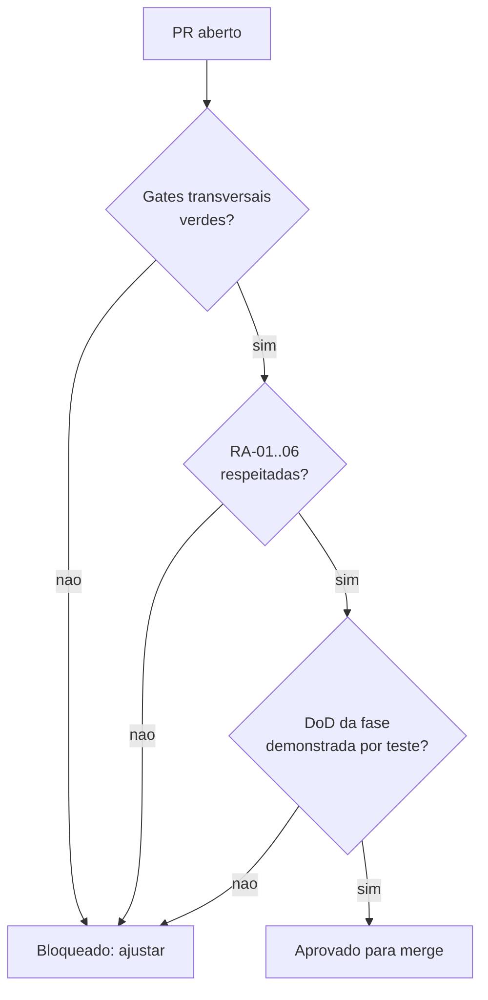

# Quality Gates — AlphaCarnes

> **Status:** Vigente
> Critérios objetivos de qualidade. Os **gates transversais** valem para todo PR; a **DoD por fase** lista os invariantes testáveis de cada fase do [`roadmap-canonico.md`](roadmap-canonico.md). O processo que aplica estes gates está em [`framework-revisao.md`](framework-revisao.md).

## Gates transversais

Condição de merge para **qualquer** PR (`feature/* -> develop` e `develop -> main`). Itens marcados como **CI** são verificados automaticamente pelo pipeline ([`ci-spec.md`](ci-spec.md)); os demais são verificados na revisão.

O deploy Vercel pertence exclusivamente à landing page de apresentação. Seu status é
obrigatório somente quando o diff toca `landing/**`; para os demais PRs, não integra o gate da
aplicação. A aplicação operacional é validada no Docker Desktop local.

### Qualidade de código
- **CI** Lint sem erros (backend e frontend).
- **CI** `type-check` com TypeScript strict; zero `any` implícito; sem `@ts-ignore` não justificado.
- **CI** Build de produção ok (backend, frontend e landing; Vercel permanece exclusivo da landing).
- Sem código legado comentado, marcadores artificiais ("CORRIGIDO:", "ANTES:"), ou duplicação evitável.
- Funções/arquivos coesos; preferir simplicidade (KISS) e reuso (DRY).

### Testes e cobertura
- **CI** Testes unitários + integração passando.
- **CI** Cobertura **backend ≥ 80%** (linha e branch nos services de domínio).
- **CI** Frontend: smoke test de render e teste dos componentes/fluxos críticos da fase.
- Testes provam o comportamento, não só o caminho feliz: incluem casos de borda e de falha.
- Invariantes de negócio têm teste dedicado que **falha** quando a regra é violada (ex.: tentar furar saldo).

### Segurança
- **CI** `npm audit` sem vulnerabilidades **high** ou **critical** (monorepo backend/frontend e pacote independente da landing).
- **CI** Sem segredos commitados (secret scanning).
- Segredos e tokens (ex.: `EISS_CHAVE_AUTENTICACAO`) só via variáveis de ambiente; nunca em código ou logs.
- Entradas validadas/sanitizadas (Zod nas bordas); queries parametrizadas (Drizzle).
- RBAC aplicado nos endpoints críticos; segregação de funções respeitada (doc 013).

### Dados e migrations
- **CI** Migrations geradas via `drizzle-kit` aplicam-se em banco limpo sem erro.
- Migrations reversíveis; sem `DELETE`/`DROP`/`TRUNCATE` destrutivo não justificado.
- Convenções de [`../data/convencoes-schema.md`](../data/convencoes-schema.md): UUID PK, `TIMESTAMPTZ`, `NUMERIC` para dinheiro/peso, status como `TEXT`+CHECK, soft delete `deleted_at`, JSONB com índice GIN quando filtrado.
- Sem `ALTER TABLE` manual; um arquivo de schema Drizzle por domínio.

### Arquitetura (RA-01..RA-06)
- **RA-01** Sem regra de negócio no frontend.
- **RA-02** Etapas críticas transacionais + auditadas no backend.
- **RA-03** Hardware como gateway/serviço isolado.
- **RA-04** Tempo real orientado a eventos (sem polling).
- **RA-05** Nenhuma falha de integração silenciosa (erro explícito, `success=false`, log; nunca dado inventado).
- **RA-06** Exceções operacionais/fiscais observáveis (registro, rastreio, alerta/ocorrência).

### Observabilidade e auditoria
- Operações críticas geram registro de auditoria (quem, quando, o quê; dados anteriores/novos).
- Logs estruturados (JSON) nas operações e integrações; correlação por requisição.
- Erros de integração externa logados com contexto suficiente para diagnóstico.

### Documentação
- ADR criada/atualizada quando há decisão arquitetural nova.
- Documento de domínio/fase atualizado quando o comportamento muda.

## DoD por fase

Cada item abaixo é um **invariante testável**. O PR de fechamento da fase só é aprovado com todos demonstrados por teste (link no relatório de gate).

### F1 — Infra + Auth + RBAC
- Login, refresh e logout funcionais; access token 15 min, refresh token 8 h revogável no banco.
- Os **11 perfis** (doc 013) existem e são aplicados por Guard nos endpoints; acesso negado para perfil incompatível tem teste.
- Seed de usuários/perfis reproduzível.
- Ambiente Docker Desktop local sobe `postgres + backend + frontend` em comando único, com
  portas publicadas no host `4000` (frontend), `4001` (backend) e `15433` (PostgreSQL);
  internamente permanecem `3000`, `3001` e `5432`.
- Migration base por domínio (usuários, perfis, refresh tokens, auditoria) aplicada em banco limpo.
- Auditoria base registra login e ações administrativas.

### F2 — Cadastros Base

**Entidades no escopo:** clientes, fornecedores, itens de compra, itens comerciais, regras de desdobramento comercial. Mais: parâmetros do sistema e gestão de usuários/perfis (administração das entidades criadas na F1).

- **CRUD por entidade** (criar, listar com paginação + filtro, detalhar, editar, soft-delete, restaurar), cada rota protegida por **permissão nomeada** via Guard; perfil sem a permissão recebe **403** (teste por entidade). Mapeamento permissão→perfil conforme doc 013.
- **Soft delete** em toda entidade de negócio: nenhuma rota faz DELETE físico; registro `deleted_at` não aparece em listagens padrão nem pode ser referenciado em novos vínculos; restauração só por perfil autorizado (teste).
- **Validação na borda (Zod):** `documentoFiscal` aceita CNPJ **e** CPF com dígito verificador válido e é único por entidade; `codigo*` único. Entrada inválida ou duplicada retorna **400/409 explícito**, sem inventar dados (RA-05; teste cobre inválido e duplicado).
- **Regra de desdobramento** (base que a F3 consome): liga item de compra → item comercial com `fatorQuantidade > 0` e vigência; itens referenciados devem existir e estar ativos; **não** permite duas regras ativas para o mesmo par no mesmo período (teste).
- **JSONB conforme convenção:** preferências de cliente e atributos semiestruturados em JSONB, com índice **GIN** onde houver filtro.
- **Auditoria (RA-02):** toda mutação de cadastro (create/update/delete/restore) gera registro com dados anteriores/novos (teste).
- **DP-01 satisfeita:** existe checagem de prontidão de cadastros mínimos (cliente + fornecedor + item de compra + item comercial + regra de desdobramento ativos) que **falha de forma explícita** quando algo falta — bloqueia o avanço para compra/pedido (teste que falha quando a regra é violada).
- **Frontend:** listagem + formulário (criar/editar) por entidade, com estados de loading e erro; smoke de render + teste do fluxo crítico (criar cliente; CNPJ inválido exibe erro).
- Cobertura backend ≥ 80% (linha e branch) nos services de domínio de cadastros.

### F3 — Planejamento Comercial (Negócio Fase 1)

**Entidades no escopo:** compra programada + itens, disponibilidade virtual do dia, pedido de venda + itens, reservas de saldo. Eventos de domínio + gateway WebSocket.

- **Geração transacional de disponibilidade:** confirmar uma compra programada gera a disponibilidade virtual por item comercial aplicando as **regras de desdobramento** da F2 (item de compra × fator × quantidade comprada), numa única transação. **Idempotente:** confirmar duas vezes não duplica saldo (guard por status). Compra confirmada é imutável (editar item após confirmação **falha**; teste).
- **Saldo nunca negativo (invariante duro):** os saldos físico e virtual usam baixa condicional atômica, com `CHECK` não negativo como backstop. A parcela sem cobertura é modelada separadamente como `pendencia_overbooking`; nunca se mascara déficit deixando saldo negativo.
- **Confirmação explícita e não bloqueante (AD-05):** a primeira tentativa com déficit retorna `409` com challenge de confirmação e **zero mutação** — nenhum pedido, item, reserva, pendência ou evento é persistido. A repetição no endpoint de confirmação, com challenge válido, reavalia tudo transacionalmente, reserva apenas a parcela real, persiste a parcela excedente tipada e permite confeccionar/finalizar o pedido.
- **Teste de concorrência (obrigatório):** N solicitações paralelas que excedem o saldo provam que (a) nenhum saldo fica negativo, (b) nenhuma parcela coberta é perdida ou vendida duas vezes, (c) challenges não confirmados são idempotentes e não mutam estado e (d) cada confirmação aceita cria pendência distinta, auditável e rastreável ao pedido.
- **Liberação e resolução:** cancelar pedido/item ou reduzir quantidade devolve reservas reais na mesma transação e resolve/recalcula a pendência tipada correspondente, sem apagar o histórico.
- **Tempo real (RA-04):** após o **commit** da reserva/liberação, um evento de domínio é publicado e o gateway WebSocket faz broadcast do novo saldo (room `dashboard`/`operacao:{data}`). Sem polling. Teste prova que o evento é emitido **após** o commit com payload correto.
- **Rastreabilidade:** cada reserva é rastreável (pedido → cliente → item comercial → disponibilidade de origem → preferências aplicadas).
- Cobertura backend ≥ 80% (linha e branch) nos services de domínio.

### F4a — Recebimento + Divergências
Primeiro encontro do mundo virtual (F3) com o físico. **Sem balança e sem entidade Peça** (isso é F4b): aqui registra-se quantidade recebida (peso é campo manual opcional, informativo). Invariantes testáveis:

- **Vínculo com o lote do dia:** todo recebimento referencia uma `compra_programada` **confirmada** (lote principal do dia). Iniciar recebimento sobre compra em rascunho/cancelada → **falha explícita** (409). Itens esperados derivam do desdobramento da compra (não digitados à mão).
- **Conferência esperado × recebido:** o sistema apresenta o esperado **antes** do registro do recebido; cada item recebido é apurado contra o esperado. A diferença (falta/sobra/item trocado) é **computada pelo sistema**, não ajustada cegamente pelo operador.
- **Divergência é sempre formal (RA-06):** qualquer diferença gera uma `divergencia_recebimento` com `tipo` (CHECK: quantidade_menor, quantidade_maior, item_divergente, qualidade_divergente, peso_incompativel, item_ausente, item_excedente, inconsistencia_nf_fisico), `descricao`, `impacto`, `acao_imediata`, `responsavel_registro` e `status`. **Não existe ajuste invisível** do esperado nem do recebido (teste prova que alterar quantidade sem ocorrência formal é rejeitado).
- **Encerramento sem pendência silenciosa (invariante duro):** concluir um recebimento com item divergente **sem** tratativa formal registrada → **falha** (409). Teste prova: recebimento com divergência aberta e sem ação → bloqueio; com tratativa registrada → conclusão permitida.
- **Imutabilidade pós-conclusão + idempotência:** recebimento `concluido` é imutável (novo registro/edição de item → 409); concluir duas vezes é idempotente (UPDATE condicional por status, sem efeito duplicado). Teste de concorrência na conclusão (S5-like).
- **Impacto na disponibilidade e pedidos em risco (RA-05/RA-06):** o recebimento atualiza `quantidade_recebida` e `quantidade_com_divergencia` na `disponibilidade_virtual` do dia, na **mesma transação**. Quando `recebido < reservado` de um item, o sistema **lista os pedidos impactados** e emite alerta observável de *pedido em risco* — nunca perde a informação em silêncio. Teste prova a lista de pedidos afetados e o alerta.
- **Ocorrência com fornecedor + histórico:** divergência pode abrir/continuar uma `ocorrencia_fornecedor` com **timeline auditável** (data/hora, usuário, ação, retorno, próximo passo, desfecho). Status com CHECK (aberta, em_analise, aguardando_fornecedor, resolvida). Encerrar ocorrência exige desfecho.
- **Tempo real (RA-04):** após o **commit**, eventos de domínio (`recebimento_iniciado`, `recebimento_registrado`, `divergencia_recebimento_aberta`, `divergencia_recebimento_atualizada`, `ocorrencia_fornecedor_aberta`, `ocorrencia_fornecedor_atualizada`) são publicados e o gateway WS faz broadcast para `dashboard`/`operacao:{data}`. Sem polling. Teste prova emissão **após** o commit e no-emit em rollback.
- **RBAC por permissão nomeada:** `RECEBIMENTO_LER/GERENCIAR`, `DIVERGENCIA_RECEBIMENTO_GERENCIAR`, `OCORRENCIA_FORNECEDOR_GERENCIAR`, mapeadas aos perfis (Operador/receptor, Gestor operacional, Compras, Administrativo; consulta para Faturamento/Comercial). Resolvidas do banco (ADR-008); teste de 403 por permissão ausente.
- **Auditoria transacional antes/depois** em toda mutação (recebimento, item, divergência, ocorrência), dentro da `db.transaction` (padrão F2/F3).
- **Rastreabilidade:** recebimento → compra/lote → fornecedor → NF → item recebido → divergência → ocorrência, consultável e sem buraco.
- **Frontend:** tela de recebimento (esperado × recebido + painel de divergência com classificação obrigatória), painel de disponibilidade refletindo recebido/divergente via WS sem refetch, gating por permissão, estados de loading/erro.
- Cobertura backend ≥ 80% (linha e branch) nos services de domínio.

### F4b — Pesagem + Associação + Etiquetagem
- Peso capturado via **gateway de balança isolado** (RA-03), com leitura estabilizada e fallback manual assistido sem falha silenciosa (RA-05).
- **Modo de captura explícito (ADR-009):** todo registro de peso grava `modo_captura` (`automatico` | `manual_assistido`), `operador_id`, `capturado_em`. **Automático exige `leitura_estavel = true`**; **manual exige `motivo`** (CHECK) + snapshot do `gateway_status`. Teste prova: leitura instável **não** confirma como automático; sem motivo no manual → falha.
- **Indisponibilidade nunca silenciosa (RA-05):** gateway fora do ar vira **status visível + evento/alerta observável**; o sistema **não autopreenche nem inventa peso**. Teste (com **gateway fake**) prova: dispositivo `indisponivel` → captura automática falha explicitamente e o caminho manual fica disponível; nenhum valor default é gravado.
- **Manual é autorizado e auditável:** entrada manual exige permissão `PESO_MANUAL` (perfis `recebimento_pesagem`/`gestor`/`administrador`); sem ela → **403**. Capturas manuais são consultáveis (KPI taxa de manual). Teste de 403 e de marcação de procedência.
- **Gateway por interface (RA-03 + testabilidade):** backend depende de `BalancaGateway`/`LeitorGateway` (interface), nunca do driver; CI usa **fake** que simula `disponivel`/`instavel`/`indisponivel` — o fallback é coberto por teste, não só documentado.
- Peça registrada com peso bruto/líquido e rastreabilidade.
- Associação sugestiva por saldo + preferências + rota; operador confirma ou redireciona.
- **Leitor/QR com mesmo contrato (ADR-009):** leitor indisponível → digitação manual autorizada (`LEITURA_MANUAL`, `modo_captura=manual_assistido`, `motivo`); o código digitado ainda precisa **resolver numa peça/subitem real** — código inválido → erro explícito, sem inventar vínculo.
- Etiqueta com QR impressa via **gateway de impressora isolado**; reimpressão auditada.
- HW mínimo (balança + impressora) operacional como dependência satisfeita.

### F4c — Corte / Transformação
Transforma uma peça em subitens rastreáveis. **Reusa** o contrato de captura/etiqueta do ADR-009 e a associação por unidade da F4b. Invariantes testáveis:

- **Peça original imortal (RF-CT-02/03, RT-007-02):** corte **nunca** apaga/sobrescreve a peça original; ela vira `em_transformacao` → `transformada`, com histórico e peso original preservados. Teste prova que a origem continua consultável após o corte.
- **Elegibilidade (RF-CT-01/23):** só peça em estado elegível (`pesada`/`associada`/`para_corte`) entra em corte; peça já transformada/expedida/faturada → **falha** (409). Peça em transformação não pode ser expedida em paralelo.
- **Contabilidade de unidade (RT-007-06 — sem inconsistência silenciosa):** ao **iniciar** o corte, a unidade que a peça original consumia no pedido é **liberada** atomicamente (`quantidade_atendida − 1` no item de origem), pois a peça deixa de ser unidade expedível. Cada **subitem associado** consome a sua própria unidade no item-alvo via o **UPDATE atômico anti-overbooking da F4b** (bloqueia item completo, 409). Teste prova o saldo antes/depois sem perda nem dupla contagem.
- **Conservação de peso (RF-CT-09/10):** `Σ pesos dos subitens ≤ peso_original`; diferença relevante (perda) exige **justificativa obrigatória + alerta** observável. Concluir com `Σ > original` sem justificativa → **falha**. Teste cobre o caminho com e sem justificativa.
- **Captura de peso do subitem (ADR-009):** cada subitem é pesado pelo mesmo contrato (auto exige leitura estável; manual exige `PESO_MANUAL` + motivo + snapshot; nunca inventa peso).
- **Destino obrigatório no encerramento (RF-CT-24, RT-007-05):** não conclui o corte se algum subitem estiver sem **peso + destino (pedido/sobra/estoque/análise) + etiqueta válida**. Teste: concluir com subitem incompleto → 409.
- **Associação de subitem (RF-CT-11..14):** subitem herda o pedido original quando compatível, ou é redirecionado (reusa a lógica F4b: compatibilidade, preferências do cliente, bloqueio de pedido completo/incompatível/faturado/caminhão fechado); sem compatível → sobra/estoque/análise (exige motivo) ou divergência (reusa F4a).
- **Reetiquetagem (RF-CT-15..18, RF-RT-01..04):** cada subitem válido recebe **etiqueta nova com referência à peça original**; a etiqueta original é **invalidada logicamente para expedição** quando a peça deixa de existir como unidade expedível, mas **coexiste no histórico**. Reimpressão/reetiqueta auditada. Reusa o contrato de impressão best-effort do ADR-009/Refino-1 (impressora down não trava nem perde o QR).
- **Rastreabilidade ponta a ponta (RF-CT-19/20, RT-007-01):** consultável por peça/subitem/pedido/cliente/lote — linha do tempo origem → corte → subitens → novas pesagens → reetiquetas → destino. Teste de consulta da cadeia.
- **Tempo real (RA-04):** eventos pós-commit (`corte_iniciado`, `subitem_gerado`, `subitem_pesado`, `subitem_associado`, `corte_concluido`/`peca_transformada`) com broadcast `dashboard`/`operacao:{data}`; no-emit em rollback.
- **RBAC** `CORTE_GERENCIAR` (perfil `corte` + `gestor`/`administrador`), reusando `PESO_MANUAL`/`LEITURA_MANUAL`/`ETIQUETA_GERENCIAR` onde aplicável; 403 por ausência. **Auditoria transacional** em toda mutação.
- Cobertura backend ≥ 80% (linha **e** branch) nos services de domínio — **priorizar testes de ramo** (o branch global vem caindo: 80,8 → 80,38).

#### Gate F4 completo (`develop → main`)
Emitido apenas com F4a + F4b + F4c concluídas e seus DoD atendidos. É o **primeiro deploy para produção** (F1–F4): operação física fim a fim — recebimento, divergência, pesagem com fallback manual, associação sugestiva, etiqueta e corte rastreável.

**Status:** ✅ Emitido em 2026-06-07 (F4a PR#4, F4b PR#5, F4c PR#6 — todas mergeadas em `develop`, CI verde).

**Dependências herdadas registradas para fases seguintes (vinculantes):**
- **F5 (Expedição):** a invalidação lógica da etiqueta original no corte é representada por `pecas.status_peca = 'transformada'` (a linha em `etiquetas_impressoes` é preservada para histórico — RT-007-04). Portanto a expedição **obrigatoriamente** exclui peças `transformada` da seleção de carga; só subitens com destino válido + etiqueta são expedíveis (RT-007-05). Também: peça `em_transformacao` não pode ser expedida em paralelo (RF-CT-23).
- **Refino futuro (não-bloqueante):** conservação de peso no corte hoje exige justificativa para qualquer diferença ≠ 0; avaliar tolerância configurável por item comercial quando houver dado operacional de aparas.

### F5 — Expedição (Negócio Fase 3)
Monta a carga física por caminhão e a congela no fechamento. **Reusa** o contrato de captura/QR do ADR-009 (conferência) e a contabilidade de unidade da F4b. Entidades: `caminhoes` (3.21), `caminhoes_pedidos` (3.22), `carga_itens` (3.23), `conferencias_carga` (3.24). Invariantes testáveis:

- **Ciclo do caminhão (RF-EC-01):** status `planejado → aguardando_carga → em_carga → em_conferencia → fechado → liberado_faturamento` (+ `faturado`/`liberado_saida`/`expedido` em F6) como `TEXT`+CHECK, com transições válidas; transição inválida → **falha** (409).
- **Expedição aberta = mutável (RF-EC-02/15):** só caminhão `em_carga`/`em_conferencia` aceita entrada/transferência/remoção de peça. Teste prova mutação permitida aberta e bloqueada fechada.
- **Elegibilidade de carga (dependência F4c):** só peça `associada`+etiquetada ou subitem com destino válido+etiqueta entra na carga; peça `transformada`/`em_transformacao`, `em_sobra`/`em_analise`, divergente bloqueada, ou sem etiqueta → **falha** (RT-007-05). Teste prova a exclusão de `transformada`.
- **Entrada na carga (RF-EC-03/07):** vincular peça/subitem a `carga_itens` atualiza em tempo real o preenchido do pedido no caminhão; um item só pode estar em **uma** carga ativa (índice único parcial). Re-entrada idempotente.
- **Transferência entre pedidos (RF-EC-06/08/09/10):** permitida só com expedição aberta, exige confirmação + motivo, é **auditada** e registra origem/destino/operador/situação (histórico 3.17). Bloqueia quando: caminhão fechado, NF emitida, pedido destino incompatível (item comercial/compra), pedido destino completo, peça bloqueada por divergência → **falha** (409). Saldo atualizado atomicamente (devolve origem / consome destino — reusa `saldo.ts` F4b; anti-overbooking).
- **Conferência (RF-EC-12/13):** conferência por QR reusa ADR-009 (auto lê do leitor; **leitor indisponível → conferência manual autorizada (`LEITURA_MANUAL`) + motivo**, sem falha silenciosa e validando o código contra a peça/subitem real). Previsto × carregado expõe faltas/excedentes; diferença gera alerta observável.
- **Fechamento congela (RF-EC-14/16/17):** `fechar` exige conferência sem pendência crítica (ou autorização explícita auditada); ao fechar, **toda** mutação de carga/peça/transferência subsequente **falha** — teste prova o bloqueio. `fechado` é pré-requisito de faturamento (DP-05): habilita `liberado_faturamento`. Idempotente.
- **Reabertura (RF-EC-18):** excepcional, só por perfil autorizado, **auditada**, e proibida se houver NF emitida.
- **Romaneio:** geração do resumo/romaneio da carga fechada (consulta consolidada previsto×real por pedido/cliente).
- **Tempo real (RA-04):** eventos pós-commit (`carga_item_adicionado`, `carga_item_transferido`, `carga_item_removido`, `conferencia_concluida`, `expedicao_fechada`, `expedicao_reaberta`) com broadcast `dashboard`/`operacao:{data}`; no-emit em rollback.
- **RBAC** `EXPEDICAO_GERENCIAR` (perfil `expedicao` + `gestor`/`administrador`), `EXPEDICAO_REABRIR` restrita (gestor/admin), reuso de `LEITURA_MANUAL`; 403 por ausência. **Auditoria transacional** em toda mutação.
- **Concorrência (obrigatório):** N peças disputando o último saldo de um pedido na transferência → `atendida` nunca excede `pedida`; fechar concorrente com transferência em voo não corrompe a carga.
- Cobertura backend ≥ 80% (linha **e** branch), priorizando ramos de erro.

#### Dependências herdadas (vinculantes)
- A elegibilidade acima **consome** a dependência registrada no gate F4 (exclusão de peças `transformada`/`em_transformacao`).
- DP-05: nenhum caminho de faturamento (F6) pode ser exposto antes de `fechado`.

**Status:** ✅ Concluída em 2026-06-08 (PR#7 mergeada em `develop`, CI verde). Histórico de transferência (`associacoes_peca_historico`) generalizado para subitem (XOR peça/subitem), idempotência de carga por caminhão (item em outra carga ativa → 409) e prova de concorrência da transferência (saldo nunca excede) validados.

**Dependências registradas para a F6 (Faturamento + NFS-e) — vinculantes:**
- A transição `fechado → liberado_faturamento` **não tem endpoint em F5** (não há faturamento ainda). A F6 é dona dessa liberação e **deve gatear a emissão de NF em `fechado`/`liberado_faturamento`** (DP-05); nunca antes.
- `reabrir` tem o ponto de checagem `// TODO F6` para **bloquear reabertura quando houver NF emitida** (RF-EC-08/18). A F6 obrigatoriamente implementa essa verificação antes de permitir reabertura.

### F6 — Faturamento + NFS-e (Negócio Fase 5)

> **Decisão do Quality Owner (subdivisão):** F6 é subdividida em **F6a (Faturamento + Emissão NFS-e)** e **F6b (Seguro + Liberação + Envio ao motorista)**, pelo mesmo critério de revisibilidade aplicado à F4 (a/b/c). Cada subfase tem PR e gate próprios; o gate **F6 completo** só é emitido com F6a + F6b mergeadas e seus DoD atendidos. Roadmap atualizado em `roadmap-canonico.md`.

#### Princípio de integração externa (vinculante — RA-03/RA-05, precedente ADR-009/010)
- A comunicação SOAP com o **EISS Osasco** é encapsulada num **gateway isolado** (porta + adapter), exatamente como ADR-006 prescreve ("serviço isolado").
- **CI não toca o EISS real.** Toda subfase com integração externa entrega um **fake determinístico** (sucesso, `Erro=true` de negócio, timeout, HTTP 500) usado nos testes; o adapter real (`node-soap`) é cabeado só fora de teste. Mesmo padrão para o gateway de **e-mail** (envio ao motorista) e de **seguro**.
- **Proibido nota/seguro/envio fantasma:** nenhuma operação pode gravar sucesso sem confirmação real do gateway. Falha → status explícito de erro + alerta (jamais `Erro=false` simulado).
- O contrato do gateway de NFS-e (porta, fake, retry, consultar-antes-de-retransmitir) deve ser registrado como **ADR-011** quando a abstração for introduzida.

#### F6a — Faturamento + Emissão NFS-e
- **Pré-condição fiscal (RT-008-01, RF-FT-02, RF-NF-01/06, DP-05):** faturamento/emissão só sobre caminhão `fechado`; caminhão não fechado → **falha** (teste prova 409). NF nunca é a causa do fechamento — sempre a consequência.
- **Base = carga real (RT-008-02, RF-NF-06):** a consolidação considera **apenas** `carga_itens` não-removidos do caminhão fechado; item fora da carga / removido não é faturável (teste prova exclusão).
- **Bloqueios críticos impedem emissão (RF-FT-09/10, RF-NF-07):** expedição não fechada, divergência crítica não tratada, dados fiscais do cliente incompletos, peça sem rastreabilidade → emissão bloqueada com **causa + impacto + ação** observáveis (RA-05); cada bloqueio tem teste.
- **Gateway EISS isolado + fake (acima):** `Emitir`/`Cancelar`/`ConsultarNotaCompleta` via porta; fake cobre sucesso, erro de negócio (`Erro=true`), timeout e 500.
- **Emissão não-idempotente tratada (codigos-erro.md):** HTTP 200 com `Erro=true` é falha; em timeout, **consultar antes de retransmitir** (`ConsultarNotaCompleta`) para não duplicar; retry com backoff só para erros retriáveis (timeout/500/indisponível), máx. 3 tentativas → `erro_emissao` + alerta. Teste cobre: sucesso, erro de negócio não-retriável (falha imediata), e timeout→consulta→captura sem retransmitir.
- **Estados e transições de NFS-e (codigos-erro.md):** `pendente → emitida | erro_emissao`; `emitida → cancelada | erro_cancelamento`; `erro_emissao → pendente` (reprocessamento autorizado). Modelados como `TEXT`+CHECK; transição inválida → falha.
- **Persistência fiscal e auditoria (RF-NF-03, ADR-006):** registrar `numero_nfse`, `codigo_verificacao`, `status_nfse`, `tentativas_emissao`, `ultimo_erro_nfse`, `emitida_em`; payload request/response EISS em JSONB (`payload_eiss`). Vínculo rastreável NF ↔ caminhão ↔ pedido ↔ cliente ↔ peça/subitem (RF-NF-07, RF-FT-05).
- **Trava pós-autorização (RF-NF-02) — fecha dependência da F5:** após NF `emitida`, a **reabertura da expedição é bloqueada** (substitui o `// TODO F6` em `FechamentoService.reabrir`) e a destinação de peças/subitens fica imutável. Teste prova reabertura→409 com NF emitida.
- **Reconciliação de nomenclatura:** alinhar o modelo entre `faturamentos` (codigos-erro.md) e `notas_fiscais` (ADR-006) consultando o modelo conceitual (doc 010); decisão única, sem duplicação.
- **RBAC por permissão nomeada:** `FATURAMENTO_LER/GERENCIAR`, `NFSE_EMITIR`, `NFSE_CANCELAR` (cancelamento e reprocessamento como ações segregadas); resolvidas do banco (ADR-008); teste de 403 por permissão ausente.
- **Tempo real (RA-04):** eventos de mudança de status fiscal após commit; sem polling.
- **Cobertura:** ≥80% linha **e** branch; ramos de erro do gateway exercitados.

#### F6b — Seguro + Liberação do caminhão + Envio ao motorista
- **Seguro da carga (RF-SG-01/02/03):** dados gerados a partir da **carga final** (não planejada), vinculados ao caminhão; gateway/registro isolado + fake; se o seguro for obrigatório, **bloqueia a liberação** enquanto pendente (teste prova bloqueio).
- **Liberação do caminhão (RF-LB-01/02/03, DP-06):** só com **todos** os pré-requisitos — expedição fechada, conferência concluída, bloqueios críticos resolvidos, **NF autorizada**, seguro gerado se obrigatório, documentos enviados, checklist final. Falta de qualquer requisito crítico → saída bloqueada (teste por requisito). Liberação **auditada** (usuário, data/hora, status documental no momento).
- **Transição de saída:** `liberado_faturamento → faturado → liberado_saida → expedido` (a cadeia diferida da F5), como `TEXT`+CHECK com transições válidas; reflete em tempo real (RF-LB-04, RA-04).
- **Envio eletrônico ao motorista (RF-MT-01/02/03):** após emissão bem-sucedida; gateway de e-mail isolado + fake; registra **evidência de envio ou falha**; falha de envio gera **alerta operacional** (não passa silenciosa). Reenvio idempotente e auditado.
- **Exceções auditáveis (RF-EX-01/02, RT-008-05):** liberação sob autorização superior / faturamento parcial / reprocessamento manual exigem perfil autorizado + justificativa + registro que **não apaga** o histórico original.
- **Rastreabilidade do faturamento (§14):** o sistema responde "qual NF cobre qual pedido/peça", "quem autorizou a saída", "quais pendências havia antes da liberação", com linha do tempo (fechamento → consolidação → emissão → autorização → seguro → envio → liberação → saída).
- **RBAC por permissão nomeada:** `SEGURO_GERENCIAR`, `LIBERACAO_GERENCIAR`, `EXPEDICAO_EXCECAO_AUTORIZAR` (segregação de funções — quem fatura não necessariamente libera); teste de 403.
- **Cobertura:** ≥80% linha **e** branch; ramos de bloqueio e de falha de envio exercitados.

### F7 — Dashboards e Observabilidade (Negócio Fase 6)
- Dashboard operacional em tempo real (recebido vs. vendido vs. expedido) consistente com os dados.
- KPIs (tempo médio de pesagem, taxa de divergência, aproveitamento de carga) calculados corretamente, com teste de cálculo.
- Alertas automáticos (item zerado, divergência crítica, atraso) disparam nas condições corretas.
- Rastreabilidade completa de cada peça (recebimento → entrega) consultável.
- Auditoria de ações críticas consultável por perfil de auditoria.

### F8 — Hardware e Integrações (hardening)
- Monitoramento de status de balança, impressora e leitores QR em tempo real no painel.
- Reconexão/retentativa dos gateways sem perda silenciosa de leitura.
- Leitores QR plenos em conferência e expedição.

### F9 — Estoque e Sobras (Negócio Fase 4)
- Sobras do dia registradas com origem rastreável.
- Congelamento registra impacto de peso/qualidade (RA-06).
- Controle de entradas/saídas de estoque com inventário; relatório de aproveitamento e perdas.

## DoD do Ciclo v1.1 (ondas — vigente)

> Ondas definidas em [`roadmap-canonico.md`](roadmap-canonico.md#8-ciclo-v11--implementação-completa-do-protótipo-vigente); rito de gates em [`pipeline-execucao.md`](pipeline-execucao.md); princípios em [`constituicao.md`](constituicao.md).

### Gate transversal adicional do Ciclo v1.1 — Fidelidade ao protótipo (Princípio I, NÃO-NEGOCIÁVEL)

Vale para **todo PR com UI**, somado aos gates transversais acima:
- Cada tela do PR referencia no plano tático o arquivo `.tsx` de origem no protótipo (`feature/completude-v1.1`) e é **estruturalmente idêntica** a ele: seções, abas, modais, botões, rótulos, estados visuais, fluxo de navegação.
- Zero cores hex fora dos tokens do DS/paleta do protótipo; fonte única Inter; menu com os 9 grupos, ordem e rótulos do protótipo.
- Terminologia: "Nome Fantasia" / "Buscar cliente"; **zero ocorrências de "Marca"** em UI (teste/grep no gate).
- Pendências abertas (P1–P15 do plano mestre §7) aparecem como parâmetro + badge "Provisório" — nunca regra fixa; badge só sai com AD-xx registrada em [`../execucao/DECISOES.md`](../execucao/DECISOES.md).
- Evidência no PR: screenshot Playwright por tela, comparável lado a lado com a rota equivalente do protótipo. Divergência não autorizada pelo plano = **reprovação**, mesmo que "melhore" a tela.

### Onda 1 — Correção estrutural
- **Operação (D2):** tabela `operacoes` criada; toda tabela de fato referencia `operacao_id` (backfill de `dataOperacao` provado por migration aplicada em banco com dados); todos os writers (`compras_programadas`, `disponibilidades_virtuais`, `pedidos_venda`, `recebimentos`, `caminhoes`, `faturamentos`) gravam a FK; `data_operacao` sai no contract `0014`; geração por cadência **parametrizada** (default seg/qua/sex marcado provisório — P1) idempotente por janela; operação extraordinária criável; teste prova unicidade por data.
- **Overbooking (D1/AD-05):** tentativa de criação/inclusão acima do saldo retorna `409 OVERBOOKING_CONFIRMACAO_NECESSARIA` com payload do modal e **nenhum `INSERT`/`UPDATE`/`DELETE`**, sem mutação em operação, pedido, item, reserva, saldo ou pendência; confirmação explícita retorna `201` na criação ou `200` na inclusão e cria reserva `tipo_consumo='overbooking'` **e** `pendencias_overbooking` na mesma transação (teste prova atomicidade); uma linha ativa por `(pedido, item comercial)` é garantida no banco; o CHECK ≥0 do saldo real **permanece** e overbooking nunca o viola (teste de concorrência: N confirmações paralelas não corrompem o saldo físico/virtual); reduzir/remover/cancelar trata separadamente as parcelas real e overbooking, atualiza/cancela a pendência e nunca credita overbooking no saldo; venda jamais é bloqueada após confirmação.
- **Pedido ao Fornecedor (D3):** recebimento só nasce de `pedido_fornecedor` (iniciar sem ele → 409); NF do fornecedor registrada como entidade com itens; migration preserva pedidos/itens/NFs históricos; acumuladores por produto vêm das peças para itens pesáveis e de `recebimentos_itens.quantidade_recebida` para caixarias/entrada direta (nunca digitados como total de conferência); `Concluir pesagem` transiciona para revisão obrigatória (concluir sem revisão → 409); `conclusoes_conferencia` imutável pós-gravação (update → 409) e `conclusoes_conferencia_nfs` preserva todas as NFs consideradas; divergência usa tipos v1.1 e gera ocorrência vinculada à conclusão e, quando atribuível a uma única nota, à NF, tudo na mesma transação; estados v1.1 §6.10.5 com CHECK.
- **Terminologia (D5):** zero "marca" em UI/rotulagem (grep no CI ou teste dedicado).
- **AGENTS.md / CLAUDE.md (D9):** `AGENTS.md` é canônico; `CLAUDE.md` permanece apenas como
  compatibilidade de contexto, sem "Fase 0 sem código"; ambos apontam para docs_v2 v1.1 e a
  governança vigente.
- Cobertura backend ≥ 80% (linha e branch) nos services tocados.

### Onda 2 — Shell + DS
- Tokens completos da paleta do protótipo centralizados (globals.css/@theme) — **zero hex avulso** nas telas (grep).
- Layout com sidebar em gradiente, menu 9 grupos (ordem/rótulos do protótipo), breadcrumb, colapso por grupo; `visibleGroups` dirigido por RBAC real (não simulador).
- Componentes compartilhados portados: PipelineBar, badge "Provisório" (com `title` citando a pendência), base do modal TrocaPeca, StatusPill/KpiCard/AlertItem alinhados.
- Login fiel ao protótipo (painel de marca + formulário) mantendo o fluxo JWT real.
- Smoke tests de render por componente; screenshot de shell comparado ao protótipo.

### Ondas 3–10 — regra geral
Cada onda tem plano tático próprio (padrão F4c) aprovado no **Portão 1**, cujo "Mapa DoD → teste" é a DoD específica da onda — derivada das linhas correspondentes da [matriz de rastreabilidade](../superpowers/plans/2026-07-22-matriz-rastreabilidade-v1.1.md) e dos invariantes do plano mestre §3–§4. Invariantes mínimos por onda (não exaustivo):
- **O3:** CRUDs completos com RBAC (403 testado por permissão), 11 perfis canônicos com recorte `ESTOQUE_*` conforme AD-04, simuladores de regras funcionais, seed AD-01 sem badge + regras TZ A/B com badge (P12/§16.15), preview de modelo de etiqueta.
- **O4:** adendo com histórico e unicidade de pedido aberto por cliente+produto+operação (AD-03); rascunho sem expiração automática e ação administrativa auditada “Liberar reserva” (AD-06); mapa teatro com estados F/V/R/C/D/O/E/! agregados + drill-down; catálogo MVP correto (nunca o legado da aba Grade); tabela de preços com publicação auditada.
- **O5:** painel de impacto na edição de compra confirmada; fila de pendências de overbooking com decisão em 3 caminhos; comparativo Pedido×NF×Pesagem imutável; SIF com versionamento/retificação (P8).
- **O6:** Troca de Peça atômica preservando pesos e invalidando etiqueta (teste dos 9 passos numa transação); estorno conforme regras doc 04 §3.2; acumuladores em tempo real.
- **O7:** exclusividade de regra por unidade de TZ (teste: alternativa A escolhida bloqueia saídas da B); checklist esperado×registrado; divergência de transformação formal; painel Modo TV via eventos (RA-04).
- **O8:** ajuste com segregação criador≠aprovador e limiar parametrizado; FIFO como sugestão parametrizável (P3).
- **O9:** UI fiel sobre o backend F5 existente; bipagem reusa contrato ADR-009.
- **O10:** adapter EISS real atrás da mesma porta (fake segue no CI — Princípio V); flag RTC; checklist de liberação calculado bloqueando por requisito faltante (teste por requisito); trava de cancelamento pós-liberação.

## Como o gate decide

