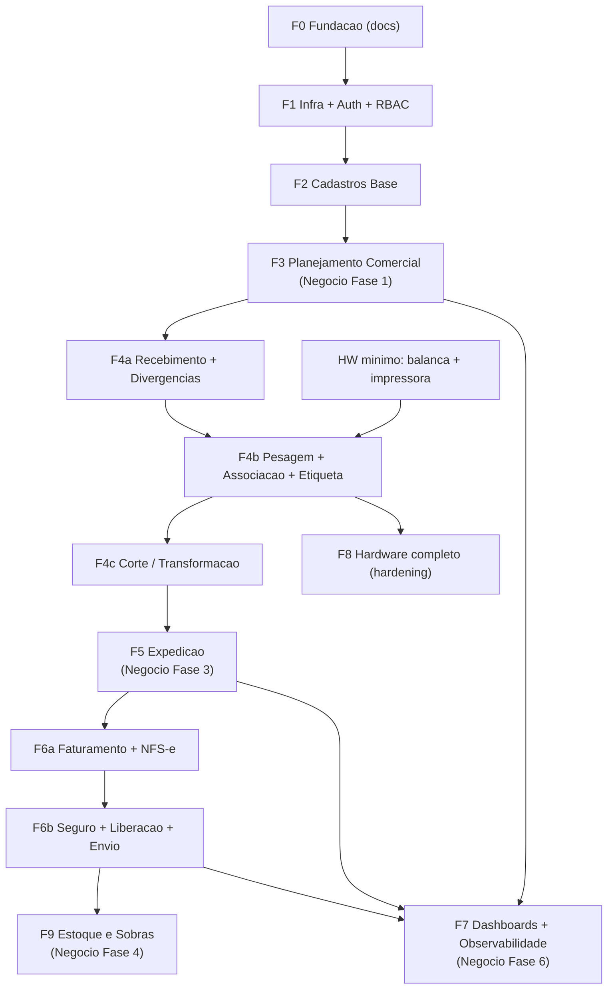
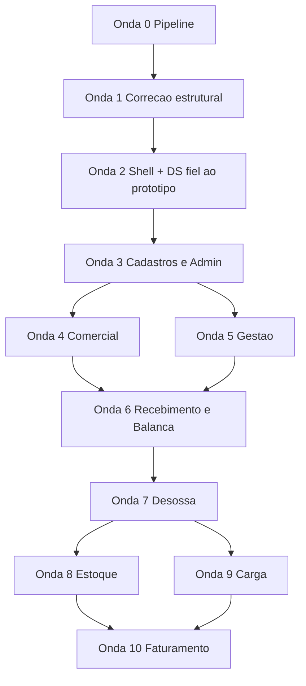

# Roadmap Canônico — AlphaCarnes

> **Status:** Vigente · **Atualizado em 2026-07-23** — adicionado o **Ciclo v1.1** (seção 8), que sucede as fases F1–F6a já concluídas. Subordinado à [`constituicao.md`](constituicao.md): em especial, **toda onda do Ciclo v1.1 entrega telas idênticas ao protótipo validado (Princípio I — NÃO-NEGOCIÁVEL) e features completas, nunca mínimas (Princípio II)**.
> **Fonte de verdade única** para o faseamento de execução e para os gates de revisão.
> Reconcilia o roadmap de engenharia ([`../architecture/roadmap-e2e.md`](../architecture/roadmap-e2e.md), 9 fases) com o roadmap de implantação de negócio ([`../015-roadmap-de-implantacao-fases-riscos-premissas-e-dependencias.md`](../015-roadmap-de-implantacao-fases-riscos-premissas-e-dependencias.md), 6 fases).

## 1. Por que um roadmap canônico

O repositório tinha dois roadmaps com faseamentos diferentes, que não batiam 1:1:

- **Roadmap de engenharia** (9 fases): organiza o trabalho técnico — Infra/Auth separada de Cadastros, de Planejamento Comercial, etc.
- **Roadmap de negócio** (6 fases): organiza a implantação por valor operacional — começa juntando cadastros + compra + disponibilidade + pedidos.

Para revisar fase a fase com gates objetivos, é preciso uma única régua. **A unidade de execução e de gate é a fase de engenharia (Fx).** Cada fase de engenharia carrega os critérios de sucesso de negócio correspondentes do doc 015.

## 2. Mapeamento das fases

| Fase de engenharia | Fase de negócio (doc 015) | Dependências | Critérios de sucesso de negócio |
|--------------------|---------------------------|--------------|---------------------------------|
| **F0 — Fundação (documentação)** | — (pré-fase) | — | Documentação E2E, ADRs, C4, modelo de dados, spec NFS-e (concluída) |
| **F1 — Infra + Auth + RBAC** | — (habilitador técnico) | F0 | Autenticação funcional, 11 perfis aplicados, ambiente local reproduzível |
| **F2 — Cadastros Base** | habilitador da Fase 1 | F1; DP-01 | Cadastros mínimos existem antes de compra/pedido |
| **F3 — Planejamento Comercial** | **Fase 1** | F2; DP-02, DP-03 | Saldos físico e virtual nunca negativos; déficit exige confirmação explícita de overbooking, sem bloquear o pedido confirmado; pedidos e pendências rastreáveis |
| **F4 — Operação Física** | **Fase 2** (+ corte da Fase 4) | F3; DP-04; HW mínimo | Peso capturado; peça registrada; divergência formalizada |
| **F5 — Expedição** | **Fase 3** | F4; DP-05 | Carga acompanhada em tempo real; fechamento bloqueia alterações |
| **F6 — Faturamento + NFS-e** | **Fase 5** | F5; DP-06 | NF emitida a partir da carga real; caminhão liberado com rastreabilidade |
| **F7 — Dashboards e Observabilidade** | **Fase 6** | F3–F6 | KPIs e alertas confiáveis para gestão |
| **F8 — Hardware e Integrações (completo)** | transversal | F4 (mínimo); maturidade em F8 | Monitoramento completo de dispositivos |
| **F9 — Estoque e Sobras** | **Fase 4** (sobras/congelamento) | F4, F5 | Sobras registradas; congelamento com impacto auditado |

## 3. Subdivisão da F4 (Operação Física)

A F4 do roadmap de engenharia concentra muitos módulos num único marco (recebimento, pesagem, associação, corte, etiquetas, divergências). Para que o gate seja verificável e o PR revisável, **a F4 é subdividida em três sub-gates sequenciais**, cada um com seu próprio fechamento parcial em `develop`:

- **F4a — Recebimento + Divergências**
  - Recebimento físico, conferência vs. NF do fornecedor, registro formal de divergência com responsável e ação corretiva.
  - Dependência: F3 concluída (há pedidos e disponibilidade).

- **F4b — Pesagem + Associação Sugestiva + Etiquetagem**
  - Terminal de pesagem touch, integração com o gateway de balança (mínimo viável), associação sugestiva por saldo + preferências + rota, impressão de etiqueta com QR.
  - Dependência: F4a + gateway de balança e impressora no mínimo viável (ver seção 4, tensão C).

- **F4c — Corte / Transformação**
  - Ordem de corte, subitens, nova pesagem, reetiquetagem, rastreabilidade ponta a ponta da transformação.
  - Dependência: F4b.

O gate de fechamento da **F4 completa** (PR `develop -> main`) só é emitido quando F4a, F4b e F4c estão concluídas e seus DoD atendidos.

### Subdivisão de F6 (Faturamento + NFS-e)
Pelo mesmo critério de revisibilidade da F4, a **F6 é subdividida**:

- **F6a — Faturamento + Emissão NFS-e**
  - Consolidação da carga real fechada, bloqueios fiscais, gateway EISS Osasco isolado (+ fake p/ CI), emissão/cancelamento/consulta, estados de NFS-e, retry/consultar-antes-de-retransmitir, trava pós-autorização (fecha a dependência de reabertura da F5).
  - Dependência: F5; DP-05.
- **F6b — Seguro + Liberação do caminhão + Envio ao motorista**
  - Dados do seguro sobre a carga final, liberação com checklist de pré-requisitos (NF autorizada, conferência, seguro se obrigatório, docs enviados), envio eletrônico ao motorista (gateway de e-mail isolado + fake), exceções auditáveis, cadeia de status até `expedido`.
  - Dependência: F6a; DP-06.

O gate **F6 completo** só é emitido quando F6a e F6b estão concluídas e seus DoD atendidos.

## 4. Tensões entre os roadmaps e decisões de reconciliação

### Tensão A — Migrations: "todas as entidades em F1" vs. incremental por domínio
O roadmap de engenharia descreve, em F1, "migrations iniciais com todas as entidades do modelo lógico". Isso conflita com a abordagem incremental (cada fase introduz seus domínios) e com a convenção de um arquivo de schema Drizzle por domínio.

**Decisão:** migration **por fase/domínio** com `drizzle-kit`. A F1 cria apenas o schema das entidades necessárias para Infra/Auth/RBAC (usuários, perfis, sessões/refresh tokens, auditoria base). Cada fase posterior adiciona as migrations dos seus domínios. Nunca `ALTER TABLE` manual; migrations versionadas e reversíveis. Isso mantém o modular monolith coerente e evita schema morto antes da fase que o usa.

### Tensão B — Corte aparece em dois lugares
Corte/Transformação está na F4 (engenharia) e também na Fase 4 (negócio, "corte, transformação e rastreabilidade ampliada").

**Decisão:** o corte fica em **F4c** (sub-gate de Operação Física), porque depende diretamente da pesagem/associação (F4b) e da rastreabilidade da peça. A "rastreabilidade ampliada" da Fase 4 de negócio é o DoD de rastreabilidade ponta a ponta verificado em F4c e reforçado em F7.

### Tensão C — Hardware em F8, mas necessário em F4
O roadmap de engenharia coloca "Hardware e Integrações" em F8, depois de expedição e faturamento. Mas a pesagem (F4b) **não funciona sem balança**, e a etiquetagem **não funciona sem impressora**.

**Decisão:** o **mínimo viável** dos gateways de balança e impressora é puxado como **dependência de F4b** — gateway isolado (RA-03), com leitura estabilizada e fallback manual assistido, sem falha silenciosa (RA-05). A **F8** passa a ser o *hardening* completo: monitoramento de dispositivos em tempo real no painel, leitores QR plenos, resiliência e observabilidade dos gateways. Assim, o invariante "peso capturado" da Fase 2 de negócio é atendido em F4b, e F8 amadurece a operação.

## 5. Dependências de negócio (DP) consolidadas

- **DP-01** — Cadastros mínimos antes de compra/pedido → gate de F2 antes de F3.
- **DP-02** — Compra programada confirmada antes de disponibilidade virtual → interno a F3.
- **DP-03** — Disponibilidade virtual antes de pedidos → interno a F3.
- **DP-04** — Pedidos e planejamento antes de associação sugestiva → gate de F3 antes de F4b.
- **DP-05** — Fechamento de expedição antes de faturamento → gate de F5 antes de F6.
- **DP-06** — Faturamento/NF antes de liberação do caminhão → interno a F6.

## 6. Ordem de execução recomendada

F7 (dashboards/observabilidade) é incremental: começa a receber dados a partir de F3 e amadurece conforme as fases entregam eventos. F8 e F9 podem rodar em paralelo após suas dependências, mas cada uma tem gate próprio.

## 7. Relação com os gates

Cada fase Fx (e os sub-gates F4a/b/c) tem:
- **Gates transversais** — aplicados a todo PR, definidos em [`quality-gates.md`](quality-gates.md#gates-transversais).
- **Definition of Done (DoD) específica** — invariantes testáveis da fase, definidos em [`quality-gates.md`](quality-gates.md#dod-por-fase).

O processo de revisão e merge que aplica esses gates está em [`framework-revisao.md`](framework-revisao.md). Para o Ciclo v1.1 (seção 8), o rito completo — com Portão 1 (gate de plano) e Portão 2 (gate de PR, incluindo a auditoria de fidelidade ao protótipo) — está em [`pipeline-execucao.md`](pipeline-execucao.md).

## 8. Ciclo v1.1 — Implementação completa do protótipo (vigente)

**Status das fases anteriores:** F1, F2, F3, F4a/b/c, F5 e F6a **concluídas** (PRs #1–#8 + absorção do protótipo v2 em `540abea`). F6b, F8 e F9 são absorvidas pelas ondas abaixo (F6b → Onda 10; hardening/estoque → Ondas 8 e seguintes). O escopo, o modelo de dados e os contratos do ciclo estão no [plano mestre](../superpowers/plans/2026-07-22-implementacao-completa-prototipo-v1.1.md); a cobertura tela a tela (39/39 rotas) está na [matriz de rastreabilidade](../superpowers/plans/2026-07-22-matriz-rastreabilidade-v1.1.md).

### Princípios de ordenação (vinculantes)

1. **Fidelidade ao protótipo é o critério de pronto de toda onda com UI.** O protótipo `feature/completude-v1.1` (39 rotas, validado com o usuário) é o contrato visual: cada tela entra idêntica — componentes, layout, fontes, cores, menu, fluxo — e o Portão 2 compara tela a tela contra o `.tsx` correspondente do protótipo antes do merge. Nenhuma onda fecha com tela "aproximada".
2. **Correção estrutural antes de features** (Onda 1): as divergências D1 (overbooking), D2 (entidade Operação) e D3 (Pedido ao Fornecedor) corrigem a fundação sob a qual todas as telas seguintes serão construídas.
3. **Shell/DS antes de qualquer tela** (Onda 2): os tokens e componentes do protótipo são centralizados uma única vez; das Ondas 3–10, nenhuma tela introduz cor/fonte/estrutura fora deles.
4. Completude E2E por onda: uma feature entra com todos os modais/estados/ações do protótipo ou é reescopada para outra onda inteira — nunca entra pela metade (Princípio II).

### Ondas e grafo

| Onda | Escopo | Depende de | DoD |
|---|---|---|---|
| 0 | Pipeline de governança (constituição, gates, skills, workflows, estado vivo) | — | artefatos criados e rito validável |
| 1 | Correção estrutural: `operacoes` (D2), overbooking v1.1 (D1), Pedido ao Fornecedor + conferência tripla (D3), terminologia (D5), CLAUDE.md (D9) | 0 | [quality-gates §Ondas](quality-gates.md) |
| 2 | Shell + DS **fiéis ao protótipo**: Layout/menu 9 grupos, breadcrumb, tokens completos da paleta, componentes compartilhados (PipelineBar, badge Provisório, TrocaPeca base), login fiel | 1 | idem |
| 3 | Cadastros & Regras completos + Admin (Caminhões, Motoristas, Modelos de Etiqueta, Produtos/Fornecedores/Rotas/Representantes fiéis, Regras de Transformação c/ simuladores, Usuários/Perfis 11/Parâmetros/Auditoria) | 2 | idem |
| 4 | Comercial (Clientes, Pedidos c/ adendo+overbooking, Tabela de Preços, Disponibilidade-mapa teatro, Espelho) | 3 | idem |
| 5 | Gestão (Painel Geral, Operações UI, Compras c/ painel de impacto, Pendências Overbooking, Aprovações & Ocorrências, Relatórios SIF) | 3 | idem |
| 6 | Recebimento & Balança (fluxo §6.10 completo, pesagem c/ Troca de Peça e estorno, etiquetas 5 estados) | 4, 5 | idem |
| 7 | Desossa (painel aeroporto/Modo TV, pesagem c/ exclusividade de regra, etiquetas) | 6 | idem |
| 8 | Estoque (consulta FIFO + destinar, entrada de caixarias, ajustes c/ aprovação) | 7 | idem |
| 9 | Carga (planejamento, conferência por bipagem, enviar p/ faturamento) | 7 | idem |
| 10 | Faturamento (adapter EISS real — AD-02 — + flag RTC, Notas/XML, Seguro Manual F6b, Liberação c/ checklist) | 8, 9 | idem |

Estado corrente por onda: [`../execucao/EXECUCAO-STATUS.md`](../execucao/EXECUCAO-STATUS.md). Decisões que fecham pendências: [`../execucao/DECISOES.md`](../execucao/DECISOES.md) (AD-01: boi casado = 2 TZ + 2 DT + 2 PA; AD-02: fiscal = EISS Osasco).
