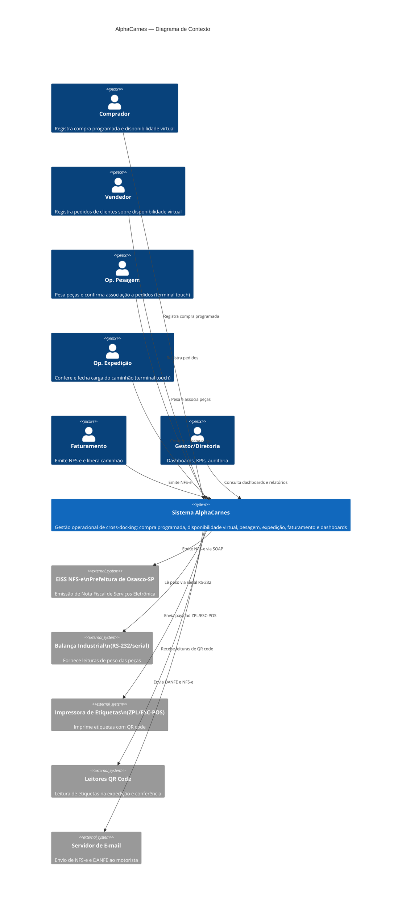
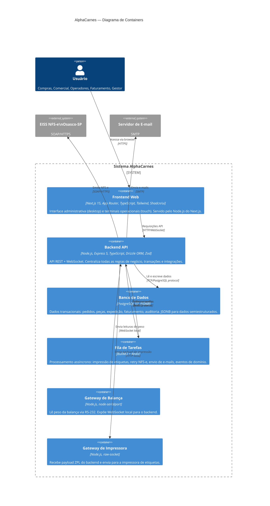

# AlphaCarnes — Plano de Documentação Fase 1

> **For agentic workers:** REQUIRED SUB-SKILL: Use superpowers:subagent-driven-development (recommended) or superpowers:executing-plans to implement this plan task-by-task. Steps use checkbox (`- [ ]`) syntax for tracking.

**Goal:** Produzir toda a documentação arquitetural e de definição do sistema AlphaCarnes antes de escrever qualquer linha de código — roadmap E2E, ADRs, C4, modelo de dados e spec completa do módulo NFS-e.

**Architecture:** Documentação versionada em Git dentro do próprio monorepo (`docs/`), em Markdown. Cada artefato é independente e referenciável. A premissa fundamental **nunca mudar**: quando há escolha entre mínimo e completo, sempre o completo.

**Tech Stack:** Markdown, Mermaid (diagramas), PostgreSQL 17 + JSONB, Next.js 15 (App Router), Node.js/Express 5, Drizzle ORM, Zod 4, TypeScript 5, EISS NFS-e Webservice SOAP (Osasco-SP).

---

## PREMISSA GLOBAL (ler antes de qualquer tarefa)

> **Projeto E2E, não MVP.**
> Esta premissa deve constar em todos os documentos e guiar todas as decisões. Quando existir uma escolha de escopo, a escolha correta é sempre a mais completa, robusta e rastreável. Nenhum atalho de "fase 2 resolve" é aceito no design — o design já contempla a solução completa desde o início.

---

## Estrutura de arquivos que este plano produz

```
docs/
├── superpowers/
│   ├── specs/
│   │   └── 2026-06-04-alphacarnes-system-design.md   (spec geral — já existente do brainstorming)
│   └── plans/
│       └── 2026-06-04-documentacao-fase1.md           (este arquivo)
│
├── architecture/
│   ├── roadmap-e2e.md                  ← Task 1
│   ├── premissas-e-restricoes.md       ← Task 2
│   ├── adr/
│   │   ├── ADR-000-template.md         ← Task 3
│   │   ├── ADR-001-stack-backend.md    ← Task 4
│   │   ├── ADR-002-stack-frontend.md   ← Task 5
│   │   ├── ADR-003-banco-de-dados.md   ← Task 6
│   │   ├── ADR-004-tempo-real.md       ← Task 7
│   │   ├── ADR-005-autenticacao.md     ← Task 8
│   │   └── ADR-006-nfse-integracao.md  ← Task 9
│   └── c4/
│       ├── c4-nivel1-contexto.md       ← Task 10
│       ├── c4-nivel2-container.md      ← Task 11
│       └── c4-nivel3-componente.md     ← Task 12
│
├── data/
│   ├── modelo-conceitual.md            ← Task 13 (expande doc 010)
│   ├── modelo-logico-postgres.md       ← Task 14 (expande doc 011 + JSONB)
│   └── convencoes-schema.md            ← Task 15
│
└── integrações/
    └── nfse-osasco/
        ├── README.md                   ← Task 16
        ├── eiss-webservice.md          ← Task 17
        ├── estrutura-xml.md            ← Task 18
        ├── ambiente-homologacao.md     ← Task 19
        ├── exemplos/
        │   ├── emitir-request.xml      ← Task 20
        │   ├── emitir-response.xml     ← Task 21
        │   ├── cancelar-request.xml    ← Task 22
        │   └── consultar-request.xml   ← Task 23
        └── codigos-erro.md             ← Task 24
```

---

## Task 1 — Roadmap E2E detalhado

**Arquivo:** `docs/architecture/roadmap-e2e.md`

- [ ] **Step 1: Criar o arquivo**

```markdown
# Roadmap E2E — AlphaCarnes

> **Premissa global:** Este é um projeto E2E (end-to-end), não um MVP. Cada fase entrega
> funcionalidade completa e produtiva. Não existe "deixar para fase 2" em decisões de design.

## Fase 0 — Fundação (atual)
**Objetivo:** Documentação completa, decisões arquiteturais, modelo de dados e spec de integrações.
**Entregáveis:**
- Roadmap E2E (este documento)
- ADRs (001–006)
- C4 Nível 1, 2 e 3
- Modelo conceitual e lógico PostgreSQL
- Spec completa do módulo NFS-e (EISS Osasco-SP)

## Fase 1 — Infraestrutura e Autenticação
**Objetivo:** Monorepo scaffolding completo, banco inicializado, autenticação funcionando.
**Entregáveis:**
- `app/backend`: Express 5 + TypeScript + Drizzle ORM + PostgreSQL 17
- `app/frontend`: Next.js 15 App Router + TypeScript + Tailwind CSS + Shadcn/ui
- Autenticação JWT (login, refresh, logout, perfis de acesso)
- RBAC completo: 11 perfis conforme doc 013
- Migrations iniciais com todas as entidades do modelo lógico
- CI básico (lint, type-check, test)
- Ambiente Docker local (postgres + backend + frontend)

## Fase 2 — Cadastros Base
**Objetivo:** CRUD completo de todas as entidades de suporte.
**Módulos:**
- Clientes (CNPJ/CPF, endereços, preferências de peça, histórico)
- Fornecedores (frigoríficos, contatos, avaliação)
- Itens / Partes (dianteiro, central, traseiro, frango, porco, outros)
- Regras de desdobramento (como a compra se quebra em partes)
- Parâmetros do sistema (tolerâncias de peso, limites, configurações)
- Usuários e perfis

## Fase 3 — Planejamento Comercial
**Objetivo:** Compra programada → disponibilidade virtual → pedidos.
**Módulos:**
- Compra Programada (registro, aprovação, desdobramento em partes)
- Disponibilidade Virtual (geração, saldo em tempo real, bloqueio de overbooking)
- Pedidos de Venda (registro por parte, reserva de disponibilidade, preferências)
- Dashboard de saldo virtual em tempo real (WebSocket)
- Alertas: saldo crítico, item zerado, pedido sem cobertura

## Fase 4 — Operação Física
**Objetivo:** Recebimento, pesagem, associação, corte e divergências.
**Módulos:**
- Recebimento físico (conferência vs NF do fornecedor, registro de divergências)
- Terminal de Pesagem (touch-friendly, integração balança RS-232/serial, associação sugestiva)
- Associação de peça a pedido (sugestão por saldo+preferências+rota, confirmação/redirecionamento)
- Corte e Transformação (subitens, nova pesagem, reetiquetagem, rastreabilidade)
- Impressão de Etiquetas (QR code, payload ZPL/ESC-POS, fila, reimpressão auditada)
- Registro de Divergências (formal, com ação corretiva e responsável)

## Fase 5 — Expedição
**Objetivo:** Carregamento de caminhão, conferência e fechamento.
**Módulos:**
- Terminal de Expedição (posicionamento estratégico por rota, conferência QR)
- Gestão de Caminhões/Rotas (ordem de parada, capacidade, atribuição de peças)
- Transferência entre pedidos (enquanto expedição aberta, com auditoria)
- Fechamento de Expedição (bloqueio de alterações, liberação para faturamento)
- Painel Operacional em tempo real (status geral do dia: recebido, pesado, expedido)

## Fase 6 — Faturamento e NFS-e
**Objetivo:** Emissão de NF-e fiscal e liberação do caminhão.
**Módulos:**
- Montagem do payload fiscal (itens, valores, CFOP, CST)
- Integração NFS-e EISS Osasco-SP (emissão unitária, lote, cancelamento, consulta)
- DANFE geração e armazenamento
- Envio ao motorista (e-mail; WhatsApp como fase futura)
- Seguro da carga (geração de protocolo)
- Liberação do caminhão para saída

## Fase 7 — Dashboards e Observabilidade
**Objetivo:** Inteligência operacional completa.
**Módulos:**
- Dashboard operacional em tempo real (cross-docking: recebido vs vendido vs expedido)
- KPIs de desempenho (tempo médio pesagem, taxa de divergência, aproveitamento de carga)
- Dashboard gerencial (volume por cliente, por fornecedor, por item, por período)
- Alertas automáticos (atraso de caminhão, divergência crítica, item zerado)
- Histórico e rastreabilidade completa de cada peça (do recebimento à entrega)
- Ocorrências com fornecedor (registro, acompanhamento, resolução)
- Auditoria de ações críticas (quem fez o quê, quando)

## Fase 8 — Hardware e Integrações
**Objetivo:** Integração completa com dispositivos físicos.
**Módulos:**
- Gateway de Balança (serial RS-232, estabilização, fallback manual, monitoramento)
- Gateway de Impressoras (ZPL/ESC-POS, fila, status, reimpressão)
- Leitores QR (conferência, expedição, rastreabilidade)
- Monitoramento de dispositivos (status em tempo real no painel)

## Fase 9 — Estoque e Sobras
**Objetivo:** Tratamento completo de exceções de estoque.
**Módulos:**
- Registro de sobras (não vendidas no dia)
- Congelamento (com impacto de peso e qualidade registrado)
- Estoque físico (controle de entradas/saídas, inventário)
- Relatórios de aproveitamento e perdas

## Critérios de qualidade transversais (todas as fases)
- Cobertura de testes ≥ 80% no backend (unitários + integração)
- TypeScript strict em todo o código
- Auditoria em todas as operações críticas (quem, quando, o quê)
- Rastreabilidade de peça ponta a ponta
- Sem acoplamento de regras de negócio no frontend
- Todas as integrações com hardware tratadas como serviços/gateways isolados
- Logs estruturados em todas as operações
```

- [ ] **Step 2: Commitar**

```bash
git add docs/architecture/roadmap-e2e.md
git commit -m "docs: roadmap E2E detalhado — 9 fases, premissa completo > mínimo"
```

---

## Task 2 — Premissas e Restrições

**Arquivo:** `docs/architecture/premissas-e-restricoes.md`

- [ ] **Step 1: Criar o arquivo**

```markdown
# Premissas e Restrições — AlphaCarnes

## Premissa Fundamental
**Este projeto é E2E, não MVP.**
Quando existe escolha entre a solução mínima e a solução completa, a solução completa é sempre a escolha correta. Esta premissa é imutável e deve ser lembrada em qualquer decisão de escopo, arquitetura, modelo de dados ou implementação.

## Premissas de Negócio
- A operação é de cross-docking: recebimento e expedição quase simultâneos, baixíssimo estoque.
- Disponibilidade virtual é gerada pela compra programada do dia. Sem compra, sem venda.
- Não existe overbooking comercial: a venda bloqueia disponibilidade imediatamente.
- O pedido é por parte (unidade), não por peso. O peso real só é conhecido na balança.
- Após o fechamento do caminhão, alterações em peças/pedidos são bloqueadas no sistema.
- A divergência entre compra programada, NF do fornecedor e recebimento físico deve ser tratada formalmente.
- Congelamento de sobras é exceção operacional indesejável (impacta peso e qualidade).

## Premissas Técnicas
- Operação on-premises: servidor local na AlphaCarnes, sem dependência de internet no core operacional.
- Terminais de pesagem e expedição são touch-friendly, alto contraste, baixo número de cliques.
- Integrações com hardware (balança, impressora, leitor QR) são serviços/gateways isolados.
- Regras de negócio residem exclusivamente no backend. O frontend não decide nada crítico.
- Toda operação crítica (associação, fechamento, faturamento) é transacional no banco.
- Atualizações em tempo real são orientadas a eventos (WebSocket ou SSE).
- Todas as ações críticas geram registro de auditoria imutável.

## Restrições
- Banco de dados: PostgreSQL 17 com JSONB habilitado. Sem troca de banco.
- NFS-e: Sistema EISS da Prefeitura de Osasco-SP. Integração via SOAP Webservice.
- Faturamento fiscal: NFS-e (nota de serviço). A AlphaCarnes é prestadora de serviços de distribuição.
- Infraestrutura: on-premises. Sem dependência de cloud para operação crítica.
- Stack: Next.js 15 (frontend), Node.js/Express 5 (backend), Drizzle ORM, TypeScript strict.

## Restrições de Qualidade
- TypeScript strict em todo o código (no `any` implícito).
- Cobertura de testes ≥ 80% no backend.
- Sem regras de negócio no frontend (apenas apresentação e validação de formulário).
- Toda integração externa com fallback e logging de falha.
- Sem falhas silenciosas em integrações físicas ou fiscais.
```

- [ ] **Step 2: Commitar**

```bash
git add docs/architecture/premissas-e-restricoes.md
git commit -m "docs: premissas e restrições — premissa E2E formalizada"
```

---

## Task 3 — Template ADR

**Arquivo:** `docs/architecture/adr/ADR-000-template.md`

- [ ] **Step 1: Criar o arquivo**

```markdown
# ADR-NNN — [Título da Decisão]

**Data:** YYYY-MM-DD
**Status:** Proposta | Aceita | Substituída por ADR-NNN | Depreciada
**Decisores:** [nomes ou papéis]

## Contexto
[Descreva o problema ou situação que exige uma decisão. Seja específico sobre as restrições, requisitos e forças em jogo.]

## Decisão
[Descreva a decisão tomada em voz ativa: "Nós vamos usar X porque Y."]

## Consequências

### Positivas
- [o que melhora com esta decisão]

### Negativas / Trade-offs
- [o que piora ou fica mais complexo]

### Riscos
- [riscos conhecidos e como serão mitigados]

## Alternativas Consideradas

### Alternativa A: [nome]
[Descrição + por que foi descartada]

### Alternativa B: [nome]
[Descrição + por que foi descartada]

## Referências
- [links, documentos, benchmarks que embasaram a decisão]
```

- [ ] **Step 2: Commitar**

```bash
git add docs/architecture/adr/ADR-000-template.md
git commit -m "docs: template ADR"
```

---

## Task 4 — ADR-001: Stack Backend

**Arquivo:** `docs/architecture/adr/ADR-001-stack-backend.md`

- [ ] **Step 1: Criar o arquivo**

```markdown
# ADR-001 — Stack Backend: Node.js + Express 5 + TypeScript

**Data:** 2026-06-04
**Status:** Aceita

## Contexto
O backend precisa suportar: API REST para operações transacionais críticas, WebSocket/SSE para tempo real, integração com hardware serial (balança), integração SOAP com EISS NFS-e, e operação on-premises sem cloud. A equipe tem familiaridade com JavaScript/TypeScript.

## Decisão
Usaremos **Node.js LTS (v22+)** com **Express 5** e **TypeScript 5 strict** como stack backend principal.

Bibliotecas complementares:
- **Drizzle ORM** — ORM type-safe para PostgreSQL, suporte nativo a JSONB
- **Zod 4** — validação de schemas em runtime (input/output de APIs)
- **ws** — WebSocket nativo para tempo real
- **node-serialport** — integração com balança RS-232
- **soap** (node-soap) — cliente SOAP para EISS NFS-e
- **bullmq** — filas para processamento assíncrono (impressão, reprocessamento fiscal)
- **pino** — logging estruturado
- **jose** — JWT (autenticação)

## Consequências

### Positivas
- TypeScript strict garante segurança de tipos ponta a ponta
- Express 5 tem suporte nativo a async/await sem wrappers
- Drizzle ORM gera SQL previsível e auditável, com suporte completo a JSONB
- Ecossistema npm maduro para todas as integrações necessárias

### Negativas / Trade-offs
- Node.js é single-threaded: operações CPU-intensas (geração de PDF, XML fiscal) precisam de worker threads ou processos separados
- Express é minimalista: estrutura de projeto precisa ser definida explicitamente (não é opinionado)

### Riscos
- **Integração serial (balança):** node-serialport requer drivers nativos; mitigação: containerizar apenas o app, manter o driver no host OS
- **SOAP legado:** o WSDL do EISS pode mudar; mitigação: versionamento da integração + testes de contrato

## Alternativas Consideradas

### NestJS
Mais opinionado e com DI nativa. Descartado por adicionar complexidade sem benefício real para o tamanho atual do projeto. Express pode ser estruturado adequadamente sem o overhead do NestJS.

### Fastify
Performance superior ao Express. Descartado porque a equipe tem mais familiaridade com Express e a performance do Express 5 é suficiente para o volume previsto (operação local, não SaaS multi-tenant).

## Referências
- Context7: /expressjs/express (v5.2.0)
- Context7: /drizzle-team/drizzle-orm-docs
- Context7: /colinhacks/zod (v4.0.1)
- docs/001-visao-geral-operacao-e-fluxo-macro.md
- docs/012-arquitetura-aplicacional-modulos-servicos-e-integracoes.md (RA-01 a RA-06)
```

- [ ] **Step 2: Commitar**

```bash
git add docs/architecture/adr/ADR-001-stack-backend.md
git commit -m "docs: ADR-001 stack backend — Node.js + Express 5 + TypeScript"
```

---

## Task 5 — ADR-002: Stack Frontend

**Arquivo:** `docs/architecture/adr/ADR-002-stack-frontend.md`

- [ ] **Step 1: Criar o arquivo**

```markdown
# ADR-002 — Stack Frontend: Next.js 15 + TypeScript + Tailwind + Shadcn/ui

**Data:** 2026-06-04
**Status:** Aceita

## Contexto
O sistema tem dois perfis de interface distintos:
1. **Frontend Administrativo:** desktop-first, formulários ricos, dashboards, filtros complexos.
2. **Frontend Operacional (Terminais):** touch-friendly, alto contraste, baixo número de cliques, atualização em tempo real.

Ambos precisam de TypeScript strict, autenticação por perfil e acesso ao backend Express via HTTP/WebSocket.

## Decisão
Usaremos **Next.js 15 App Router** com **TypeScript 5 strict**, **Tailwind CSS 4** e **Shadcn/ui** para ambos os frontends (admin e operacional) dentro do mesmo projeto Next.js, separados por rotas e layouts.

Bibliotecas complementares:
- **Shadcn/ui** — componentes acessíveis e customizáveis sobre Radix UI
- **React Hook Form** + **Zod 4** — formulários com validação type-safe
- **TanStack Query v5** — cache e sincronização de estado servidor
- **Recharts** — gráficos para dashboards
- **Socket.io-client** ou **EventSource** — tempo real nos terminais e painéis

## Consequências

### Positivas
- App Router + React Server Components: carregamento otimizado, dados fetchados no servidor
- Shadcn/ui: componentes acessíveis prontos para os formulários complexos do admin
- Uma única codebase para admin e operacional: componentes compartilhados, autenticação unificada
- TypeScript end-to-end: tipos do backend (Drizzle + Zod) podem ser exportados e usados no frontend

### Negativas / Trade-offs
- App Router tem curva de aprendizado (Server vs Client Components)
- Terminais operacionais touch-friendly precisam de cuidado especial no design (Shadcn/ui não é otimizado para touch por padrão)

### Riscos
- **Terminais em ambiente de fábrica:** conexão instável; mitigação: offline-first para operações críticas de terminal (pesagem armazena localmente e sincroniza)
- **Versão Next.js:** usar sempre a versão estável mais recente e não versões canary

## Alternativas Consideradas

### React + Vite (SPA pura)
Sem SSR. Descartado porque o dashboard administrativo se beneficia de Server Components para queries pesadas, e o App Router oferece estrutura de rotas mais organizada para um sistema complexo.

### Separar admin e operacional em projetos distintos
Mais isolamento, mas duplicação de código e autenticação. Descartado: a complexidade de manter dois projetos frontend não justifica o benefício neste estágio.

## Referências
- Context7: /vercel/next.js (v16.x)
- docs/012-arquitetura-aplicacional-modulos-servicos-e-integracoes.md (seções 3 e 4)
- docs/016-wireframes-fluxos-por-tela.md
```

- [ ] **Step 2: Commitar**

```bash
git add docs/architecture/adr/ADR-002-stack-frontend.md
git commit -m "docs: ADR-002 stack frontend — Next.js 15 App Router + Shadcn/ui"
```

---

## Task 6 — ADR-003: Banco de Dados

**Arquivo:** `docs/architecture/adr/ADR-003-banco-de-dados.md`

- [ ] **Step 1: Criar o arquivo**

```markdown
# ADR-003 — Banco de Dados: PostgreSQL 17 + JSONB

**Data:** 2026-06-04
**Status:** Aceita

## Contexto
O sistema requer: consistência transacional forte (ACID) para operações críticas (associação de peça, fechamento de expedição, faturamento), rastreabilidade de auditoria, suporte a dados semiestruturados (preferências de cliente, parâmetros de peça, payload fiscal), e operação on-premises.

## Decisão
Usaremos **PostgreSQL 17** como banco transacional único com **JSONB habilitado**.

### Uso de JSONB
JSONB será usado para dados que variam por tipo ou têm estrutura flexível:
- `clientes.preferencias` — peso mínimo/máximo, perfil de gordura, preferências por item
- `pecas.atributos` — dados específicos do tipo de corte (ex: peso de osso, rendimento)
- `notas_fiscais.payload_eiss` — XML/JSON da requisição e resposta EISS para auditoria
- `eventos_dominio.payload` — payload de cada evento de domínio
- `auditoria.dados_anteriores` / `auditoria.dados_novos` — snapshot de estado para auditoria

### Campos estruturados permanecem como colunas tipadas
Tudo que tem cardinalidade fixa e é indexado ou filtrado é coluna tipada. JSONB é para extensibilidade, não para substituir o modelo relacional.

### Convenções
- UUIDs v7 como PKs (ordenáveis por tempo)
- `created_at TIMESTAMPTZ DEFAULT now()` em todas as tabelas
- `updated_at TIMESTAMPTZ` com trigger de atualização automática
- Soft delete com `deleted_at TIMESTAMPTZ` (nunca DELETE físico em entidades de negócio)
- Auditoria via tabela `auditoria` com trigger em tabelas críticas

## Consequências

### Positivas
- ACID completo para operações transacionais críticas
- JSONB com índices GIN: queries eficientes em dados semiestruturados
- PostgreSQL 17 tem performance excelente para o volume previsto (operação local)
- Drizzle ORM suporta JSONB nativamente com tipagem TypeScript

### Negativas / Trade-offs
- Banco único = ponto único de falha; mitigação: backup contínuo + réplica de leitura local
- JSONB não tem schema enforcement no banco; mitigação: validação via Zod no backend antes de persistir

### Riscos
- **Performance em queries JSONB sem índice:** mitigação: índices GIN obrigatórios em colunas JSONB que participam de filtros
- **Migração de schema:** mitigação: Drizzle Kit para migrations versionadas, nunca ALTER TABLE manual em produção

## Alternativas Consideradas

### MySQL 8
Suporte a JSON inferior ao PostgreSQL. JSONB do PostgreSQL é indexável com GIN; JSON do MySQL não tem o mesmo nível de suporte. Descartado.

### MongoDB
Sem ACID completo em transações multi-documento até versão recente. Operações de fechamento de expedição e faturamento exigem garantias transacionais fortes. Descartado.

## Referências
- Context7: /websites/postgresql_current
- Context7: /drizzle-team/drizzle-orm-docs (jsonb, migrations)
- docs/010-modelo-de-dados-conceitual-e-entidades-principais-do-sistema.md
- docs/011-modelo-logico-inicial-banco-de-dados-tabelas-e-relacionamentos.md
```

- [ ] **Step 2: Commitar**

```bash
git add docs/architecture/adr/ADR-003-banco-de-dados.md
git commit -m "docs: ADR-003 banco de dados — PostgreSQL 17 + JSONB"
```

---

## Task 7 — ADR-004: Tempo Real

**Arquivo:** `docs/architecture/adr/ADR-004-tempo-real.md`

- [ ] **Step 1: Criar o arquivo**

```markdown
# ADR-004 — Comunicação em Tempo Real: WebSocket + Eventos de Domínio

**Data:** 2026-06-04
**Status:** Aceita

## Contexto
Múltiplas telas precisam de atualização em tempo real sem polling:
- Painel operacional: status de recebimento, pesagem, expedição
- Terminal de pesagem: novas peças chegando, alertas
- Dashboard de saldo virtual: atualização ao vender/reservar
- Tela de expedição: peças associadas, status do caminhão

## Decisão
Usaremos **WebSocket nativo** (`ws` no backend, `WebSocket API` no frontend) com um **barramento de eventos de domínio interno** para propagar mudanças de estado.

### Fluxo
1. Operação transacional ocorre no backend (ex: associar peça a pedido)
2. Após commit, um evento de domínio é publicado no barramento interno (EventEmitter ou BullMQ)
3. O serviço de WebSocket consome o evento e faz broadcast para os clientes conectados relevantes
4. O frontend atualiza o estado local sem refetch completo

### Canais por contexto (rooms)
- `operacao:{data}` — painel operacional do dia
- `caminhao:{id}` — terminais de expedição daquele caminhão
- `pesagem` — terminal de pesagem
- `dashboard` — dashboards gerenciais

## Consequências

### Positivas
- Latência mínima: operadores veem mudanças em < 500ms
- Desacoplamento: o backend emite eventos, não chama diretamente o frontend
- Escalável: canais por contexto evitam broadcast desnecessário

### Negativas / Trade-offs
- WebSocket requer conexão persistente; terminais com Wi-Fi instável precisam de reconexão automática
- Estado do cliente pode ficar desatualizado se mensagem for perdida; mitigação: reconexão faz refetch do estado atual

### Riscos
- **Muitas conexões simultâneas:** para o volume on-premises (< 20 terminais), WebSocket nativo é mais que suficiente. Se escalar para SaaS, revisar para Redis Pub/Sub.

## Alternativas Consideradas

### Server-Sent Events (SSE)
Unidirecional (servidor → cliente). Adequado para dashboards somente leitura, mas não para terminais que também enviam dados. Pode ser usado complementarmente para dashboards.

### Polling
Simples, mas gera carga desnecessária e latência inaceitável para operação de pesagem. Descartado para tempo real.

## Referências
- docs/014-eventos-de-dominio-workflows-assincronos-e-atualizacao-em-tempo-real.md
- docs/009-dashboards-operacionais-kpis-alertas-e-monitoramento-em-tempo-real.md
```

- [ ] **Step 2: Commitar**

```bash
git add docs/architecture/adr/ADR-004-tempo-real.md
git commit -m "docs: ADR-004 tempo real — WebSocket + eventos de domínio"
```

---

## Task 8 — ADR-005: Autenticação

**Arquivo:** `docs/architecture/adr/ADR-005-autenticacao.md`

- [ ] **Step 1: Criar o arquivo**

```markdown
# ADR-005 — Autenticação e Autorização: JWT + RBAC

**Data:** 2026-06-04
**Status:** Aceita

## Contexto
O sistema tem 11 perfis de acesso distintos (conforme doc 013): Administrador, Compras, Comercial, Operador de Pesagem, Operador de Corte, Operador de Expedição, Conferente, Faturamento, Gestor, Diretoria, Auditoria. Cada perfil tem capacidades específicas e algumas ações exigem aprovação de outro perfil (segregação de funções).

## Decisão
Usaremos **JWT (access + refresh token)** com **RBAC (Role-Based Access Control)** implementado no backend.

### Estrutura do JWT
```json
{
  "sub": "uuid-do-usuario",
  "perfil": "operador_pesagem",
  "nome": "João Silva",
  "iat": 1234567890,
  "exp": 1234567890
}
```

### Access token: 15 minutos. Refresh token: 8 horas (turno de trabalho).
### Refresh tokens armazenados no banco (revogáveis).

### RBAC
- Permissões definidas em `docs/013-perfis-acesso-papeis-aprovacoes-e-segregacao-de-funcoes.md`
- Middleware `requirePermissao('FECHAR_EXPEDICAO')` em cada endpoint crítico
- Segregação de funções: ações que exigem dois perfis distintos (ex: aprovar divergência)

## Consequências

### Positivas
- Stateless no access token: backend horizontal se necessário
- Refresh token revogável: logout forçado em caso de comprometimento
- RBAC declarativo: fácil auditar quem pode fazer o quê

### Negativas / Trade-offs
- JWT não revogável imediatamente (access token válido por 15min mesmo após logout)
- Mitigação: access token curto (15min) + refresh token revogável no banco

## Alternativas Consideradas

### Sessão no servidor (session cookie)
Stateful, requer Redis para multi-instância. Mais simples mas acoplado. Descartado em favor de JWT para facilitar futuras integrações mobile/tablet.

### OAuth2 / OpenID Connect
Over-engineering para operação interna. Descartado.

## Referências
- docs/013-perfis-acesso-papeis-aprovacoes-e-segregacao-de-funcoes.md
- Context7: /colinhacks/zod (validação de payload JWT)
```

- [ ] **Step 2: Commitar**

```bash
git add docs/architecture/adr/ADR-005-autenticacao.md
git commit -m "docs: ADR-005 autenticação — JWT + RBAC"
```

---

## Task 9 — ADR-006: Integração NFS-e

**Arquivo:** `docs/architecture/adr/ADR-006-nfse-integracao.md`

- [ ] **Step 1: Criar o arquivo**

```markdown
# ADR-006 — Integração NFS-e: EISS Osasco-SP via SOAP

**Data:** 2026-06-04
**Status:** Aceita

## Contexto
A AlphaCarnes emite NFS-e (Nota Fiscal de Serviços Eletrônica) pela Prefeitura de Osasco-SP.
O sistema municipal usa a plataforma **EISS versão 6.0.15.0** com WebService SOAP.
A integração é obrigatória e não tem alternativa de fornecedor (prefeitura define o sistema).

## Decisão
Implementaremos um **serviço isolado de NFS-e** no backend que encapsula toda a comunicação SOAP com o EISS, expondo uma API REST interna para o módulo de faturamento.

### Endpoints EISS utilizados (produção e homologação)
| Ambiente | URL Base |
|----------|----------|
| Produção | `https://nfe.osasco.sp.gov.br/EissnfeWebServices/NotaFiscalEletronica.svc` |
| Homologação | `https://homolog-nfe.osasco.sp.gov.br/EissnfeWebServices/NotaFiscalEletronica.svc` |
| WSDL Homologação | `https://homolog-nfe.osasco.sp.gov.br/EissnfeWebServices/NotaFiscalEletronica.svc?wsdl` |

### Operações implementadas (fase inicial)
| Método SOAP | Uso |
|------------|-----|
| `Emitir` | Emissão unitária de NFS-e |
| `EmitirEmLote` | Emissão em lote (async) |
| `ConsultarLote` | Polling de resultado do lote |
| `Cancelar` | Cancelamento de NFS-e |
| `ConsultarNotaCompleta` | Consulta completa pós-emissão |

### Estrutura do serviço
```
backend/src/services/nfse/
├── eiss-client.ts          ← cliente SOAP (node-soap)
├── nfse-service.ts         ← orquestração (emitir, cancelar, consultar)
├── payload-builder.ts      ← monta NotaFiscalDTO a partir dos dados do pedido
├── nfse-queue.ts           ← fila BullMQ para reprocessamento
└── types/
    ├── emissao.types.ts    ← tipos TypeScript mapeando o WSDL
    └── cancelamento.types.ts
```

### Autenticação EISS
- Campo `ChaveAutenticacao` em todas as requisições (token de usuário/sistema)
- Campo `Homologacao: boolean` para distinguir ambientes
- Armazenado em variável de ambiente: `EISS_CHAVE_AUTENTICACAO`, `EISS_HOMOLOGACAO=true/false`

### Campos obrigatórios identificados no WSDL (NotaFiscalDTO)
| Campo | Tipo | Descrição |
|-------|------|-----------|
| `Aliquota` | decimal | Alíquota ISS |
| `Homologacao` | boolean | true = homologação |
| `Valor` | decimal | Valor bruto do serviço |
| `ValorDeducao` | decimal | Deduções (pode ser 0) |
| `NotificarTomadorPorEmail` | boolean | Notificar tomador |
| `SubstituicaoTributaria` | boolean | Substituição tributária |
| `Tomador.Nome` | string | Razão social do cliente |
| `Tomador.CNPJ` ou `CPF` | string | Documento do cliente |

### Payload persistido para auditoria
Toda requisição e resposta EISS é armazenada em `notas_fiscais.payload_eiss` (JSONB) com timestamp e status.

## Consequências

### Positivas
- Serviço isolado: falha na NFS-e não impacta o restante da operação
- Fila de reprocessamento: falhas transitórias são retentadas automaticamente
- Auditoria completa: payload completo armazenado em JSONB

### Negativas / Trade-offs
- SOAP é verboso e menos ergonômico que REST; mitigação: node-soap abstrai o XML
- WSDL pode mudar sem aviso; mitigação: versionamento do WSDL local + testes de contrato

### Riscos
- **Instabilidade do EISS:** histórico de prefeituras com sistemas lentos; mitigação: timeout configurável + fila de retry com backoff exponencial
- **Mudança para RTC (Reforma Tributária):** o WSDL já expõe métodos `RTC_EmitirNFE`; a integração deve ser preparada para suportar ambos os modelos de emissão

## Referências
- docs/integrações/nfse-osasco/ (documentação completa — Tasks 16-24)
- docs/008-faturamento-emissao-nf-seguro-bloqueios-fiscais-e-liberacao-do-caminhao.md
- WSDL: https://homolog-nfe.osasco.sp.gov.br/EissnfeWebServices/NotaFiscalEletronica.svc?wsdl
- Portal de manuais: https://nfe.osasco.sp.gov.br/EissnfeWebApp/Portal/Manuais.aspx
- Contato técnico: nf-e@osasco.sp.gov.br
```

- [ ] **Step 2: Commitar**

```bash
git add docs/architecture/adr/ADR-006-nfse-integracao.md
git commit -m "docs: ADR-006 integração NFS-e — EISS Osasco-SP SOAP"
```

---

## Task 10 — C4 Nível 1: Contexto

**Arquivo:** `docs/architecture/c4/c4-nivel1-contexto.md`

- [ ] **Step 1: Criar o arquivo**

```markdown
# C4 Nível 1 — Diagrama de Contexto

## Descrição
Visão de alto nível: quem usa o sistema e com quais sistemas externos ele se comunica.



## Atores

| Ator | Perfil no sistema | Uso principal |
|------|------------------|---------------|
| Comprador | `compras` | Compra Programada, Disponibilidade Virtual |
| Vendedor | `comercial` | Pedidos de Venda |
| Operador de Pesagem | `operador_pesagem` | Terminal de Pesagem |
| Operador de Corte | `operador_corte` | Corte e Transformação |
| Operador de Expedição | `operador_expedicao` | Terminal de Expedição |
| Conferente | `conferente` | Conferência de carga |
| Faturamento | `faturamento` | Emissão NFS-e |
| Gestor | `gestor` | Dashboards, aprovações |
| Diretoria | `diretoria` | Relatórios executivos |
| Administrador | `administrador` | Cadastros, configurações |
| Auditoria | `auditoria` | Consulta de auditoria |

## Sistemas Externos

| Sistema | Protocolo | Criticidade |
|---------|-----------|-------------|
| EISS NFS-e (Osasco-SP) | SOAP/HTTPS | Alta — bloqueante para liberar caminhão |
| Balança Industrial | RS-232 serial | Alta — bloqueante para pesagem |
| Impressora de Etiquetas | ZPL/ESC-POS (TCP ou USB) | Alta — necessária para rastreabilidade |
| Leitores QR Code | USB HID / TCP | Média — expedição pode funcionar sem |
| Servidor de E-mail | SMTP | Baixa — envio assíncrono ao motorista |
```

- [ ] **Step 2: Commitar**

```bash
git add docs/architecture/c4/c4-nivel1-contexto.md
git commit -m "docs: C4 Nível 1 — diagrama de contexto"
```

---

## Task 11 — C4 Nível 2: Container

**Arquivo:** `docs/architecture/c4/c4-nivel2-container.md`

- [ ] **Step 1: Criar o arquivo**

```markdown
# C4 Nível 2 — Diagrama de Containers



## Responsabilidades por Container

### Frontend Web (`app/frontend`)
- Renderização de páginas (Server Components para queries, Client Components para interatividade)
- Autenticação (cookie seguro com JWT)
- Layout administrativo (sidebar, filtros, tabelas, formulários)
- Layout operacional (tela cheia, touch-friendly, alto contraste)
- Conexão WebSocket para atualizações em tempo real

### Backend API (`app/backend`)
- Todas as regras de negócio
- API REST por domínio (`/api/compras`, `/api/pedidos`, `/api/pesagem`, etc.)
- WebSocket server para tempo real
- Integração EISS NFS-e (encapsulada em serviço isolado)
- Integração com gateways de balança e impressora
- Auditoria automática via middleware

### PostgreSQL
- Dados transacionais com ACID
- JSONB para preferências, atributos de peça, payload fiscal
- Auditoria via tabela de log + triggers

### BullMQ + Redis
- Filas: impressão de etiquetas, retry NFS-e, envio e-mail, propagação de eventos
- Jobs recorrentes: limpeza de tokens expirados, relatórios diários

### Gateway de Balança
- Processo separado no servidor on-premises
- Lê serial RS-232 da balança industrial
- Estabiliza leitura (descarta leituras instáveis)
- Expõe WebSocket local para o backend consumir

### Gateway de Impressora
- Processo separado (pode ser o mesmo servidor)
- Recebe payload ZPL/ESC-POS do backend
- Envia para impressora via TCP (porta 9100) ou USB
- Gerencia fila de impressão e confirma sucesso
```

- [ ] **Step 2: Commitar**

```bash
git add docs/architecture/c4/c4-nivel2-container.md
git commit -m "docs: C4 Nível 2 — diagrama de containers"
```

---

## Task 12 — C4 Nível 3: Componentes do Backend

**Arquivo:** `docs/architecture/c4/c4-nivel3-componente.md`

- [ ] **Step 1: Criar o arquivo**

```markdown
# C4 Nível 3 — Componentes do Backend

```mermaid
C4Component
    title AlphaCarnes — Componentes do Backend API

    Container_Boundary(backend, "Backend API — Express 5") {
        Component(router_compras, "Router: Compras", "Express Router", "CRUD de compra programada e desdobramento em disponibilidade virtual")
        Component(router_pedidos, "Router: Pedidos", "Express Router", "Registro de pedidos, reserva de disponibilidade, preferências")
        Component(router_pesagem, "Router: Pesagem", "Express Router", "Receber peso, sugerir associação, confirmar/redirecionar peça")
        Component(router_expedicao, "Router: Expedição", "Express Router", "Posicionar peça no caminhão, transferir, fechar expedição")
        Component(router_faturamento, "Router: Faturamento", "Express Router", "Montar payload fiscal, emitir NFS-e, liberar caminhão")
        Component(router_cadastros, "Router: Cadastros", "Express Router", "Clientes, fornecedores, itens, usuários, parâmetros")
        Component(router_dashboards, "Router: Dashboards", "Express Router", "KPIs, alertas, histórico operacional")

        Component(svc_disponibilidade, "Service: Disponibilidade", "TypeScript", "Lógica de saldo virtual, reserva, overbooking, zeramento")
        Component(svc_associacao, "Service: Associação Sugestiva", "TypeScript", "Algoritmo de sugestão: saldo + preferências + rota + planejamento")
        Component(svc_rastreabilidade, "Service: Rastreabilidade", "TypeScript", "Registro de eventos de cada peça do recebimento à entrega")
        Component(svc_nfse, "Service: NFS-e", "TypeScript, node-soap", "Encapsula toda comunicação SOAP com EISS Osasco-SP")
        Component(svc_impressao, "Service: Impressão", "TypeScript", "Gera payload ZPL, enfileira, confirma impressão")
        Component(svc_eventos, "Service: Eventos de Domínio", "TypeScript, BullMQ", "Publica e consome eventos; propaga para WebSocket")
        Component(svc_auditoria, "Service: Auditoria", "TypeScript", "Middleware que registra todas as operações críticas")

        Component(ws_server, "WebSocket Server", "ws library", "Gerencia conexões, salas por contexto, broadcast de eventos")
        Component(auth_middleware, "Auth Middleware", "JWT, jose", "Valida token, injeta usuário e perfil no request")
        Component(rbac_middleware, "RBAC Middleware", "TypeScript", "Verifica permissão por perfil para cada endpoint")

        Component(db_layer, "Drizzle ORM Layer", "Drizzle ORM, PostgreSQL", "Schemas tipados, queries, transactions, migrations")
    }

    Rel(router_compras, svc_disponibilidade, "Gera disponibilidade virtual após registrar compra")
    Rel(router_pedidos, svc_disponibilidade, "Reserva disponibilidade ao confirmar pedido")
    Rel(router_pesagem, svc_associacao, "Solicita sugestão de associação")
    Rel(router_pesagem, svc_rastreabilidade, "Registra evento de pesagem")
    Rel(router_expedicao, svc_rastreabilidade, "Registra evento de expedição")
    Rel(router_faturamento, svc_nfse, "Emite NFS-e")
    Rel(router_faturamento, svc_impressao, "Imprime etiqueta de saída")
    Rel(svc_nfse, svc_eventos, "Publica evento: nfse_emitida")
    Rel(svc_eventos, ws_server, "Propaga eventos para clientes WebSocket")
    Rel(svc_auditoria, db_layer, "Persiste log de auditoria")
```



## Estrutura de diretórios do backend

```
app/backend/src/
├── routes/
│   ├── compras.routes.ts
│   ├── pedidos.routes.ts
│   ├── pesagem.routes.ts
│   ├── expedicao.routes.ts
│   ├── faturamento.routes.ts
│   ├── cadastros.routes.ts
│   └── dashboards.routes.ts
│
├── services/
│   ├── disponibilidade.service.ts
│   ├── associacao-sugestiva.service.ts
│   ├── rastreabilidade.service.ts
│   ├── nfse/
│   │   ├── eiss-client.ts
│   │   ├── nfse.service.ts
│   │   ├── payload-builder.ts
│   │   └── nfse-queue.ts
│   ├── impressao.service.ts
│   └── eventos.service.ts
│
├── middleware/
│   ├── auth.middleware.ts
│   ├── rbac.middleware.ts
│   └── auditoria.middleware.ts
│
├── db/
│   ├── schema/
│   │   ├── cadastros.schema.ts
│   │   ├── compras.schema.ts
│   │   ├── pedidos.schema.ts
│   │   ├── operacao.schema.ts
│   │   ├── expedicao.schema.ts
│   │   ├── fiscal.schema.ts
│   │   └── auditoria.schema.ts
│   ├── migrations/
│   └── index.ts
│
├── websocket/
│   └── ws-server.ts
│
├── queues/
│   └── workers/
│
└── app.ts
```
```

- [ ] **Step 2: Commitar**

```bash
git add docs/architecture/c4/c4-nivel3-componente.md
git commit -m "docs: C4 Nível 3 — componentes do backend"
```

---

## Task 13 — Modelo Conceitual

**Arquivo:** `docs/data/modelo-conceitual.md`

- [ ] **Step 1: Criar o arquivo** com as 31 entidades do doc 010, organizadas por domínio, com diagrama Mermaid e descrição de cada entidade, seus atributos principais, e relacionamentos.

Estrutura do arquivo:

```markdown
# Modelo de Dados Conceitual — AlphaCarnes

> Expande e formaliza o doc 010. Serve como referência para o modelo lógico (Task 14).

## Domínios de Negócio

### 1. Cadastro Base
Entidades: Cliente, Fornecedor, Item, RegraDesdobramento, Parametro, Usuario, Perfil

### 2. Planejamento Comercial
Entidades: CompraProgramada, DisponibilidadeVirtual, PedidoVenda, ItemPedido, ReservaDisponibilidade

### 3. Operação Física
Entidades: Recebimento, ItemRecebido, Divergencia, Peca, Pesagem

### 4. Transformação
Entidades: OrdemCorte, SubItem, Reetiquetagem

### 5. Expedição
Entidades: Caminhao, Rota, PecaCaminhao, FechamentoExpedicao

### 6. Fiscal / Documental
Entidades: NotaFiscal, ItemNotaFiscal, SeguroCarga, EnvioDocumento

### 7. Observabilidade
Entidades: EventoDominio, Auditoria, Alerta, Ocorrencia

## Diagrama Entidade-Relacionamento (conceitual)

[diagrama Mermaid erDiagram com todas as 31 entidades e seus relacionamentos principais]

## Descrição das Entidades

[Para cada entidade: propósito, atributos principais, relacionamentos, invariantes de negócio]
```

- [ ] **Step 2: Escrever o conteúdo completo** de todas as 31 entidades com diagrama ER Mermaid, atributos e invariantes (baseado em docs 010 e 011).

- [ ] **Step 3: Commitar**

```bash
git add docs/data/modelo-conceitual.md
git commit -m "docs: modelo conceitual — 31 entidades, 7 domínios, diagrama ER"
```

---

## Task 14 — Modelo Lógico PostgreSQL

**Arquivo:** `docs/data/modelo-logico-postgres.md`

- [ ] **Step 1: Criar o arquivo** com o DDL SQL completo para todas as tabelas, seguindo:
  - UUIDs v7 como PKs
  - `created_at TIMESTAMPTZ DEFAULT now()` em todas as tabelas
  - `updated_at TIMESTAMPTZ` com trigger
  - Soft delete `deleted_at TIMESTAMPTZ`
  - Colunas JSONB identificadas na ADR-003
  - Índices obrigatórios (incluindo GIN para JSONB)
  - Foreign keys com ON DELETE adequado por entidade

Exemplo de como devem estar as tabelas críticas:

```sql
-- Exemplo: tabela pecas
CREATE TABLE pecas (
  id           UUID PRIMARY KEY DEFAULT gen_random_uuid(),
  numero       SERIAL UNIQUE NOT NULL,
  pedido_id    UUID REFERENCES pedidos(id),
  item_id      UUID NOT NULL REFERENCES itens(id),
  peso_bruto   NUMERIC(10,3),
  peso_liquido NUMERIC(10,3),
  status       TEXT NOT NULL DEFAULT 'pendente',
  -- CHECK constraint nos status válidos
  CONSTRAINT pecas_status_valido CHECK (status IN (
    'pendente','pesada','associada','em_corte','expedida','cancelada'
  )),
  atributos    JSONB DEFAULT '{}',  -- dados semiestruturados do corte
  created_at   TIMESTAMPTZ NOT NULL DEFAULT now(),
  updated_at   TIMESTAMPTZ NOT NULL DEFAULT now(),
  deleted_at   TIMESTAMPTZ
);
CREATE INDEX idx_pecas_pedido ON pecas(pedido_id);
CREATE INDEX idx_pecas_status ON pecas(status) WHERE deleted_at IS NULL;
CREATE INDEX idx_pecas_atributos ON pecas USING GIN(atributos);
```

- [ ] **Step 2: Incluir todas as tabelas** dos 7 domínios com DDL completo.

- [ ] **Step 3: Incluir seção de triggers** (updated_at automático, auditoria).

- [ ] **Step 4: Commitar**

```bash
git add docs/data/modelo-logico-postgres.md
git commit -m "docs: modelo lógico PostgreSQL — DDL completo, JSONB, índices, triggers"
```

---

## Task 15 — Convenções de Schema

**Arquivo:** `docs/data/convencoes-schema.md`

- [ ] **Step 1: Criar o arquivo**

```markdown
# Convenções de Schema — AlphaCarnes

## Nomenclatura
- Tabelas: `snake_case` plural (ex: `pedidos_venda`, `disponibilidades_virtuais`)
- Colunas: `snake_case` (ex: `created_at`, `pedido_id`)
- PKs: sempre `id UUID`
- FKs: `{entidade_referenciada}_id` (ex: `pedido_id`, `cliente_id`)
- Índices: `idx_{tabela}_{coluna(s)}`
- Constraints: `{tabela}_{descricao}_{tipo}` (ex: `pecas_status_valido_check`)

## Tipos de dado obrigatórios por categoria
- PKs: `UUID DEFAULT gen_random_uuid()`
- Datas/horas: sempre `TIMESTAMPTZ` (com timezone)
- Valores monetários: `NUMERIC(15,2)` — nunca FLOAT
- Pesos: `NUMERIC(10,3)` — 3 casas decimais (gramas como unidade mínima)
- Alíquotas/percentuais: `NUMERIC(5,4)` (ex: 0.0500 = 5%)
- Textos curtos: `VARCHAR(n)` com limite explícito
- Textos longos/livres: `TEXT`
- Flags: `BOOLEAN NOT NULL DEFAULT false`
- Status/enums: `TEXT` com CHECK constraint (não usar pg ENUM — difícil de migrar)
- Dados semiestruturados: `JSONB DEFAULT '{}'`

## Colunas obrigatórias em todas as tabelas de negócio
```sql
created_at   TIMESTAMPTZ NOT NULL DEFAULT now()
updated_at   TIMESTAMPTZ NOT NULL DEFAULT now()  -- atualizado por trigger
deleted_at   TIMESTAMPTZ  -- NULL = ativo; NOT NULL = soft deleted
```

## Regras de soft delete
- Nunca DELETE físico em entidades de negócio
- Todas as queries filtram `WHERE deleted_at IS NULL`
- Índices parciais com `WHERE deleted_at IS NULL`
- Apenas dados de sessão/cache podem ser deletados fisicamente

## Auditoria
Tabelas críticas têm trigger que registra em `auditoria`:
- `compras_programadas`, `pedidos_venda`, `disponibilidades_virtuais`
- `pecas`, `pesagens`, `associacoes`
- `expedicoes`, `fechamentos_expedicao`
- `notas_fiscais`

## Drizzle ORM — convenções de schema TypeScript
- Um arquivo de schema por domínio em `backend/src/db/schema/`
- Tipos inferidos com `$inferSelect` e `$inferInsert`
- Relações declaradas com `relations()` do Drizzle
- Migrations geradas com `drizzle-kit generate`; nunca ALTER TABLE manual em produção
```

- [ ] **Step 2: Commitar**

```bash
git add docs/data/convencoes-schema.md
git commit -m "docs: convenções de schema PostgreSQL e Drizzle ORM"
```

---

## Task 16 — NFS-e README

**Arquivo:** `docs/integrações/nfse-osasco/README.md`

- [ ] **Step 1: Criar o arquivo**

```markdown
# NFS-e — Prefeitura de Osasco/SP

Documentação completa da integração com o sistema EISS de emissão de NFS-e do município de Osasco/SP.

## Sistema
- **Fornecedor:** EISS (plataforma municipal)
- **Versão:** 6.0.15.0
- **Protocolo:** SOAP/HTTPS (WCF, document/literal)

## URLs
| Ambiente | Portal | WebService |
|----------|--------|------------|
| Produção | https://nfe.osasco.sp.gov.br | https://nfe.osasco.sp.gov.br/EissnfeWebServices/NotaFiscalEletronica.svc |
| Homologação | https://homolog-nfe.osasco.sp.gov.br | https://homolog-nfe.osasco.sp.gov.br/EissnfeWebServices/NotaFiscalEletronica.svc |
| WSDL (homolog) | — | https://homolog-nfe.osasco.sp.gov.br/EissnfeWebServices/NotaFiscalEletronica.svc?wsdl |
| Manuais | https://nfe.osasco.sp.gov.br/EissnfeWebApp/Portal/Manuais.aspx | — |

## Diferenciação de Ambientes
- Faixa superior **verde** = produção
- Faixa superior **roxa** = homologação
- Campo `Homologacao: boolean` em todas as requisições

## Contato Técnico
- E-mail: nf-e@osasco.sp.gov.br

## Arquivos desta pasta
| Arquivo | Conteúdo |
|---------|---------|
| eiss-webservice.md | Operações SOAP disponíveis, estrutura de request/response |
| estrutura-xml.md | Campos do NotaFiscalDTO, PessoaDTO, EnderecoDTO |
| ambiente-homologacao.md | Setup do ambiente de testes, credenciais, procedimentos |
| exemplos/emitir-request.xml | Exemplo de requisição de emissão |
| exemplos/emitir-response.xml | Exemplo de resposta de emissão |
| exemplos/cancelar-request.xml | Exemplo de requisição de cancelamento |
| exemplos/consultar-request.xml | Exemplo de requisição de consulta |
| codigos-erro.md | Códigos de retorno e tratamento de erros |

## Reforma Tributária (RTC)
O WSDL já expõe métodos `RTC_*` para o novo modelo da Reforma Tributária do Consumo.
A integração deve suportar ambos os modelos (padrão e RTC) com feature flag.
```

- [ ] **Step 2: Commitar**

```bash
git add docs/integrações/nfse-osasco/README.md
git commit -m "docs: NFS-e Osasco — README da integração EISS"
```

---

## Task 17 — EISS Webservice

**Arquivo:** `docs/integrações/nfse-osasco/eiss-webservice.md`

- [ ] **Step 1: Criar o arquivo** com tabela completa de todos os 33 métodos SOAP identificados no WSDL, agrupados por funcionalidade (emissão, cancelamento, consulta, repasse R1/R2, RTC, executores/tomadores), e notas técnicas sobre o protocolo (document/literal, HTTPS obrigatório, campos de envelope SOAP).

- [ ] **Step 2: Commitar**

```bash
git add docs/integrações/nfse-osasco/eiss-webservice.md
git commit -m "docs: NFS-e — EISS webservice, 33 métodos SOAP documentados"
```

---

## Task 18 — Estrutura XML / Campos

**Arquivo:** `docs/integrações/nfse-osasco/estrutura-xml.md`

- [ ] **Step 1: Criar o arquivo** com a estrutura completa dos tipos identificados nos XSDs (xsd0–xsd4):
  - `NotaFiscalDTO` — todos os campos com tipo, obrigatoriedade e descrição
  - `PessoaDTO` — CNPJ, CPF, InscricaoMunicipal, Nome, Email, DDD, Telefone, Endereco
  - `EnderecoDTO` — Logradouro, TipoLogradouro, Numero, Complemento, Bairro, Cidade, CodigoCidadeIBGE, Estado, CEP, Pais
  - `CancelamentoNotaFiscalRequest` — campos obrigatórios: Homologacao, NumeroNota, Motivo
  - `ConsultaNotaFiscalRequest` — filtros disponíveis
  - Campos de autenticação: `ChaveAutenticacao`

- [ ] **Step 2: Commitar**

```bash
git add docs/integrações/nfse-osasco/estrutura-xml.md
git commit -m "docs: NFS-e — estrutura XML dos tipos EISS (XSD completo)"
```

---

## Task 19 — Ambiente de Homologação

**Arquivo:** `docs/integrações/nfse-osasco/ambiente-homologacao.md`

- [ ] **Step 1: Criar o arquivo**

```markdown
# Ambiente de Homologação NFS-e — EISS Osasco

## URL Base
https://homolog-nfe.osasco.sp.gov.br

## Identificação Visual
Faixa superior **roxa** no portal (verde = produção).

## Campo Homologacao nas Requisições
**OBRIGATÓRIO** definir `Homologacao: true` em todas as requisições de teste.
Requisições com `Homologacao: false` em homologação podem gerar notas reais ou erros.

## Acesso ao Portal de Homologação
1. Acessar https://homolog-nfe.osasco.sp.gov.br
2. Cadastrar usuário de teste (ou usar credenciais fornecidas pela prefeitura)
3. Obter `ChaveAutenticacao` do usuário de teste nas configurações do perfil

## Credenciais de Teste
- Solicitar junto à Secretaria de Finanças: nf-e@osasco.sp.gov.br
- A `ChaveAutenticacao` de homologação deve ser armazenada em `EISS_CHAVE_AUTENTICACAO_HML`

## Procedimento de Teste End-to-End
1. Configurar `EISS_HOMOLOGACAO=true` e `EISS_CHAVE_AUTENTICACAO_HML` no `.env`
2. Executar teste de emissão unitária (`Emitir`)
3. Verificar resposta: `Erro: false`, número da nota gerado
4. Consultar nota emitida (`ConsultarNotaCompleta`) pelo número retornado
5. Cancelar nota de teste (`Cancelar`) com motivo "Teste de cancelamento"
6. Verificar cancelamento (`Consultar`)

## Variáveis de Ambiente Necessárias
```env
EISS_HOMOLOGACAO=true
EISS_CHAVE_AUTENTICACAO_HML=<token-de-homologacao>
EISS_CHAVE_AUTENTICACAO_PRD=<token-de-producao>
EISS_ENDPOINT_HML=https://homolog-nfe.osasco.sp.gov.br/EissnfeWebServices/NotaFiscalEletronica.svc
EISS_ENDPOINT_PRD=https://nfe.osasco.sp.gov.br/EissnfeWebServices/NotaFiscalEletronica.svc
EISS_TIMEOUT_MS=30000
EISS_RETRY_MAX=3
EISS_RETRY_DELAY_MS=5000
```

## Manuais Disponíveis no Portal
| Manual | URL |
|--------|-----|
| Geração de NFS-e via Web Service 2.1 | /EissnfeWebApp/Portal/Manual/Geracao de NFS-e Via Web Service 2.1.pdf |
| Passos Iniciais | /EissnfeWebApp/Portal/Manual/Passos_Iniciais_para_Utilizacao_Sistema.pdf |
| Modelo RPS-RTC V1.01 | /EissnfeWebApp/Portal/Manual/Modelo RPS-RTC V1.01.pdf |
| Emissão de NFS-e | /EissnfeWebApp/Portal/Manual/Emissao_de_NFe.pdf |
```

- [ ] **Step 2: Commitar**

```bash
git add docs/integrações/nfse-osasco/ambiente-homologacao.md
git commit -m "docs: NFS-e — ambiente de homologação, procedimentos e variáveis de ambiente"
```

---

## Tasks 20-23 — Exemplos XML

**Arquivos:** `docs/integrações/nfse-osasco/exemplos/`

- [ ] **Step 1: Criar `emitir-request.xml`** — envelope SOAP completo para `Emitir` com todos os campos obrigatórios preenchidos com valores de exemplo realistas (AlphaCarnes como prestadora, cliente fictício como tomador, serviço de distribuição de carnes, valor, alíquota ISS).

- [ ] **Step 2: Criar `emitir-response.xml`** — resposta de sucesso do EISS com número da nota gerado, data de emissão, link de consulta.

- [ ] **Step 3: Criar `cancelar-request.xml`** — envelope SOAP para `Cancelar` com NumeroNota, Motivo e Homologacao.

- [ ] **Step 4: Criar `consultar-request.xml`** — envelope SOAP para `ConsultarNotaCompleta` com ChaveAutenticacao e NumeroNota.

- [ ] **Step 5: Commitar**

```bash
git add docs/integrações/nfse-osasco/exemplos/
git commit -m "docs: NFS-e — exemplos XML de emissão, cancelamento e consulta"
```

---

## Task 24 — Códigos de Erro

**Arquivo:** `docs/integrações/nfse-osasco/codigos-erro.md`

- [ ] **Step 1: Criar o arquivo** com:
  - Estrutura do `ResponseBase` (campos `Erro: boolean`, `MensagemErro: string`)
  - Erros conhecidos do EISS (autenticação inválida, nota não encontrada, cancelamento fora do prazo, campo obrigatório ausente)
  - Erros de rede/timeout
  - Estratégia de retry: quais erros são retriáveis (timeout, 5xx) vs. quais não são (autenticação, nota já cancelada)
  - Mapping de erros EISS para erros internos do sistema

- [ ] **Step 2: Commitar**

```bash
git add docs/integrações/nfse-osasco/codigos-erro.md
git commit -m "docs: NFS-e — códigos de erro EISS e estratégia de retry"
```

---

## Task 25 — Commit final e tag de versão da documentação

- [ ] **Step 1: Verificar todos os arquivos criados**

```bash
find docs/architecture docs/data "docs/integrações" -name "*.md" -o -name "*.xml" | sort
```

- [ ] **Step 2: Atualizar MEMORY com estado da documentação**

Atualizar `C:/Users/sammuka/.claude/projects/F--Projetos-AlphaCarnes/memory/project-alphacarnes.md` para refletir que a Fase 0 (documentação) foi concluída.

- [ ] **Step 3: Commitar estado final**

```bash
git add .
git commit -m "docs: fase 0 concluída — roadmap, ADRs, C4, modelo de dados, NFS-e Osasco"
```

- [ ] **Step 4: Push**

```bash
git push origin main
```

---

## Self-Review

**Cobertura do escopo solicitado:**
- [x] Roadmap E2E detalhado com premissa E2E formalizada (Task 1)
- [x] Premissas e restrições formalizadas (Task 2)
- [x] ADRs: stack backend, frontend, banco, tempo real, auth, NFS-e (Tasks 3-9)
- [x] C4 Nível 1, 2 e 3 (Tasks 10-12)
- [x] Modelo conceitual e lógico PostgreSQL + JSONB (Tasks 13-15)
- [x] Documentação completa NFS-e Osasco-SP EISS (Tasks 16-24)
- [x] Context7 usado: Next.js, Express, Drizzle ORM, Zod, PostgreSQL
- [x] Pesquisa real do WSDL, XSDs e portal da prefeitura de Osasco

**Placeholders:** Nenhum TBD crítico. Tasks 13, 14, 17, 18, 20-23 têm instruções detalhadas de conteúdo mas o conteúdo real será preenchido na execução (são os mais volumosos).

**Consistência de tipos:** Todos os nomes de arquivo, rotas e tipos são consistentes entre ADRs e C4.
