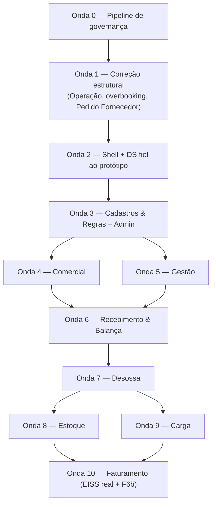

# Implementação Completa AlphaCarnes — Protótipo v1.1 → Sistema Real — Plano Mestre

> **Para workers agênticos:** SUB-SKILL OBRIGATÓRIA: usar `superpowers:subagent-driven-development` (recomendado) ou `superpowers:executing-plans` para executar os planos táticos de onda derivados deste mestre. Este documento é o plano **mestre**: define escopo, modelo de dados, contratos, RBAC e ondas. Cada onda ganha um plano tático próprio (padrão F4c) que passa pelo **Portão 1** antes da implementação — ver [`../../governance/pipeline-execucao.md`](../../governance/pipeline-execucao.md).

**Goal:** Levar o sistema real (F1–F6a implementadas) à cobertura funcional e visual completa do protótipo `feature/completude-v1.1` (41 entradas de rota: 39 telas de conteúdo + login + redirect), corrigindo as divergências estruturais que a spec v1.1 revogou (overbooking, entidade Operação, recebimento por Pedido ao Fornecedor) e implementando tudo que está ausente — sem telas mínimas, com UI/UX idêntica ao protótipo validado.

**Architecture:** Modular monolith NestJS 11 (Drizzle direto nos services), Next.js 16 App Router como BFF, WebSocket nativo com eventos pós-commit, gateways isolados para hardware e fiscal (EISS Osasco — AD-02). Novos módulos: `operacoes`, `precos`, `sif`; demais funcionalidades entram nos módulos existentes. Migrações estruturais (Operação, overbooking, Pedido ao Fornecedor) precedem as features.

**Tech Stack:** Node 22, NestJS 11, TypeScript 5 strict, Drizzle + PostgreSQL 18, Zod 4, Next.js 16 + React 19 + Tailwind 4 + shadcn/ui, Jest + Playwright, node-soap (EISS), GitHub Actions (CI existente com gate ≥80% linha+branch).

## Global Constraints

- **Fidelidade ao protótipo é NÃO-NEGOCIÁVEL** ([constituição](../../governance/constituicao.md) Princípio I): componentes, layout, fontes (Inter), cores (navy `#265389`, sidebar `#1E3A5F→#1B4E9B`, tokens da paleta do protótipo), menu de 9 grupos, fluxos e microcopy idênticos ao validado. Únicas alterações permitidas: remoção de frases exclusivas de protótipo ("simular perfil", dados demo) e dados reais no lugar de mocks.
- **Completude E2E, nunca MVP**: feature entra completa (todos os modais, estados, ações do protótipo) ou não entra na onda.
- Terminologia: `Nome Fantasia` / `Buscar cliente` — **nunca "Marca"** (v1.1 §6.8).
- Itens do v1.1 §16 ainda abertos: **parametrizáveis + badge "Provisório"**, nunca regra fixa (§7 deste plano).
- Convenções de schema (`docs/data/convencoes-schema.md`): UUID PK (uuidv7), TIMESTAMPTZ, NUMERIC(15,2)/NUMERIC(10,3), TEXT+CHECK, soft delete, created/updated triggers, 1 schema Drizzle por domínio, migrations só via drizzle-kit.
- RA-01..RA-06 ([quality-gates](../../governance/quality-gates.md)) em todo PR; cobertura backend ≥80% linha+branch.
- Branch model: `feature/onda<N>-<slug>` → `develop` → `main` ([framework-revisao](../../governance/framework-revisao.md)).

---

## 1. Resumo executivo

**Estado real** (branch `feature/absorcao-prototipo-v2`, inspeção direta — o CLAUDE.md que dizia "Fase 0 sem código" está desatualizado e será corrigido): backend NestJS com F1–F6a completas — auth/RBAC 11 perfis, cadastros base + F7 (produtos/representantes/rotas), planejamento comercial com reserva atômica, recebimento, pesagem/etiqueta, corte/transformação, expedição com fechamento, faturamento NFS-e com gateway EISS isolado (fake determinístico; adapter SOAP real ainda stub). 194 arquivos TS, 38 specs, migrations 0000–0011, CI com gate de cobertura ≥80%. Frontend Next.js com ~25 telas reais no DS v2 (absorvido do protótipo v2 anterior) e **17 placeholders**.

**Escopo do protótipo v1.1**: 39 telas de conteúdo (+ login + redirect = 41 entradas de rota), todas completas (zero placeholders), 9 grupos de menu, 9 perfis simulados, mapa de disponibilidade "teatro", Operações como entidade, overbooking com confirmação, conferência tripla Pedido×NF×Pesagem, Troca de Peça, SIF, seguro manual, modelos de etiqueta configuráveis.

**Gap consolidado** ([matriz completa](2026-07-22-matriz-rastreabilidade-v1.1.md), 41/41 entradas classificadas):
- **2 conformes** (login; auditoria);
- **28 divergentes** — implementadas sob premissa antiga ou com UI placeholder/backend parcial; inclui conferência, cujo backend está conforme, mas a UI ainda diverge;
- **11 ausentes** — sem nada no projeto real (tabela de preços, espelho, operações, pendências de overbooking, relatórios SIF, entrada de itens, ajustes, seguro, caminhões, motoristas, modelos de etiqueta).

**Divergências estruturais** (corrigidas na Onda 1, antes de qualquer feature):
- **D1 — Overbooking:** código bloqueia via reserva parcial + `sem_cobertura` + CHECK ≥0; v1.1 exige venda além do saldo, sem limite, com confirmação explícita e pendência para o gestor.
- **D2 — Operação:** não existe como entidade — só `dataOperacao: date` espalhado; v1.1/protótipo exigem pivô com cadência configurável e operações extraordinárias.
- **D3 — Recebimento:** nasce de `compras_programadas`, sem Pedido ao Fornecedor formal, sem NF do fornecedor como entidade, sem acumuladores nem revisão obrigatória Pedido×NF×Pesagem.

**Decisões já confirmadas pelo cliente durante este planejamento** (registradas em [`docs/execucao/DECISOES.md`](../../execucao/DECISOES.md)):
- **AD-01:** composição do boi casado = **1 boi → 2 TZ + 2 DT + 2 PA** (6 partes). Deixa de ser provisório; permanece parametrizável via regra de desdobramento.
- **AD-02:** sistema fiscal externo = **EISS Osasco** (SOAP), já levantado e documentado em `docs/integrações/nfse-osasco/` (webservice, XML, homologação, códigos de erro). A pendência v1.1 §16.11 está fechada; a modelagem existente (`payloadEiss`, ADR-006/011) está correta — o gap é o adapter real + homologação + feature flag RTC.
- **AD-03:** unicidade de pedido aberto considera **cliente + produto + operação**.
- **AD-04:** permanecem **11 perfis**; “estoque” é recorte de permissões nos perfis canônicos.
- **AD-05:** overbooking usa challenge `409` sem mutação e confirmação explícita `201/200`; confirmado não bloqueia finalização.
- **AD-06:** reserva de rascunho **não expira automaticamente**; liberação é explícita e auditada.

## 2. Matriz de rastreabilidade

Documento dedicado: [`2026-07-22-matriz-rastreabilidade-v1.1.md`](2026-07-22-matriz-rastreabilidade-v1.1.md) — 39/39 rotas + 6 mecânicas transversais, com módulo NestJS, entidades, endpoints/eventos, perfis, classificação tripla, referência documental e observações de regra provisória por linha.

## 3. Modelo de dados (nível conceitual, por domínio)

> Notação: **negrito** = tabela nova; *itálico* = alteração em tabela existente. Todas seguem as convenções globais (UUID, TIMESTAMPTZ, soft delete, auditoria).

### 3.1 `operacoes` (novo domínio — Onda 1)

- **`operacoes`** — `id`, `data` (date, unique), `dia_semana`, `rotulo`, `status` (TEXT+CHECK: `aberta | em_andamento | fechada`), `extraordinaria` (bool), `criada_por`, timestamps. Geração por cadência parametrizada (parâmetro `operacao.cadencia_dias_semana`, default `[1,3,5]` **provisório** §16.2) + criação extraordinária manual.
- *Tabelas de fato* — `compras_programadas`, `disponibilidades_virtuais`, `pedidos_venda`, `recebimentos`, `caminhoes`, `faturamentos`, `relatorios_sif`: ganham `operacao_id` FK NOT NULL, com **backfill** a partir de `dataOperacao` (cria-se uma Operação por data distinta existente; `dataOperacao` é mantida como coluna denormalizada de leitura durante a transição e removida em migration posterior da mesma onda).

### 3.2 `comercial` (Ondas 1 e 4–5)

- *`pedidos_venda`* — estados v1.1 §10.1 (`rascunho | em_elaboracao_reserva_ativa | aguardando_confirmacao_overbooking | finalizado | parcialmente_atendido | atendido | faturado | cancelado`); campos `operacao_id`, `finalizado_em`.
- *`pedidos_venda_itens`* — `quantidade_overbooking` (NUMERIC, ≥0), `origem_atendimento` detalhada (`fisico | virtual | overbooking` por parcela — ver `reservas_disponibilidade`).
- *`reservas_disponibilidade`* — nova coluna `tipo_consumo` (TEXT+CHECK: `fisico | virtual | overbooking`); reservas de overbooking **não** debitam `disponibilidades_virtuais` (o CHECK ≥0 permanece como invariante do saldo real; o overbooking vive em reservas tipadas + pendência).
- **`adendos_pedido`** — `id`, `pedido_id`, `item_id`, `quantidade_anterior`, `quantidade_adicionada`, `autor_id`, `motivo`, timestamps. Unicidade de pedido aberto por **(cliente, produto, operação)**, conforme AD-03, aplicada no service com sugestão de adendo.
- **`pendencias_overbooking`** — `id`, `pedido_id`, `item_id`, `produto_id`, `quantidade_deficit`, `cliente_id`, `vendedor_id`, `operacao_id`, `status` (CHECK: `aberta | em_analise | compra_complementar_programada | redistribuicao_decidida | novo_pedido_criado | resolvida | cancelada` — v1.1 §6.4), `decisao_json`, `responsavel_id`, timestamps.
- **`pendencias_overbooking_historico`** — append-only: `pendencia_id`, `acao`, `autor_id`, `detalhe_json`, `criado_em`.
- **`tabelas_preco`** — `id`, `data` (unique parcial em ativas), `status` (CHECK: `rascunho | publicada`), `publicada_por`, `publicada_em`, `observacao`.
- **`tabelas_preco_itens`** — `tabela_id`, `produto_id`, `preco_a..preco_d` NUMERIC(15,2), `preco_canal_json` (JSONB opcional).
- **`tabelas_preco_publicacoes`** — histórico de publicações/alterações pós-publicação (auditoria dedicada).

### 3.3 `recebimento` (Onda 1)

- **`pedidos_fornecedor`** — `id`, `numero`, `fornecedor_id`, `operacao_id`, `compra_programada_id` (FK — o Pedido ao Fornecedor materializa a compra programada perante o fornecedor), `status` (CHECK: `rascunho | enviado | aguardando_recebimento | recebido | encerrado | cancelado`), timestamps.
- **`pedidos_fornecedor_itens`** — `pedido_fornecedor_id`, `produto_id`, `quantidade_prevista`, `peso_previsto` NUMERIC(10,3) opcional.
- **`notas_fiscais_fornecedor`** — `id`, `pedido_fornecedor_id`, `recebimento_id`, `numero`, `serie`, `chave`, `data_emissao`, `peso_total_declarado`, `payload_json`.
- **`notas_fiscais_fornecedor_itens`** — `nf_id`, `produto_id`, `quantidade_declarada`, `peso_declarado`.
- *`recebimentos`* — passa a referenciar `pedido_fornecedor_id` (a FK `compra_programada_id` migra para o pedido ao fornecedor); estados v1.1 §6.10.5 (`pesagem_em_andamento | aguardando_conclusao_pesagem | aguardando_conferencia_final | conferido_sem_divergencia | conferido_com_divergencia | ocorrencia_administrativa_aberta | tratativa_administrativa_concluida`).
- **`conclusoes_conferencia`** — snapshot **imutável** da revisão final: `recebimento_id` (unique), quadro por produto (`quantidade_pedido`, `quantidade_nf`, `quantidade_pesada`, `peso_nf`, `peso_apurado`, diferenças, `situacao` — JSONB por item + colunas agregadas), `resultado` (CHECK: `sem_divergencia | com_divergencia`), `observacao`, `concluida_por`, `concluida_em`. Acumuladores calculados das pesagens vinculadas (v1.1 §6.10.3), nunca digitados.
- **`conclusoes_conferencia_nfs`** — junção append-only entre a conclusão e todas as NFs consideradas, preservando cardinalidade sem antecipar a decisão P7.
- *`divergencias_recebimento` / `ocorrencias_fornecedor`* — ganham FK para `conclusoes_conferencia` e `notas_fiscais_fornecedor`; tipos v1.1 §6.10.6 (falta, excesso, peso divergente, produto não previsto, outro).

### 3.4 `pesagem` (Onda 6)

- **`trocas_peca`** — operação atômica v1.1 §6.13: `pedido_id`, `peca_retirada_id`, `peca_inserida_id`, `destino_peca_retirada` (CHECK: `estoque | desossa | outro_pedido`), `motivo`, `etiqueta_invalidada_id`, `etiqueta_emitida_id`, `autor_id`, `criado_em`. Pesos das duas peças preservados (invariante testado).
- *`pecas`* — `caracteristicas_json` (mais pesada / mais gorda / melhor acabamento — observações, nunca bloqueio); estado adicional `em_troca`.
- *`etiquetas_impressoes`* — estados v1.1 §10.4 (`emitida | ativa | invalidada_por_troca | reimpressa | cancelada`) + FK `modelo_etiqueta_id`.

### 3.5 `desossa` (Onda 7)

- *`regras_transformacao`* — seed com as **2 alternativas provisórias** (A: Coxão-bola + Jacaré; B: Coxão-bola c/ alcatra + Filé curto — v1.1 §6.6, badge Provisório §16.15) e a regra de desdobramento do boi casado com **AD-01 (2 TZ + 2 DT + 2 PA)** sem badge.
- *`transformacoes`* — `regra_transformacao_id` NOT NULL antes de gerar saídas (exclusividade por unidade: uma regra escolhida trava as saídas incompatíveis da outra — invariante testado).
- **`divergencias_transformacao`** — saídas registradas ≠ esperadas pela regra: `transformacao_id`, `tipo` (CHECK: `subpeca_faltante | subpeca_excedente | produto_diferente | perda_informada`), `detalhe_json`, encaminhamento à fila de aprovações.

### 3.6 `estoque` (Onda 8)

- **`entradas_itens`** — caixarias/itens por unidade: `produto_id`, `quantidade`, `fornecedor_id`, `lote_nf`, `destino` (CHECK: `estoque | pedido`), `pedido_id` opcional.
- **`ajustes_estoque`** — `produto_id`, referência de peça/lote, `quantidade_delta`/`peso_delta`, `motivo` (CHECK: quebra, perda, erro de contagem, vencimento, outro), `status` (CHECK: `aplicado | aguardando_aprovacao | rejeitado`), `criado_por`, `aprovado_por` (segregação: criador ≠ aprovador), limiar de aprovação = parâmetro.

### 3.7 `expedicao` + `cadastros` (Ondas 3 e 9)

- **`caminhoes_cadastro`** — frota: `placa` (unique), `descricao`, `capacidade`, `rota_padrao_id`, `status`. A entidade F5 `caminhoes` (viagem/carga do dia) ganha FK `caminhao_cadastro_id`.
- **`motoristas`** — `nome`, `documento`, `telefone`, `caminhao_padrao_id`, `status`.
- *`rotas`* — `paradas_json` (sequência de clientes/bairros).
- **`modelos_etiqueta`** — `nome`, `tipo` (CHECK: pedido, estoque, desossa, parte_pedido, parte_estoque, unidade), `campos_json` (12 campos configuráveis do protótipo), `ativo`. Impressão consome o modelo ativo por tipo. **Pendente §16.12** (campos finais) → por isso configurável com preview.

### 3.8 `faturamento` (Onda 10)

- **`seguros_carga`** — F6b: `caminhao_id`, `valor_carga`, `status` (CHECK: `pendente | enviado | confirmado`), `responsavel_id`, `enviado_em`, `confirmado_em`, `observacao`, `anexos_json`; notas vinculadas por consulta.
- *`notas_fiscais`* — mantém modelagem EISS (AD-02); adicionar `modelo_fiscal` (CHECK: `padrao | rtc`) para a feature flag da Reforma Tributária (WSDL expõe métodos `RTC_*`).
- Liberação do caminhão: checklist **calculado** (carga conferida + NF autorizada + seguro confirmado se obrigatório + caminhão/motorista preenchidos) — sem tabela própria; requisitos derivados + registro de liberação auditado (já existe transição F5).

### 3.9 `sif` (Onda 5)

- **`relatorios_sif`** — `nome_provisorio`, `operacao_id`/período, `status` (CHECK: `pendente_de_dados | pronto_para_gerar | gerado | retificado`), `responsavel_id`, `pendencias_json`.
- **`relatorios_sif_versoes`** — versionamento/retificação append-only: `relatorio_id`, `versao`, `conteudo_json`, `gerado_por`, `gerado_em`, `motivo_retificacao`. **Pendente §16.10** (modelos oficiais) → layouts provisórios sinalizados, configuráveis sem redesenho.

## 4. Contratos de API e eventos (por módulo — sem implementação)

> Endpoints existentes não são repetidos ([matriz](2026-07-22-matriz-rastreabilidade-v1.1.md) os referencia). Todos os novos seguem o padrão atual: `JwtAuthGuard` + `RbacGuard` + `@RequirePermissoes`, Zod na borda, transação + auditoria (RA-02), evento pós-commit (RA-04).

### `operacoes`
- `GET /operacoes?status=&de=&ate=` · `GET /operacoes/:id` · `POST /operacoes/extraordinaria` · `PATCH /operacoes/:id/status` · `POST /operacoes/gerar-cadencia` (idempotente por janela).
- Eventos: `OPERACAO_CRIADA`, `OPERACAO_STATUS_ALTERADO`.

### `comercial/pedidos` (mudanças v1.1)
- `POST /comercial/pedidos` e `POST /comercial/pedidos/:id/itens` — criação/inclusão sem confirmação. Se houver déficit, retornam `409 OVERBOOKING_CONFIRMACAO_NECESSARIA` com o payload do modal do protótipo (produto, disponível, solicitado, overbooking gerado) e **zero mutação persistida**, conforme AD-05.
- `POST /comercial/pedidos/confirmar-overbooking` (criação, `201`) e `POST /comercial/pedidos/:id/itens/confirmar-overbooking` (inclusão/aumento, `200`) — reavaliam o saldo dentro da transação e persistem explicitamente a parcela real + reserva `tipo_consumo=overbooking` + `pendencias_overbooking`. Depois de confirmada, a falta não bloqueia `finalizar`.
- `POST /comercial/pedidos/:id/adendos` · `POST /comercial/pedidos/:id/finalizar` (reserva → compromisso, sem dupla baixa) · `GET /comercial/pedidos/aberto?clienteId=&produtoId=[&operacaoId=]` (verificação de unicidade → sugestão de adendo).
- Eventos: `RESERVA_ATUALIZADA` (existe), `OVERBOOKING_CONFIRMADO`, `ADENDO_REGISTRADO`, `PEDIDO_FINALIZADO`, `PENDENCIA_OVERBOOKING_ABERTA`.

### `comercial/overbooking`
- `GET /comercial/overbooking?status=` · `GET /:id` (+histórico) · `POST /:id/decisao` (`compra_complementar | redistribuicao | novo_pedido`) · `PATCH /:id/status`.
- Eventos: `PENDENCIA_OVERBOOKING_ATUALIZADA`, `PENDENCIA_OVERBOOKING_RESOLVIDA`.

### `precos`
- `GET /precos/tabelas?data=` · `POST /precos/tabelas` · `POST /precos/tabelas/:id/copiar` · `PATCH /precos/tabelas/:id/itens` · `POST /precos/tabelas/:id/publicar` · `GET /precos/tabelas/:id/historico`.
- Evento: `TABELA_PRECO_PUBLICADA`.

### `comercial/disponibilidade` (mapa)
- `GET /comercial/disponibilidade/mapa?operacaoId=&produtoId=` — agregado por produto×estado (F/V/R/C/D/O/E/!), com composição do saldo (v1.1 §17.5).
- `GET /comercial/disponibilidade/mapa/:produtoId/detalhe` — drill-down: unidades físicas individualizadas + cotas virtuais + reservas (quem, pedido, vendedor).
- Reusa eventos existentes; adiciona `MAPA_ALERTA` (reserva antiga, pendência).

### `comercial/espelho`
- `GET /comercial/espelho?operacaoId=&agrupar=cliente|rota|representante&formato=json|csv`.

### `recebimento` (fluxo v1.1 §6.10)
- `GET /operacao/pedidos-fornecedor?status=` · `POST /operacao/pedidos-fornecedor` (a partir de compra programada confirmada) · `GET /:id`.
- `POST /operacao/recebimentos` — agora exige `pedidoFornecedorId`; `POST /operacao/recebimentos/:id/nf` — registra `notas_fiscais_fornecedor` + itens.
- `GET /operacao/recebimentos/:id/conferencia` — acumuladores tripla em tempo real (por produto: qtd pedido/NF/pesada, pesos, diferenças, situação).
- `POST /operacao/recebimentos/:id/concluir-pesagem` — transiciona para `aguardando_conferencia_final` (revisão obrigatória, nunca silenciosa).
- `POST /operacao/recebimentos/:id/conferencia/concluir` — body `{ resultado: 'sem_divergencia' | 'com_divergencia', observacao }`; com divergência cria ocorrência(s) e encaminha ao administrativo na mesma transação; grava `conclusoes_conferencia` imutável.
- Eventos: F4a existentes + `CONFERENCIA_TRIPLA_CONCLUIDA`, `RECEBIMENTO_ESTADO_ALTERADO`.

### `pesagem`
- `POST /operacao/pesagem/trocas` — Troca de Peça atômica (9 passos v1.1 §6.13 em uma transação) · `POST /operacao/pesagem/pecas/:id/estornar` (regras de estorno do doc 04 §3.2) · `GET /operacao/recebimentos/:id/acumuladores`.
- Eventos: `PECA_TROCADA`, `PESAGEM_ESTORNADA`, `ETIQUETA_INVALIDADA`.

### `desossa`
- `GET /desossa/painel?modoTv=true` (payload do painel aeroporto: produto, faltam, pronto em estoque, origem; visão por regra sugerida) · `POST /operacao/corte/:id/regra` (trava exclusividade) · `GET /operacao/corte/:id/checklist` · `POST /operacao/corte/:id/divergencia`.
- Eventos: `FALTAS_DESOSSA_ATUALIZADAS` (broadcast contínuo p/ telão), `DIVERGENCIA_TRANSFORMACAO_ABERTA`.

### `estoque`
- `POST /estoque/entradas` · `GET /estoque/entradas` · `POST /estoque/:itemId/destinar` (FIFO sugerido — **§16.4 parametrizável**) · `POST /estoque/ajustes` · `POST /estoque/ajustes/:id/aprovar|rejeitar` · `GET /estoque/:itemId/historico`.
- Eventos: `ENTRADA_ITENS_REGISTRADA`, `AJUSTE_ESTOQUE_CRIADO/APROVADO/REJEITADO`, `ITEM_DESTINADO`.

### `cadastros` (novos CRUDs — mesmo padrão dos existentes: paginação, filtro, soft delete, restaurar, 403 por permissão)
- `/cadastros/caminhoes` · `/cadastros/motoristas` · `/cadastros/modelos-etiqueta` (+ `GET /:id/preview`) · simuladores: `POST /cadastros/regras-desdobramento/simular`, `POST /desossa/regras-transformacao/simular`.

### `faturamento` (Onda 10)
- Existentes mantidos (porta ADR-011). Novos: `GET /faturamento/notas?filtros` · `GET /faturamento/notas/:id/rastreabilidade` · `GET/POST /faturamento/seguros` + `PATCH /:id/status` · `GET /faturamento/liberacao/:caminhaoId/checklist`.
- Adapter EISS real (node-soap) substitui o stub; homologação conforme `docs/integrações/nfse-osasco/ambiente-homologacao.md`; feature flag `modelo_fiscal=rtc`.
- Eventos: existentes + `SEGURO_ATUALIZADO`, `CAMINHAO_LIBERADO`.

### `sif`
- `GET /sif/relatorios?operacaoId=` · `POST /sif/relatorios/:id/gerar` · `POST /sif/relatorios/:id/retificar` · `GET /sif/relatorios/:id/versoes` · `GET /sif/relatorios/:id/preview`.
- Eventos: `RELATORIO_SIF_GERADO/RETIFICADO`.

## 5. Mapeamento RBAC — 11 perfis (doc 013) × funcionalidades

Os 9 perfis simulados no protótipo são um **subconjunto de apresentação** dos 11 canônicos. Reconciliação:

| Perfil simulado (protótipo) | Perfil(is) canônico(s) doc 013 | Observação |
|---|---|---|
| administrador | `administrador` | 1:1 |
| gestao (Fabrício) | `gestor` (+ `diretoria` para consulta executiva) | Fabrício acumula gestor comercial/operacional; dono das pendências de overbooking |
| comercialInterno (Sabrina) | `comercial` com escopo "representante próprio" | escopo por representante = dimensão do usuário, não perfil novo |
| comercialExterno (Duda/Cemol) | `comercial` com escopo restrito + sem permissão `PRECOS_LER` | protótipo esconde tabela-precos via `hiddenItems` → vira permissão |
| recebimento (Richard) | `recebimento_pesagem` | 1:1 |
| desossa | `corte` | 1:1 |
| estoque | **recorte de permissões** `ESTOQUE_*` atribuído a `expedicao` e `recebimento_pesagem` | **AD-04 confirmada**: não criar 12º perfil; doc 013 §2.7/2.8 cobre estoque via expedição/recebimento |
| carga (Ludmila) | `expedicao` + `conferente` | conferente é perfil próprio no doc 013 (segregação da conferência) |
| faturamento (Carla) | `faturamento` + `logistica` (liberação) | doc 013 separa quem fatura de quem libera (SF) |
| — (sem simulação) | `compras` | telas de Compras/Operações/Pedido ao Fornecedor |
| — (sem simulação) | `diretoria` | consulta executiva (dashboard, auditoria, relatórios) |

Permissões nomeadas novas (padrão `DOMINIO_ACAO`, resolvidas do banco — ADR-008): `OPERACOES_GERENCIAR`, `PRECOS_LER/GERENCIAR/PUBLICAR`, `OVERBOOKING_RESOLVER`, `PEDIDO_OVERBOOKING_CONFIRMAR`, `PEDIDO_ADENDO_CRIAR`, `PEDIDO_FORNECEDOR_GERENCIAR`, `CONFERENCIA_CONCLUIR`, `TROCA_PECA_EXECUTAR`, `PESAGEM_ESTORNAR`, `ESTOQUE_LER/ENTRADA/AJUSTAR/AJUSTE_APROVAR/DESTINAR`, `SIF_LER/GERAR/RETIFICAR`, `SEGURO_GERENCIAR` (existia no plano F6b), `LIBERACAO_GERENCIAR`, `MODELOS_ETIQUETA_GERENCIAR`, `CADASTRO_CAMINHOES_GERENCIAR`, `CADASTRO_MOTORISTAS_GERENCIAR`, `ESPELHO_LER`, `MAPA_DISPONIBILIDADE_LER`.

Segregações (doc 013 §5, mecanismo genérico F1): criador de ajuste ≠ aprovador; quem fatura ≠ quem libera; quem registra divergência ≠ quem conclui tratativa administrativa.

A matriz completa permissão×perfil (tabela 11×~40) é produzida no plano tático da Onda 3 (Admin/Perfis), derivada de doc 013 §3 + protótipo `PerfisAcesso.tsx`.

## 6. Ondas de execução

Grafo de dependências (cada onda = 1+ PRs `feature/onda<N>-*` → `develop`; gate de onda = Portão 2 + DoD):

| Onda | Escopo | Depende de | Plano tático |
|---|---|---|---|
| **0 — Pipeline** | Constituição, pipeline-execucao, estado vivo, skills de gate, workflows autônomos, atualização roadmap/quality-gates/CLAUDE.md | — | (este ciclo de planejamento) |
| **1 — Correção estrutural** | D2 entidade `operacoes` + FKs/backfill; D1 overbooking v1.1 (confirmação + pendências + `tipo_consumo`); D3 Pedido ao Fornecedor + NF fornecedor + conferência tripla + estados; D5 varredura "marca"; D9 CLAUDE.md | 0 | [`2026-07-22-onda1-correcao-estrutural.md`](2026-07-22-onda1-correcao-estrutural.md) ✅ |
| **2 — Shell + DS** | Layout/menu 9 grupos/breadcrumb do protótipo; tokens completos da paleta; componentes compartilhados (PipelineBar, badge Provisório, StatusPill alinhado, base do TrocaPeca); tela de login fiel; remoção do simulador de perfil (RBAC real dirige `visibleGroups`) | 1 | just-in-time |
| **3 — Cadastros & Regras + Admin** | Caminhões, Motoristas, Modelos de Etiqueta (novos); Produtos/Fornecedores/Rotas/Representantes ampliados e fiéis; Regras de Transformação completas (2 abas + simuladores + seed AD-01 e regras A/B provisórias); Usuários (escopo representante), Perfis (11), Parâmetros (catálogo v1.1), Auditoria fiel | 2 | just-in-time |
| **4 — Comercial** | Clientes fiel; Pedidos de Venda completo (estados, adendo, overbooking UI com modal do protótipo); Tabela de Preços; Disponibilidade (mapa teatro + drill-down + grade com catálogo MVP correto); Espelho | 3 | just-in-time |
| **5 — Gestão** | Painel Geral (KPIs por Operação); Operações UI; Compras com painel de impacto; Pendências de Overbooking; Aprovações & Ocorrências (fila unificada + comparativo imutável); Relatórios SIF | 3 | just-in-time |
| **6 — Recebimento & Balança** | Recebimento de Carga fiel (fluxo §6.10 completo em 2 fases); Pesagem e Destinação (características, acumulado, Troca de Peça, estorno, lista de ações); Etiquetas (5 estados) | 4, 5 | just-in-time |
| **7 — Desossa** | Dashboard aeroporto + Modo TV; Pesagem/Destinação (exclusividade de regra, checklist, divergência de transformação, etiqueta com peça mãe); Etiquetas (invalidada por troca) | 6 | just-in-time |
| **8 — Estoque** | Consulta (FIFO + destinar a pedido); Entrada de Itens; Ajustes com aprovação por limiar | 7 | just-in-time |
| **9 — Carga** | Planejamento fiel; Conferência (bipagem) fiel; Enviar para Faturamento (UI + PipelineBar) | 7 | just-in-time |
| **10 — Faturamento** | Adapter EISS real (node-soap) + homologação (AD-02) + flag RTC; Pré-Faturamento fiel com reprocesso; Notas/XML (rastreabilidade + trava pós-liberação); Seguro Manual (F6b); Liberação com checklist calculado | 8, 9 | just-in-time |

Racional da ordem: correção estrutural primeiro (decisão do usuário — evita construir telas sobre fundação errada); shell/DS antes de qualquer tela (fidelidade visual é transversal); cadastros antes de comercial/gestão (DP-01); operação física depois do comercial (consome pedidos/disponibilidade); faturamento por último (DP-05/06 + consome tudo).

## 7. Decisões pendentes / perguntas ao cliente

**Já resolvidas neste ciclo** (ver [`docs/execucao/DECISOES.md`](../../execucao/DECISOES.md)):
- ~~§16.1 composição do boi casado~~ → **AD-01: 1 boi = 2 TZ + 2 DT + 2 PA** (parametrizável, sem badge).
- ~~§16.11 sistema fiscal externo~~ → **AD-02: EISS Osasco** (`docs/integrações/nfse-osasco/`).
- ~~P4 / §16.5 operação na unicidade do pedido aberto~~ → **AD-03: chave (cliente, produto, operação)**.
- ~~P13 perfil “estoque”~~ → **AD-04: recorte `ESTOQUE_*` nos 11 perfis canônicos, sem 12º perfil**.
- ~~P14 semântica do parâmetro legado~~ → **AD-05: challenge 409 sem mutação + confirmação explícita; nunca bloqueio pós-confirmação**.
- ~~P2 / §16.3 expiração de reserva~~ → **AD-06: sem expiração automática; liberação explícita e auditada**.

**Abertas (tratar como parametrizável + badge "Provisório"; nunca regra fixa):**

| # | Pendência (v1.1 §16 + achados) | Tratamento no plano |
|---|---|---|
| P1 | §16.2 — separação obrigatória do estoque por operação seg/qua/sex (cadência) | parâmetro `operacao.cadencia_dias_semana`, default [1,3,5], badge |
| P3 | §16.4 — ordem detalhada de consumo FIFO entre peças físicas | FIFO por data de entrada como sugestão; parametrizável |
| P5 | §16.6 — política de preço em adendos | adendo herda preço vigente do pedido; parametrizável |
| P6 | §16.7 — momento exato da escolha da transformação na desossa | escolha na entrada OU confirmação na saída; obrigatória antes de gerar produtos |
| P7 | §16.8/§16.9 — N caminhões/NFs por pedido ao fornecedor e N pedidos por caminhão | modelo 1:N preparado (NF referencia pedido+recebimento); fluxo de UI trata 1:1 até confirmação |
| P8 | §16.10 — lista e modelos oficiais dos relatórios SIF | área SIF com nomes provisórios sinalizados + layout configurável |
| P9 | §16.12 — campos finais da etiqueta | modelos de etiqueta configuráveis com preview |
| P10 | §16.13 — procedimento físico de substituição de etiqueta com peça no caminhão | Troca de Peça registra pendência física quando carga aberta; bloqueada com carga fechada |
| P11 | §16.14 — catálogo oficial completo e saneado de produtos | seed do catálogo MVP marcado provisório; CRUD completo permite saneamento |
| P12 | §16.15 — outras transformações além do TZ | estrutura de regras já genérica (origem parametrizada); só TZ seedado |
| P15 | *(achado)* marco exato de fechamento do pedido (docs_v2/05 §3.3: carga conferida × envio a faturamento × NF × liberação) | estados F5/F6 já modelam a cadeia; confirmar qual transição congela o pedido comercial |

**Pendências ainda abertas:** P1, P3, P5–P12 e P15. Nenhuma delas pode ser fixada sem nova AD-xx; o tratamento provisório da tabela acima permanece obrigatório.

## 8. Riscos e requisitos não-funcionais

| Risco | Mitigação |
|---|---|
| **Concorrência na última unidade** (v1.1 cenário 4): dois vendedores disputam o mesmo saldo | Manter o padrão F3 de UPDATE condicional atômico para consumo físico/virtual; overbooking nunca compete pelo saldo (reserva tipada separada). Teste de concorrência obrigatório por onda que toca reserva (herdado de quality-gates F3) |
| **Migração estrutural da Onda 1** (backfill `operacao_id`, mudança de FK do recebimento, estados novos) | Migrations em passos reversíveis (expand → backfill → contract), `ROLLBACK.md` atualizado; migration aplicada em banco limpo E em banco com dados de dev; sem `ALTER TABLE` manual |
| **Conflito de portas no ambiente local** | Docker Desktop publica frontend em `4000`, backend em `4001` e PostgreSQL em `15433`; comunicação entre containers mantém `3000`, `3001` e `5432`. A Vercel publica somente `landing/` e só é gate para diffs em `landing/**` |
| **Remoção do bloqueio de overbooking** regride o invariante anti-negativo | O CHECK ≥0 em `disponibilidades_virtuais` **permanece** (saldo real nunca negativo); overbooking vive em `reservas_disponibilidade.tipo_consumo='overbooking'` + pendência. Invariante novo testado: toda reserva overbooking tem pendência aberta na mesma transação |
| **Performance do mapa teatro** com volumes grandes (100+ bois × produtos × estados) | Endpoint agregado por produto×estado (nunca unidade a unidade na visão inicial); drill-down paginado sob demanda; atualização via eventos WS existentes (sem polling — RA-04); índices por (operacao_id, produto_id) |
| **Resiliência da balança/impressora** | Contratos ADR-009/010 já provados (fakes no CI, fallback manual autorizado, nunca inventa peso — RA-05); Troca de Peça e desossa reusam os mesmos gateways |
| **EISS homologação** (dependência externa: credenciais) | Fake determinístico segue no CI (nunca toca EISS real); adapter real atrás da mesma porta; consultar-antes-de-retransmitir preservado (ADR-011); pendência externa registrada no roadmap |
| **Fidelidade visual regride com o tempo** | Gate de PR (Portão 2) inclui verificação de fidelidade contra screenshots/rotas do protótipo (skill `gate-pr`); paleta e componentes centralizados na Onda 2 (tokens únicos, sem hex avulso em tela) |
| **Telão da desossa (Modo TV)** — sessão longa sem interação | Reconexão automática do WS; token de leitura dedicado (permissão `DESOSSA_PAINEL_LER`); painel funciona em modo degradado com último snapshot |
| **Volume de auditoria** (v1.1 §12 amplia eventos) | Padrão transacional existente; índice por entidade+data; retenção fora de escopo (registrar como dívida) |

Não-funcionais herdados (vigentes): reserva/mutações críticas transacionais (RA-02), tempo real por eventos pós-commit (RA-04), falha de integração nunca silenciosa (RA-05), exceções observáveis (RA-06), poucos cliques/botões grandes nas telas operacionais (v1.1 §13.4), desktop primeiro (§17.6).

## 9. Checagem de fechamento

Percorrido `src/app/routes.tsx` do protótipo (`feature/completude-v1.1`) linha a linha, na ordem do arquivo: `/login`, `/` (index redirect) e as **39 rotas de conteúdo** (9 grupos: 5+6+3+3+3+3+4+8+4) — **41/41 entradas de rota cobertas (100%)** na [matriz de rastreabilidade](2026-07-22-matriz-rastreabilidade-v1.1.md), cada uma com módulo, entidades, endpoints, perfis, classificação e referência documental. As 6 mecânicas transversais obrigatórias do checklist mestre (Operação-pivô, Troca de Peça atômica, badge Provisório, terminologia, prioridade físico→virtual→overbooking, auditoria §12) têm entradas dedicadas. Nenhuma rota usa PlaceholderPage no protótipo; nenhuma ficou sem classificação.

**Contagem final:** 2 conformes · 28 divergentes · 11 ausentes (entradas de rota); com as transversais: 31 itens divergentes/parciais sob regra antiga a corrigir e 13 blocos ausentes a construir.
